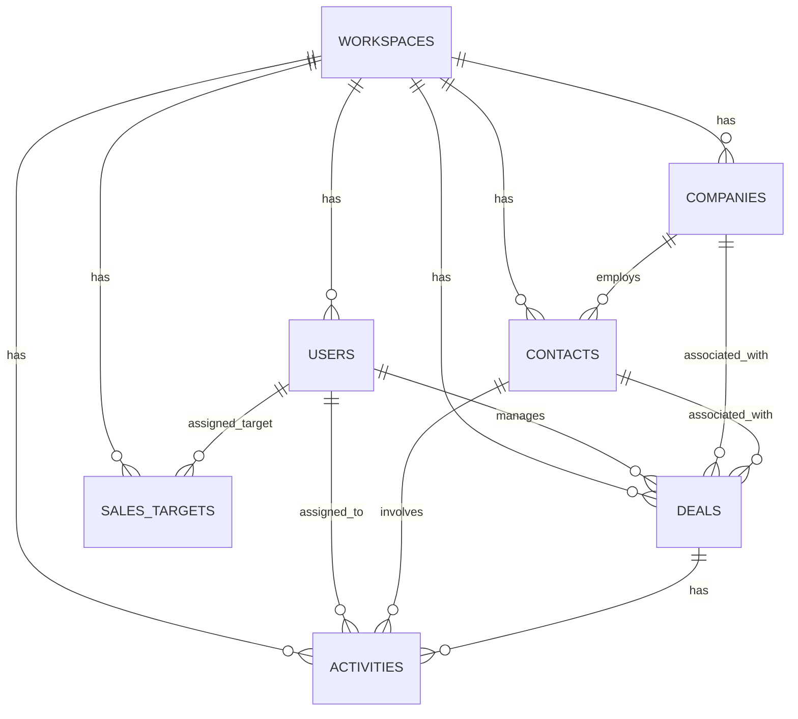

# Product Requirements Document: SalesFlow CRM
Version: 1.0, Status: Draft, Tanggal: 24 Mei 2024

## 1. Overview
- **Problem Statement**: Tim sales kecil sering kehilangan peluang penjualan karena pengelolaan data kontak dan perusahaan masih menggunakan spreadsheet manual yang tidak terstruktur. Hal ini mengakibatkan tindak lanjut (*follow-up*) sering terlewat, tidak adanya visibilitas terhadap status kesepakatan (*deal pipeline*), dan kesulitan bagi manajer untuk memantau pencapaian target sales bulanan serta performa konversi tim.
- **Solution**: SalesFlow CRM adalah aplikasi berbasis web responsif yang menyederhanakan pengelolaan data kontak dan perusahaan, menyediakan papan kanban visual untuk alur penjualan (*deal pipeline*), mencatat aktivitas tindak lanjut dengan sistem pengingat otomatis, dan menyajikan laporan performa konversi serta pencapaian target bulanan secara real-time.
- **Goals**:
  - Mengurangi tingkat *follow-up* yang terlewat hingga di bawah 5% dalam waktu 3 bulan setelah implementasi.
  - Mempercepat waktu pembaruan status *deal* oleh sales representative dari rata-rata 10 menit menjadi kurang dari 1 menit menggunakan Kanban board.
  - Meningkatkan akurasi estimasi pendapatan bulanan dengan visualisasi nilai *deal* di setiap tahapan pipeline.
  - Menghemat waktu entri data kontak hingga 80% melalui fitur import massal menggunakan file CSV.
- **Non-Goals**:
  - Menyediakan integrasi langsung dengan server email (IMAP/SMTP) untuk mengirim/menerima email di dalam aplikasi (hanya menyediakan tautan `mailto:` dan pencatatan log aktivitas manual).
  - Menyediakan fitur panggilan telepon langsung (*built-in VoIP/dialer*).
  - Mendukung multi-mata uang (*multi-currency*); sistem hanya menggunakan mata uang Rupiah (IDR).
- **Target Users**:
  - Sales Representative (Tenaga Penjual lapangan maupun internal).
  - Sales Manager (Manajer Penjualan / Pemilik Usaha).
- **Personas**:
  - **Budi (Sales Representative)**:
    - *Peran*: Melakukan prospekting, menghubungi calon klien, dan menutup transaksi.
    - *Kebutuhan*: Mencatat hasil panggilan dengan cepat, melihat daftar tugas harian, dan mengetahui *deal* mana yang harus diprioritaskan hari ini.
    - *Pain Points*: Sering lupa menghubungi kembali klien yang berjanji dihubungi minggu depan; merasa aplikasi CRM yang ada terlalu rumit dan lambat.
    - *Konteks*: Sering bekerja di lapangan menggunakan smartphone dengan koneksi internet tidak stabil.
  - **Sinta (Sales Manager)**:
    - *Peran*: Menentukan target penjualan, memantau kinerja tim, dan membuat laporan pendapatan bulanan.
    - *Kebutuhan*: Melihat total nilai transaksi di setiap tahapan pipeline dan mengetahui performa konversi setiap sales rep secara real-time.
    - *Pain Points*: Harus merekap puluhan file spreadsheet dari setiap sales rep setiap akhir bulan untuk membuat laporan penjualan.
    - *Konteks*: Bekerja dari laptop di kantor, membutuhkan visualisasi grafik yang cepat dan akurat.
- **User Stories**:
  - **US-01**: Sebagai Sales Rep, saya ingin melihat semua *deal* aktif dalam bentuk papan Kanban berdasarkan tahapannya agar saya bisa memperbarui status transaksi secara cepat dengan cara menggeser kartu (*drag-and-drop*).
  - **US-02**: Sebagai Sales Rep, saya ingin mengimpor data kontak dari file CSV agar saya tidak perlu memasukkan ratusan data prospek satu per satu secara manual.
  - **US-03**: Sebagai Sales Rep, saya ingin menjadwalkan aktivitas *follow-up* (telepon, pertemuan, email) untuk setiap kontak agar saya mendapatkan notifikasi ketika ada aktivitas yang terlewat.
  - **US-04**: Sebagai Sales Manager, saya ingin menetapkan target penjualan bulanan untuk setiap anggota tim agar saya dapat memantau kontribusi masing-masing sales terhadap target perusahaan.
  - **US-05**: Sebagai Sales Manager, saya ingin melihat laporan konversi dari tahap *prospect* hingga *won* agar saya dapat mengidentifikasi pada tahap mana tim paling sering kehilangan peluang.
  - **US-06**: Sebagai Admin, saya ingin mengelola akun pengguna dan menentukan peran (*role*) mereka di dalam workspace agar akses data sensitif perusahaan tetap terjaga.

## 2. Scope
- **In-Scope**:
  - Autentikasi pengguna berbasis JWT (Login, Logout, Reset Password).
  - Manajemen Workspace (satu workspace untuk satu organisasi/perusahaan kecil).
  - Manajemen Kontak dan Perusahaan (CRUD, asosiasi kontak ke perusahaan).
  - Papan Kanban Deal (tahapan: Lead, Contacted, Proposal, Negotiation, Won, Lost) dengan fitur seret-taruh (*drag-and-drop*).
  - Pencatatan dan Penjadwalan Aktivitas (Call, Meeting, Email, Task) dengan status (Pending, Completed, Missed).
  - Fitur Import Kontak dari file CSV (dengan pemetaan kolom nama, email, telepon, dan perusahaan).
  - Dasbor Laporan: Grafik konversi deal (conversion funnel) dan grafik pencapaian target sales vs realisasi.
  - Notifikasi sistem (in-app banner dan email harian) untuk aktivitas *follow-up* yang terlewat (*overdue*).
- **Out-of-Scope (with reason)**:
  - Integrasi API WhatsApp resmi (ditunda ke Fase 2 untuk mengurangi kompleksitas biaya dan proses verifikasi pihak ketiga).
  - Fitur kolaborasi chat antar sales rep di dalam aplikasi (komunikasi tim diasumsikan tetap menggunakan platform eksternal seperti Slack atau WhatsApp).
- **Assumptions**:
  - Pengguna memiliki akses internet stabil saat melakukan import CSV.
  - Format file CSV yang diunggah menggunakan pemisah koma (`,`) atau titik koma (`;`) dengan baris pertama sebagai header.
- **Dependencies**:
  - Database PostgreSQL untuk penyimpanan data relasional yang konsisten.
  - Layanan pengiriman email (seperti SendGrid atau Mailgun) untuk mengirimkan notifikasi aktivitas *overdue*.

## 3. Functional Requirements

| ID | Fitur | Deskripsi Detail | Prioritas | Acceptance Criteria |
| :--- | :--- | :--- | :--- | :--- |
| **FR-01** | Autentikasi & Manajemen Sesi | Pengguna dapat masuk ke sistem menggunakan email dan password terenkripsi. Sesi aktif akan dipertahankan menggunakan JWT yang disimpan secara aman di HTTP-only cookie selama 24 jam. | P0 | - Given: Pengguna berada di halaman login. - When: Memasukkan email valid dan password yang benar. - Then: Sistem mengarahkan pengguna ke Dashboard dan menyimpan token sesi. |
| **FR-02** | Manajemen Kontak | Membuat, membaca, memperbarui, dan menghapus data kontak. Setiap kontak wajib memiliki Nama Lengkap dan Email unik dalam satu workspace. Kontak dapat dihubungkan dengan satu entitas Perusahaan. | P0 | - Given: Form tambah kontak terbuka. - When: Menyimpan kontak tanpa mengisi nama lengkap. - Then: Sistem menampilkan validasi error "Nama lengkap wajib diisi". |
| **FR-03** | Manajemen Perusahaan | Membuat, membaca, memperbarui, dan menghapus data perusahaan (Nama Perusahaan, Website, Industri). Satu perusahaan bisa memiliki banyak kontak yang terasosiasi. | P0 | - Given: Pengguna membuka detail perusahaan. - When: Menambahkan kontak baru ke perusahaan tersebut. - Then: Kontak terhubung secara relasional di database dan tampil di daftar kontak perusahaan. |
| **FR-04** | Kanban Deal Pipeline | Menampilkan visualisasi kartu transaksi (*deal*) berdasarkan 6 tahapan alur penjualan. Setiap kartu menampilkan nama deal, nama perusahaan, nilai transaksi (IDR), dan pemilik deal. | P0 | - Given: Pengguna berada di halaman Pipeline. - When: Menggeser kartu deal dari 'Proposal' ke 'Negotiation'. - Then: Nilai total di atas kolom terupdate otomatis secara real-time tanpa reload halaman. |
| **FR-05** | Pencatatan Aktivitas | Sales rep dapat mencatat aktivitas masa lalu atau menjadwalkan aktivitas mendatang (telepon, rapat, email) yang terhubung ke kontak atau deal tertentu. | P0 | - Given: Pengguna membuka detail deal. - When: Menambahkan aktivitas baru dengan tipe 'Meeting' dan tanggal besok. - Then: Aktivitas tersimpan dengan status 'Pending' dan tampil di timeline deal. |
| **FR-06** | Import Kontak CSV | Mengunggah file CSV (maksimal 5MB) untuk memasukkan ratusan kontak secara massal. Sistem menyediakan antarmuka pemetaan (*column mapping*) sebelum data disimpan ke database. | P1 | - Given: Pengguna mengunggah file CSV berukuran 6MB. - When: Menekan tombol unggah. - Then: Sistem menampilkan error "Ukuran file maksimal adalah 5MB". |
| **FR-07** | Notifikasi Follow-up Terlewat | Sistem secara otomatis mengirimkan ringkasan email harian setiap pukul 08:00 pagi ke sales rep yang memiliki aktivitas berstatus 'Pending' dengan waktu terjadwal yang sudah terlewat (*overdue*). | P1 | - Given: Sales rep memiliki 3 aktivitas pending dengan jadwal kemarin. - When: Waktu menunjukkan pukul 08:00 waktu lokal server. - Then: Sistem mengirimkan 1 email rangkuman berisi 3 aktivitas tersebut ke sales rep bersangkutan. |
| **FR-08** | Target Sales Bulanan | Manajer dapat menginput target nominal penjualan dalam Rupiah untuk setiap sales rep per bulan kalender. | P1 | - Given: Halaman pengaturan target dibuka oleh Manajer. - When: Menginput target Rp 50.000.000 untuk Sales A pada bulan Juni 2024. - Then: Data tersimpan dan grafik pencapaian di dashboard langsung menyesuaikan target baru tersebut. |
| **FR-09** | Laporan Konversi & Target | Menampilkan grafik corong (*conversion funnel*) dari jumlah deal di setiap tahap dan visualisasi persentase pencapaian target bulanan per sales rep. | P1 | - Given: Dasbor laporan dibuka. - When: Memilih filter rentang waktu "Bulan Ini". - Then: Grafik menampilkan rasio deal Won dibanding total deal yang masuk pada bulan berjalan. |
| **FR-10** | Audit Log Aktivitas | Sistem mencatat setiap aksi kritis (penghapusan deal, perubahan nilai deal, import CSV) yang dilakukan oleh pengguna untuk keperluan pelacakan keamanan. | P2 | - Given: Pengguna menghapus sebuah deal bernilai Rp 100.000.000. - When: Operasi hapus berhasil. - Then: Log tersimpan dengan format: "[User] menghapus Deal [Nama Deal] senilai Rp 100.000.000 pada [Timestamp]". |

## 4. Non-Functional Requirements
- **Performance**:
  - Waktu respon server untuk p95 harus < 500ms untuk semua request API baca/tulis, kecuali proses import CSV yang didelegasikan ke *background job* dengan batas penyelesaian < 10 detik untuk 1000 baris data.
  - Waktu muat halaman pertama (*First Contentful Paint*) di sisi klien harus < 1.5 detik pada jaringan 4G standar.
- **Security**:
  - Autentikasi wajib menggunakan JSON Web Token (JWT) yang disimpan di HTTP-only, Secure, dan SameSite=Strict cookie untuk mencegah serangan XSS dan CSRF.
  - Enkripsi data saat transit menggunakan TLS 1.3 (HTTPS) dan enkripsi data saat diam (*at rest*) menggunakan AES-256 pada level database PostgreSQL.
  - Pembatasan laju permintaan (*Rate Limiting*) maksimal 100 request per menit per alamat IP untuk mencegah serangan brute force pada endpoint `/api/v1/auth/login`.
- **Scalability**:
  - Sistem harus mampu melayani minimal 1000 pengguna aktif harian (*Daily Active Users*) dengan estimasi 100 pengguna bersamaan (*concurrent users*) tanpa penurunan performa.
- **Reliability / Availability**:
  - Target ketersediaan sistem (*Uptime*) sebesar 99.9% setiap bulan (maksimal waktu henti tidak terencana adalah 43 menit per bulan).
  - Backup database dilakukan secara otomatis setiap hari pukul 02:00 UTC dengan retensi penyimpanan selama 30 hari di server penyimpanan terpisah yang terisolasi.
- **Usability**:
  - Antarmuka pengguna harus sepenuhnya responsif (berfungsi dengan baik pada resolusi layar minimal 360px lebar hingga 1920px lebar).
- **Accessibility**:
  - Memenuhi standar WCAG 2.1 Level AA, memastikan kontras warna teks minimal 4.5:1 dan semua elemen interaktif dapat diakses menggunakan navigasi keyboard.
- **Compliance**:
  - Kepatuhan terhadap regulasi perlindungan data pribadi (GDPR / UU PDP Indonesia) dengan menyediakan opsi bagi pengguna untuk menghapus akun dan seluruh data terkait secara permanen (*Right to be Forgotten*).

## 5. Business Rules (BR)
- **BR-01**: Setiap Kontak harus terikat pada satu Workspace aktif. Kontak tidak dapat diakses atau dilihat oleh pengguna dari Workspace lain.
- **BR-02**: Nilai transaksi (*Deal Value*) tidak boleh bernilai negatif (harus $\ge 0$).
- **BR-03**: Status tahapan Deal hanya dapat bernilai salah satu dari: `Lead`, `Contacted`, `Proposal`, `Negotiation`, `Won`, atau `Lost`.
- **BR-04**: Ketika status Deal diubah menjadi `Won` atau `Lost`, tanggal penutupan (`closed_at`) harus otomatis diisi dengan timestamp saat perubahan status terjadi. Jika status dikembalikan ke tahap aktif lainnya, nilai `closed_at` harus diubah kembali menjadi `NULL`.
- **BR-05**: Hanya pengguna dengan peran `Manager` yang diizinkan untuk membuat, memperbarui, atau menghapus target sales bulanan (`sales_targets`) untuk pengguna lain di workspace yang sama.
- **BR-06**: Pengguna dengan peran `Sales Rep` hanya dapat melihat, mengedit, dan menghapus data `Deals` dan `Activities` yang mereka miliki sendiri (owner), sedangkan `Manager` dapat melihat dan memodifikasi semua data di dalam workspace mereka.
- **BR-07**: Aktivitas yang telah lewat dari waktu terjadwal (`scheduled_at` < waktu sekarang) dan masih berstatus `Pending` harus otomatis masuk kategori *overdue* dan memicu indikator peringatan visual warna merah di antarmuka pengguna.
- **BR-08**: Proses import CSV hanya akan memproses baris data yang memiliki email valid. Baris data dengan format email salah atau duplikat di dalam file yang sama akan diabaikan dan dicatat dalam log error import untuk diunduh pengguna.

## 6. Edge Cases

| Skenario | Perilaku Diharapkan |
| :--- | :--- |
| **Workspace Tanpa Data (Empty State)** | Saat pengguna baru masuk pertama kali, tampilkan ilustrasi panduan langkah demi langkah untuk mengimpor kontak dari CSV atau membuat deal pertama, bukan sekadar halaman kosong. |
| **Import Kontak dengan Email Duplikat** | Jika email pada baris CSV sudah terdaftar di database dalam workspace yang sama, sistem harus melakukan *update* data (Upsert) berdasarkan data terbaru dari CSV, bukan memunculkan error database. |
| **Edit Deal Bersamaan (Concurrent Edit)** | Jika dua pengguna mengedit nominal deal yang sama secara bersamaan, sistem akan menerapkan mekanisme *optimistic locking* menggunakan kolom `version`. Pengguna kedua yang menyimpan akan menerima pesan "Data telah diperbarui oleh pengguna lain, silakan muat ulang halaman". |
| **Koneksi Terputus Saat Drag-and-Drop** | Jika koneksi internet terputus saat pengguna menggeser kartu deal di Kanban board, kartu harus otomatis kembali ke posisi semula (rollback visual) dan muncul notifikasi toast merah "Gagal memperbarui status. Periksa koneksi internet Anda". |
| **Nilai Deal Sangat Besar (Extreme Value)** | Jika nilai deal diinput melebihi batas tipe data numerik standard, sistem harus membatasi input maksimal hingga Rp 99.999.999.999.999 (99 Triliun Rupiah) dengan tipe data numeric(15,2) untuk mencegah error *overflow*. |
| **Perbedaan Timezone pada Pengingat** | Semua waktu disimpan di database dalam format UTC. Saat merender waktu aktivitas di browser, sistem harus mengonversi waktu tersebut ke zona waktu lokal perangkat pengguna (misal: WIB/WITA/WIT). |
| **Penghapusan Perusahaan dengan Deal Aktif** | Jika pengguna mencoba menghapus data perusahaan yang masih memiliki deal aktif terkait, sistem harus menampilkan konfirmasi: "Perusahaan ini memiliki [X] deal aktif. Menghapus perusahaan ini akan memindahkan deal terkait ke status tanpa perusahaan. Lanjutkan?". |
| **File CSV Rusak / Salah Format** | Jika file yang diunggah bukan format CSV standar (misalnya file excel .xlsx yang diubah ekstensinya secara manual menjadi .csv), sistem harus mendeteksi kegagalan parsing pada baris pertama dan menghentikan proses dengan menampilkan error "Format file tidak valid". |

## 7. User Flow & Screen List
### Primary Flow: Siklus Penjualan (Happy Path)
1. Pengguna masuk ke aplikasi dan diarahkan ke Dashboard.
2. Pengguna mengunggah file CSV berisi data prospek di halaman Kontak untuk melakukan import massal.
3. Pengguna memilih salah satu kontak dari daftar, lalu menekan tombol "Buat Deal".
4. Pengguna mengisi informasi nama deal, nominal transaksi, dan memilih tahapan awal `Lead`.
5. Pengguna membuka halaman Kanban Board, melihat deal baru tersebut, lalu menjadwalkan aktivitas *follow-up* berupa panggilan telepon untuk besok hari.
6. Keesokan harinya, setelah menelpon klien, pengguna menandai aktivitas tersebut sebagai `Completed` dan menggeser kartu deal ke tahapan `Proposal`.
7. Setelah negosiasi selesai, pengguna menggeser kartu deal ke kolom `Won`. Sistem mencatat waktu penutupan deal.
8. Manajer membuka halaman Laporan untuk melihat pembaruan grafik konversi dan pencapaian target bulanan tim.

### Alternative Flow: Penanganan Aktivitas Terlewat (Overdue)
1. Pengguna menjadwalkan aktivitas rapat dengan kontak pada tanggal 10 Juni pukul 10:00 WIB.
2. Tanggal 10 Juni pukul 11:00 WIB, pengguna belum menandai aktivitas tersebut sebagai selesai.
3. Sistem mendeteksi status aktivitas masih `Pending` namun waktu sudah terlewati.
4. Di halaman utama, sistem memunculkan lencana merah pada menu "Aktivitas" dengan tulisan "1 Terlewat".
5. Keesokan paginya pukul 08:00 WIB, sistem mengirimkan email rekap kepada pengguna tersebut yang mengingatkan bahwa ada 1 aktivitas rapat yang belum diselesaikan.

### Screen List

| Nama Layar | Destinasi Navigasi | Elemen Utama | Navigasi |
| :--- | :--- | :--- | :--- |
| **Layar Login** | Dashboard | Form input email, input password, tombol "Masuk", link "Lupa Password". | Mengarah ke Dashboard setelah login sukses. |
| **Layar Dashboard** | Kontak, Deals, Laporan | Ringkasan metrik (Total Deal Aktif, Nilai Pipeline, Aktivitas Terlewat), Widget daftar tugas hari ini. | Sidebar navigasi konstan ke semua modul utama. |
| **Layar Daftar Kontak** | Detail Kontak, Import CSV | Tabel daftar kontak (Nama, Email, Telepon, Perusahaan, Tanggal Dibuat), tombol "Tambah Kontak Baru", tombol "Import CSV". | Klik baris kontak menuju Detail Kontak; klik tombol import membuka modal upload. |
| **Layar Kanban Deal** | Detail Deal | Papan 6 kolom (Lead, Contacted, Proposal, Negotiation, Won, Lost), tombol "Tambah Deal Baru", akumulasi nilai deal di setiap kolom. | Klik kartu deal membuka modal Detail Deal; drag-and-drop mengubah status deal. |
| **Layar Laporan & Analitik** | Dashboard | Grafik corong konversi deal, grafik batang pencapaian target bulanan per sales rep, filter rentang waktu (Bulan Ini, Bulan Lalu, Kustom). | Akses langsung via sidebar menu "Laporan". |
| **Layar Pengaturan Target (Manager)** | Dashboard | Form input target bulanan per sales rep, daftar target aktif per bulan berjalan. | Akses terbatas hanya untuk role Manager via menu "Pengaturan > Target Sales". |

## 8. API Requirements
Semua endpoint API menggunakan prefix `/api/v1` dan mengembalikan data dalam format JSON. Autentikasi berbasis JWT Bearer Token yang divalidasi melalui header `Authorization: Bearer <token>`.

### Error Codes Standard:
- `400 Bad Request`: Parameter input tidak valid atau tidak lengkap.
- `401 Unauthorized`: Token JWT tidak ada, kedaluwarsa, atau tidak valid.
- `403 Forbidden`: Pengguna tidak memiliki izin akses (role tidak sesuai).
- `404 Not Found`: Sumber daya yang dicari tidak ditemukan.
- `409 Conflict`: Terjadi duplikasi data unik (misal email kontak sudah terdaftar).
- `422 Unprocessable Entity`: Validasi bisnis gagal (misal nilai target sales negatif).
- `500 Internal Server Error`: Terjadi kesalahan pada server internal.

### API Endpoints List

| Method | Endpoint | Auth | Deskripsi | Request Payload (JSON) | Response Payload (JSON) |
| :--- | :--- | :--- | :--- | :--- | :--- |
| **POST** | `/api/v1/auth/login` | Publik | Autentikasi pengguna dan pembuatan token sesi. | `{"email": "budi@salesflow.com", "password": "password123"}` | `{"token": "eyJhbGciOi...", "expires_in": 86400, "user": {"id": "u-1", "name": "Budi", "role": "sales"}}` |
| **GET** | `/api/v1/contacts` | JWT | Mengambil daftar kontak dalam workspace pengguna dengan paginasi. | Query Params: `page=1&limit=10&search=budi` | `{"data": [{"id": "c-1", "name": "Budi Santoso", "email": "budi@mail.com", "phone": "0812345", "company": {"id": "cp-1", "name": "PT Maju"}}], "meta": {"total": 1, "page": 1, "limit": 10}}` |
| **POST** | `/api/v1/contacts` | JWT | Menambahkan kontak baru ke workspace. | `{"first_name": "Rian", "last_name": "Pratama", "email": "rian@mail.com", "phone": "087654", "company_id": "cp-1"}` | `{"id": "c-2", "first_name": "Rian", "last_name": "Pratama", "email": "rian@mail.com", "phone": "087654", "company_id": "cp-1", "created_at": "2024-05-24T10:00:00Z"}` |
| **POST** | `/api/v1/contacts/import` | JWT | Mengunggah file CSV untuk di-import (Multipart Form Data). | Form data key `file` (binary file) dan `column_mapping` (JSON string) | `{"status": "processing", "job_id": "job-99", "message": "Proses import 500 baris dimulai di background."}` |
| **GET** | `/api/v1/deals` | JWT | Mengambil semua data deal untuk visualisasi Kanban. | None | `{"deals": [{"id": "d-1", "name": "Pengadaan Laptop", "value": 150000000.00, "stage": "Proposal", "owner_id": "u-1", "company_name": "PT Maju"}]}` |
| **PATCH** | `/api/v1/deals/:id/stage` | JWT | Memperbarui tahapan deal (digunakan saat drag-and-drop). | `{"stage": "Negotiation", "version": 1}` | `{"id": "d-1", "stage": "Negotiation", "version": 2, "updated_at": "2024-05-24T10:05:00Z"}` |
| **POST** | `/api/v1/sales-targets` | JWT (Manager Only) | Menetapkan target sales bulanan pengguna. | `{"user_id": "u-1", "target_amount": 50000000.00, "month": 6, "year": 2024}` | `{"id": "st-1", "user_id": "u-1", "target_amount": 50000000.00, "month": 6, "year": 2024}` |

## 9. Database Schema
Database dirancang menggunakan arsitektur relasional normalisasi pihak ketiga (3NF) dengan PostgreSQL.

### 1. Table: `workspaces`
| Kolom | Tipe | Constraint | Keterangan |
| :--- | :--- | :--- | :--- |
| `id` | UUID | PRIMARY KEY, DEFAULT gen_random_uuid() | ID unik workspace |
| `name` | VARCHAR(100) | NOT NULL | Nama perusahaan/workspace |
| `created_at` | TIMESTAMP WITH TIME ZONE | NOT NULL, DEFAULT NOW() | Waktu pembuatan |
| `updated_at` | TIMESTAMP WITH TIME ZONE | NOT NULL, DEFAULT NOW() | Waktu pembaruan terakhir |

### 2. Table: `users`
| Kolom | Tipe | Constraint | Keterangan |
| :--- | :--- | :--- | :--- |
| `id` | UUID | PRIMARY KEY, DEFAULT gen_random_uuid() | ID unik user |
| `workspace_id` | UUID | NOT NULL, FK references `workspaces(id)` ON DELETE CASCADE | Relasi ke workspace |
| `email` | VARCHAR(150) | NOT NULL, UNIQUE | Email untuk login |
| `password_hash` | VARCHAR(255) | NOT NULL | Password terenkripsi bcrypt |
| `name` | VARCHAR(100) | NOT NULL | Nama lengkap user |
| `role` | VARCHAR(20) | NOT NULL, CHECK (role IN ('Manager', 'Sales Rep')) | Hak akses pengguna |
| `created_at` | TIMESTAMP WITH TIME ZONE | NOT NULL, DEFAULT NOW() | Waktu pendaftaran |
| `updated_at` | TIMESTAMP WITH TIME ZONE | NOT NULL, DEFAULT NOW() | Waktu pembaruan terakhir |

### 3. Table: `companies`
| Kolom | Tipe | Constraint | Keterangan |
| :--- | :--- | :--- | :--- |
| `id` | UUID | PRIMARY KEY, DEFAULT gen_random_uuid() | ID unik perusahaan |
| `workspace_id` | UUID | NOT NULL, FK references `workspaces(id)` ON DELETE CASCADE | Relasi ke workspace |
| `name` | VARCHAR(150) | NOT NULL | Nama perusahaan klien |
| `website` | VARCHAR(255) | NULL | URL website perusahaan |
| `created_at` | TIMESTAMP WITH TIME ZONE | NOT NULL, DEFAULT NOW() | Waktu pembuatan |
| `updated_at` | TIMESTAMP WITH TIME ZONE | NOT NULL, DEFAULT NOW() | Waktu pembaruan terakhir |

### 4. Table: `contacts`
| Kolom | Tipe | Constraint | Keterangan |
| :--- | :--- | :--- | :--- |
| `id` | UUID | PRIMARY KEY, DEFAULT gen_random_uuid() | ID unik kontak |
| `workspace_id` | UUID | NOT NULL, FK references `workspaces(id)` ON DELETE CASCADE | Relasi ke workspace |
| `company_id` | UUID | NULL, FK references `companies(id)` ON DELETE SET NULL | Relasi ke perusahaan |
| `first_name` | VARCHAR(100) | NOT NULL | Nama depan kontak |
| `last_name` | VARCHAR(100) | NULL | Nama belakang kontak |
| `email` | VARCHAR(150) | NOT NULL | Email kontak |
| `phone` | VARCHAR(20) | NULL | Nomor telepon kontak |
| `created_at` | TIMESTAMP WITH TIME ZONE | NOT NULL, DEFAULT NOW() | Waktu pembuatan |
| `updated_at` | TIMESTAMP WITH TIME ZONE | NOT NULL, DEFAULT NOW() | Waktu pembaruan terakhir |

### 5. Table: `deals`
| Kolom | Tipe | Constraint | Keterangan |
| :--- | :--- | :--- | :--- |
| `id` | UUID | PRIMARY KEY, DEFAULT gen_random_uuid() | ID unik deal |
| `workspace_id` | UUID | NOT NULL, FK references `workspaces(id)` ON DELETE CASCADE | Relasi ke workspace |
| `contact_id` | UUID | NULL, FK references `contacts(id)` ON DELETE SET NULL | Kontak utama terkait |
| `company_id` | UUID | NULL, FK references `companies(id)` ON DELETE SET NULL | Perusahaan terkait |
| `owner_id` | UUID | NOT NULL, FK references `users(id)` ON DELETE RESTRICT | Sales pemilik deal |
| `name` | VARCHAR(150) | NOT NULL | Nama kesepakatan/deal |
| `value` | NUMERIC(15, 2) | NOT NULL, DEFAULT 0.00, CHECK (value >= 0) | Nilai deal dalam IDR |
| `stage` | VARCHAR(20) | NOT NULL, CHECK (stage IN ('Lead', 'Contacted', 'Proposal', 'Negotiation', 'Won', 'Lost')) | Tahap penjualan |
| `version` | INT | NOT NULL, DEFAULT 1 | Kolom untuk optimistic locking |
| `closed_at` | TIMESTAMP WITH TIME ZONE | NULL | Tanggal deal Won/Lost |
| `created_at` | TIMESTAMP WITH TIME ZONE | NOT NULL, DEFAULT NOW() | Waktu deal dibuat |
| `updated_at` | TIMESTAMP WITH TIME ZONE | NOT NULL, DEFAULT NOW() | Waktu pembaruan terakhir |

### 6. Table: `activities`
| Kolom | Tipe | Constraint | Keterangan |
| :--- | :--- | :--- | :--- |
| `id` | UUID | PRIMARY KEY, DEFAULT gen_random_uuid() | ID unik aktivitas |
| `workspace_id` | UUID | NOT NULL, FK references `workspaces(id)` ON DELETE CASCADE | Relasi ke workspace |
| `contact_id` | UUID | NULL, FK references `contacts(id)` ON DELETE CASCADE | Kontak terkait |
| `deal_id` | UUID | NULL, FK references `deals(id)` ON DELETE CASCADE | Deal terkait |
| `assigned_to` | UUID | NOT NULL, FK references `users(id)` ON DELETE RESTRICT | Penerima tugas |
| `type` | VARCHAR(20) | NOT NULL, CHECK (type IN ('Call', 'Meeting', 'Email', 'Task')) | Tipe aktivitas |
| `description` | TEXT | NOT NULL | Catatan/detail aktivitas |
| `scheduled_at` | TIMESTAMP WITH TIME ZONE | NOT NULL | Jadwal aktivitas dilaksanakan |
| `completed_at` | TIMESTAMP WITH TIME ZONE | NULL | Waktu aktivitas diselesaikan |
| `status` | VARCHAR(20) | NOT NULL, DEFAULT 'Pending', CHECK (status IN ('Pending', 'Completed', 'Missed')) | Status aktivitas |
| `created_at` | TIMESTAMP WITH TIME ZONE | NOT NULL, DEFAULT NOW() | Waktu pencatatan |
| `updated_at` | TIMESTAMP WITH TIME ZONE | NOT NULL, DEFAULT NOW() | Waktu pembaruan terakhir |

### 7. Table: `sales_targets`
| Kolom | Tipe | Constraint | Keterangan |
| :--- | :--- | :--- | :--- |
| `id` | UUID | PRIMARY KEY, DEFAULT gen_random_uuid() | ID unik target |
| `workspace_id` | UUID | NOT NULL, FK references `workspaces(id)` ON DELETE CASCADE | Relasi ke workspace |
| `user_id` | UUID | NOT NULL, FK references `users(id)` ON DELETE CASCADE | User sales penerima target |
| `target_amount` | NUMERIC(15, 2) | NOT NULL, CHECK (target_amount > 0) | Nilai target dalam IDR |
| `month` | INT | NOT NULL, CHECK (month BETWEEN 1 AND 12) | Bulan target (1-12) |
| `year` | INT | NOT NULL, CHECK (year >= 2024) | Tahun target |
| `created_at` | TIMESTAMP WITH TIME ZONE | NOT NULL, DEFAULT NOW() | Waktu pembuatan |
| `updated_at` | TIMESTAMP WITH TIME ZONE | NOT NULL, DEFAULT NOW() | Waktu pembaruan terakhir |
| *Constraint Tambahan* | UNIQUE(workspace_id, user_id, month, year) | - | Mencegah duplikasi target per user/bulan |

### Database Indexes:
- `idx_users_email` (UNIQUE) pada `users(email)`
- `idx_contacts_workspace_email` (UNIQUE) pada `contacts(workspace_id, email)`
- `idx_deals_workspace_stage` pada `deals(workspace_id, stage)`
- `idx_activities_assigned_status` pada `activities(assigned_to, status, scheduled_at)`
- `idx_sales_targets_lookup` pada `sales_targets(workspace_id, user_id, year, month)`

### Entity Relationship Diagram (ERD):

## 10. Roles & Permissions

| Role | Modul | Hak Akses (CRUD) | Keterangan |
| :--- | :--- | :--- | :--- |
| **Manager** | Kontak & Perusahaan | Create, Read, Update, Delete | Dapat mengelola semua data kontak & perusahaan di dalam satu workspace. |
| **Manager** | Deals | Create, Read, Update, Delete | Dapat melihat dan mengubah semua deal milik tim. |
| **Manager** | Target Sales | Create, Read, Update, Delete | Memiliki hak eksklusif untuk menetapkan target bulanan untuk semua sales rep. |
| **Manager** | Laporan | Read | Dapat melihat laporan analitik konversi keseluruhan tim. |
| **Sales Rep** | Kontak & Perusahaan | Create, Read, Update | Dapat menambah dan mengedit kontak/perusahaan; tidak diizinkan menghapus data permanen. |
| **Sales Rep** | Deals | Create, Read, Update | Hanya dapat melihat dan mengedit deal yang di-assign ke dirinya sendiri. |
| **Sales Rep** | Target Sales | Read | Hanya dapat melihat target sales miliknya sendiri pada dashboard. |
| **Sales Rep** | Laporan | Read | Hanya dapat melihat laporan konversi performa dirinya sendiri. |

## 11. Validation Rules

| Nama Field | Aturan Validasi | Pesan Error (Bahasa Indonesia) |
| :--- | :--- | :--- |
| `users.email` | Wajib diisi, format email valid, unik di seluruh sistem. | "Format email tidak valid atau email sudah terdaftar." |
| `users.password` | Minimal 8 karakter, mengandung minimal 1 huruf besar, 1 huruf kecil, dan 1 angka. | "Password minimal 8 karakter dengan kombinasi huruf besar, kecil, dan angka." |
| `contacts.first_name` | Wajib diisi, tipe string, maksimal 100 karakter. | "Nama depan wajib diisi dan maksimal 100 karakter." |
| `contacts.email` | Format email valid, unik dalam satu workspace. | "Format email tidak valid atau email sudah digunakan di workspace ini." |
| `deals.value` | Wajib diisi, tipe numerik, nilai minimum 0. | "Nilai deal tidak boleh kurang dari 0." |
| `deals.stage` | Harus bernilai salah satu dari tahapan pipeline yang sah. | "Tahapan deal tidak valid." |
| `activities.scheduled_at` | Wajib diisi, format ISO 8601, tidak boleh kurang dari 1 jam dari waktu sekarang (untuk penjadwalan baru). | "Jadwal aktivitas baru minimal harus 1 jam ke depan." |
| `sales_targets.target_amount` | Wajib diisi, tipe numerik, nilai minimum 10.000 (IDR). | "Target bulanan minimal adalah Rp 10.000." |
| `sales_targets.month` | Wajib diisi, integer antara 1 dan 12. | "Bulan harus bernilai antara 1 sampai 12." |

## 12. Error Handling
- **Strategi Error Handling**:
  - **Toast Notifications**: Digunakan untuk aksi cepat di latar belakang (misal: "Gagal menyimpan deal", "Koneksi terputus"). Tampil di pojok kanan atas selama 5 detik, kemudian menghilang otomatis.
  - **Inline Validation**: Pesan error langsung muncul di bawah field input formulir saat pengguna mengetik data yang tidak valid (real-time validation).
  - **Banner Error**: Digunakan untuk kegagalan tingkat halaman (misal: gagal memuat data dashboard). Banner merah muncul di bagian atas halaman dengan tombol "Muat Ulang Halaman".
  - **Idempotency**: Untuk endpoint pembuatan transaksi (`POST /api/v1/deals`), sistem mewajibkan header `Idempotency-Key` (UUID) untuk mencegah pembuatan deal ganda akibat klik tombol berulang kali saat koneksi lambat.

| Skenario Error | HTTP Code / Internal Code | Pesan Error ke Pengguna | Aksi Sistem |
| :--- | :--- | :--- | :--- |
| Token JWT kedaluwarsa | `401 Unauthorized` | "Sesi Anda telah berakhir. Silakan masuk kembali." | Hapus token cookie lokal, arahkan paksa pengguna ke Halaman Login. |
| Konflik Optimistic Locking | `409 Conflict` | "Data deal ini telah diubah oleh rekan tim lain. Halaman Anda akan dimuat ulang." | Batalkan transaksi tulis database, kirim status data terbaru, picu reload halaman detail deal di sisi klien. |
| Format CSV tidak sesuai saat import | `422 Unprocessable Entity` | "Gagal memproses file. Kolom 'Email' tidak ditemukan pada baris header CSV." | Hentikan proses pembacaan file, hapus temporary file di server, kembalikan response error detail. |
| Limit Rate Limit Terlampaui | `429 Too Many Requests` | "Terlalu banyak permintaan dilakukan. Silakan tunggu 1 menit lagi." | Blokir request dari IP tersebut selama 60 detik, kembalikan header `Retry-After`. |
| Gagal Koneksi DB (Database Down) | `500 Internal Error` | "Terjadi masalah pada server kami. Silakan coba beberapa saat lagi." | Catat stack trace ke sistem monitoring (Sentry), kirim notifikasi ke tim infrastruktur. |

## 13. Analytics & Monitoring
### Tracking Events

| Nama Event | Deskripsi | Properti yang Dikirim |
| :--- | :--- | :--- |
| `user_login` | Pengguna berhasil masuk ke sistem | `user_id`, `role`, `workspace_id`, `device_type` |
| `contact_imported` | Proses import kontak dari CSV selesai | `workspace_id`, `total_rows_imported`, `total_rows_failed`, `duration_ms` |
| `deal_status_changed` | Status deal diperbarui (Kanban drag) | `deal_id`, `old_stage`, `new_stage`, `deal_value`, `user_id` |
| `activity_marked_complete` | Aktivitas ditandai selesai | `activity_id`, `activity_type`, `delay_seconds` (selisih jadwal vs realisasi) |
| `sales_target_set` | Target bulanan baru ditetapkan | `target_user_id`, `target_amount`, `month`, `year`, `manager_id` |

### Monitoring & Observability
- **Health Check Endpoint**: `/api/v1/health` mengembalikan status database, koneksi redis, dan sisa ruang penyimpanan server. Response harus `{"status": "healthy"}` dengan kode HTTP `200` jika semua komponen berfungsi.
- **Error Tracking**: Menggunakan Sentry untuk menangkap unhandled exceptions di backend dan frontend. Setiap error wajib menyertakan tag `workspace_id` dan `user_id` (jika terautentikasi) untuk mempercepat debugging.
- **Business Performance Metrics**: Dashboard internal admin untuk memantau total deal aktif secara global, volume import CSV harian, dan metrik latensi query database terlama.

## 14. Tech Stack

| Layer | Pilihan Teknologi | Alasan Pemilihan |
| :--- | :--- | :--- |
| **Frontend Framework** | React.js (Next.js App Router) | Mendukung rendering sisi server (SSR) untuk performa muat halaman awal yang cepat, serta struktur folder yang rapi untuk skalabilitas jangka panjang. |
| **Styling & UI Components** | Tailwind CSS + Shadcn UI | Mempercepat pengembangan antarmuka pengguna yang konsisten, aksesibel (memenuhi standar WCAG), dan responsif secara mobile-first. |
| **State Management & Drag-Drop** | TanStack Query (React Query) + `@hello-pangea/dnd` | React Query menangani sinkronisasi state server & caching dengan efisien. `@hello-pangea/dnd` digunakan untuk interaksi drag-and-drop Kanban board yang mulus dan bebas bug pada perangkat sentuh. |
| **Backend Framework** | Node.js (NestJS) | Menyediakan arsitektur backend yang kokoh, modular, berbasis TypeScript, serta memudahkan pembuatan dependency injection dan validasi pipa (*validation pipes*). |
| **Database** | PostgreSQL (v16) | Database relasional tangguh yang mendukung integritas data tingkat tinggi (ACID), pemrosesan kueri kompleks untuk laporan analitik, dan dukungan native untuk UUID serta JSONB. |
| **Background Job Queue** | BullMQ + Redis | Digunakan untuk antrean proses asinkronus seperti parsing file CSV berukuran besar dan pengiriman email massal harian agar tidak membebani thread utama server API. |
| **Hosting & Infrastructure** | AWS (ECS Fargate + RDS PostgreSQL) | Infrastruktur serverless yang dapat berskala otomatis berdasarkan beban trafik pengguna, mengurangi overhead manajemen server fisik. |

## 15. Future Improvements
- **Fase 2: Integrasi WhatsApp API & Notifikasi Real-time**:
  - Integrasi resmi dengan WhatsApp Business API untuk pengiriman pesan pengingat follow-up langsung dari sistem CRM ke nomor telepon kontak.
  - Implementasi WebSockets (Socket.io) untuk pembaruan instan Kanban board jika ada perubahan data dari anggota tim lain tanpa perlu memuat ulang halaman.
- **Fase 3: Asisten AI & Analitik Prediktif**:
  - Integrasi dengan Large Language Model (LLM) untuk menyusun draf email follow-up secara otomatis berdasarkan riwayat aktivitas kontak.
  - Fitur prediksi peluang kemenangan deal (*deal win probability*) menggunakan algoritma machine learning sederhana berdasarkan riwayat deal sukses di masa lalu.
- **Fase 4: Aplikasi Mobile Native**:
  - Pengembangan aplikasi mobile native menggunakan React Native untuk mempermudah sales representative di lapangan mengakses kontak secara offline dengan sinkronisasi otomatis saat kembali online.