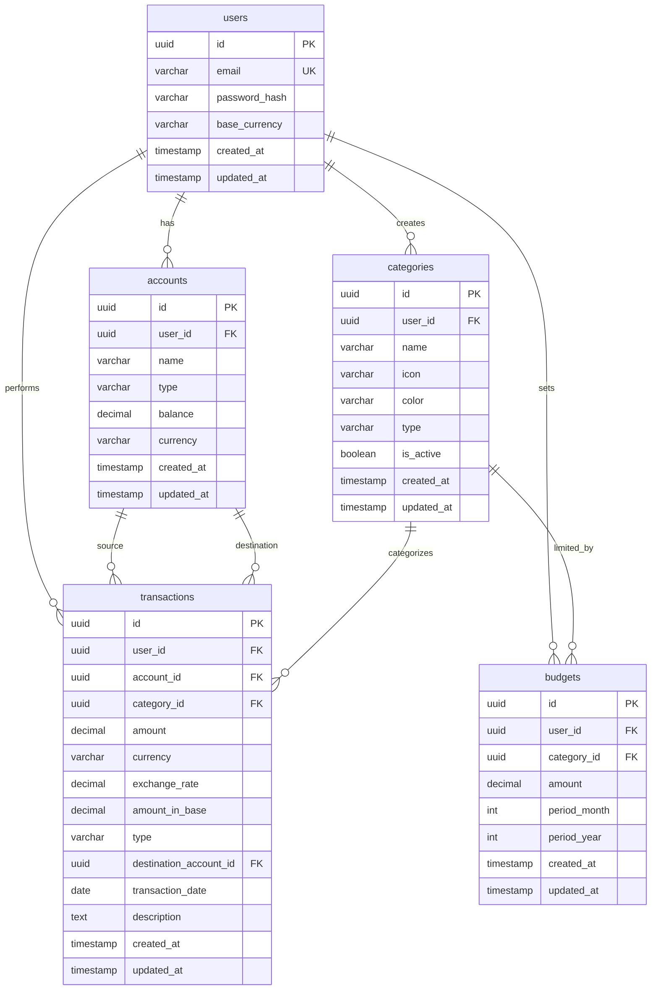

# Product Requirements Document: Hematly
Version: 1.0, Status: Draft, Tanggal: 24 Oktober 2023

## 1. Overview
- **Problem Statement**: Banyak individu kelas pekerja urban dan mahasiswa mengalami kesulitan melacak pengeluaran bulanan mereka karena pencatatan manual yang tersebar atau terlalu rumit. Hal ini mengakibatkan pengeluaran berlebih (*overspending*), ketidakmampuan menabung, dan kebingungan ke mana uang mereka habis setiap bulannya, terutama ketika mereka mengelola beberapa rekening bank, dompet digital (*multi-account*), atau bertransaksi dalam mata uang asing (*multi-currency*).
- **Solution**: Hematly adalah aplikasi mobile pelacak keuangan pribadi yang memungkinkan pengguna mencatat transaksi harian secara cepat, mengelompokkannya secara otomatis, menetapkan anggaran (*budget*) bulanan per kategori, serta memantau kesehatan keuangan melalui visualisasi grafik yang intuitif. Hematly memfasilitasi pengelolaan multi-akun dan konversi multi-mata uang secara real-time untuk memberikan gambaran finansial yang komprehensif.
- **Goals**:
  1. Mengurangi waktu pencatatan transaksi manual hingga di bawah 10 detik per transaksi.
  2. Membantu minimal 80% pengguna aktif menekan pengeluaran bulanan mereka sebesar 15% dalam 3 bulan pertama penggunaan.
  3. Mengurangi insiden *overspending* anggaran kategori hingga 50% melalui sistem notifikasi real-time.
  4. Mempertahankan retensi pengguna bulanan (Monthly Active Users - MAU) di atas 60% dalam tahun pertama.
  5. Akurasi konversi nilai multi-mata uang mencapai 99.9% menggunakan kurs terupdate harian.
- **Non-Goals**:
  1. Integrasi otomatis (open banking/scraping) dengan mutasi rekening bank lokal pada fase ini (pencatatan tetap manual/import CSV).
  2. Fitur investasi, manajemen portofolio saham, reksa dana, atau perdagangan kripto.
  3. Fitur sosial atau berbagi pengeluaran antar pengguna (*split bill* kelompok belum didukung).
  4. Pengajuan pinjaman atau produk paylater di dalam aplikasi.
- **Target Users**:
  1. Pekerja kantoran urban (usia 22-40 tahun) dengan beberapa rekening bank/e-wallet.
  2. Mahasiswa atau pelajar yang ingin mengatur uang saku bulanan.
  3. Traveler atau pekerja lepas (*freelancer*) yang sering bertransaksi dengan mata uang asing.
- **Personas**:
  1. **Nama**: Rian Hartono
     - **Peran**: Digital Marketing Specialist (Pekerja Kantoran)
     - **Kebutuhan**: Konsolidasi catatan pengeluaran dari 3 rekening bank berbeda dan 2 e-wallet.
     - **Pain Points**: Sering lupa mencatat pengeluaran kecil seperti kopi atau parkir karena proses input aplikasi lama yang ribet.
     - **Konteks**: Menggunakan smartphone Android mid-range, sibuk, butuh pencatatan cepat kurang dari 5 detik di sela-sela aktivitas.
  2. **Nama**: Sarah Wijaya
     - **Peran**: Freelancer Desain Grafis Internasional
     - **Kebutuhan**: Mencatat pendapatan dalam USD dan pengeluaran harian dalam IDR secara akurat.
     - **Pain Points**: Kesulitan menghitung sisa budget bulanan karena perbedaan nilai tukar mata uang yang berfluktuasi.
     - **Konteks**: Menggunakan iPhone 13, membutuhkan konversi otomatis saat mencatat transaksi asing ke mata uang utama (IDR).
- **User Stories**:
  - **US-01**: Sbg pengguna Hematly, saya ingin mencatat transaksi pengeluaran dengan nominal, kategori, akun, dan mata uang tertentu agar catatan keuangan saya selalu akurat.
  - **US-02**: Sbg pengguna Hematly, saya ingin menetapkan budget bulanan untuk kategori tertentu (misal: Makanan) agar saya mendapat peringatan sebelum terjadi *overspending*.
  - **US-03**: Sbg pengguna Hematly, saya ingin membuat beberapa akun (misal: Cash, Bank BCA, Gopay) agar saya bisa melacak saldo di masing-masing dompet secara terpisah.
  - **US-04**: Sbg pengguna Hematly, saya ingin melihat grafik lingkaran (*pie chart*) distribusi pengeluaran bulanan agar saya tahu kategori apa yang paling banyak menghabiskan uang saya.
  - **US-05**: Sbg pengguna Hematly, saya ingin mencatat transaksi dalam mata uang asing (misal: USD) dan melihat konversinya ke mata uang utama (IDR) agar saya mengetahui nilai total kekayaan saya secara konsisten.
  - **US-06**: Sbg pengguna Hematly, saya ingin menyalin (*duplicate*) transaksi yang sering terjadi agar mempercepat proses pencatatan harian saya.

---

## 2. Scope
- **In-Scope**:
  - Autentikasi pengguna menggunakan Email/Password dan Google OAuth.
  - Manajemen Akun Keuangan (tambah, ubah, hapus, set saldo awal, multi-currency).
  - Pencatatan Transaksi (Pengeluaran, Pemasukan, Transfer antar akun) dengan dukungan multi-currency.
  - Manajemen Kategori Transaksi (kategori bawaan dan kustom oleh pengguna).
  - Manajemen Budget Bulanan per kategori dengan indikator visual sisa budget.
  - Laporan Keuangan berupa grafik lingkaran (distribusi pengeluaran) dan grafik garis (tren pengeluaran bulanan).
  - Sinkronisasi data otomatis ke cloud (database backend) saat online, dan penyimpanan lokal (SQLite) saat offline.
- **Out-of-Scope**:
  - Sinkronisasi otomatis dengan API bank lokal (BCA, Mandiri, dll.) karena keterbatasan regulasi dan biaya API.
  - Fitur scan struk belanja menggunakan OCR (Optical Character Recognition) - ditunda ke fase berikutnya.
  - Ekspor laporan keuangan langsung ke format PDF berbayar (hanya CSV yang didukung gratis di fase ini).
- **Assumptions**:
  - Pengguna memiliki koneksi internet stabil setidaknya sekali sehari untuk sinkronisasi data lokal ke server.
  - Kurs nilai tukar mata uang asing diperbarui sekali setiap hari (setiap pukul 00:00 UTC) menggunakan API pihak ketiga.
- **Dependencies**:
  - API Penyedia Kurs Mata Uang (ExchangeRate-API atau sejenisnya) untuk konversi multi-currency harian.
  - Firebase Authentication / Google Auth SDK untuk manajemen login sosial.
  - Supabase/PostgreSQL sebagai database utama dan backend service.

---

## 3. Functional Requirements


| ID | Fitur | Deskripsi Detail | Prioritas | Acceptance Criteria |
| :--- | :--- | :--- | :--- | :--- |
| **FR-01** | Autentikasi Pengguna | Pengguna dapat mendaftar, masuk, dan keluar dari aplikasi menggunakan alamat email aktif dan kata sandi, atau menggunakan akun Google. | P0 | - **Given** Pengguna berada di layar login. **When** Pengguna memasukkan email dan password yang valid lalu menekan tombol "Login". **Then** Sistem mengarahkan pengguna ke Dashboard dalam waktu < 2 detik.<br>- **Given** Pengguna memilih "Login dengan Google". **When** Autentikasi Google berhasil. **Then** Akun pengguna dibuat otomatis jika belum ada, dan langsung masuk ke Dashboard. |
| **FR-02** | Manajemen Akun | Pengguna dapat membuat beberapa akun keuangan (misalnya: Dompet Tunai, Tabungan BCA, Kartu Kredit) dengan menentukan mata uang utama (*base currency*) untuk masing-masing akun. | P0 | - **Given** Pengguna berada di form Tambah Akun. **When** Pengguna mengisi nama akun "BCA", memilih mata uang "IDR", dan saldo awal "1.000.000" lalu menyimpan. **Then** Akun baru muncul di daftar akun dengan saldo awal yang tepat.<br>- **Given** Pengguna menghapus akun. **When** Akun tersebut dihapus. **Then** Seluruh transaksi yang terasosiasi dengan akun tersebut ikut terhapus (*cascade delete*). |
| **FR-03** | Pencatatan Transaksi | Pengguna dapat mencatat transaksi Masuk, Keluar, dan Transfer dengan detail: nominal, mata uang, kategori, akun asal/tujuan, tanggal, dan deskripsi singkat. | P0 | - **Given** Pengguna mengisi form Transaksi Keluar sebesar 50.000 IDR dari akun "BCA" kategori "Makanan". **When** Menekan tombol "Simpan". **Then** Saldo akun "BCA" berkurang 50.000 IDR dan transaksi tercatat di riwayat.<br>- **Given** Transaksi bertipe "Transfer". **When** Pengguna memilih akun asal "BCA" (IDR) dan akun tujuan "Mandiri" (IDR) sebesar 100.000 IDR. **Then** Saldo BCA berkurang 100.000 IDR dan saldo Mandiri bertambah 100.000 IDR. |
| **FR-04** | Konversi Multi-Mata Uang | Aplikasi secara otomatis mengonversi transaksi bermata uang asing ke mata uang default pengguna menggunakan kurs terbaru yang tersimpan. | P0 | - **Given** Mata uang default pengguna adalah IDR dan memiliki akun USD. **When** Pengguna mencatat pengeluaran 10 USD dengan kurs 1 USD = 15.000 IDR. **Then** Sistem mencatat transaksi sebesar 10 USD dan menghitung nilai konversi sebesar 150.000 IDR untuk laporan konsolidasi. |
| **FR-05** | Pengaturan Budget | Pengguna dapat menetapkan batas anggaran bulanan untuk setiap kategori pengeluaran pada bulan berjalan. | P0 | - **Given** Pengguna memilih kategori "Makanan" dan memasukkan nominal budget 2.000.000 IDR untuk bulan November. **When** Tombol simpan ditekan. **Then** Sistem menetapkan budget tersebut dan menampilkan visualisasi bar progres 0% di halaman budget. |
| **FR-06** | Notifikasi Peringatan Budget | Sistem mengirimkan notifikasi push ketika pengeluaran pada suatu kategori mendekati atau melebihi batas anggaran yang ditentukan. | P1 | - **Given** Budget kategori "Makanan" adalah 1.000.000 IDR. **When** Akumulasi pengeluaran kategori tersebut mencapai 800.000 IDR (80%). **Then** Sistem mengirimkan notifikasi "Perhatian: Pengeluaran Makanan telah mencapai 80% dari budget Anda". |
| **FR-07** | Laporan Grafik Pengeluaran | Menyediakan visualisasi berupa pie chart untuk distribusi pengeluaran per kategori dan line chart untuk tren pengeluaran harian/bulanan. | P1 | - **Given** Pengguna membuka tab "Laporan". **When** Memilih filter "Bulan Ini". **Then** Sistem menampilkan pie chart yang membagi pengeluaran berdasarkan persentase kategori dan menampilkan total pengeluaran dalam mata uang default. |
| **FR-08** | Transaksi Berulang | Pengguna dapat mengatur transaksi pengeluaran atau pemasukan rutin agar otomatis tercatat kembali setiap bulan pada tanggal yang ditentukan. | P1 | - **Given** Pengguna berada di form Transaksi Berulang. **When** Pengguna membuat jadwal transaksi pengeluaran bulanan sebesar 150.000 IDR untuk "Langganan Netflix" setiap tanggal 25. **Then** Sistem menyimpan jadwal tersebut dan otomatis membuat transaksi baru senilai 150.000 IDR pada tanggal 25 di setiap bulan berikutnya.<br>- **Given** Pengguna memiliki transaksi berulang aktif. **When** Pengguna menghapus jadwal transaksi berulang tersebut. **Then** Sistem berhenti membuat transaksi otomatis di bulan berikutnya tanpa menghapus riwayat transaksi yang sudah terbuat sebelumnya. |
| **FR-09** | Manajemen Kategori Kustom | Pengguna dapat menambahkan kategori baru dengan ikon dan warna pilihan mereka sendiri selain dari kategori default sistem. | P1 | - **Given** Pengguna di halaman Kategori. **When** Menambahkan kategori "Hobi" dengan ikon "Game" dan warna "Biru". **Then** Kategori tersebut langsung tersedia sebagai pilihan saat membuat transaksi baru. |
| **FR-10** | Sinkronisasi Offline | Pengguna dapat melakukan pencatatan transaksi saat perangkat tidak terhubung ke internet, dan data akan disinkronisasikan ke cloud saat koneksi kembali tersedia. | P1 | - **Given** Perangkat dalam mode pesawat (offline). **When** Pengguna mencatat transaksi baru. **Then** Transaksi disimpan di database lokal (SQLite) dan diberi status `pending_sync = true`. Saat internet aktif, data otomatis terunggah ke database cloud dan status berubah menjadi `pending_sync = false`. |
| **FR-11** | Ekspor Data ke CSV | Pengguna dapat mengekspor seluruh data transaksi mereka ke dalam file berformat CSV berdasarkan rentang tanggal yang dipilih. | P2 | - **Given** Pengguna berada di menu Ekspor Data. **When** Memilih rentang tanggal "1 Okt - 31 Okt" dan menekan "Ekspor". **Then** Sistem menghasilkan file CSV yang berisi kolom Tanggal, Akun, Kategori, Nominal, Mata Uang, Tipe, dan Deskripsi untuk diunduh. |

## 4. Non-Functional Requirements
- **Performance**:
  - Waktu respon API (*response time*) untuk operasi baca/tulis data harus p95 < 500ms dalam kondisi jaringan 4G stabil.
  - Operasi pembacaan database lokal (SQLite) pada perangkat harus selesai dalam waktu < 50ms.
  - Aplikasi harus dapat dibuka dan menampilkan layar dashboard (Cold Start) dalam waktu < 2.0 detik.
- **Security**:
  - Autentikasi menggunakan JSON Web Token (JWT) dengan masa berlaku token (*expiry time*) selama 24 jam.
  - Semua komunikasi data antara aplikasi mobile dan server wajib menggunakan enkripsi TLS 1.3.
  - Data sensitif pengguna (seperti hash password) di database disandikan menggunakan algoritma bcrypt.
  - Penerapan *Rate-limiting* pada API backend maksimal 100 request per menit per alamat IP untuk mencegah serangan Brute Force/DDoS.
  - Validasi dan sanitasi input ketat di sisi server (menggunakan pustaka Zod) untuk mencegah SQL Injection dan Cross-Site Scripting (XSS).
- **Scalability**:
  - Backend harus mampu melayani hingga 10.000 pengguna aktif harian (Daily Active Users - DAU) dengan kapasitas konkurensi minimal 1.000 pengguna secara bersamaan tanpa penurunan performa.
- **Reliability/Availability**:
  - Tingkat ketersediaan sistem (*uptime*) minimal 99.9% setiap bulannya.
  - Proses backup data otomatis dilakukan setiap hari dengan target Recovery Point Objective (RPO) maksimal 24 jam dan Recovery Time Objective (RTO) maksimal 4 jam, serta disimpan di server penyimpanan terpisah yang aman dengan kebijakan retensi data selama 5 tahun.
  - Sistem memiliki mekanisme otomatisasi *retry* maksimal sebanyak 3 kali jika terjadi kegagalan sinkronisasi data akibat gangguan jaringan sementara.
- **Usability & Accessibility**:
  - Desain antarmuka pengguna (UI) harus memenuhi standar System Usability Scale (SUS) dengan skor minimal 80.
  - Mendukung aksesibilitas sesuai panduan WCAG 2.1 Level AA, termasuk dukungan pembaca layar (*screen reader* seperti TalkBack/VoiceOver) dan ukuran target sentuh (*touch target*) minimal 48x48 density-independent pixels (dp).
- **Compliance**:
  - Kepatuhan terhadap regulasi perlindungan data pribadi (GDPR/UU PDP Indonesia) dengan menyediakan opsi bagi pengguna untuk mengekspor seluruh data pribadi mereka atau menghapus akun secara permanen dari sistem beserta seluruh cadangan datanya (*Right to be Forgotten*).

## 5. Business Rules (BR)
- **BR-01**: Transaksi dengan tipe `TRANSFER` wajib memiliki `account_id` (akun asal) dan `destination_account_id` (akun tujuan) yang berbeda. Jika mata uang kedua akun berbeda, nominal transfer pada akun tujuan harus dikalikan dengan nilai kurs konversi yang berlaku pada tanggal transaksi tersebut.
- **BR-02**: Anggaran (*budget*) bulanan dihitung berdasarkan bulan kalender penuh (mulai tanggal 1 pukul 00:00:00 hingga hari terakhir bulan tersebut pukul 23:59:59 berdasarkan zona waktu lokal pengguna).
- **BR-03**: Mata uang utama (*Base Currency*) pengguna ditentukan saat pendaftaran akun pertama kali dan tidak dapat diubah di kemudian hari untuk menjaga konsistensi kalkulasi nilai historis laporan keuangan.
- **BR-04**: Pencatatan transaksi dengan tanggal di masa mendatang (*future-dated transaction*) diperbolehkan, namun nominal transaksi tersebut tidak akan memotong saldo akun berjalan (*current balance*) sampai tanggal transaksi tersebut tercapai.
- **BR-05**: Peringatan batas anggaran (*budget alert*) akan secara otomatis dipicu dan dikirimkan lewat notifikasi ketika total akumulasi pengeluaran pada suatu kategori telah mencapai persis $\ge 80\%$ dan $\ge 100\%$ dari nilai nominal budget yang dialokasikan pada bulan tersebut.
- **BR-06**: Penghapusan suatu Akun Keuangan akan mengakibatkan seluruh riwayat transaksi yang terikat pada akun tersebut dihapus secara permanen dari sistem (*hard delete cascade*). Nilai saldo pada akun lain tidak akan terpengaruh kecuali jika ada transaksi transfer yang melibatkan akun yang dihapus tersebut (transaksi transfer akan diubah tipenya menjadi pengeluaran/pemasukan biasa pada akun lawan).
- **BR-07**: Kurs konversi mata uang asing yang digunakan untuk mencatat transaksi harus menggunakan nilai kurs pada tanggal transaksi dibuat, bukan kurs pada hari penginputan atau hari ini.
- **BR-08**: Kategori default bawaan sistem (Makanan, Transportasi, Belanja, Utilitas, Hiburan) bersifat *read-only* bagi pengguna; tidak dapat dihapus atau diubah namanya, namun pengguna diperbolehkan menonaktifkan (*deactivate*) agar tidak muncul di pilihan menu transaksi.

---

## 6. Edge Cases

| Skenario | Perilaku Diharapkan |
| :--- | :--- |
| **Data Kosong (Empty State)** | Saat pengguna baru masuk pertama kali dan belum memiliki transaksi atau budget, dashboard tidak boleh kosong melainkan menampilkan ilustrasi *empty state* dengan tombol panduan cepat "Buat Transaksi Pertama Anda" dan "Atur Budget Kategori". |
| **Transaksi Duplikat (Double Tap)** | Jika pengguna menekan tombol "Simpan" berkali-kali secara cepat pada form transaksi, sistem harus menonaktifkan (*disable*) tombol segera setelah ketukan pertama dan hanya memproses 1 request transaksi untuk mencegah pencatatan ganda. |
| **Edit Bersamaan (Concurrent Edit)** | Jika pengguna mengedit transaksi yang sama dari dua perangkat berbeda secara bersamaan dalam kondisi online, sistem akan menerapkan aturan *Last-Write-Wins* berdasarkan timestamp pembaruan paling akhir di server. |
| **Pembuatan Offline & Konflik Sinkronisasi** | Ketika pengguna membuat transaksi saat offline lalu menghapusnya sebelum sempat online, saat koneksi internet kembali aktif, sistem harus mendeteksi status penghapusan lokal tersebut dan tidak melakukan sinkronisasi pembuatan transaksi ke server. |
| **Nilai Nominal Ekstrim** | Jika pengguna memasukkan nominal transaksi yang tidak masuk akal (misalnya: 999 triliun rupiah atau nilai negatif), validator input akan menolak transaksi tersebut dengan batas maksimal input transaksi sebesar 99.999.999.999 IDR (99 Miliar) per transaksi. |
| **Perubahan Zona Waktu (Timezone Shift)** | Jika pengguna melakukan perjalanan dari Jakarta (UTC+7) ke Tokyo (UTC+9) dan mencatat transaksi, tanggal transaksi akan disimpan menggunakan format ISO 8601 UTC di database, namun ditampilkan di layar sesuai dengan zona waktu perangkat saat ini agar tidak merusak urutan laporan harian. |
| **Pelanggaran Batas Izin (Permission Boundary)** | Jika pengguna mencoba mengakses data transaksi milik user lain dengan memanipulasi ID transaksi pada request API, backend harus mengembalikan error `403 Forbidden` setelah memvalidasi bahwa `user_id` pada transaksi tidak cocok dengan JWT token. |
| **Kegagalan Koneksi saat Pembayaran/Konversi** | Jika API pihak ketiga penyedia kurs mati saat pengguna menambahkan transaksi mata uang asing baru secara online, sistem akan menggunakan data kurs terakhir yang berhasil di-cache secara lokal (maksimal berumur 7 hari) dan memberikan indikasi visual "Kurs Offline". |
| **Migrasi Kategori Sistem** | Jika sistem menambahkan kategori default baru secara global pada update aplikasi, proses migrasi database lokal harus otomatis menyuntikkan kategori tersebut ke tabel kategori pengguna tanpa menghapus atau mengubah urutan kategori kustom yang sudah dibuat pengguna. |

---

## 7. User Flow & Screen List
### Primary Flow: Menambahkan Transaksi Pengeluaran Baru (Happy Path)
1. Pengguna membuka aplikasi dan berada di layar Dashboard.
2. Pengguna menekan tombol "+" (Tambah Transaksi) di bagian bawah navigasi.
3. Sistem menampilkan Layar Form Transaksi.
4. Pengguna memilih tipe transaksi "Pengeluaran".
5. Pengguna memasukkan nominal transaksi (misal: 75.000).
6. Pengguna memilih Akun asal dana (misal: "Dompet Tunai").
7. Pengguna memilih Kategori pengeluaran (misal: "Makanan").
8. Pengguna memilih tanggal transaksi (secara default terisi tanggal hari ini).
9. Pengguna menuliskan catatan opsional (misal: "Makan siang bakso").
10. Pengguna menekan tombol "Simpan".
11. Sistem memvalidasi data, memperbarui saldo akun "Dompet Tunai" secara lokal dan di server, lalu mengembalikan pengguna ke layar Dashboard dengan pesan sukses "Transaksi berhasil disimpan".

### Alternative Flow: Penanganan Kegagalan Sinkronisasi Offline
1. Pengguna melakukan langkah 1-10 pada Primary Flow dalam kondisi tanpa koneksi internet.
2. Sistem mendeteksi kegagalan koneksi ke server API.
3. Sistem menyimpan transaksi ke database lokal SQLite dengan flag `pending_sync = true`.
4. Sistem memperbarui saldo akun secara lokal di layar Dashboard dan menampilkan banner kecil "Mode Offline - Data akan disinkronkan saat online".
5. Saat koneksi internet terdeteksi kembali aktif oleh aplikasi, modul Sync Manager berjalan di latar belakang.
6. Sync Manager mengirimkan data transaksi tertunda ke server API `/api/v1/transactions`.
7. Server membalas dengan status sukses `201 Created`.
8. Sync Manager mengubah flag transaksi lokal menjadi `pending_sync = false` dan menghilangkan banner offline dari layar.

### Screen List

| Nama Layar | Target Destinasi Navigasi | Elemen Utama | Navigasi |
| :--- | :--- | :--- | :--- |
| **Layar Login/Register** | Dashboard, Lupa Password | Input Email, Input Password, Tombol Login Google, Tombol Login Email, Link Register | Menuju Dashboard setelah login sukses; Menuju Form Register jika belum punya akun. |
| **Layar Dashboard** | Form Transaksi, Detail Akun, Notifikasi | Total Saldo Konsolidasi, Daftar Akun Keuangan, Riwayat Transaksi Terbaru (5 terakhir), Tombol "+" Tambah Transaksi, Bottom Navigation Bar (Dashboard, Budget, Laporan, Pengaturan). | Menekan akun mengarah ke Detail Akun; Menekan "+" mengarah ke Form Transaksi. |
| **Layar Form Transaksi** | Dashboard | Segmented Control (Pemasukan, Pengeluaran, Transfer), Input Nominal, Dropdown Mata Uang, Dropdown Akun, Dropdown Kategori, Date Picker, Input Catatan, Tombol Simpan. | Tombol "Kembali" atau "Simpan" mengarahkan kembali ke Dashboard. |
| **Layar Manajemen Budget** | Form Tambah Budget | Daftar Kategori dengan bar progres budget (nominal terpakai vs limit), Tombol "Set Budget Baru", Filter Bulan/Tahun. | Menekan budget kategori mengarah ke pengubahan budget; Menekan "Set Budget Baru" membuka form input budget. |
| **Layar Laporan Grafik** | Dashboard | Selector Periode (Minggu Ini, Bulan Ini, Kustom), Pie Chart Kategori, Line Chart Tren, Ringkasan Total Pemasukan vs Pengeluaran, Tombol Ekspor CSV. | Menekan ikon ekspor mengarahkan ke proses download file CSV. |
| **Layar Pengaturan** | Layar Login (setelah logout), Manajemen Kategori | Pengaturan Profil, Pilihan Base Currency, Kelola Kategori, Opsi Hapus Akun, Tombol Logout, Kebijakan Privasi. | Menekan "Kelola Kategori" membuka Layar Manajemen Kategori. |

---

## 8. API Requirements
- **Endpoint Prefix**: `/api/v1`
- **Authentication**: JWT Token dikirimkan melalui HTTP Header `Authorization: Bearer <token>`
- **Rate Limit**: Maksimal 100 request per menit per IP. Jika melanggar, API mengembalikan status `429 Too Many Requests`.

### API Endpoints

| Method | Endpoint | Auth | Deskripsi | Request Body (JSON) | Response Body (JSON) (Success 200/201) |
| :--- | :--- | :--- | :--- | :--- | :--- |
| **POST** | `/api/v1/auth/register` | Public | Pendaftaran pengguna baru | `{"email": "user@example.com", "password": "SecurePassword123", "base_currency": "IDR"}` | `{"status": "success", "data": {"user_id": "usr-9281", "email": "user@example.com", "base_currency": "IDR"}}` |
| **POST** | `/api/v1/auth/login` | Public | Login pengguna untuk mendapatkan JWT | `{"email": "user@example.com", "password": "SecurePassword123"}` | `{"status": "success", "token": "eyJhbGciOi...", "expires_in": 86400}` |
| **GET** | `/api/v1/accounts` | Private | Mengambil semua daftar akun milik user | None | `{"status": "success", "data": [{"id": "acc-101", "name": "BCA", "balance": 1500000.00, "currency": "IDR"}]}` |
| **POST** | `/api/v1/accounts` | Private | Membuat akun keuangan baru | `{"name": "Gopay", "balance": 50000.00, "currency": "IDR"}` | `{"status": "success", "data": {"id": "acc-102", "name": "Gopay", "balance": 50000.00, "currency": "IDR"}}` |
| **POST** | `/api/v1/transactions` | Private | Mencatat transaksi baru | `{"account_id": "acc-101", "category_id": "cat-05", "amount": 75000.00, "currency": "IDR", "type": "EXPENSE", "transaction_date": "2023-10-24", "description": "Makan Siang"}` | `{"status": "success", "data": {"id": "tx-509", "amount": 75000.00, "amount_in_base": 75000.00, "status": "synced"}}` |
| **GET** | `/api/v1/budgets` | Private | Mengambil budget bulanan aktif | None | `{"status": "success", "data": [{"id": "bdg-77", "category_id": "cat-05", "amount": 1000000.00, "spent": 450000.00, "month": 10, "year": 2023}]}` |
| **POST** | `/api/v1/budgets` | Private | Menetapkan budget kategori | `{"category_id": "cat-05", "amount": 1000000.00, "month": 10, "year": 2023}` | `{"status": "success", "data": {"id": "bdg-77", "category_id": "cat-05", "amount": 1000000.00}}` |

### Standard Error Responses

```json
// 400 Bad Request
{
  "error": "BAD_REQUEST",
  "message": "Parameter input tidak valid atau tidak lengkap.",
  "details": ["Nominal transaksi harus lebih besar dari 0"]
}

// 401 Unauthorized
{
  "error": "UNAUTHORIZED",
  "message": "Token autentikasi tidak valid atau telah kedaluwarsa."
}

// 403 Forbidden
{
  "error": "FORBIDDEN",
  "message": "Anda tidak memiliki hak akses untuk sumber daya ini."
}

// 404 Not Found
{
  "error": "NOT_FOUND",
  "message": "Sumber daya yang Anda cari tidak ditemukan."
}

// 409 Conflict
{
  "error": "CONFLICT",
  "message": "Data yang dikirimkan bertabrakan dengan data yang sudah ada di server."
}

// 422 Unprocessable Entity
{
  "error": "VALIDATION_ERROR",
  "message": "Validasi data gagal.",
  "details": {
    "email": "Format email tidak sesuai."
  }
}

// 500 Internal Server Error
{
  "error": "INTERNAL_SERVER_ERROR",
  "message": "Terjadi kesalahan internal pada server kami. Silakan coba beberapa saat lagi."
}
```

---

## 9. Database Schema
Desain database menggunakan PostgreSQL (3NF). Semua tabel memiliki audit fields `created_at` dan `updated_at`.

### Tabel: `users`
| Kolom | Tipe | Constraint | Keterangan |
| :--- | :--- | :--- | :--- |
| `id` | UUID | PRIMARY KEY, DEFAULT gen_random_uuid() | ID unik pengguna |
| `email` | VARCHAR(255) | UNIQUE, NOT NULL | Alamat email pengguna |
| `password_hash` | VARCHAR(255) | NOT NULL | Password terenkripsi |
| `base_currency` | VARCHAR(3) | NOT NULL, DEFAULT 'IDR' | Mata uang dasar laporan |
| `created_at` | TIMESTAMP | NOT NULL, DEFAULT NOW() | Waktu pendaftaran |
| `updated_at` | TIMESTAMP | NOT NULL, DEFAULT NOW() | Waktu pembaruan profil |

### Tabel: `accounts`
| Kolom | Tipe | Constraint | Keterangan |
| :--- | :--- | :--- | :--- |
| `id` | UUID | PRIMARY KEY, DEFAULT gen_random_uuid() | ID unik akun |
| `user_id` | UUID | FOREIGN KEY REFERENCES users(id) ON DELETE CASCADE, NOT NULL | Pemilik akun |
| `name` | VARCHAR(100) | NOT NULL | Nama akun (misal: BCA) |
| `type` | VARCHAR(50) | NOT NULL | Tipe akun (CASH, BANK, CREDIT_CARD) |
| `balance` | DECIMAL(15,2) | NOT NULL, DEFAULT 0.00 | Saldo berjalan saat ini |
| `currency` | VARCHAR(3) | NOT NULL, DEFAULT 'IDR' | Mata uang akun |
| `created_at` | TIMESTAMP | NOT NULL, DEFAULT NOW() | Waktu pembuatan akun |
| `updated_at` | TIMESTAMP | NOT NULL, DEFAULT NOW() | Waktu pembaruan saldo |

### Tabel: `categories`
| Kolom | Tipe | Constraint | Keterangan |
| :--- | :--- | :--- | :--- |
| `id` | UUID | PRIMARY KEY, DEFAULT gen_random_uuid() | ID unik kategori |
| `user_id` | UUID | FOREIGN KEY REFERENCES users(id) ON DELETE CASCADE, NULLABLE | NULL jika kategori default sistem |
| `name` | VARCHAR(100) | NOT NULL | Nama kategori (misal: Makanan) |
| `icon` | VARCHAR(50) | NOT NULL, DEFAULT 'tag' | Nama ikon untuk UI |
| `color` | VARCHAR(7) | NOT NULL, DEFAULT '#FFFFFF' | Kode warna hex |
| `type` | VARCHAR(20) | NOT NULL | Tipe kategori (EXPENSE, INCOME) |
| `is_active` | BOOLEAN | NOT NULL, DEFAULT TRUE | Status aktif kategori |
| `created_at` | TIMESTAMP | NOT NULL, DEFAULT NOW() | Waktu pembuatan |
| `updated_at` | TIMESTAMP | NOT NULL, DEFAULT NOW() | Waktu pembaruan |

### Tabel: `budgets`
| Kolom | Tipe | Constraint | Keterangan |
| :--- | :--- | :--- | :--- |
| `id` | UUID | PRIMARY KEY, DEFAULT gen_random_uuid() | ID unik budget |
| `user_id` | UUID | FOREIGN KEY REFERENCES users(id) ON DELETE CASCADE, NOT NULL | Pemilik budget |
| `category_id` | UUID | FOREIGN KEY REFERENCES categories(id) ON DELETE CASCADE, NOT NULL | Kategori yang dibatasi |
| `amount` | DECIMAL(15,2) | NOT NULL, CHECK (amount > 0) | Nominal budget |
| `period_month` | INT | NOT NULL, CHECK (period_month BETWEEN 1 AND 12) | Bulan budget berlaku |
| `period_year` | INT | NOT NULL, CHECK (period_year >= 2023) | Tahun budget berlaku |
| `created_at` | TIMESTAMP | NOT NULL, DEFAULT NOW() | Tanggal pembuatan |
| `updated_at` | TIMESTAMP | NOT NULL, DEFAULT NOW() | Tanggal pembaruan |

### Tabel: `transactions`
| Kolom | Tipe | Constraint | Keterangan |
| :--- | :--- | :--- | :--- |
| `id` | UUID | PRIMARY KEY, DEFAULT gen_random_uuid() | ID unik transaksi |
| `user_id` | UUID | FOREIGN KEY REFERENCES users(id) ON DELETE CASCADE, NOT NULL | Pemilik transaksi |
| `account_id` | UUID | FOREIGN KEY REFERENCES accounts(id) ON DELETE CASCADE, NOT NULL | Akun asal/utama |
| `category_id` | UUID | FOREIGN KEY REFERENCES categories(id) ON DELETE SET NULL, NULLABLE | Kategori transaksi |
| `amount` | DECIMAL(15,2) | NOT NULL | Nominal dalam mata uang transaksi |
| `currency` | VARCHAR(3) | NOT NULL | Mata uang transaksi |
| `exchange_rate` | DECIMAL(15,6) | NOT NULL, DEFAULT 1.000000 | Kurs ke base currency user |
| `amount_in_base` | DECIMAL(15,2) | NOT NULL | Hasil perkalian amount * exchange_rate |
| `type` | VARCHAR(20) | NOT NULL, CHECK (type IN ('EXPENSE', 'INCOME', 'TRANSFER')) | Jenis transaksi |
| `destination_account_id` | UUID | FOREIGN KEY REFERENCES accounts(id) ON DELETE SET NULL, NULLABLE | Terisi hanya jika tipe TRANSFER |
| `transaction_date` | DATE | NOT NULL | Tanggal transaksi aktual |
| `description` | TEXT | NULLABLE | Catatan tambahan |
| `created_at` | TIMESTAMP | NOT NULL, DEFAULT NOW() | Waktu pencatatan di database |
| `updated_at` | TIMESTAMP | NOT NULL, DEFAULT NOW() | Waktu pembaruan data |

### Indexes:
- `idx_users_email` ON `users(email)` (B-Tree untuk login cepat)
- `idx_transactions_user_date` ON `transactions(user_id, transaction_date)` (B-Tree untuk query riwayat & laporan)
- `idx_budgets_lookup` ON `budgets(user_id, category_id, period_year, period_month)` (Unique Index untuk mencegah duplikasi budget kategori per bulan)

### Entity Relationship Diagram (ERD)


---

## 10. Roles & Permissions

| Role | Modul | Hak Akses (CRUD) | Keterangan |
| :--- | :--- | :--- | :--- |
| **End-User** | Autentikasi | CR-D | Dapat mendaftar, membaca profil sendiri, dan menghapus akun pribadi. |
| **End-User** | Akun Keuangan | CRUD | Memiliki kontrol penuh atas akun keuangan miliknya sendiri. Tidak dapat melihat akun user lain. |
| **End-User** | Transaksi | CRUD | Dapat mencatat, melihat, mengedit, dan menghapus transaksi pribadinya. |
| **End-User** | Kategori | CRUD | Dapat membuat kategori kustom, serta membaca kategori default sistem. Kategori default tidak dapat diubah/dihapus (hanya dinonaktifkan). |
| **End-User** | Budget | CRUD | Memiliki kontrol penuh atas budget bulanan miliknya sendiri. |
| **System Admin** | Semua Modul | R--D | Hanya memiliki hak membaca data agregat untuk laporan performa sistem dan menghapus akun pengguna yang melanggar ketentuan layanan (tidak berhak mengubah data transaksi). |
| **System Cron** | Nilai Kurs | CR-U | Worker otomatis yang berjalan setiap pukul 00:00 UTC untuk mengambil data kurs terbaru dan menulisnya ke basis data. |

---

## 11. Validation Rules

| Field | Aturan Validasi | Pesan Error (Bahasa Indonesia) |
| :--- | :--- | :--- |
| `users.email` | Format email harus valid sesuai regex standar, tidak boleh kosong, panjang maks 255 karakter. | "Format email tidak valid atau alamat email terlalu panjang." |
| `users.password` | Minimal 8 karakter, mengandung setidaknya 1 angka dan 1 huruf besar. | "Kata sandi minimal harus 8 karakter dan mengandung minimal 1 angka serta 1 huruf besar." |
| `accounts.name` | Tidak boleh kosong, minimal 2 karakter, maksimal 50 karakter. | "Nama akun harus diisi dengan panjang antara 2 hingga 50 karakter." |
| `accounts.balance` | Harus berupa angka desimal valid, tidak boleh null. | "Saldo awal harus berupa angka desimal yang valid." |
| `transactions.amount`| Harus berupa angka desimal positif (> 0), maksimal 99.999.999.999. | "Nominal transaksi harus bernilai positif dan tidak boleh melebihi 99 Miliar." |
| `transactions.type` | Wajib bernilai salah satu dari: 'EXPENSE', 'INCOME', 'TRANSFER'. | "Tipe transaksi tidak valid." |
| `transactions.transaction_date` | Format tanggal YYYY-MM-DD, tidak boleh lebih dari 1 tahun ke masa depan. | "Tanggal transaksi tidak valid atau terlalu jauh ke masa depan." |
| `budgets.amount` | Harus berupa angka desimal positif (> 0). | "Nominal budget harus bernilai positif." |
| `budgets.period_month`| Harus berupa integer antara nilai 1 hingga 12. | "Bulan budget tidak valid." |

---

## 12. Error Handling
- **Strategy**:
  - **UI/UX**: Error validasi form ditampilkan secara inline di bawah field yang bermasalah dengan warna teks merah (#FF3B30). Error jaringan atau sistem global ditampilkan menggunakan Toast Notification (melayang selama 3 detik) atau Banner di bagian atas layar jika bersifat kritis.
  - **Retry Policy**: Untuk kegagalan koneksi API saat melakukan sinkronisasi transaksi offline, aplikasi akan mencoba ulang (*retry*) secara otomatis menggunakan metode *Exponential Backoff* (mencoba setelah 2s, 4s, hingga maksimal 8s) sebelum akhirnya menandai transaksi dengan status "Gagal Sinkronisasi, Ketuk untuk Coba Lagi".
  - **Idempotency**: Setiap request pembuatan transaksi baru dari aplikasi mobile menyertakan header `X-Idempotency-Key` (berisi UUID yang di-generate di sisi client). Jika server menerima request dengan key yang sama dalam waktu 24 jam, server akan mengembalikan response yang sama tanpa memproses ulang transaksi di database.

### Tabel Penanganan Error

| Skenario Error | Error Code | Pesan ke User | Aksi Sistem |
| :--- | :--- | :--- | :--- |
| Token JWT Kedaluwarsa | `AUTH_TOKEN_EXPIRED` | "Sesi Anda telah berakhir. Silakan masuk kembali." | Menghapus token lokal, mengarahkan pengguna kembali ke Layar Login. |
| Koneksi Internet Terputus | `NETWORK_UNAVAILABLE` | "Koneksi internet terputus. Anda bekerja dalam mode offline." | Mengaktifkan mode database lokal (SQLite) dan memunculkan banner offline. |
| Limit Budget Terlewati | `BUDGET_EXCEEDED` | "Peringatan: Pengeluaran Anda untuk kategori [Nama Kategori] telah melebihi budget bulan ini!" | Mengirimkan notifikasi push lokal dan menandai bar progres budget dengan warna merah menyala. |
| Konflik Nilai Kurs | `EXCHANGE_RATE_FETCH_FAILED` | "Gagal memperbarui nilai kurs terbaru. Menggunakan kurs tersimpan." | Membaca data kurs historis terakhir dari database lokal untuk kalkulasi sementara. |
| Gagal Validasi Form | `VALIDATION_FAILED` | "Beberapa data yang Anda masukkan tidak valid. Silakan periksa kembali." | Menyorot field input yang salah dengan warna merah dan menampilkan pesan error inline. |
| Database Lock (Konkurensi) | `DATABASE_LOCKED` | "Sistem sedang sibuk. Transaksi Anda sedang mengantre untuk disimpan." | Menempatkan transaksi ke dalam antrean lokal untuk dicoba ulang dalam 1 detik. |

---

## 13. Analytics & Monitoring
### Events Table

| Event Name | Trigger | Properties |
| :--- | :--- | :--- |
| `user_signup_completed` | Pengguna sukses mendaftar akun baru | `method` (Email / Google), `base_currency`, `timestamp` |
| `transaction_created` | Pengguna sukses menyimpan transaksi baru | `type` (EXPENSE/INCOME/TRANSFER), `category`, `currency`, `amount_in_base`, `is_offline` (Boolean) |
| `budget_breached` | Pengeluaran kategori melewati batas budget | `category`, `budget_amount`, `current_spent`, `percentage` (80% / 100%) |
| `report_exported` | Pengguna menekan tombol ekspor data ke CSV | `date_range_days`, `format` (CSV), `timestamp` |
| `sync_completed` | Proses sinkronisasi data offline selesai dilakukan | `records_synced_count`, `duration_ms`, `status` (SUCCESS/FAILED) |

### Monitoring Setup:
1. **Health Checks**: Endpoint `/health` pada API server dipantau setiap 60 detik menggunakan UptimeRobot. Mengembalikan status `200 OK` jika database dan server cache (Redis) dapat diakses normal.
2. **Error Tracking**: Integrasi Sentry SDK pada aplikasi mobile dan backend untuk menangkap error *unhandled exceptions* secara real-time. Alert akan dikirim ke Slack tim developer jika tingkat error melebihi 1% dari total traffic dalam 15 menit.
3. **Business Metrics Dashboard**: Menggunakan Grafana untuk memantau metrik bisnis utama secara real-time: Jumlah transaksi harian, volume transaksi nominal, jumlah pengguna aktif (DAU), dan rasio kegagalan sinkronisasi data.

---

## 14. Tech Stack

| Layer | Pilihan Teknologi | Alasan Pemilihan |
| :--- | :--- | :--- |
| **Mobile Frontend** | Flutter (Dart) | Memungkinkan pembuatan aplikasi cross-platform (Android & iOS) dengan performa native, komponen UI yang konsisten, dan dukungan database lokal SQLite yang sangat stabil. |
| **Local Database** | SQLite (via Drift/Moor library) | Engine database relasional lokal yang ringan, mendukung query kompleks, dan sangat andal untuk penyimpanan data offline sementara pada perangkat mobile. |
| **Backend Service** | Node.js (TypeScript) + Express | Ekosistem yang matang, performa I/O non-blocking yang sangat baik untuk menangani konkurensi tinggi, serta integrasi mudah dengan validator skema Zod. |
| **Database Utama** | PostgreSQL (Supabase) | Database relasional tangguh yang mendukung integritas data tingkat tinggi (ACID), penanganan data spasial/JSON, dan kemudahan skalabilitas vertikal maupun horizontal. |
| **Caching & Queue** | Redis | Digunakan untuk menyimpan data kurs mata uang asing harian yang sering diakses dan mengelola antrean proses sinkronisasi transaksi yang berat. |
| **Cloud Hosting** | AWS (Amazon Web Services) | Infrastruktur cloud dengan jaminan keamanan tinggi, ketersediaan global, dan skalabilitas otomatis (*auto-scaling*) untuk server Node.js. |

---

## 15. Future Improvements
- **Fase 1 (MVP - Versi Saat Ini)**:
  - Peluncuran fitur pencatatan manual dasar, multi-currency, multi-account, budget bulanan, diagram laporan sederhana, dan sinkronisasi offline.
- **Fase 2 (Automasi & Keamanan Tambahan)**:
  - Integrasi modul OCR (Optical Character Recognition) untuk membaca struk belanja secara otomatis menggunakan kamera smartphone.
  - Implementasi login biometrik (Fingerprint / Face ID) pada aplikasi mobile.
  - Penambahan fitur import transaksi langsung dari file CSV/Excel mutasi bank.
- **Fase 3 (Prediksi Finansial & AI)**:
  - Implementasi Machine Learning lokal untuk memprediksi tren pengeluaran pengguna di bulan berikutnya berdasarkan data historis 3 bulan terakhir.
  - Fitur rekomendasi penghematan anggaran otomatis berbasis AI (*Smart Financial Advisor*).

## 16. Feature Breakdown & Tasks

### Pencatatan Transaksi Pengeluaran
## Sub-fitur
- [ ] Sub-fitur 1: Input Cepat via Custom Numeric Keypad — Memungkinkan pengguna memasukkan nominal transaksi secara instan tanpa keyboard sistem untuk mempercepat waktu pencatatan di bawah 10 detik.
- [ ] Sub-fitur 2: Pemilihan Kategori dan Akun Asal — Memungkinkan pengguna mengatribusikan pengeluaran ke kategori tertentu (makanan, transportasi, dll.) dan memotong saldo dari akun yang dipilih (BCA, Gopay, dll.).
- [ ] Sub-fitur 3: Lampiran Foto Bukti Transaksi — Memungkinkan pengguna mengambil foto struk belanja secara langsung atau mengunggahnya dari galeri sebagai bukti pendukung transaksi.
- [ ] Sub-fitur 4: Konversi Multi-Mata Uang Otomatis — Mengonversi nominal pengeluaran asing ke mata uang utama (base currency) secara real-time berdasarkan kurs harian yang tersimpan.
- [ ] Sub-fitur 5: Sinkronisasi Offline Otomatis — Menyimpan transaksi secara lokal di SQLite saat tidak ada internet, lalu menyinkronkannya kembali ke Supabase cloud setelah koneksi terdeteksi aktif.

## Spesifikasi Teknis
- **Data Model / Fields Involved**:
  - `transactions`: `id` (UUID), `user_id` (UUID), `account_id` (UUID), `category_id` (UUID), `amount` (DECIMAL), `currency` (VARCHAR), `exchange_rate` (DECIMAL), `amount_in_base` (DECIMAL), `type` (VARCHAR = 'EXPENSE'), `destination_account_id` (NULL), `transaction_date` (DATE), `description` (TEXT), `image_url` (VARCHAR/TEXT, nullable), `pending_sync` (BOOLEAN, local only), `created_at` (TIMESTAMP), `updated_at` (TIMESTAMP).
- **State Management Approach**:
  - Menggunakan Flutter Bloc/Riverpod untuk mengelola state form transaksi, status upload gambar, dan antrean sinkronisasi offline.
- **Key Algorithms / Business Logic**:
  - Perhitungan nilai base currency: `amount_in_base = amount * exchange_rate`.
  - Logika Idempotensi: Mengirimkan UUID unik via header `X-Idempotency-Key` di setiap request API untuk mencegah duplikasi data transaksi akibat double tap atau gangguan jaringan.
  - Logika Pengurangan Saldo: Mengurangi saldo (`balance`) pada tabel `accounts` yang terhubung secara otomatis setelah transaksi berhasil disimpan.
- **Performance Considerations**:
  - Kompresi gambar bukti transaksi di sisi client (maksimal resolusi 1080p, format JPEG, ukuran file < 2MB) sebelum diunggah ke storage untuk menghemat bandwidth.
  - Operasi penulisan ke database lokal SQLite harus diselesaikan dalam waktu kurang dari 50ms.
- **Dependencies**:
  - `image_picker` & `flutter_image_compress` untuk penanganan foto bukti.
  - Drift/Moor (SQLite wrapper) untuk penyimpanan lokal.
  - Supabase Storage Client untuk penyimpanan file gambar.

## Tasks

### Frontend
- [ ] [Layar Form Transaksi Pengeluaran] Membuat antarmuka form pengeluaran dengan custom numeric keypad terintegrasi di bagian bawah layar.
- [ ] [Dropdown Selector Kategori & Akun] Menyusun komponen dropdown pencarian cepat untuk kategori transaksi dan akun asal dana beserta sisa saldonya.
- [ ] [Widget Lampiran Foto] Membuat komponen preview foto bukti transaksi dengan opsi hapus/ambil ulang gambar menggunakan kamera atau galeri.
- [ ] [Validasi Form Form Input] Menghubungkan input nominal agar membatasi nilai maksimal 99.999.999.999 IDR dan mendeteksi input negatif.
- [ ] [State Handler UI] Mengimplementasikan loading spinner saat proses upload foto ke Supabase Storage, serta menampilkan banner status "Mode Offline - Transaksi Disimpan Lokal" jika koneksi internet terputus.

### Backend
- [ ] [Service Create Transaction] Membuat use-case `CreateTransaction` yang bertugas mengurangi saldo akun terkait dan memicu validasi budget bulanan (pemicu alert jika pengeluaran $\ge 80\%$ atau $\ge 100\%$).
- [ ] [Validation Logic Zod] Menyusun skema validasi Zod untuk memastikan `amount` positif, format UUID valid untuk `account_id` dan `category_id`, serta tipe transaksi bernilai 'EXPENSE'.
- [ ] [Idempotency Middleware] Mengimplementasikan pengecekan header `X-Idempotency-Key` pada Redis/Database untuk mencegah proses ganda transaksi yang sama dalam rentang waktu 24 jam.
- [ ] [Error Handler & Log] Menangani error database lock (konkurensi) dan menyusun log aktivitas transaksi ke sistem monitoring.

### Database
- [ ] [Migration Local SQLite] Menambahkan kolom `image_url` (TEXT) dan `pending_sync` (BOOLEAN, default true) ke tabel `transactions` lokal.
- [ ] [Migration PostgreSQL] Membuat migrasi database untuk menambahkan kolom `image_url` (VARCHAR) ke tabel `transactions` di Supabase.
- [ ] [Database Trigger] Membuat trigger PostgreSQL untuk otomatis memotong saldo di tabel `accounts` ketika ada baris baru masuk ke tabel `transactions` dengan tipe 'EXPENSE'.

### API
- [ ] [POST /api/v1/transactions] Membuat endpoint pencatatan transaksi pengeluaran baru dengan autentikasi JWT Bearer Token.
- [ ] [POST /api/v1/transactions/receipt] Membuat endpoint upload foto bukti transaksi yang menerima multipart/form-data dan mengembalikan URL publik gambar.

### Integrasi
- [ ] [Supabase Storage Integration] Menghubungkan backend dengan Supabase Storage bucket `receipts` untuk menyimpan file foto bukti transaksi secara aman.
- [ ] [ExchangeRate-API Integration] Menghubungkan sistem konversi mata uang dengan cache kurs harian di Redis untuk query transaksi multi-currency secara cepat.

### Testing
- [ ] [Unit Test Business Logic] Membuat unit test untuk fungsi kalkulasi konversi mata uang asing dan logika pengurangan saldo akun.
- [ ] [Integration Test API] Membuat integration test untuk endpoint `POST /api/v1/transactions` dengan skenario token valid, token kedaluwarsa, dan pengiriman payload tidak lengkap.
- [ ] [Manual Checklist Edge Cases] Melakukan pengujian manual untuk skenario double-tap tombol simpan, penginputan nominal ekstrim (99 Miliar), dan simulasi transaksi offline lalu online kembali (sinkronisasi data).

## Catatan
- [ ] Risiko: Kegagalan upload foto bukti transaksi saat koneksi internet tidak stabil. Keputusan: Foto akan disimpan di penyimpanan lokal perangkat terlebih dahulu dan baru diunggah saat proses sinkronisasi latar belakang berjalan.
- [ ] Pertanyaan Terbuka: Apakah perlu membatasi jumlah maksimum foto bukti transaksi yang boleh diunggah oleh satu pengguna dalam satu bulan untuk menghemat biaya cloud storage?
