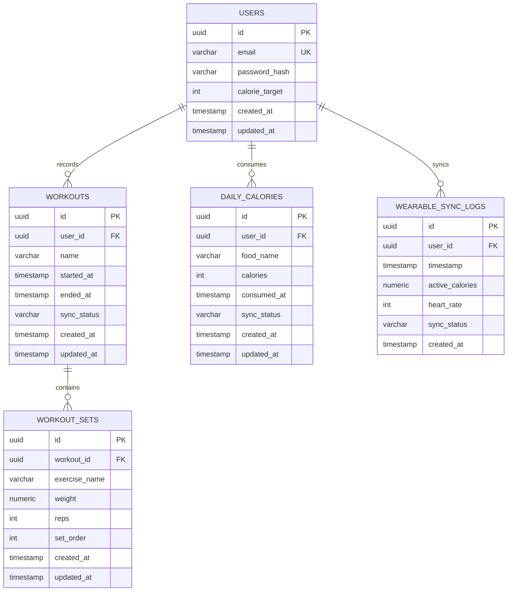

# Product Requirements Document: FitTrack
Version: 1.0, Status: Draft, Tanggal: 24 Oktober 2023

## 1. Overview
- **Problem Statement**: Pengguna aplikasi kebugaran sering kehilangan data latihan dan catatan kalori mereka ketika sedang berlatih di lokasi dengan konektivitas internet yang buruk atau tidak stabil (seperti di dalam gym bawah tanah atau area outdoor terpencil). Hal ini menyebabkan frustrasi, hilangnya motivasi, dan ketidakakuratan dalam pelacakan kemajuan kebugaran mereka.
- **Solution**: FitTrack adalah aplikasi pelacak kebugaran berbasis *offline-first* yang memungkinkan pengguna mencatat set, repetisi, beban latihan, serta asupan kalori harian secara instan tanpa koneksi internet. Data disimpan secara lokal terlebih dahulu dan disinkronkan secara otomatis ke cloud serta perangkat wearable (smartwatch) begitu koneksi internet terdeteksi kembali.
- **Goals**:
  - Mengurangi waktu pencatatan set latihan menjadi di bawah 15 detik per set.
  - Menjamin 100% data tersimpan secara lokal tanpa kehilangan data saat aplikasi ditutup dalam kondisi offline.
  - Melakukan sinkronisasi data lokal ke cloud dalam waktu kurang dari 5 detik setelah koneksi internet kembali aktif.
  - Sinkronisasi data detak jantung dan kalori dari wearable dengan latensi di bawah 3 detik saat perangkat berada dalam jangkauan Bluetooth.
  - Mencapai retensi mingguan aktif sebesar 60% dalam 3 bulan pertama setelah rilis.
- **Non-Goals**:
  - Menyediakan fitur jejaring sosial seperti berbagi foto workout ke feed publik atau fitur komentar antar-pengguna pada versi ini.
  - Menyediakan video panduan latihan secara *streaming* langsung di dalam aplikasi.
  - Mengintegrasikan pembayaran langsung untuk pelatih pribadi (personal trainer).
- **Target Users**:
  - Atlet angkat beban (powerlifter/bodybuilder) yang berlatih di gym basement.
  - Pelari outdoor atau pesepeda yang sering melewati rute minim sinyal.
  - Pengguna smartwatch yang ingin memantau kalori dan aktivitas harian secara terpadu.
- **Personas**:
  1. **Nama**: Budi Santoso
     - **Peran**: Powerlifter Amatir
     - **Kebutuhan**: Mencatat beban, set, dan repetisi latihan dengan cepat di gym bawah tanah tanpa sinyal seluler.
     - **Pain Points**: Aplikasi latihan sebelumnya sering hang atau gagal menyimpan data ketika koneksi internet terputus di tengah sesi latihan.
     - **Konteks**: Berlatih 4 kali seminggu selama 2 jam per sesi di gym basement beton tebal.
  2. **Nama**: Siti Aminah
     - **Peran**: Pekerja Kantoran & Pelari Hobi
     - **Kebutuhan**: Memantau asupan kalori harian dan menyinkronkan data kalori aktif yang terbakar dari Apple Watch.
     - **Pain Points**: Sulit menghitung sisa kuota kalori harian secara real-time karena data wearable sering terlambat masuk ke aplikasi utama.
     - **Konteks**: Berlari di taman kota setiap pagi dan mencatat makanan di sela-sela jam kerja.
- **User Stories**:
  - **US-01**: Sebagai Budi, saya ingin mencatat set, repetisi, dan beban latihan saya saat offline agar data latihan saya tetap aman tersimpan tanpa koneksi internet.
  - **US-02**: Sebagai Budi, saya ingin melihat riwayat beban latihan sebelumnya secara offline saat berada di gym agar saya dapat menentukan target beban set berikutnya dengan tepat.
  - **US-03**: Sebagai Siti, saya ingin menetapkan target kalori harian dan mencatat makanan yang saya konsumsi agar saya dapat memantau defisit atau surplus kalori saya setiap hari.
  - **US-04**: Sebagai Siti, saya ingin menyinkronkan data detak jantung dan kalori aktif dari smartwatch saya ke aplikasi FitTrack agar saya mendapatkan visualisasi data kesehatan yang akurat.
  - **US-05**: Sebagai Budi, saya ingin melihat grafik statistik kemajuan volume latihan mingguan saya agar saya dapat mengevaluasi penerapan prinsip *progressive overload*.
  - **US-06**: Sebagai Budi, saya ingin aplikasi otomatis mengunggah data latihan lokal ke cloud saat HP kembali mendeteksi sinyal internet agar data saya ter-backup dengan aman.
  - **US-07**: Sebagai Siti, saya ingin menerima notifikasi harian pada pukul 20:00 jika saya belum mencatat makanan atau belum mencapai target kalori agar saya tetap disiplin pada program diet saya.

## 2. Scope
- **In-Scope**:
  - Penyimpanan database lokal terenkripsi (SQLite/SQLCipher) untuk mendukung operasi *offline-first*.
  - Modul pencatatan workout (nama latihan, set, repetisi, beban, waktu istirahat).
  - Modul pelacakan kalori harian (input makanan, target kalori, integrasi kalori aktif).
  - Integrasi SDK wearable (Google Health Connect untuk Android dan Apple HealthKit untuk iOS).
  - Sinkronisasi background otomatis dengan mekanisme resolusi konflik "Last-Write-Wins".
  - Grafik statistik mingguan untuk performa latihan dan konsumsi kalori.
- **Out-of-Scope**:
  - Fitur ekspor data ke format PDF atau Excel (ditunda untuk fase berikutnya).
  - Program latihan kustom berbayar dari pelatih eksternal.
  - Fitur pelacakan rute GPS real-time untuk lari (mengandalkan data yang sudah direkam wearable).
- **Assumptions**:
  - Pengguna memiliki perangkat Android dengan OS versi 10 ke atas atau iOS versi 15 ke atas.
  - Perangkat wearable pengguna mendukung sinkronisasi ke Google Health Connect atau Apple HealthKit.
  - Pengguna melakukan login minimal satu kali saat memiliki koneksi internet sebelum dapat menggunakan aplikasi secara offline.
- **Dependencies**:
  - Google Health Connect API & Apple HealthKit API.
  - SQLCipher untuk enkripsi database lokal.
  - Server API berbasis REST untuk sinkronisasi data cloud.

## 3. Functional Requirements

| ID | Fitur | Deskripsi Detail | Prioritas | Acceptance Criteria |
| :--- | :--- | :--- | :--- | :--- |
| FR-01 | Pencatatan Workout Offline | Pengguna dapat membuat sesi latihan baru, memilih latihan dari daftar, serta menambah/mengubah/menghapus set, repetisi, dan beban secara offline. | P0 | - Given: Pengguna berada dalam mode offline. - When: Pengguna menekan tombol "Tambah Set" dan memasukkan angka repetisi "10" dan beban "60 kg". - Then: Data set langsung tersimpan di database lokal dan UI terupdate dalam < 100ms. |
| FR-02 | Sinkronisasi Otomatis | Aplikasi mendeteksi status internet dan mengirimkan data lokal yang belum tersinkronisasi ke server cloud secara background. | P0 | - Given: Pengguna memiliki 3 sesi latihan yang dicatat secara offline. - When: Koneksi internet aktif kembali. - Then: Aplikasi mengirim data ke API sinkronisasi, mengubah status lokal menjadi `synced`, dan menghapus antrean kirim dalam waktu < 5 detik. |
| FR-03 | Pengaturan Target Kalori | Pengguna dapat memasukkan target kalori harian dalam satuan kilokalori (kkal). | P0 | - Given: Pengguna berada di halaman profil. - When: Pengguna memasukkan angka "2000" pada input target kalori dan menekan simpan. - Then: Target kalori tersimpan di database lokal dan langsung memperbarui grafik lingkaran kalori di dashboard. |
| FR-04 | Pencatatan Kalori Makanan | Pengguna dapat mencatat nama makanan dan jumlah kalori yang dikonsumsi sepanjang hari. | P0 | - Given: Pengguna berada di halaman pelacak kalori. - When: Pengguna menambahkan makanan "Nasi Goreng" dengan nilai "500" kkal. - Then: Jumlah kalori harian bertambah 500 kkal dan sisa kuota kalori berkurang secara real-time. |
| FR-05 | Sinkronisasi Wearable | Aplikasi menarik data kalori aktif terbakar dan detak jantung rata-rata dari Google Health Connect atau Apple HealthKit. | P1 | - Given: Aplikasi memiliki izin akses HealthKit/Health Connect. - When: Pengguna membuka aplikasi FitTrack setelah berolahraga menggunakan smartwatch. - Then: Aplikasi membaca data kalori aktif terbakar terbaru dan menambahkannya ke perhitungan kalori harian secara otomatis. |
| FR-06 | Grafik Statistik Mingguan | Aplikasi menampilkan grafik batang volume latihan total mingguan dan tren konsumsi kalori harian selama 7 hari terakhir. | P1 | - Given: Pengguna membuka tab statistik. - When: Grafik dimuat. - Then: Aplikasi menampilkan data agregasi volume latihan (beban x rep x set) per hari untuk minggu berjalan secara offline. |
| FR-07 | Penghitung Waktu Istirahat | Timer otomatis berjalan setelah pengguna mencentang set latihan yang telah selesai. | P1 | - Given: Pengguna menyelesaikan set ke-1. - When: Pengguna menekan tombol centang pada set tersebut. - Then: Timer hitung mundur 60 detik (dapat disesuaikan) muncul di layar dan berbunyi/bergetar saat waktu habis. |
| FR-08 | Registrasi & Login | Pengguna dapat membuat akun baru atau masuk menggunakan email dan password saat online. | P0 | - Given: Pengguna memiliki koneksi internet. - When: Pengguna memasukkan email valid dan password, lalu menekan login. - Then: Server mengembalikan JWT token, aplikasi menyimpannya di secure storage, dan mengunduh data latihan terakhir milik user. |
| FR-09 | Resolusi Konflik Data | Sistem menyelesaikan perbedaan data antara lokal dan cloud menggunakan aturan timestamp terbaru. | P0 | - Given: Data sesi latihan diubah di HP saat offline pada pukul 12:00 dan di tablet saat online pada pukul 12:05. - When: HP kembali online dan melakukan sinkronisasi. - Then: Data dari tablet (12:05) yang tetap dipertahankan karena memiliki timestamp `updated_at` lebih baru. |
| FR-10 | Kamus Latihan Bawaan | Aplikasi menyediakan daftar 100+ latihan bawaan (misal: Bench Press, Squat, Deadlift) yang langsung tersedia secara offline. | P0 | - Given: Aplikasi baru selesai diinstal. - When: Pengguna mencari latihan "Squat" saat offline. - Then: Aplikasi menampilkan detail latihan Squat beserta kategori otot utamanya (Quadriceps) dari database bawaan. |
| FR-11 | Pembuatan Latihan Kustom | Pengguna dapat menambahkan nama latihan baru yang tidak ada di daftar bawaan. | P2 | - Given: Pengguna tidak menemukan nama latihan di kamus bawaan. - When: Pengguna memasukkan nama "Cable Lateral Raise" dan menekan simpan. - Then: Latihan baru tersebut tersimpan di database lokal dan dapat langsung dipilih untuk sesi workout. |
| FR-12 | Hapus Akun & Data | Pengguna dapat menghapus seluruh data akun mereka secara permanen dari server dan lokal sesuai regulasi privasi. | P1 | - Given: Pengguna menekan tombol "Hapus Akun" di pengaturan. - When: Pengguna mengonfirmasi tindakan dengan memasukkan password. - Then: API menghapus seluruh data user dari database cloud, dan aplikasi melakukan pembersihan total data lokal lalu mengarahkan ke halaman login. |

## 4. Non-Functional Requirements
- **Performance**:
  - Kecepatan baca/tulis ke database lokal SQLite harus di bawah 10ms (p95).
  - Waktu muat halaman utama (Dashboard) saat aplikasi dibuka harus di bawah 1.5 detik.
  - Ukuran payload sinkronisasi API tidak boleh melebihi 2MB per request untuk menghemat kuota data.
  - Penggunaan memori RAM aplikasi tidak boleh melebihi 150MB saat aktif.
- **Security**:
  - Otentikasi menggunakan OAuth 2.0 dengan JSON Web Token (JWT). Access token berlaku selama 15 menit, refresh token berlaku selama 30 hari dan disimpan di Secure Storage (iOS Keychain / Android EncryptedSharedPreferences).
  - Enkripsi database lokal menggunakan SQLCipher dengan algoritma AES-256.
  - Semua komunikasi data ke API server wajib menggunakan protokol HTTPS dengan TLS 1.3.
  - Penerapan *rate-limiting* pada API server maksimal 60 request per menit per alamat IP.
  - Penyimpanan kredensial dan API key di sisi server menggunakan AWS Secrets Manager.
- **Scalability**:
  - Arsitektur backend harus mampu menangani hingga 100,000 pengguna terdaftar dengan minimal 5,000 pengguna aktif bersamaan (*concurrent users*) saat sinkronisasi jam sibuk (17:00 - 20:00).
- **Reliability/Availability**:
  - Ketersediaan layanan API server (Uptime) minimal 99.9% setiap bulan.
  - Backup database cloud dilakukan secara otomatis setiap hari pada pukul 02:00 UTC dengan retensi penyimpanan selama 30 hari.
  - Mekanisme *retry* sinkronisasi menggunakan algoritma *exponential backoff* dengan batas maksimal 5 kali percobaan sebelum menampilkan status gagal ke user.
- **Usability**:
  - Desain antarmuka menggunakan tema gelap (Dark Theme) sebagai opsi utama untuk kenyamanan mata pengguna saat berlatih di area gym yang redup.
  - Ukuran tombol interaktif minimal 48x48 piksel untuk mencegah salah tekan saat tangan pengguna berkeringat.
- **Accessibility**:
  - Mematuhi standar WCAG 2.1 Level AA.
  - Setiap elemen input form harus memiliki label teks yang jelas untuk pembaca layar (Screen Reader seperti TalkBack/VoiceOver).
  - Kontras warna teks dengan latar belakang minimal 4.5:1.
- **Compliance**:
  - Kepatuhan penuh terhadap regulasi perlindungan data pribadi (GDPR & UU PDP Indonesia). Data pengguna tidak boleh dibagikan ke pihak ketiga tanpa persetujuan eksplisit.
  - Riwayat data latihan pengguna disimpan maksimal selama 5 tahun setelah akun tidak aktif, kemudian akan dianonimkan secara otomatis.

## 5. Business Rules (BR)
- **BR-01**: Target kalori harian yang diinput oleh pengguna harus bernilai positif, minimal 500 kkal dan maksimal 10,000 kkal.
- **BR-02**: Setiap set latihan wajib memiliki nilai repetisi minimal 1 dan beban minimal 0 kg (beban 0 kg digunakan untuk latihan beban tubuh/bodyweight).
- **BR-03**: Sinkronisasi data dari lokal ke cloud hanya dapat berjalan jika status otentikasi user valid (JWT token tidak kedaluwarsa) dan status koneksi internet terdeteksi aktif.
- **BR-04**: Jika terjadi konflik data antara lokal dan cloud untuk entitas yang sama, sistem wajib menggunakan aturan "Last-Write-Wins" berdasarkan timestamp UTC terbaru pada kolom `updated_at`.
- **BR-05**: Data latihan yang dicatat secara offline tidak boleh dihapus dari memori lokal sebelum status pengiriman pada antrean sinkronisasi (`sync_queue`) bernilai `success` (mendapat respon HTTP 200 dari server).
- **BR-06**: Pengguna hanya diperbolehkan menyinkronkan data wearable (kalori/detak jantung) untuk rentang waktu maksimal 7 hari ke belakang dari tanggal hari ini guna mencegah penumpukan data sampah.
- **BR-07**: Satu akun pengguna hanya dapat aktif melakukan sinkronisasi secara bersamaan pada maksimal 3 perangkat terdaftar.

## 6. Edge Cases

| Skenario | Perilaku Diharapkan |
| :--- | :--- |
| **Aplikasi ditutup paksa saat mencatat latihan offline** | Database lokal SQLite menyimpan status draf secara real-time pada setiap ketukan tombol. Saat aplikasi dibuka kembali, sesi latihan terakhir langsung dimuat ulang sesuai kondisi sebelum ditutup. |
| **Pengguna mengubah zona waktu HP di tengah sesi latihan** | Seluruh pencatatan waktu latihan disimpan menggunakan format UTC ISO 8601 di database lokal. UI akan mengonversi waktu UTC tersebut ke zona waktu lokal perangkat yang sedang aktif saat itu untuk ditampilkan ke pengguna. |
| **Input beban latihan dengan angka ekstrem (misal 99999 kg)** | Sistem membatasi input beban maksimal 1,000 kg per set. Jika melebihi batasan tersebut, tombol simpan dinonaktifkan dan muncul pesan peringatan "Beban latihan melebihi batas wajar". |
| **Koneksi internet terputus di tengah proses sinkronisasi** | Transaksi API dibatalkan secara aman. Data lokal tetap ditandai `pending_sync`. Aplikasi akan mencoba kembali melakukan sinkronisasi saat koneksi stabil menggunakan *exponential backoff*. |
| **Token JWT kedaluwarsa saat sinkronisasi background berjalan** | Proses sinkronisasi background dihentikan sementara. Aplikasi menyimpan data dalam antrean lokal, lalu memicu proses penyegaran token (*refresh token*). Jika gagal, pengguna diberikan notifikasi untuk login ulang. |
| **Dua perangkat mengubah set latihan yang sama secara offline** | Saat kedua perangkat kembali online, server membandingkan timestamp `updated_at`. Perubahan dengan timestamp terbaru yang akan disimpan di cloud, sementara perangkat dengan data lama akan mengunduh versi terbaru tersebut. |
| **Database lokal penuh atau memori penyimpanan HP habis** | Aplikasi menangkap error penulisan database lokal, membatalkan transaksi penulisan terbaru, dan menampilkan banner peringatan "Penyimpanan HP penuh. Bebaskan ruang untuk melanjutkan pencatatan". |
| **Pengguna menghapus data aplikasi secara manual lewat pengaturan OS** | Data lokal yang belum disinkronkan ke cloud akan hilang. Aplikasi menampilkan peringatan saat pertama kali dibuka bahwa data yang belum disinkronkan ke cloud tidak dapat dipulihkan. |

## 7. User Flow & Screen List
### Primary Flow (Pencatatan Workout Offline & Sinkronisasi)
1. Pengguna membuka aplikasi FitTrack dalam kondisi offline (tanpa koneksi internet).
2. Pengguna masuk ke halaman **Dashboard** (menampilkan status "Offline Mode - Data disimpan lokal").
3. Pengguna menekan tombol "Mulai Latihan Baru".
4. Pengguna diarahkan ke halaman **Sesi Workout**, memilih latihan "Bench Press".
5. Pengguna memasukkan data Set 1: 60 kg x 10 rep, lalu menekan tombol centang.
6. Aplikasi menyimpan data ke SQLite lokal dan menjalankan timer istirahat.
7. Pengguna menyelesaikan latihan dan menekan tombol "Selesai Latihan".
8. Data latihan disimpan di SQLite dengan status `sync_status = 'pending'`.
9. Pengguna keluar dari gym dan mendapatkan koneksi internet (online).
10. Background worker mendeteksi internet aktif, membaca data berstatus `pending`, mengirim ke REST API `/api/v1/workouts/sync`.
11. Server merespon HTTP 200 OK. Aplikasi mengubah status data lokal menjadi `synced`.

### Alternative Flow (Token Expired saat Sinkronisasi)
1. Aplikasi mendeteksi koneksi internet kembali aktif.
2. Background worker mencoba mengirim data antrean sinkronisasi ke server.
3. Server merespon dengan HTTP 401 Unauthorized karena access token kedaluwarsa.
4. Background worker mengirim request ke `/api/v1/auth/refresh` menggunakan refresh token yang tersimpan di secure storage.
5. Server mengirimkan access token baru (HTTP 200 OK).
6. Background worker mengulangi proses sinkronisasi data latihan menggunakan token baru hingga sukses.

### Screen List

| Nama Layar | Layar Tujuan | Elemen Utama | Navigasi |
| :--- | :--- | :--- | :--- |
| **Dashboard Screen** | Workout Session Screen, Calorie Tracker Screen, Statistics Screen | - Ringkasan kalori harian (grafik lingkaran) - Tombol "Mulai Latihan" - Indikator status koneksi (Online/Offline) - Riwayat latihan terakhir | - Tap "Mulai Latihan" -> Workout Session Screen - Tap grafik kalori -> Calorie Tracker Screen - Tab Bar -> Statistics Screen |
| **Workout Session Screen** | Dashboard Screen | - Timer istirahat (melayang) - Daftar latihan yang dipilih - Input set (beban, rep, checkbox selesai) - Tombol "Tambah Latihan" - Tombol "Selesai Latihan" | - Tap "Selesai Latihan" -> Dashboard Screen - Tap tombol kembali -> Pop-up konfirmasi simpan draf |
| **Calorie Tracker Screen** | Dashboard Screen | - Rincian target vs konsumsi kalori - Tombol "Tambah Makanan" - Daftar makanan yang dikonsumsi hari ini - Data kalori aktif dari wearable | - Tap "Tambah Makanan" -> Pop-up Input Makanan - Tap tombol kembali -> Dashboard Screen |
| **Statistics Screen** | Dashboard Screen | - Grafik batang volume latihan mingguan - Grafik garis tren kalori harian - Selector filter rentang waktu (7 hari, 30 hari) | - Tab Bar -> Dashboard Screen |
| **Settings Screen** | Halaman Login | - Pengaturan target kalori - Tombol hubungkan wearable (HealthKit/Health Connect) - Tombol "Hapus Akun" - Tombol "Logout" | - Tap "Logout" -> Halaman Login (setelah hapus token lokal) |

## 8. API Requirements
Semua endpoint API menggunakan base URL `https://api.fittrack.com/api/v1` dan membutuhkan header `Authorization: Bearer <JWT_TOKEN>` kecuali endpoint otentikasi.

| Method | Endpoint | Auth | Deskripsi | Request Body (JSON) | Response (JSON) Success 200/201 |
| :--- | :--- | :--- | :--- | :--- | :--- |
| POST | `/auth/login` | Publik | Melakukan autentikasi user dan mendapatkan token. | `{"email": "budi@mail.com", "password": "Password123"}` | `{"access_token": "eyJhb...", "refresh_token": "eyJhc...", "expires_in": 900}` |
| POST | `/auth/refresh` | Publik | Menyegarkan access token yang kedaluwarsa. | `{"refresh_token": "eyJhc..."}` | `{"access_token": "eyJhb...", "expires_in": 900}` |
| POST | `/workouts/sync` | Bearer | Menyinkronkan data latihan dari lokal ke server. | `{"workouts": [{"id": "uuid-1", "name": "Push Day", "started_at": "2023-10-24T10:00:00Z", "ended_at": "2023-10-24T11:00:00Z", "updated_at": "2023-10-24T11:05:00Z", "sets": [{"id": "uuid-set-1", "exercise_name": "Squat", "weight": 80.0, "reps": 10, "set_order": 1}]}]}` | `{"status": "success", "synced_ids": ["uuid-1"]}` |
| POST | `/calories/sync` | Bearer | Menyinkronkan data makanan dan target kalori. | `{"entries": [{"id": "uuid-cal-1", "food_name": "Nasi Putih", "calories": 200, "consumed_at": "2023-10-24T12:00:00Z", "updated_at": "2023-10-24T12:01:00Z"}], "target_calorie": 2000}` | `{"status": "success", "synced_ids": ["uuid-cal-1"]}` |
| POST | `/wearable/sync` | Bearer | Mengirimkan data kalori aktif dan detak jantung dari wearable. | `{"sync_logs": [{"timestamp": "2023-10-24T10:30:00Z", "active_calories": 150.5, "heart_rate": 125}]}` | `{"status": "success", "records_processed": 1}` |

### Standard Errors
- **400 Bad Request**: Request body tidak sesuai format atau validasi gagal.
  - *Response*: `{"error": "INVALID_INPUT", "message": "Beban latihan tidak boleh negatif."}`
- **401 Unauthorized**: Token tidak valid atau kedaluwarsa.
  - *Response*: `{"error": "UNAUTHORIZED", "message": "Token tidak valid atau telah kedaluwarsa."}`
- **403 Forbidden**: User tidak memiliki hak akses untuk resource tersebut.
  - *Response*: `{"error": "FORBIDDEN", "message": "Akses ditolak."}`
- **404 Not Found**: Resource tidak ditemukan di server.
  - *Response*: `{"error": "NOT_FOUND", "message": "Sesi latihan tidak ditemukan."}`
- **409 Conflict**: Terjadi konflik versi data (di luar skenario resolusi otomatis).
  - *Response*: `{"error": "CONFLICT", "message": "Data versi terbaru sudah ada di server."}`
- **422 Unprocessable Entity**: Validasi bisnis gagal (misal: format email salah).
  - *Response*: `{"error": "VALIDATION_FAILED", "fields": {"email": "Format email tidak valid"}}`
- **500 Internal Server Error**: Kegagalan sistem internal server.
  - *Response*: `{"error": "SERVER_ERROR", "message": "Terjadi kesalahan internal pada server."}`

## 9. Database Schema
Desain database menggunakan SQLite (lokal) dan PostgreSQL (cloud) dengan skema yang identik untuk memudahkan pemetaan objek ORM.

### Tabel: `users`
| Kolom | Tipe | Constraint | Keterangan |
| :--- | :--- | :--- | :--- |
| `id` | UUID | PRIMARY KEY, NOT NULL | ID unik pengguna |
| `email` | VARCHAR(255) | UNIQUE, NOT NULL | Alamat email pengguna |
| `password_hash` | VARCHAR(255) | NOT NULL | Hash password (hanya di cloud) |
| `calorie_target` | INTEGER | NOT NULL DEFAULT 2000 | Target kalori harian |
| `created_at` | TIMESTAMP | NOT NULL DEFAULT CURRENT_TIMESTAMP | Waktu pendaftaran |
| `updated_at` | TIMESTAMP | NOT NULL DEFAULT CURRENT_TIMESTAMP | Waktu pembaruan profil |

### Tabel: `workouts`
| Kolom | Tipe | Constraint | Keterangan |
| :--- | :--- | :--- | :--- |
| `id` | UUID | PRIMARY KEY, NOT NULL | ID unik sesi latihan |
| `user_id` | UUID | FOREIGN KEY REFERENCES users(id) ON DELETE CASCADE, NOT NULL | Ref ke tabel user |
| `name` | VARCHAR(100) | NOT NULL | Nama sesi (misal: Push Day) |
| `started_at` | TIMESTAMP | NOT NULL | Waktu mulai latihan |
| `ended_at` | TIMESTAMP | NOT NULL | Waktu selesai latihan |
| `sync_status` | VARCHAR(20) | NOT NULL DEFAULT 'pending' | Status: 'pending', 'synced' (hanya di lokal) |
| `created_at` | TIMESTAMP | NOT NULL DEFAULT CURRENT_TIMESTAMP | Waktu data dibuat |
| `updated_at` | TIMESTAMP | NOT NULL DEFAULT CURRENT_TIMESTAMP | Waktu data diubah |

### Tabel: `workout_sets`
| Kolom | Tipe | Constraint | Keterangan |
| :--- | :--- | :--- | :--- |
| `id` | UUID | PRIMARY KEY, NOT NULL | ID unik set latihan |
| `workout_id` | UUID | FOREIGN KEY REFERENCES workouts(id) ON DELETE CASCADE, NOT NULL | Ref ke sesi workout |
| `exercise_name` | VARCHAR(100) | NOT NULL | Nama gerakan latihan |
| `weight` | NUMERIC(5,2) | NOT NULL CHECK (weight >= 0) | Beban dalam kg |
| `reps` | INTEGER | NOT NULL CHECK (reps >= 1) | Jumlah repetisi |
| `set_order` | INTEGER | NOT NULL | Urutan set dalam latihan |
| `created_at` | TIMESTAMP | NOT NULL DEFAULT CURRENT_TIMESTAMP | Waktu pembuatan set |
| `updated_at` | TIMESTAMP | NOT NULL DEFAULT CURRENT_TIMESTAMP | Waktu pembaruan set |

### Tabel: `daily_calories`
| Kolom | Tipe | Constraint | Keterangan |
| :--- | :--- | :--- | :--- |
| `id` | UUID | PRIMARY KEY, NOT NULL | ID unik entri makanan |
| `user_id` | UUID | FOREIGN KEY REFERENCES users(id) ON DELETE CASCADE, NOT NULL | Ref ke tabel user |
| `food_name` | VARCHAR(150) | NOT NULL | Nama makanan/minuman |
| `calories` | INTEGER | NOT NULL CHECK (calories > 0) | Jumlah kalori (kkal) |
| `consumed_at` | TIMESTAMP | NOT NULL | Waktu konsumsi makanan |
| `sync_status` | VARCHAR(20) | NOT NULL DEFAULT 'pending' | Status sinkronisasi lokal |
| `created_at` | TIMESTAMP | NOT NULL DEFAULT CURRENT_TIMESTAMP | Waktu data dibuat |
| `updated_at` | TIMESTAMP | NOT NULL DEFAULT CURRENT_TIMESTAMP | Waktu data diubah |

### Tabel: `wearable_sync_logs`
| Kolom | Tipe | Constraint | Keterangan |
| :--- | :--- | :--- | :--- |
| `id` | UUID | PRIMARY KEY, NOT NULL | ID unik log wearable |
| `user_id` | UUID | FOREIGN KEY REFERENCES users(id) ON DELETE CASCADE, NOT NULL | Ref ke tabel user |
| `timestamp` | TIMESTAMP | NOT NULL | Waktu pencatatan dari sensor |
| `active_calories` | NUMERIC(6,2) | NOT NULL DEFAULT 0.00 | Kalori terbakar (kkal) |
| `heart_rate` | INTEGER | NOT NULL DEFAULT 0 | Detak jantung (bpm) |
| `sync_status` | VARCHAR(20) | NOT NULL DEFAULT 'pending' | Status sinkronisasi lokal |
| `created_at` | TIMESTAMP | NOT NULL DEFAULT CURRENT_TIMESTAMP | Waktu pembuatan log |

### Daftar Index Database
- `idx_workouts_user_id`: Mempercepat query daftar latihan per pengguna.
- `idx_workout_sets_workout_id`: Mempercepat query seluruh set pada satu sesi latihan.
- `idx_daily_calories_user_consumed`: Mempercepat agregasi kalori harian berdasarkan `user_id` dan rentang tanggal `consumed_at`.
- `idx_wearable_sync_timestamp`: Mempercepat pencarian data wearable terbaru untuk sinkronisasi.

### ERD (Entity Relationship Diagram)

## 10. Roles & Permissions

| Role | Modul | Hak (CRUD) | Keterangan |
| :--- | :--- | :--- | :--- |
| **User** | Profile / Users | Read, Update | Hanya dapat melihat dan mengubah datanya sendiri. Tidak bisa menghapus secara langsung tanpa konfirmasi password. |
| **User** | Workouts & Sets | Create, Read, Update, Delete | Akses penuh terhadap data latihan miliknya sendiri secara lokal maupun cloud. |
| **User** | Daily Calories | Create, Read, Update, Delete | Akses penuh terhadap catatan makanan dan target kalori miliknya sendiri. |
| **User** | Wearable Logs | Create, Read | Membaca data dari SDK wearable lokal dan menulisnya ke database pribadi. |
| **Admin** | Users Management | Read, Delete | Dapat memblokir pengguna yang melanggar ketentuan layanan atau menghapus data user atas permintaan resmi. |
| **Admin** | Exercise Dictionary | Create, Read, Update, Delete | Dapat mengelola isi kamus latihan bawaan yang didistribusikan ke seluruh aplikasi pengguna. |

## 11. Validation Rules

| Field | Aturan Validasi | Pesan Error |
| :--- | :--- | :--- |
| `email` | Harus format email valid, tidak boleh kosong, maksimal 255 karakter. | "Masukkan format email yang valid." |
| `password` | Minimal 8 karakter, mengandung minimal 1 huruf besar, 1 huruf kecil, dan 1 angka. | "Password minimal 8 karakter dengan kombinasi huruf besar, kecil, dan angka." |
| `calorie_target` | Harus berupa angka bulat positif antara 500 dan 10000. | "Target kalori harus berada di antara 500 hingga 10,000 kkal." |
| `weight` | Harus angka desimal positif, minimal 0 dan maksimal 1000 (presisi 2 angka di belakang koma). | "Beban latihan harus di antara 0.00 kg hingga 1,000.00 kg." |
| `reps` | Harus angka bulat positif, minimal 1 dan maksimal 99. | "Repetisi harus bernilai antara 1 hingga 99." |
| `food_name` | Tidak boleh kosong, minimal 3 karakter, maksimal 150 karakter. | "Nama makanan harus diisi minimal 3 karakter." |
| `calories` | Harus angka bulat positif, minimal 1 dan maksimal 5000. | "Nilai kalori makanan harus di antara 1 hingga 5,000 kkal." |
| `started_at` & `ended_at` | `ended_at` harus setelah `started_at`; durasi maksimum latihan adalah 24 jam. | "Waktu selesai latihan tidak boleh mendahului waktu mulai." |

## 12. Error Handling
- **Strategi**:
  - Tampilkan **Banner Merah** di bagian atas layar jika aplikasi kehilangan koneksi internet saat proses yang membutuhkan koneksi sedang berjalan (misal: saat login pertama kali).
  - Tampilkan pesan error **Inline** tepat di bawah field input form yang tidak lolos validasi.
  - Untuk error transaksi sinkronisasi background, gunakan *silent retry* dengan *exponential backoff* dan tulis log kegagalan ke file lokal untuk dikirim ke sistem monitoring (Sentry).
  - Gunakan header HTTP `Idempotency-Key` (berisi UUID dari entitas data) pada setiap request POST sinkronisasi untuk mencegah duplikasi data di server jika terjadi pengiriman ulang akibat koneksi terputus di tengah jalan.

| Skenario Error | Code | Pesan ke User | Aksi Sistem |
| :--- | :--- | :--- | :--- |
| Gagal terhubung ke API server saat login | `ERR_NETWORK_TIMEOUT` | "Koneksi internet bermasalah. Periksa koneksi Anda dan coba lagi." | Membatalkan animasi loading, mengaktifkan kembali tombol login. |
| Token JWT tidak valid saat sinkronisasi | `ERR_API_UNAUTHORIZED` | "Sesi masuk telah berakhir. Silakan masuk kembali." | Menghentikan antrean sinkronisasi, menghapus token kedaluwarsa, mengarahkan user ke halaman login. |
| Konflik versi data saat sinkronisasi | `ERR_API_CONFLICT` | (Tidak ada pesan ke user - ditangani otomatis) | Menjalankan resolusi konflik "Last-Write-Wins" menggunakan timestamp `updated_at`. |
| Gagal menulis ke database lokal karena disk penuh | `ERR_DISK_FULL` | "Penyimpanan perangkat Anda penuh. Bebaskan ruang penyimpanan." | Membatalkan transaksi database, memutar kembali (*rollback*) state UI ke kondisi sebelumnya. |
| Izin akses HealthKit/Health Connect ditolak user | `ERR_WEARABLE_PERMISSION_DENIED` | "FitTrack membutuhkan izin untuk membaca data aktivitas dari smartwatch Anda." | Membuka menu pengaturan aplikasi di sistem operasi perangkat agar user bisa memberikan izin secara manual. |

## 13. Analytics & Monitoring
### Events Tracking

| Event Name | Trigger | Properties |
| :--- | :--- | :--- |
| `user_signup` | Berhasil membuat akun baru | `method` (Email/Google), `timestamp` |
| `workout_started` | Pengguna menekan tombol "Mulai Latihan Baru" | `workout_id`, `is_offline` (true/false), `timestamp` |
| `workout_completed` | Pengguna menekan tombol "Selesai Latihan" | `workout_id`, `duration_seconds`, `total_volume_kg`, `total_sets`, `is_offline` |
| `calorie_logged` | Pengguna berhasil menambahkan makanan | `food_id`, `calories_value`, `timestamp` |
| `sync_completed` | Antrean sinkronisasi lokal berhasil dikirim ke server | `records_count`, `duration_ms`, `network_type` (Wifi/Cellular) |
| `wearable_sync_success` | Data wearable berhasil diimpor | `source` (HealthKit/HealthConnect), `calories_imported`, `timestamp` |

### Monitoring
- **Sentry**: Digunakan untuk menangkap error crash aplikasi di sisi client (Android & iOS) serta pengecualian (*exceptions*) pada API backend secara real-time. Target: 99.9% sesi bebas crash (*crash-free sessions*).
- **Prometheus & Grafana**: Digunakan di sisi server untuk memantau metrik performa API (latensi request, jumlah request per detik, penggunaan CPU & Memori server).
- **Health Check Endpoint**: Server menyediakan endpoint `/api/v1/health` yang mengembalikan status konektivitas database dan redis untuk digunakan oleh load balancer dalam menentukan kelayakan kontainer server.

## 14. Tech Stack

| Layer | Pilihan Teknologi | Alasan Pemilihan |
| :--- | :--- | :--- |
| **Mobile App Framework** | Flutter | Memungkinkan pembuatan aplikasi Android & iOS menggunakan satu codebase dengan performa native dan dukungan plugin database lokal yang matang. |
| **Local Database** | SQLite dengan SQLCipher | Database relasional lokal yang ringan, mendukung query kompleks untuk statistik, dan SQLCipher menyediakan enkripsi tingkat militer (AES-256) untuk keamanan data lokal. |
| **Backend Framework** | Node.js (TypeScript) dengan Express | Memiliki ekosistem yang luas, performa I/O non-blocking yang sangat baik untuk menangani ribuan request sinkronisasi bersamaan, dan pengetikan statis menjamin keamanan kode. |
| **Remote Database** | PostgreSQL | Database relasional handal dengan dukungan integritas data yang ketat (ACID), mempermudah replikasi skema relasional dari SQLite lokal. |
| **Cache & Queue** | Redis | Digunakan untuk menyimpan session token (JWT whitelist) dan membatasi laju request (*rate-limiting*) pada API server. |
| **Cloud Hosting** | AWS (Amazon Web Services) | Menggunakan ECS (Elastic Container Service) untuk skalabilitas otomatis container API, serta RDS untuk manajemen database PostgreSQL yang terkelola secara penuh. |

## 15. Future Improvements
- **Fase 2 (Sosial & Gamifikasi)**:
  - Fitur berbagi pencapaian latihan mingguan ke media sosial dalam bentuk gambar infografis yang menarik.
  - Papan peringkat (*leaderboard*) mingguan antar-teman untuk memicu kompetisi latihan yang sehat.
- **Fase 3 (AI Coach & Personalisasi)**:
  - Integrasi asisten kecerdasan buatan (AI) yang menganalisis riwayat latihan pengguna untuk memberikan rekomendasi beban latihan berikutnya secara otomatis (*smart progressive overload*).
  - Pemindai barcode makanan menggunakan kamera HP untuk mempermudah pencatatan kalori instan.
- **Fase 4 (Konektivitas Gym Pintar)**:
  - Integrasi protokol Bluetooth FTMS (Fitness Machine Service) untuk berkomunikasi langsung dengan alat olahraga pintar seperti treadmill, sepeda statis, dan mesin dayung.