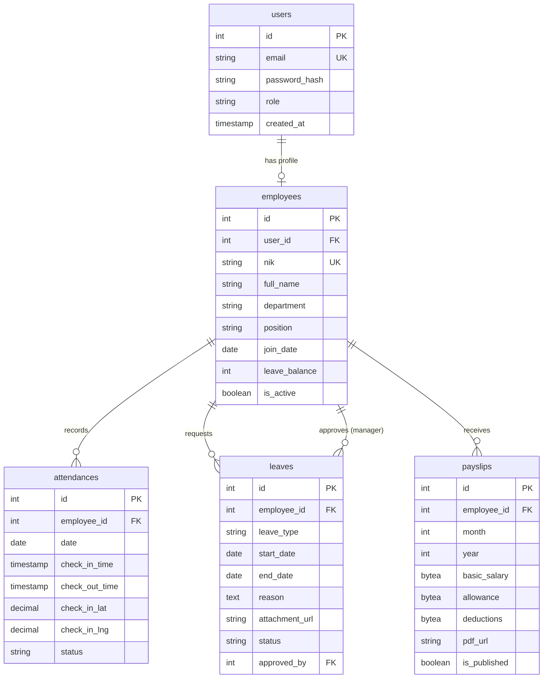

# Product Requirements Document: HadirSimpel
Version: 1.0, Status: Draft, Tanggal: 24 Oktober 2023

## 1. Overview
### Problem Statement
Perusahaan kecil dengan staf hingga 50 karyawan sering kali mengandalkan pencatatan absensi manual menggunakan spreadsheet atau grup WhatsApp. Proses ini memakan waktu hingga 8 jam kerja HR per bulan untuk rekapitulasi, memiliki tingkat kesalahan input data sebesar 15%, rentan terhadap manipulasi lokasi kehadiran, serta memperlambat proses persetujuan cuti yang memakan waktu hingga 3 hari kerja.

### Solution
HadirSimpel adalah aplikasi web mobile-first yang menyederhanakan manajemen HR melalui pencatatan absensi mandiri berbasis geofencing GPS, pengajuan cuti instan dengan notifikasi persetujuan manager, serta kalkulasi otomatis slip gaji bulanan. Solusi ini memangkas beban administrasi HR hingga 80% dan memberikan transparansi data kehadiran bagi karyawan.

### Goals
1. Mengurangi tingkat kesalahan kalkulasi kehadiran dan keterlambatan hingga 0% melalui otomatisasi sistem.
2. Mempercepat waktu persetujuan pengajuan cuti dan sakit dari rata-rata 3 hari menjadi kurang dari 4 jam.
3. Memangkas waktu pemrosesan slip gaji bulanan oleh HR dari 8 jam menjadi kurang dari 30 menit.
4. Mencapai tingkat adopsi harian aktif (Daily Active Users/DAU) sebesar 95% dari total karyawan dalam 1 bulan pertama rilis.

### Non-Goals
1. Versi ini tidak menangani perhitungan pajak PPh 21 secara dinamis (menggunakan nilai potongan tetap/flat input dari HR).
2. Tidak mendukung integrasi dengan mesin absensi fisik sidik jari (biometrik hardware).
3. Tidak mendukung manajemen shift kerja bergilir (hanya mendukung satu jadwal kerja standar 9-to-5).

### Target Users
* **Karyawan (Staff)**: Pekerja yang membutuhkan cara cepat untuk absen, mengajukan cuti, dan melihat slip gaji via smartphone.
* **Manager**: Kepala divisi yang bertanggung jawab menyetujui absensi manual dan pengajuan cuti anggotanya.
* **HR / Admin**: Pengelola data karyawan, konfigurasi lokasi kantor, pengunggah data slip gaji, dan pengunduh laporan bulanan.

### Personas
1. **Nama: Budi Santoso**
   * **Peran**: Karyawan (Sales Lapangan)
   * **Kebutuhan**: Melakukan absensi masuk/pulang dengan cepat di lokasi kantor tanpa harus mengantre di mesin fisik.
   * **Pain Points**: Sering lupa mengisi form absensi manual di grup WhatsApp dan kesulitan memantau sisa kuota cuti tahunan.
   * **Konteks**: Menggunakan smartphone Android kelas menengah dengan koneksi internet seluler yang tidak selalu stabil.
   
2. **Nama: Siti Aminah**
   * **Peran**: HR & Admin
   * **Kebutuhan**: Merekap data kehadiran bulanan secara akurat untuk dasar perhitungan gaji tanpa perlu memindahkan data manual dari WhatsApp.
   * **Pain Points**: Menghabiskan waktu seharian di akhir bulan untuk mencocokkan chat izin sakit dengan tabel Excel absensi.
   * **Konteks**: Bekerja menggunakan laptop kantor dengan browser Chrome, membutuhkan file ekspor berformat Excel/CSV yang siap pakai.

3. **Nama: Rian Wijaya**
   * **Peran**: Manager Operasional
   * **Kebutuhan**: Melihat pengajuan cuti anggotanya secara terpusat dan memberikan keputusan persetujuan secara instan.
   * **Pain Points**: Chat pengajuan cuti dari tim sering tertimbun di WhatsApp Group sehingga mengganggu perencanaan jadwal kerja tim.
   * **Konteks**: Sering berpindah rapat, mengakses sistem melalui tablet atau smartphone.

### User Stories
* **US-01**: Sebagai **Karyawan**, saya ingin melakukan check-in absensi lewat HP di area kantor agar kehadiran saya tercatat secara otomatis tanpa antre.
* **US-02**: Sebagai **Karyawan**, saya ingin mengunggah surat dokter saat mengajukan izin sakit agar absensi saya tetap dinilai sah oleh HR.
* **US-03**: Sebagai **HR/Admin**, saya ingin mengatur koordinat lokasi kantor dan radius toleransi absensi (geofence) agar karyawan tidak bisa melakukan absensi palsu dari rumah.
* **US-04**: Sebagai **Manager**, saya ingin menerima notifikasi pengajuan cuti staf saya agar saya bisa menyetujui atau menolaknya dalam satu klik.
* **US-05**: Sebagai **HR/Admin**, saya ingin mengunggah file slip gaji PDF untuk masing-masing karyawan secara massal agar mereka dapat mengunduhnya secara mandiri.
* **US-06**: Sebagai **Karyawan**, saya ingin melihat sisa kuota cuti tahunan saya di dashboard agar saya bisa merencanakan liburan dengan baik.
* **US-07**: Sebagai **HR/Admin**, saya ingin mengekspor laporan kehadiran bulanan ke format Excel agar dapat langsung digunakan sebagai dasar penggajian.

---

## 2. Scope
### In-Scope
1. **Manajemen Data Karyawan**: CRUD profil karyawan, jabatan, departemen, status aktif, dan sisa cuti.
2. **Absensi Geofencing**: Check-in dan Check-out berbasis koordinat GPS dengan radius toleransi yang dapat dikonfigurasi.
3. **Pengajuan Cuti & Sakit**: Formulir pengajuan, unggah dokumen pendukung (khusus sakit), dan alur persetujuan bertingkat (Manager -> HR).
4. **Slip Gaji Digital**: Upload file slip gaji PDF oleh HR dan halaman unduh khusus untuk masing-masing karyawan.
5. **Laporan Kehadiran**: Dashboard ringkasan kehadiran karyawan dan fitur ekspor laporan bulanan berformat `.xlsx`.

### Out-of-Scope (with reason)
1. **Modul Rekrutmen & ATS**: Tidak diperlukan untuk skala perusahaan di bawah 50 karyawan yang frekuensi rekrutmennya rendah.
2. **Perhitungan Lembur Otomatis**: Lembur akan diinput secara manual oleh HR pada akhir bulan untuk menghindari kerumitan pelacakan lembur di fase awal.
3. **Multi-cabang (Multi-office)**: Aplikasi hanya mendukung 1 titik koordinat kantor pusat untuk meminimalkan kompleksitas manajemen lokasi pada rilis pertama.

### Assumptions
* Semua karyawan memiliki smartphone berspesifikasi minimal Android 8 atau iOS 12 dengan modul GPS yang berfungsi baik.
* Browser yang digunakan mendukung fitur HTML5 Geolocation API.
* Pengaturan zona waktu server disamakan dengan Waktu Indonesia Barat (WIB / GMT+7).

### Dependencies
* **Google Maps Geocoding API**: Untuk menerjemahkan koordinat GPS absensi menjadi alamat teks di laporan.
* **SMTP Server (SendGrid/Mailgun)**: Untuk pengiriman email notifikasi pengajuan cuti dan slip gaji baru.
* **Cloud Storage (AWS S3/Google Cloud Storage)**: Tempat penyimpanan file dokumen sakit (PDF/Image) dan slip gaji karyawan (PDF).

---

## 3. Functional Requirements

| ID | Fitur | Deskripsi Detail | Prioritas | Acceptance Criteria |
| :--- | :--- | :--- | :--- | :--- |
| **FR-01** | Autentikasi Pengguna | Sistem mengizinkan pengguna masuk menggunakan email perusahaan dan kata sandi terenkripsi, serta mendukung fitur reset password via email. | P0 | - Given: Pengguna berada di halaman login.<br>- When: Memasukkan email valid dan password benar.<br>- Then: Sistem mengarahkan ke dashboard sesuai role masing-masing.<br>- Given: Pengguna lupa password.<br>- When: Meminta reset link.<br>- Then: Sistem mengirim email berisi token reset berdurasi 1 jam. |
| **FR-02** | Manajemen Profil | Karyawan dapat melihat data pribadi (Nama, NIK, Jabatan, Tanggal Bergabung) dan memperbarui foto profil mereka sendiri. | P1 | - Given: Karyawan membuka halaman Profil.<br>- When: Mengunggah foto profil baru format JPG maks 2MB.<br>- Then: Sistem memperbarui foto profil dan menampilkan pesan sukses. |
| **FR-03** | Konfigurasi Geofence | Admin dapat menentukan titik koordinat latitud/longitud kantor dan radius aman (dalam meter) untuk absensi karyawan. | P0 | - Given: Admin berada di menu Pengaturan Lokasi.<br>- When: Menyimpan koordinat `-6.2000, 106.8166` dengan radius `50` meter.<br>- Then: Sistem menyimpan konfigurasi dan menerapkannya sebagai validasi check-in. |
| **FR-04** | Check-in Kehadiran | Karyawan melakukan absensi masuk dengan memverifikasi posisi GPS mereka terhadap area geofence kantor. | P0 | - Given: Karyawan berada di dalam radius 50m dari koordinat kantor.<br>- When: Menekan tombol "Check-in".<br>- Then: Sistem mencatat waktu masuk, status "Tepat Waktu" atau "Terlambat", dan menyimpan koordinat GPS. |
| **FR-05** | Check-out Kehadiran | Karyawan melakukan absensi pulang untuk mencatat jam selesai kerja hari tersebut. | P0 | - Given: Karyawan telah melakukan check-in pada hari yang sama.<br>- When: Menekan tombol "Check-out" di area geofence.<br>- Then: Sistem mencatat waktu pulang dan menghitung total jam kerja hari itu. |
| **FR-06** | Pengajuan Cuti | Karyawan dapat mengajukan permohonan cuti dengan memilih tanggal mulai, tanggal selesai, tipe cuti, dan alasan. | P0 | - Given: Karyawan memiliki sisa cuti > 0.<br>- When: Mengajukan cuti 3 hari mulai tanggal 10 hingga 12 November.<br>- Then: Sistem memotong kuota sementara dan mengirim notifikasi ke Manager terkait. |
| **FR-07** | Pengajuan Izin Sakit | Karyawan dapat mengajukan izin sakit dengan melampirkan bukti foto surat keterangan dokter. | P0 | - Given: Karyawan dalam kondisi sakit.<br>- When: Mengisi form sakit dan mengunggah file `surat_dokter.jpg` (1.5MB).<br>- Then: Sistem menyimpan pengajuan dengan status "Pending Approval" oleh HR. |
| **FR-08** | Persetujuan Cuti/Sakit | Manager/HR dapat menyetujui atau menolak permohonan cuti/sakit yang diajukan oleh anggota timnya. | P0 | - Given: Terdapat pengajuan cuti berstatus "Pending".<br>- When: Manager menekan tombol "Setujui".<br>- Then: Status berubah menjadi "Approved", kuota cuti karyawan terpotong permanen, dan mengirim email konfirmasi ke karyawan. |
| **FR-09** | Manajemen Slip Gaji | HR mengunggah file PDF slip gaji bulanan karyawan ke sistem secara individu. | P1 | - Given: HR berada di halaman Payroll.<br>- When: Memilih karyawan, memilih bulan/tahun gaji, mengunggah file PDF, lalu menekan "Publish".<br>- Then: File tersimpan aman di cloud storage dan karyawan menerima notifikasi bahwa slip gaji siap diunduh. |
| **FR-10** | Laporan Kehadiran Bulanan | Admin dapat memfilter data kehadiran berdasarkan departemen dan rentang tanggal, lalu mengekspornya ke file Excel. | P0 | - Given: Admin berada di halaman Laporan.<br>- When: Memilih bulan "Oktober 2023", departemen "Sales", lalu klik "Ekspor Excel".<br>- Then: Sistem mengunduh file `.xlsx` berisi rekapitulasi kehadiran, keterlambatan, dan ketidakhadiran karyawan. |

---

## 4. Non-Functional Requirements
### Performance
* **Response Time**: Waktu respon API (p95) harus di bawah 300ms untuk operasi baca (read) dan di bawah 500ms untuk operasi tulis (write).
* **Page Load Time**: Halaman pertama aplikasi harus termuat sepenuhnya dalam waktu kurang dari 1.5 detik pada koneksi 4G (menggunakan throttling 3G/4G).
* **Throughput**: Sistem harus mampu menangani beban hingga 100 pengguna aktif bersamaan (concurrent users) tanpa penurunan performa.

### Security
* **Authentication**: Menggunakan JSON Web Token (JWT) yang disimpan di HTTP-only cookie dengan masa kedaluwarsa 24 jam.
* **Authorization**: Implementasi Role-Based Access Control (RBAC) ketat untuk memisahkan hak akses Karyawan, Manager, dan Admin.
* **Data Encryption**: Seluruh data yang ditransmisikan wajib menggunakan HTTPS TLS 1.3. Data sensitif seperti nominal gaji pada slip gaji di database harus dienkripsi dengan standar AES-256 pada level aplikasi sebelum disimpan.
* **Rate Limiting**: Maksimal 60 request per menit per IP address untuk mencegah serangan brute force pada endpoint login dan submit kehadiran.
* **Input Sanitization**: Semua input teks wajib dibersihkan dari tag HTML/JS untuk mencegah Cross-Site Scripting (XSS) dan SQL Injection menggunakan ORM parameterization.

### Scalability
* **User Capacity**: Sistem dirancang untuk dapat menangani pertumbuhan data hingga 500 karyawan aktif tanpa perlu merestrukturisasi database.
* **Storage**: Penyimpanan berkas (slip gaji & surat dokter) menggunakan Object Storage yang dapat bertambah secara otomatis hingga 50GB.

### Reliability & Availability
* **Uptime**: Menjamin ketersediaan sistem minimal 99.9% setiap bulannya (maksimal downtime 43 menit per bulan).
* **Backup**: Pencadangan database dilakukan secara otomatis setiap hari pada pukul 02:00 WIB, dengan retensi cadangan selama 30 hari kalender.
* **RPO & RTO**: Recovery Point Objective (RPO) maksimal 24 jam dan Recovery Time Objective (RTO) maksimal 2 jam dalam skenario kegagalan server utama.

### Usability
* **Responsive Design**: Aplikasi harus sepenuhnya responsif dan berfungsi optimal pada layar smartphone (lebar minimal 360px) maupun layar desktop (lebar hingga 1920px).
* **Ease of Use**: Proses check-in kehadiran tidak boleh membutuhkan lebih dari 2 klik dari halaman utama dashboard.

### Accessibility
* **WCAG Target**: Memenuhi standar WCAG 2.1 Level AA.
* **Contrast Ratio**: Rasio kontras teks dengan latar belakang minimal 4.5:1 untuk semua elemen antarmuka utama.
* **Keyboard Navigation**: Seluruh formulir pengajuan cuti harus dapat diisi dan dikirim menggunakan navigasi keyboard saja (tabbing, enter, space).

### Compliance
* **Personal Data Protection**: Mematuhi Undang-Undang Perlindungan Data Pribadi (UU PDP) Indonesia. Data karyawan tidak boleh dibagikan ke pihak ketiga tanpa persetujuan eksplisit.
* **Data Retention**: Log kehadiran karyawan disimpan selama minimal 3 tahun sebelum dapat diarsipkan secara permanen.

---

## 5. Business Rules
* **BR-01**: Titik koordinat kantor pusat ditetapkan pada latitude `-6.2000` dan longitude `106.8166` dengan batas radius aman absensi (geofence) maksimal 50 meter.
* **BR-02**: Batas waktu absensi masuk (check-in) standar adalah pukul 09:00 WIB. Karyawan yang melakukan check-in pada pukul 09:01 WIB atau setelahnya akan otomatis ditandai dengan status "Terlambat".
* **BR-03**: Kuota cuti tahunan diberikan sebanyak 12 hari kerja per tahun kalender untuk setiap karyawan tetap, yang akan diperbarui secara otomatis pada tanggal 1 Januari setiap tahunnya.
* **BR-04**: Pengajuan cuti tahunan harus diajukan minimal 3 hari kerja sebelum tanggal mulai cuti, kecuali untuk jenis pengajuan "Sakit" yang dapat diajukan pada hari H hingga H+1 kejadian.
* **BR-05**: Karyawan hanya diperbolehkan melakukan absensi masuk (check-in) sebanyak 1 kali dan absensi pulang (check-out) sebanyak 1 kali per hari kerja.
* **BR-06**: Pengajuan izin "Sakit" wajib disertai dengan unggahan dokumen surat keterangan dokter yang sah jika durasi sakit lebih dari 1 hari kerja.
* **BR-07**: Slip gaji hanya dapat diakses dan diunduh oleh karyawan yang bersangkutan setelah status slip gaji diubah menjadi "Published" oleh HR/Admin.
* **BR-08**: Persetujuan pengajuan cuti harus melalui persetujuan Manager divisi terlebih dahulu sebelum diteruskan ke HR untuk pencatatan akhir.

---

## 6. Edge Cases

| Skenario | Perilaku Diharapkan |
| :--- | :--- |
| **GPS Spoofing / Mock Location** | Aplikasi mendeteksi penggunaan aplikasi GPS palsu (mock location) melalui API browser/perangkat. Jika terdeteksi, tombol check-in dinonaktifkan dan sistem menampilkan pesan error: "Deteksi lokasi palsu aktif. Harap matikan aplikasi mock location Anda." |
| **Koneksi Internet Putus Saat Check-in** | Jika koneksi terputus saat menekan tombol check-in, aplikasi akan menyimpan data kehadiran secara lokal di enkripsi LocalStorage (offline mode) dengan timestamp lokal yang aman, lalu otomatis mengirimkannya ke server begitu koneksi terdeteksi kembali (sync dalam waktu maks 24 jam). |
| **Pengajuan Cuti Bentrok (Double Booking)** | Sistem menolak pengajuan cuti baru jika tanggal yang dipilih tumpang tindih dengan cuti yang telah disetujui sebelumnya untuk karyawan yang sama. Menampilkan pesan: "Anda sudah memiliki pengajuan cuti yang disetujui pada tanggal tersebut." |
| **Pembaruan Kuota Cuti di Tahun Baru** | Tepat pada tanggal 1 Januari pukul 00:00 WIB, cron job sistem akan mereset sisa cuti karyawan menjadi 12 hari, dan memindahkan sisa cuti tahun lalu yang hangus ke tabel log riwayat. |
| **Ukuran Upload File Melebihi Batas** | Ketika karyawan mencoba mengunggah surat dokter berukuran > 2MB atau format selain PDF/JPG/PNG, sistem langsung menolak di sisi klien dengan pesan: "File terlalu besar atau format tidak didukung (Maks 2MB, PDF/JPG/PNG)." |
| **Check-out Tanpa Check-in Terlebih Dahulu** | Sistem menyembunyikan atau menonaktifkan tombol "Check-out" di dashboard jika record kehadiran hari tersebut belum memiliki data "Check-in". |
| **Perubahan Zona Waktu Perangkat Pengguna** | Sistem mengabaikan waktu lokal pada perangkat pengguna saat mencatat absensi. Semua pencatatan jam check-in/out wajib menggunakan timestamp dari server (WIB / GMT+7) untuk mencegah manipulasi waktu HP. |
| **Karyawan Resign di Tengah Bulan** | Jika status karyawan diubah menjadi "Non-Aktif" oleh HR, akun karyawan tersebut langsung dideaktivasi secara real-time, sesi login dicabut, dan nama mereka tidak akan muncul lagi di daftar pengajuan cuti baru. |

---

## 7. User Flow & Screen List
### Primary Flow: Geofenced Attendance (Happy Path)
1. Karyawan membuka aplikasi HadirSimpel di browser smartphone.
2. Karyawan masuk menggunakan email dan password terdaftar.
3. Dashboard menampilkan peta lokasi saat ini dan tombol "Check-in" berwarna hijau (karena berada di dalam radius 50m geofence).
4. Karyawan menekan tombol "Check-in".
5. Sistem mengambil koordinat GPS, mencocokkan dengan geofence, dan mencatat waktu kehadiran di server.
6. Dashboard diperbarui menampilkan pesan "Check-in Berhasil" beserta jam masuk.

### Alternative Flow: Pengajuan Izin Sakit dengan Lampiran
1. Karyawan membuka dashboard, menekan menu "Pengajuan Izin".
2. Karyawan memilih tipe pengajuan "Sakit", mengisi tanggal mulai dan selesai, serta menuliskan alasan.
3. Karyawan menekan tombol "Unggah Surat Dokter" dan memilih file foto dari galeri kamera.
4. Karyawan menekan tombol "Kirim Pengajuan".
5. Sistem memvalidasi ukuran file, menyimpan data ke database, mengunggah file ke cloud storage, lalu mengirim email notifikasi ke Manager.

### Screen List

| Nama Layar | Deskripsi | Elemen Utama | Navigasi |
| :--- | :--- | :--- | :--- |
| **Layar Login** | Halaman masuk untuk semua pengguna. | Input Email, Input Password, Tombol Login, Link Lupa Password. | Mengarah ke Dashboard setelah sukses login. |
| **Dashboard Karyawan** | Halaman utama karyawan untuk absensi dan ringkasan informasi. | Widget Peta Geofence, Tombol Check-in/Check-out, Info Sisa Cuti, Riwayat Kehadiran 5 Hari Terakhir. | Menu ke Profil, Pengajuan Cuti, dan Slip Gaji. |
| **Form Pengajuan Cuti** | Formulir untuk mengajukan cuti atau izin sakit. | Dropdown Tipe Cuti, Date Picker Tanggal Mulai/Selesai, Textarea Alasan, File Uploader Surat Dokter, Tombol Kirim. | Kembali ke Dashboard setelah submit. |
| **Dashboard Manager** | Halaman persetujuan cuti dan absensi tim. | Daftar Pengajuan Pending, Tombol Setuju/Tolak, Tabel Kehadiran Anggota Tim Hari Ini. | Menu ke Laporan Tim. |
| **Layar Kelola Karyawan (Admin)** | Panel admin untuk manajemen data karyawan. | Tabel Karyawan, Tombol Tambah Karyawan, Aksi Edit/Non-aktifkan, Filter Departemen. | Menu ke Pengaturan Geofence dan Laporan. |
| **Layar Slip Gaji** | Daftar slip gaji yang siap diunduh oleh karyawan. | Dropdown Tahun, Tabel Slip Gaji Bulanan, Tombol Download PDF. | Kembali ke Dashboard. |

---

## 8. API Requirements
Semua endpoint menggunakan prefix `/api/v1/` dan mengembalikan respon dalam format JSON.

| Method | Endpoint | Auth | Deskripsi | Request Body / Query | Response Body (Success 200/201) |
| :--- | :--- | :--- | :--- | :--- | :--- |
| **POST** | `/api/v1/auth/login` | No | Autentikasi user dan mendapatkan JWT token. | `{"email": "user@co.id", "password": "securepassword"}` | `{"token": "eyJhbG...", "user": {"id": 1, "role": "employee"}}` |
| **POST** | `/api/v1/attendance/check-in` | Yes | Mencatat waktu check-in karyawan berdasarkan koordinat GPS. | `{"latitude": -6.2005, "longitude": 106.8167}` | `{"status": "success", "data": {"id": 101, "check_in_time": "2023-10-24T08:45:00Z", "status": "present"}}` |
| **POST** | `/api/v1/attendance/check-out` | Yes | Mencatat waktu check-out karyawan. | `{"latitude": -6.2004, "longitude": 106.8165}` | `{"status": "success", "data": {"id": 101, "check_out_time": "2023-10-24T17:00:00Z"}}` |
| **POST** | `/api/v1/leaves` | Yes | Mengajukan permohonan cuti atau sakit baru. | `{"leave_type": "sick", "start_date": "2023-10-25", "end_date": "2023-10-26", "reason": "Demam tinggi", "attachment_url": "https://s3.bucket/doc.jpg"}` | `{"status": "success", "data": {"id": 50, "status": "pending"}}` |
| **PATCH** | `/api/v1/leaves/{id}/approve` | Yes (Manager/HR) | Menyetujui atau menolak pengajuan cuti. | `{"status": "approved", "rejection_reason": ""}` | `{"status": "success", "data": {"id": 50, "status": "approved"}}` |
| **GET** | `/api/v1/payslips` | Yes | Mengambil daftar slip gaji milik karyawan yang bersangkutan. | Query: `?year=2023` | `{"data": [{"id": 12, "month": "October", "pdf_url": "https://s3.bucket/slip.pdf", "published_at": "2023-10-31"}]}` |
| **GET** | `/api/v1/reports/attendance` | Yes (Admin) | Mendapatkan data rekapitulasi kehadiran untuk diekspor. | Query: `?month=10&year=2023` | `{"data": [{"employee_id": 1, "name": "Budi", "present_days": 20, "late_days": 2, "absent_days": 0}]}` |

### Standard Errors
* **400 Bad Request**: Input tidak valid atau tidak lengkap.
  ```json
  {"error": "Validation Failed", "details": ["Email is required", "Password must be at least 8 characters"]}
  ```
* **401 Unauthorized**: Token JWT tidak valid atau sudah kedaluwarsa.
  ```json
  {"error": "Unauthorized access token"}
  ```
* **403 Forbidden**: Pengguna tidak memiliki role yang sesuai untuk mengakses resource ini.
  ```json
  {"error": "Access denied for this role"}
  ```
* **404 Not Found**: Data atau resource yang dicari tidak ditemukan.
  ```json
  {"error": "Employee record not found"}
  ```
* **409 Conflict**: Aksi yang diminta bentrok dengan data yang sudah ada (misal: double check-in).
  ```json
  {"error": "You have already checked in for today"}
  ```
* **422 Unprocessable Entity**: Validasi bisnis gagal (misal: lokasi di luar geofence).
  ```json
  {"error": "Check-in failed. You are outside the office radius boundary"}
  ```
* **500 Internal Server Error**: Kegagalan sistem internal server.
  ```json
  {"error": "Internal server error. Please try again later"}
  ```

---

## 9. Database Schema
Desain database ternormalisasi (3NF) menggunakan PostgreSQL.

### Table: `users`
| Kolom | Tipe | Constraint | Keterangan |
| :--- | :--- | :--- | :--- |
| `id` | SERIAL | PRIMARY KEY | ID unik user |
| `email` | VARCHAR(100) | UNIQUE, NOT NULL | Email login perusahaan |
| `password_hash` | VARCHAR(255) | NOT NULL | Hash password (bcrypt) |
| `role` | VARCHAR(20) | NOT NULL, CHECK (role IN ('admin', 'manager', 'employee')) | Peran pengguna dalam sistem |
| `created_at` | TIMESTAMP | DEFAULT CURRENT_TIMESTAMP | Waktu data dibuat |
| `updated_at` | TIMESTAMP | DEFAULT CURRENT_TIMESTAMP | Waktu data diperbarui |

### Table: `employees`
| Kolom | Tipe | Constraint | Keterangan |
| :--- | :--- | :--- | :--- |
| `id` | SERIAL | PRIMARY KEY | ID unik karyawan |
| `user_id` | INT | FOREIGN KEY REFERENCES users(id) ON DELETE CASCADE | Relasi ke tabel user |
| `nik` | VARCHAR(20) | UNIQUE, NOT NULL | Nomor Induk Karyawan |
| `full_name` | VARCHAR(100) | NOT NULL | Nama lengkap karyawan |
| `department` | VARCHAR(50) | NOT NULL | Departemen kerja |
| `position` | VARCHAR(50) | NOT NULL | Jabatan karyawan |
| `join_date` | DATE | NOT NULL | Tanggal mulai bekerja |
| `leave_balance` | INT | DEFAULT 12, CHECK (leave_balance >= 0) | Sisa kuota cuti tahunan |
| `is_active` | BOOLEAN | DEFAULT TRUE | Status keaktifan karyawan |
| `created_at` | TIMESTAMP | DEFAULT CURRENT_TIMESTAMP | Waktu data dibuat |
| `updated_at` | TIMESTAMP | DEFAULT CURRENT_TIMESTAMP | Waktu data diperbarui |

### Table: `attendances`
| Kolom | Tipe | Constraint | Keterangan |
| :--- | :--- | :--- | :--- |
| `id` | SERIAL | PRIMARY KEY | ID unik absensi |
| `employee_id` | INT | FOREIGN KEY REFERENCES employees(id) ON DELETE CASCADE | Relasi ke karyawan |
| `date` | DATE | NOT NULL | Tanggal absensi |
| `check_in_time` | TIMESTAMP | NOT NULL | Waktu check-in |
| `check_out_time` | TIMESTAMP | NULL | Waktu check-out |
| `check_in_lat` | DECIMAL(10, 8) | NOT NULL | Latitude check-in |
| `check_in_lng` | DECIMAL(11, 8) | NOT NULL | Longitude check-in |
| `check_out_lat` | DECIMAL(10, 8) | NULL | Latitude check-out |
| `check_out_lng` | DECIMAL(11, 8) | NULL | Longitude check-out |
| `status` | VARCHAR(20) | NOT NULL, CHECK (status IN ('present', 'late', 'absent')) | Status kehadiran |
| `created_at` | TIMESTAMP | DEFAULT CURRENT_TIMESTAMP | Waktu data dibuat |

### Table: `leaves`
| Kolom | Tipe | Constraint | Keterangan |
| :--- | :--- | :--- | :--- |
| `id` | SERIAL | PRIMARY KEY | ID unik pengajuan cuti |
| `employee_id` | INT | FOREIGN KEY REFERENCES employees(id) ON DELETE CASCADE | Relasi ke karyawan |
| `leave_type` | VARCHAR(20) | NOT NULL, CHECK (leave_type IN ('annual', 'sick', 'unpaid')) | Tipe cuti |
| `start_date` | DATE | NOT NULL | Tanggal mulai |
| `end_date` | DATE | NOT NULL | Tanggal selesai |
| `reason` | TEXT | NOT NULL | Alasan pengajuan |
| `attachment_url` | VARCHAR(255) | NULL | URL file surat dokter/pendukung |
| `status` | VARCHAR(20) | DEFAULT 'pending', CHECK (status IN ('pending', 'approved', 'rejected')) | Status persetujuan |
| `approved_by` | INT | FOREIGN KEY REFERENCES employees(id) ON DELETE SET NULL | Manager/HR yang menyetujui |
| `rejection_reason` | TEXT | NULL | Alasan jika pengajuan ditolak |
| `created_at` | TIMESTAMP | DEFAULT CURRENT_TIMESTAMP | Waktu data dibuat |

### Table: `payslips`
| Kolom | Tipe | Constraint | Keterangan |
| :--- | :--- | :--- | :--- |
| `id` | SERIAL | PRIMARY KEY | ID unik slip gaji |
| `employee_id` | INT | FOREIGN KEY REFERENCES employees(id) ON DELETE CASCADE | Relasi ke karyawan |
| `month` | INT | NOT NULL, CHECK (month BETWEEN 1 AND 12) | Bulan gaji |
| `year` | INT | NOT NULL | Tahun gaji |
| `basic_salary` | BYTEA | NOT NULL | Gaji pokok terenkripsi |
| `allowance` | BYTEA | NOT NULL | Tunjangan terenkripsi |
| `deductions` | BYTEA | NOT NULL | Potongan terenkripsi |
| `pdf_url` | VARCHAR(255) | NOT NULL | URL file PDF di cloud storage |
| `is_published` | BOOLEAN | DEFAULT FALSE | Status publish ke karyawan |
| `created_at` | TIMESTAMP | DEFAULT CURRENT_TIMESTAMP | Waktu data dibuat |

### Indexes
* `idx_users_email` ON `users` (email) - Mempercepat proses login.
* `idx_employees_user_id` ON `employees` (user_id) - Mempercepat join data user dan profil karyawan.
* `idx_attendances_employee_date` ON `attendances` (employee_id, date) - Mencegah double check-in dan mempercepat pencarian absensi harian.
* `idx_leaves_status` ON `leaves` (status) - Mempercepat filter persetujuan cuti yang tertunda.

### ERD (Entity Relationship Diagram)


---

## 10. Roles & Permissions

| Role | Modul | Hak Akses (CRUD) | Keterangan |
| :--- | :--- | :--- | :--- |
| **Karyawan** | Kehadiran | Read, Create | Hanya bisa melakukan check-in/out untuk dirinya sendiri pada hari berjalan. |
| **Karyawan** | Pengajuan Cuti | Read, Create | Mengajukan cuti sendiri dan melihat riwayat persetujuannya. |
| **Karyawan** | Slip Gaji | Read | Hanya bisa melihat dan mengunduh slip gajinya sendiri yang berstatus "Published". |
| **Manager** | Kehadiran Tim | Read | Melihat riwayat dan rekap kehadiran anggota timnya. |
| **Manager** | Persetujuan Cuti | Read, Update | Menyetujui atau menolak pengajuan cuti dari anggota timnya. |
| **HR / Admin** | Data Karyawan | Create, Read, Update, Delete | Mengelola penuh seluruh data profil karyawan perusahaan. |
| **HR / Admin** | Konfigurasi Sistem| Read, Update | Mengubah pengaturan geofence kantor dan radius toleransi. |
| **HR / Admin** | Slip Gaji | Create, Read, Update, Delete | Mengunggah, mengedit, dan mempublikasikan slip gaji seluruh karyawan. |
| **HR / Admin** | Laporan | Read | Mengekspor laporan kehadiran bulanan seluruh departemen. |

---

## 11. Validation Rules

| Field | Aturan Validasi | Pesan Error (Indonesian) |
| :--- | :--- | :--- |
| `email` | Formats email valid (`*@company.com`), wajib diisi, unik di database. | "Format email harus menggunakan domain resmi perusahaan dan tidak boleh kosong." |
| `password` | Minimal 8 karakter, mengandung minimal 1 huruf besar, 1 huruf kecil, dan 1 angka. | "Kata sandi minimal 8 karakter, wajib mengandung huruf besar, huruf kecil, dan angka." |
| `check_in_lat` / `check_in_lng` | Harus berada di dalam radius <= 50 meter dari titik pusat kantor (-6.2000, 106.8166). | "Gagal melakukan absensi. Anda berada di luar radius aman kantor (maks 50 meter)." |
| `start_date` (Cuti) | Minimal 3 hari dari tanggal hari ini (kecuali tipe pengajuan = 'sick'). | "Pengajuan cuti tahunan harus diajukan minimal 3 hari sebelum tanggal mulai." |
| `end_date` (Cuti) | Harus lebih besar atau sama dengan `start_date`. | "Tanggal selesai cuti tidak boleh mendahului tanggal mulai cuti." |
| `attachment_url` | Wajib diisi jika tipe cuti = 'sick' dan selisih hari > 1. Format wajib PDF/JPG/PNG. Maksimal 2MB. | "Wajib mengunggah surat keterangan dokter yang sah dengan format PDF/JPG/PNG maksimal 2MB." |
| `month` (Slip Gaji) | Angka bulat antara 1 hingga 12. | "Pilihan bulan gaji tidak valid." |
| `pdf_url` (Slip Gaji) | Format file wajib PDF. Maksimal ukuran file 5MB. | "Berkas slip gaji harus berformat PDF dengan ukuran maksimal 5MB." |

---

## 12. Error Handling
### Strategy
* **UI/UX Strategy**: Kesalahan input form akan ditampilkan langsung secara inline di bawah field yang bermasalah. Kesalahan sistem global (seperti server down atau koneksi terputus) akan ditampilkan menggunakan Toast Notification di pojok kanan atas aplikasi dengan durasi tampil 5 detik.
* **Retry Policy**: Untuk pengunggahan slip gaji atau dokumen cuti yang gagal akibat gangguan jaringan, sistem akan mencoba mengunggah ulang secara otomatis hingga 3 kali (exponential backoff) sebelum menampilkan status gagal ke pengguna.
* **Idempotency**: Pengajuan cuti dan absensi menggunakan idempotency key di level API (menggunakan kombinasi hash `employee_id` + `date`) untuk mencegah duplikasi data akibat klik ganda pada tombol submit.

### Error Scenarios

| Skenario Error | Error Code | Pesan ke User | Aksi Sistem |
| :--- | :--- | :--- | :--- |
| **Gagal Mendapatkan Lokasi GPS** | `GEOLOCATION_DENIED` | "Aplikasi tidak dapat mengakses lokasi Anda. Harap aktifkan GPS dan izinkan akses lokasi pada browser Anda." | Menghentikan proses check-in, meminta izin akses ulang lokasi via browser prompt. |
| **Token JWT Kedaluwarsa** | `AUTH_TOKEN_EXPIRED` | "Sesi Anda telah berakhir. Silakan masuk kembali ke akun Anda." | Menghapus cookie JWT lokal, mengarahkan paksa pengguna kembali ke Layar Login. |
| **Kuota Cuti Tidak Cukup** | `INSUFFICIENT_LEAVE_BALANCE` | "Pengajuan ditolak. Sisa cuti tahunan Anda tidak mencukupi untuk durasi yang diajukan." | Menolak penyimpanan data pengajuan ke database, mengembalikan form ke status edit. |
| **Gagal Mengunggah Surat Dokter** | `UPLOAD_FAILED` | "Gagal mengunggah file. Silakan periksa koneksi internet Anda dan coba lagi." | Membatalkan transaksi pengajuan cuti, menghapus file parsial jika sempat terunggah di storage. |
| **Database Down Saat Absensi** | `DATABASE_CONNECTION_ERROR` | "Sistem sedang sibuk. Data absensi Anda disimpan secara lokal dan akan disinkronisasi otomatis." | Menyimpan data absen terenkripsi ke LocalStorage, mengaktifkan service worker sinkronisasi latar belakang. |
| **Akses Slip Gaji Belum Rilis** | `PAYSLIP_NOT_PUBLISHED` | "Slip gaji untuk bulan yang Anda pilih belum tersedia." | Menyembunyikan tombol download, menampilkan placeholder kosong pada tabel list. |
| **NIM/NIK Ganda saat Registrasi** | `DUPLICATE_NIK` | "Karyawan dengan NIK tersebut sudah terdaftar di sistem." | Menandai field NIK berwarna merah, membatalkan proses pembuatan akun baru. |

---

## 13. Analytics & Monitoring
### Events Tracking

| Event Name | Trigger | Properties |
| :--- | :--- | :--- |
| `user_login` | Pengguna berhasil masuk ke sistem | `user_id`, `role`, `device_type`, `timestamp` |
| `attendance_check_in` | Karyawan berhasil melakukan check-in | `employee_id`, `status` (present/late), `distance_from_office`, `timestamp` |
| `leave_submitted` | Karyawan berhasil mengirim form cuti | `employee_id`, `leave_type`, `duration_days`, `timestamp` |
| `leave_approved` | Manager menyetujui/menolak cuti | `manager_id`, `leave_id`, `action` (approved/rejected), `response_time_hours` |
| `payslip_downloaded` | Karyawan mengunduh file slip gaji PDF | `employee_id`, `payslip_id`, `month`, `year`, `timestamp` |
| `report_exported` | Admin mengekspor laporan bulanan | `admin_id`, `format` (excel), `month_selected`, `timestamp` |

### Monitoring
* **Health Checks**: Endpoint `/api/v1/health` dikonfigurasi untuk memantau status koneksi database PostgreSQL dan ketersediaan Object Storage setiap 60 detik.
* **Error Tracking**: Mengintegrasikan Sentry SDK pada aplikasi backend dan frontend untuk menangkap error unhandled (500 status code) secara real-time dan mengirimkan peringatan ke tim developer jika error terjadi > 5 kali dalam 15 menit.
* **Business Metrics**: Dashboard monitoring internal untuk memantau total persentase kehadiran karyawan harian dan rata-rata waktu respons persetujuan cuti oleh manager.

---

## 14. Tech Stack

| Layer | Pilihan Teknologi | Alasan Pemilihan |
| :--- | :--- | :--- |
| **Frontend Framework** | **Next.js (React)** | Mendukung Server-Side Rendering (SSR) untuk performa loading awal yang cepat, serta memiliki fitur API routes yang memudahkan pembuatan endpoint internal. |
| **CSS Framework** | **Tailwind CSS** | Mempercepat proses pembangunan antarmuka (UI) yang responsif dan mobile-first dengan footprint ukuran file CSS yang sangat kecil. |
| **Backend Runtime** | **Node.js (Express)** | Ringan, memiliki ekosistem package NPM yang luas, dan efisien dalam menangani I/O intensif seperti upload file dan request API absensi massal. |
| **Database** | **PostgreSQL** | Database relasional tangguh yang mendukung integritas data tinggi (ACID), pemrosesan query spasial (jika dibutuhkan ekspansi GPS di masa depan), dan enkripsi data tingkat kolom. |
| **ORM** | **Prisma ORM** | Memudahkan migrasi skema database, menyediakan type-safety penuh antara database dan backend Express, serta mempercepat penulisan query. |
| **Cloud Storage** | **Supabase Storage / AWS S3** | Layanan penyimpanan objek yang andal dan aman dengan fitur link kedaluwarsa otomatis (Presigned URL) untuk keamanan file slip gaji PDF. |
| **Deployment & Hosting** | **Vercel (FE) & Render (BE)** | Deployment otomatis berbasis git yang mudah dikonfigurasi, murah untuk skala kecil (50 user), dan mendukung auto-scaling dasar. |

---

## 15. Future Improvements
### Fase 1: Validasi Biometrik Wajah (Face Recognition)
Menambahkan verifikasi foto wajah (selfie) saat melakukan check-in absensi untuk mencegah kecurangan titip absen antar karyawan menggunakan perangkat yang sama.

### Fase 2: Integrasi Notifikasi Slack & WhatsApp
Menghubungkan alur persetujuan cuti langsung ke workspace Slack perusahaan atau notifikasi WhatsApp interaktif, sehingga manager dapat menyetujui cuti tanpa perlu membuka aplikasi web.

### Fase 3: Modul Payroll Otomatis & Pajak PPh 21
Mengembangkan mesin kalkulasi gaji otomatis yang terintegrasi langsung dengan data kehadiran bulanan (potongan keterlambatan, bonus kehadiran) serta perhitungan pajak PPh 21 dan BPJS Ketenagakerjaan/Kesehatan sesuai regulasi terbaru pemerintah Indonesia.