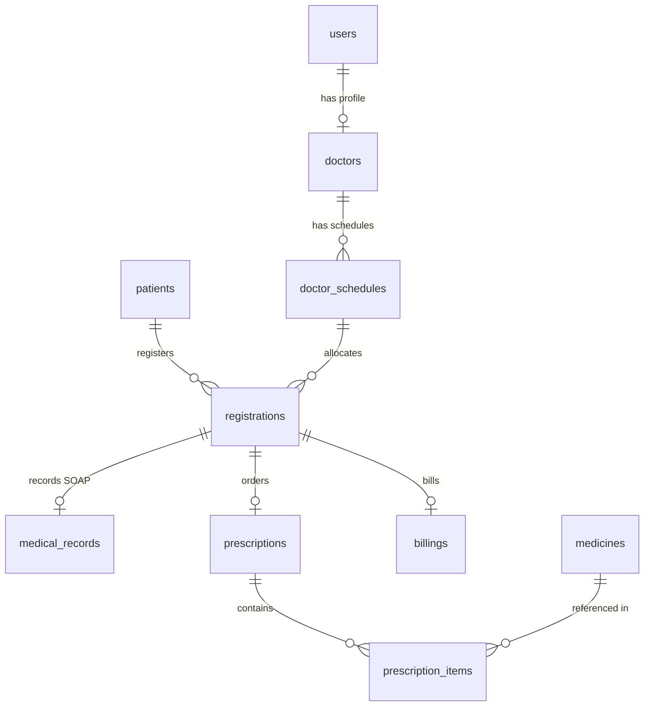

# Product Requirements Document: SIMRS Cendekia (Sistem Informasi Manajemen Rumah Sakit - 30 Bed)
Version: 1.0, Status: Draft, Tanggal: 24 Oktober 2023

## 1. Overview

### Problem Statement
Rumah sakit dengan kapasitas 30 bed sering kali mengalami penumpukan antrean pasien rawat jalan akibat proses pendaftaran yang lambat dan koordinasi manual. Penggunaan rekam medis kertas rawan hilang, rusak, dan sulit dibaca oleh apoteker, yang berujung pada lambatnya penyiapan obat (rata-rata 30-45 menit). Selain itu, kasir sering kali mengalami selisih perhitungan tagihan akhir pasien akibat pencatatan tindakan dan resep obat yang terfragmentasi pada lembaran kertas terpisah.

### Solution
SIMRS Cendekia adalah sistem informasi manajemen rumah sakit berbasis web yang mengintegrasikan seluruh alur layanan rawat jalan secara real-time. Sistem ini mengotomatisasi pendaftaran dan antrean, mendigitalisasi rekam medis melalui modul Rekam Medis Elektronik (RME), mengirimkan e-resep langsung dari meja dokter ke apotek, serta mengonsolidasikan seluruh biaya tindakan dan obat ke dalam satu tagihan (billing) otomatis untuk kasir.

### Goals
*   Mengurangi waktu tunggu pasien rawat jalan di area resepsionis dan ruang tunggu dari rata-rata 60 menit menjadi p95 < 15 menit.
*   Mencapai 100% migrasi dari rekam medis kertas ke Rekam Medis Elektronik (RME) yang aman dan terstandardisasi.
*   Mempercepat waktu penyiapan obat di farmasi dari rata-rata 30 menit menjadi p95 < 10 menit sejak e-resep dikirim dokter.
*   Mengurangi tingkat kesalahan selisih kasir (billing discrepancy) hingga 0%.
*   Menghasilkan laporan kunjungan dan pendapatan harian secara otomatis dalam waktu < 3 detik setelah hari operasional berakhir.

### Non-Goals
*   Aplikasi ini tidak mengelola alur klinis rawat inap secara mendetail (hanya mencatat status ketersediaan 30 bed secara statis).
*   Integrasi dengan BPJS Kesehatan (P-Care / VClaim) dan platform SatuSehat Kementerian Kesehatan tidak dimasukkan dalam Fase 1 (ditargetkan pada Fase 2).
*   Sistem tidak mengelola penggajian (payroll) staf rumah sakit maupun manajemen aset alat medis berat.

### Target Users
*   **Staf Administrasi (Admin)**: Bertanggung jawab mendaftarkan pasien, mengelola jadwal dokter, dan mengatur antrean awal.
*   **Perawat**: Bertugas melakukan triase awal dan menginput tanda-tanda vital (TTV) pasien.
*   **Dokter**: Bertugas memeriksa pasien, mengisi RME, dan menulis e-resep.
*   **Apoteker**: Bertugas memvalidasi e-resep, menyiapkan obat, dan memperbarui stok obat.
*   **Kasir**: Bertugas menerima pembayaran dari pasien berdasarkan kalkulasi otomatis sistem.

### Personas

#### 1. Budi (Admin Resepsionis)
*   **Peran**: Admin Pendaftaran
*   **Kebutuhan**: Memasukkan data pasien baru dengan cepat (< 2 menit) dan mencetak nomor antrean poli tanpa hambatan.
*   **Pain Points**: Pasien sering marah karena antrean menumpuk dan sering terjadi kesalahan ketik nama atau nomor identitas pasien.
*   **Konteks**: Menggunakan komputer desktop di meja depan dengan printer thermal untuk mencetak nomor antrean.

#### 2. Dr. Andi (Dokter Spesialis Penyakit Dalam)
*   **Peran**: Dokter Pemeriksa
*   **Kebutuhan**: Melihat riwayat penyakit pasien terdahulu dalam 1 klik dan menulis resep obat dengan cepat tanpa menulis tangan.
*   **Pain Points**: Lelah menulis resep manual berulang-ulang dan sering dipanggil apoteker karena tulisan tangannya tidak terbaca.
*   **Konteks**: Menggunakan tablet atau laptop di ruang periksa yang terhubung ke jaringan Wi-Fi rumah sakit.

#### 3. Suster Siti (Perawat Triase)
*   **Peran**: Perawat
*   **Kebutuhan**: Menginput data tanda-tanda vital (tensi, nadi, suhu) pasien dengan cepat sebelum pasien masuk ke ruang dokter.
*   **Pain Points**: Harus menulis data TTV di kertas lalu menempelkannya di berkas rekam medis fisik yang sering tercecer.
*   **Konteks**: Menggunakan tablet di stasiun perawat (nurse station) depan poli.

#### 4. Rina (Apoteker)
*   **Peran**: Staf Farmasi
*   **Kebutuhan**: Menerima daftar resep yang jelas, terstruktur, dan langsung terhubung dengan sisa stok obat di gudang farmasi.
*   **Pain Points**: Kesulitan membaca tulisan tangan dokter dan sering kecolongan memberikan obat yang stoknya ternyata sudah habis di sistem manual.
*   **Konteks**: Menggunakan komputer desktop di ruang farmasi yang terintegrasi dengan printer label obat.

#### 5. Joko (Kasir)
*   **Peran**: Staf Keuangan
*   **Kebutuhan**: Menampilkan total tagihan pasien (biaya dokter + tindakan + obat) secara instan tanpa perlu menghitung manual menggunakan kalkulator.
*   **Pain Points**: Pasien mengeluh karena proses pembayaran lama akibat kasir harus menunggu nota fisik dari apotek dan poli.
*   **Konteks**: Menggunakan komputer desktop di loket pembayaran dekat pintu keluar.

### User Stories
*   **US-01**: Sbg Admin, saya ingin mendaftarkan pasien baru dengan menginput NIK dan nama agar pasien terdaftar dalam sistem dan mendapatkan Nomor Rekam Medis (No RM) unik secara otomatis.
*   **US-02**: Sbg Admin, saya ingin memasukkan pasien ke dalam antrean poli tujuan agar pasien mendapatkan nomor antrean fisik yang tercetak dari printer thermal.
*   **US-03**: Sbg Perawat, saya ingin menginput data tanda-tanda vital (tensi, nadi, suhu, berat badan) pasien ke dalam sistem agar Dokter dapat langsung melihat kondisi awal pasien saat pemeriksaan.
*   **US-04**: Sbg Dokter, saya ingin melihat riwayat kunjungan dan catatan medis masa lalu pasien agar saya dapat memberikan diagnosis yang akurat.
*   **US-05**: Sbg Dokter, saya ingin menulis e-resep dengan memilih obat dari daftar stok yang tersedia agar transaksi resep langsung terkirim ke bagian farmasi secara instan.
*   **US-06**: Sbg Apoteker, saya ingin melihat antrean e-resep masuk yang diurutkan berdasarkan waktu masuk agar saya dapat menyiapkan obat secara FIFO (First In First Out).
*   **US-07**: Sbg Apoteker, saya ingin menekan tombol "Resep Selesai" agar sistem memotong stok obat secara otomatis dan mengirimkan data billing ke kasir.
*   **US-08**: Sbg Kasir, saya ingin memanggil data tagihan pasien berdasarkan No RM agar saya dapat memproses pembayaran (tunai/debit/QRIS) dan mencetak kwitansi resmi.
*   **US-09**: Sbg Admin, saya ingin mengunduh laporan keuangan dan kunjungan harian dalam format PDF dan Excel agar dapat diserahkan kepada Direktur Rumah Sakit setiap sore.

---

## 2. Scope

### In-Scope
*   Modul Pendaftaran Pasien Baru & Lama (Rawat Jalan).
*   Modul Manajemen Antrean Poli (Poli Umum, Poli Gigi, Poli Anak, Poli Penyakit Dalam, Poli Kandungan).
*   Modul Rekam Medis Elektronik (RME) mencakup SOAP (Subjektif, Objektif, Asesmen, Plan) dan riwayat medis.
*   Modul E-Resep yang terintegrasi langsung dengan inventori obat farmasi (stok obat berkurang saat obat diserahkan).
*   Modul Kasir & Billing (pembayaran biaya registrasi, jasa dokter, tindakan medis, dan obat).
*   Modul Manajemen Jadwal Dokter harian.
*   Modul Laporan (Laporan Kunjungan Pasien, Laporan Pendapatan Kasir, Laporan Penggunaan Obat).
*   Sistem autentikasi dan otorisasi berbasis peran (Role-Based Access Control - RBAC).

### Out-of-Scope (with reason)
*   Modul Rawat Inap (Inpatient) detail seperti manajemen bangsal, sensus harian pasien rawat inap, dan asuhan keperawatan rawat inap (ditunda karena fokus awal pada efisiensi rawat jalan).
*   Integrasi BPJS Kesehatan / SatuSehat Kemenkes (memerlukan sertifikasi dan koordinasi eksternal yang memakan waktu, dijadwalkan untuk Fase 2).
*   Modul Laboratorium dan Radiologi (LIS/RIS) (rumah sakit saat ini merujuk pemeriksaan penunjang ke lab eksternal).
*   Modul Kepegawaian (HRIS) dan Penggajian (Payroll) (sudah dikelola oleh aplikasi akuntansi pihak ketiga yang terpisah).

### Assumptions
*   Server aplikasi akan dijalankan pada jaringan lokal (LAN) rumah sakit dengan server fisik on-premise untuk menjamin kecepatan akses p95 < 100ms tanpa ketergantungan koneksi internet luar.
*   Semua komputer di poli, farmasi, kasir, dan pendaftaran terhubung ke subnet LAN yang sama.
*   Printer thermal untuk nomor antrean dan printer label untuk obat sudah terpasang dan mendukung protokol cetak standar (ESC/POS atau driver Windows).

### Dependencies
*   **Database Server**: PostgreSQL v15 sebagai penyimpanan data relasional utama.
*   **Hardware**: Mini PC / Server lokal (Min. RAM 16GB, SSD 512GB) untuk deployment aplikasi.
*   **Printer Driver**: Node-printer atau library sejenis pada client untuk mengontrol cetak langsung ke printer thermal.

---

## 3. Functional Requirements

| ID | Fitur | Deskripsi Detail | Prioritas | Acceptance Criteria |
| :--- | :--- | :--- | :--- | :--- |
| **FR-01** | Registrasi Pasien Baru | Admin menginput data pasien baru meliputi NIK (16 digit), Nama Lengkap, Tanggal Lahir, Jenis Kelamin, Alamat, dan No HP. Sistem memvalidasi keunikan NIK dan membuat No RM otomatis dengan format YYMMXXXX. | P0 | - Given: Form registrasi kosong.<br>- When: Admin menginput NIK yang sudah terdaftar.<br>- Then: Sistem menampilkan error "NIK sudah terdaftar dengan No RM XXXXXXXX".<br>- Given: Data valid diinput.<br>- When: Tombol simpan ditekan.<br>- Then: No RM terbentuk dan data tersimpan ke database. |
| **FR-02** | Manajemen Antrean Poli | Admin mendaftarkan pasien ke poli tertentu pada hari berjalan. Sistem menerbitkan nomor antrean (misal: A-01 untuk Poli Umum, B-01 untuk Poli Gigi) dan mencetak slip antrean. | P0 | - Given: Pasien terdaftar.<br>- When: Admin memilih Poli Umum dan menekan "Daftar Poli".<br>- Then: Sistem menghasilkan nomor antrean berurutan dan mengirim perintah cetak ke printer thermal. |
| **FR-03** | Input TTV Pasien | Perawat menginput data vital: Tekanan Darah (Sistol/Diastol), Detak Nadi, Suhu Tubuh, Berat Badan, Tinggi Badan, dan Keluhan Utama pada antrean pasien terpilih. | P0 | - Given: Pasien berada di status antrean "Menunggu TTV".<br>- When: Perawat menyimpan data TTV.<br>- Then: Status antrean berubah menjadi "Menunggu Dokter" dan data TTV langsung tampil di dashboard Dokter. |
| **FR-04** | Pengisian RME SOAP | Dokter mengisi catatan SOAP (Subjektif, Objektif, Asesmen, Plan) dan memilih kode diagnosis ICD-10 pada form pemeriksaan pasien. | P0 | - Given: Dokter membuka rekam medis pasien.<br>- When: Dokter mengisi SOAP dan memilih minimal 1 ICD-10 lalu menekan "Simpan Pemeriksaan".<br>- Then: Status rekam medis terkunci (read-only) dan status antrean berubah menjadi "Menunggu Resep" atau "Selesai Periksa". |
| **FR-05** | Pembuatan E-Resep | Dokter memilih obat dari database obat aktif, menentukan jumlah (qty), aturan pakai (signa), dan mengirimkannya ke farmasi. | P0 | - Given: Form resep terbuka.<br>- When: Dokter memilih obat yang stoknya 0.<br>- Then: Sistem memblokir pilihan obat tersebut dan menampilkan label "Stok Kosong".<br>- Given: Resep diisi obat dengan stok tersedia.<br>- When: Dokter menekan "Kirim Resep".<br>- Then: Data resep masuk ke antrean farmasi secara real-time. |
| **FR-06** | Dispensing Obat | Apoteker memvalidasi e-resep, menyiapkan obat fisik, mencetak label aturan pakai, dan menekan tombol "Serahkan Obat". | P0 | - Given: Resep berstatus "Pending" di farmasi.<br>- When: Apoteker menekan "Serahkan Obat".<br>- Then: Stok obat di database otomatis berkurang sesuai jumlah resep, status resep menjadi "Selesai", dan tagihan obat masuk ke billing kasir. |
| **FR-07** | Kalkulasi Billing | Kasir memanggil tagihan pasien berdasarkan No RM atau nomor antrean. Sistem menampilkan rincian biaya: Jasa Dokter, Tindakan Medis, dan Obat-obatan secara otomatis. | P0 | - Given: Pasien menyelesaikan pemeriksaan dan pengambilan obat.<br>- When: Kasir mencari No RM pasien.<br>- Then: Sistem menampilkan rincian biaya yang tidak dapat diedit secara manual kecuali diberikan diskon resmi oleh admin. |
| **FR-08** | Proses Pembayaran | Kasir menginput nominal pembayaran pasien, memilih metode pembayaran (Cash, Debit, QRIS), dan mencetak kwitansi pembayaran resmi. | P0 | - Given: Rincian tagihan tampil.<br>- When: Kasir memasukkan jumlah uang < total tagihan.<br>- Then: Sistem memblokir tombol bayar dan menampilkan pesan "Jumlah pembayaran kurang".<br>- Given: Pembayaran pas/lebih.<br>- When: Tombol "Bayar" ditekan.<br>- Then: Status transaksi menjadi "Paid" dan kwitansi tercetak. |
| **FR-09** | Manajemen Jadwal Dokter | Admin mengelola jadwal praktik dokter (Hari, Jam Mulai, Jam Selesai, Kuota Maksimal Pasien) untuk membatasi pendaftaran antrean. | P1 | - Given: Dokter A memiliki kuota 30 pasien.<br>- When: Admin mencoba mendaftarkan pasien ke-31 ke Dokter A pada hari tersebut.<br>- Then: Sistem menolak pendaftaran dengan pesan "Kuota Dokter A telah penuh". |
| **FR-10** | Laporan Pendapatan | Admin/Owner melihat dan mengunduh laporan pendapatan berdasarkan rentang tanggal yang dipilih, dikelompokkan per metode pembayaran. | P1 | - Given: Halaman laporan keuangan terbuka.<br>- When: User memilih tanggal 1-10 Oktober dan menekan "Export PDF".<br>- Then: File PDF terunduh dengan tabel rincian transaksi harian dan total nominal yang akurat. |
| **FR-11** | Manajemen Data Obat | Apoteker/Admin mengelola master data obat: Nama Obat, Satuan (tablet/botol), Harga Beli, Harga Jual, Stok Minimal, dan Stok Saat Ini. | P0 | - Given: Form tambah obat baru.<br>- When: User menginput harga jual < harga beli.<br>- Then: Sistem menampilkan peringatan "Harga jual tidak boleh lebih rendah dari harga beli". |
| **FR-12** | Audit Trail RME | Sistem mencatat setiap aktivitas akses, penulisan, dan perubahan (addendum) pada data RME pasien beserta timestamp dan ID user. | P1 | - Given: Dokter melakukan addendum pada RME yang sudah terkunci.<br>- When: Addendum disimpan.<br>- Then: Log audit mencatat: "User [ID] melakukan addendum pada RME [ID] pada [Timestamp]". |

---

## 4. Non-Functional Requirements

### Performance
*   **Response Time**: API response time untuk p95 harus < 500ms pada kondisi beban normal.
*   **Load Capacity**: Sistem harus mampu menangani hingga 100 concurrent users aktif tanpa penurunan performa.
*   **Throughput**: Sistem harus mampu memproses minimal 50 requests per second (RPS).
*   **Cetak Slip**: Perintah cetak antrean dan kwitansi harus dikirim ke printer dalam waktu < 1 detik setelah tombol ditekan.

### Security
*   **Autentikasi**: Menggunakan JWT (JSON Web Token) dengan masa berlaku token maksimal 12 jam.
*   **Otorisasi**: Menggunakan Role-Based Access Control (RBAC) yang ketat untuk membatasi akses endpoint API berdasarkan role user.
*   **Encryption**:
    *   Data in-transit wajib menggunakan HTTPS/TLS 1.3 (jika diakses via WAN/Internet) atau enkripsi tingkat aplikasi pada LAN.
    *   Data at-rest untuk kolom sensitif (seperti NIK dan riwayat penyakit pasien) dienkripsi menggunakan AES-256 pada level database.
*   **Password Hashing**: Menggunakan algoritma Bcrypt dengan cost factor minimal 10.
*   **Rate-limiting**: Maksimal 100 requests per menit per IP address untuk mencegah Brute Force dan Denial of Service.
*   **Input Sanitization**: Mencegah SQL Injection dengan menggunakan ORM parameterized queries dan mencegah XSS dengan melakukan sanitasi HTML pada input teks bebas (SOAP).

### Scalability & Availability
*   **Database Capacity**: Desain database harus mampu menampung hingga 50.000 data pasien dan 500.000 transaksi rekam medis tanpa degradasi kecepatan query (indeksasi yang tepat).
*   **Uptime**: Target ketersediaan sistem (availability) adalah 99.9% selama jam operasional rumah sakit (07:00 - 21:00).
*   **Backup**: Backup database otomatis setiap hari pada pukul 01:00 WIB, disimpan di local storage eksternal dan disinkronisasikan ke cloud storage aman (S3-compatible) dengan retensi 30 hari.
*   **RTO & RPO**: Recovery Time Objective (RTO) < 2 jam dan Recovery Point Objective (RPO) < 24 jam.

### Usability & Accessibility
*   **UI Responsiveness**: Antarmuka web harus responsif dan dioptimalkan untuk resolusi layar minimal 1024x768 (tablet standar dan monitor desktop rumah sakit).
*   **Accessibility**: Memenuhi standar WCAG 2.1 Level AA, terutama kontras warna minimal 4.5:1 untuk keterbacaan teks medis dan dukungan navigasi keyboard penuh pada layar kasir dan pemanggilan antrean.

### Compliance
*   **Regulasi RME**: Wajib mematuhi Peraturan Menteri Kesehatan (PMK) No. 24 Tahun 2022 tentang Rekam Medis Elektronik.
*   **Retensi Data**: Data rekam medis pasien wajib disimpan minimal selama 5 tahun sejak tanggal kunjungan terakhir pasien sebelum dapat diarsipkan secara offline.

---

## 5. Business Rules (BR)

*   **BR-01 (Antrean Unik)**: Satu pasien hanya boleh memiliki maksimal 1 antrean aktif di poli yang sama pada hari kunjungan yang sama.
*   **BR-02 (Kunci RME)**: Data Rekam Medis Elektronik (RME) yang telah ditandatangani secara digital (signed) oleh dokter pemeriksa akan berstatus *Locked* (Read-Only) dan tidak dapat diedit atau dihapus. Perubahan data hanya dapat dilakukan melalui mekanisme "Addendum" terpisah yang mencatat riwayat perubahan secara kronologis.
*   **BR-03 (Kontrol Stok Obat)**: Transaksi penyerahan obat (dispensing) oleh apoteker tidak boleh membuat stok obat di gudang menjadi bernilai negatif (< 0). Jika stok obat tidak mencukupi, sistem harus menolak transaksi dan meminta apoteker melakukan penyesuaian resep atau restock barang.
*   **BR-04 (Syarat Pembayaran Kasir)**: Kasir tidak dapat memproses pembayaran tagihan pasien (status billing berubah menjadi "Paid") sebelum status pemeriksaan dokter dinyatakan "Selesai" dan status dispensing obat dinyatakan "Siap" atau "Dibatalkan" oleh apoteker.
*   **BR-05 (Format Nomor Rekam Medis)**: Nomor Rekam Medis (No RM) bersifat unik, tidak boleh diubah setelah dibuat, dan wajib berformat `YYMMXXXX` (di mana YY adalah 2 digit tahun pendaftaran, MM adalah 2 digit bulan pendaftaran, dan XXXX adalah nomor urut otomatis dari 0001 hingga 9999 yang di-reset setiap bulan).
*   **BR-06 (Pembatalan Transaksi)**: Pembatalan transaksi billing yang sudah berstatus "Paid" hanya dapat dilakukan oleh user dengan role "Admin" setelah mengisi form alasan pembatalan. Tindakan ini akan mengembalikan stok obat secara otomatis dan mencatat log audit pembatalan.
*   **BR-07 (Masa Berlaku Resep)**: E-resep yang dibuat oleh dokter hanya berlaku pada hari yang sama dengan tanggal periksa. Resep yang tidak ditebus hingga pukul 23:59 WIB pada hari tersebut akan otomatis dibatalkan oleh sistem.

---

## 6. Edge Cases

| Skenario | Perilaku Diharapkan |
| :--- | :--- |
| **1. Empty State Antrean Poli** | Ketika belum ada pasien yang mendaftar pada suatu poli di hari tersebut, dashboard dokter dan perawat harus menampilkan ilustrasi bersih dengan teks "Belum ada pasien terdaftar hari ini" dan menonaktifkan tombol panggil. |
| **2. Pendaftaran Duplikat (NIK Sama)** | Jika admin mencoba mendaftarkan pasien baru dengan NIK yang sudah ada di database, sistem harus memblokir form, menampilkan pop-up informasi pasien lama yang memiliki NIK tersebut, dan menawarkan opsi "Daftarkan ke Poli" menggunakan data lama tersebut. |
| **3. Concurrent Edit RME** | Jika Dokter dan Perawat membuka halaman edit RME pasien yang sama secara bersamaan: ketika perawat menyimpan data TTV setelah dokter membuka halaman, sistem dokter harus mendeteksi perubahan versi data (optimistic locking) dan menampilkan notifikasi "Data telah diperbarui oleh Perawat. Silakan muat ulang halaman sebelum menyimpan." |
| **4. Koneksi Server Terputus saat Menulis RME** | Aplikasi client harus menyimpan draf tulisan SOAP dokter secara lokal di browser storage (localStorage) setiap 30 detik. Jika koneksi terputus saat dokter menekan "Simpan", sistem menampilkan pesan offline dan draf tetap aman untuk dikirim ulang saat koneksi pulih. |
| **5. Input Nilai Ekstrem Tanda Vital** | Jika perawat memasukkan suhu tubuh di luar rentang 30°C - 45°C atau tekanan darah sistol > 300 mmHg, sistem harus memunculkan dialog konfirmasi: "Nilai yang Anda masukkan di luar batas normal. Apakah Anda yakin data ini benar?" sebelum memperbolehkan penyimpanan data. |
| **6. Pergantian Shift Dokter di Tengah Antrean** | Jika jam praktik dokter berakhir saat masih ada sisa antrean pasien yang belum diperiksa, admin dapat melakukan aksi "Transfer Antrean" secara massal ke dokter pengganti yang aktif tanpa mengubah nomor urut antrean pasien. |
| **7. Pembatasan Hak Akses Menu (Bypass URL)** | Jika staf kasir mencoba mengakses URL dashboard dokter (misal `/doctor/dashboard`) secara langsung, middleware otorisasi harus mendeteksi ketidakcocokan role token JWT, mengalihkan user ke halaman `/dashboard`, dan menampilkan toast error "Akses Ditolak". |
| **8. Kegagalan API Pengurangan Stok Obat** | Jika saat penyerahan obat terjadi kegagalan koneksi database di tengah jalan (setelah billing dibuat tapi sebelum stok terpotong), sistem harus menjalankan mekanisme *database transaction rollback* sehingga tidak ada data yang tersimpan setengah-setengah (menjaga konsistensi data). |
| **9. Rekonsiliasi Stok Obat Fisik Kurang dari Sistem** | Jika stok obat di sistem menunjukkan ada 10 tablet, namun secara fisik di laci apotek kosong: Apoteker dapat menekan tombol "Batalkan Resep/Substitusi" yang akan mengirimkan notifikasi balik ke Dokter untuk merevisi e-resep dengan obat alternatif. |

---

## 7. User Flow & Screen List

### Primary Flow: Alur Pelayanan Rawat Jalan Pasien
1. **Pendaftaran**: Pasien datang -> Admin mendaftarkan pasien (atau mencari data pasien lama) -> Admin memilih Poli tujuan -> Printer mencetak nomor antrean -> Status pasien: `MENUNGGU_TTV`.
2. **Pemeriksaan Awal**: Perawat memanggil pasien ke ruang tensi -> Perawat menginput data vital (TTV) -> Status pasien berubah menjadi: `MENUNGGU_DOKTER`.
3. **Pemeriksaan Medis**: Dokter memanggil pasien masuk -> Dokter membaca riwayat medis -> Dokter memeriksa pasien dan mengisi SOAP + Diagnosis ICD-10 -> Dokter membuat e-resep -> Dokter menyelesaikan pemeriksaan -> Status pasien: `PROSES_FARMASI`.
4. **Penyiapan Obat**: Apoteker melihat resep masuk -> Apoteker meracik obat -> Apoteker mencetak label aturan pakai -> Apoteker menyerahkan obat ke pasien -> Status pasien: `PROSES_BILLING`.
5. **Pembayaran**: Kasir memanggil data billing pasien -> Kasir memproses pembayaran -> Kasir mencetak kwitansi -> Status pasien: `SELESAI`.

```
[Pasien Datang] 
       │
       ▼
[Pendaftaran] ──(Cetak Antrean)──► Status: MENUNGGU_TTV
       │
       ▼
[Pemeriksaan Awal (TTV oleh Perawat)] ──► Status: MENUNGGU_DOKTER
       │
       ▼
[Pemeriksaan Dokter (SOAP & E-Resep)] ──► Status: PROSES_FARMASI
       │
       ▼
[Penyiapan & Penyerahan Obat (Apotek)] ──► Status: PROSES_BILLING
       │
       ▼
[Pembayaran & Cetak Kwitansi (Kasir)] ──► Status: SELESAI
```

### Alternative / Error Flows

#### Flow A: Pasien Membatalkan Kunjungan Sebelum Diperiksa
1. Pasien terdaftar dengan status `MENUNGGU_TTV` atau `MENUNGGU_DOKTER`.
2. Pasien menginformasikan pembatalan ke resepsionis.
3. Admin membuka menu antrean hari ini, memilih pasien tersebut, dan menekan tombol "Batalkan Kunjungan".
4. Sistem mengubah status registrasi menjadi `DIBATALKAN` dan menghapusnya dari daftar antrean aktif poli.

#### Flow B: Obat Resep Kosong / Perlu Substitusi
1. Dokter mengirim e-resep dengan obat X.
2. Apoteker memeriksa laci obat, ternyata obat X rusak/tidak layak pakai (stok fisik habis tapi sistem belum terupdate).
3. Apoteker menekan tombol "Tolak Resep (Stok Kosong)" di sistem.
4. Sistem mengubah status resep menjadi `REJECTED`, memunculkan notifikasi merah di layar Dokter, dan mengembalikan status pasien menjadi `MENUNGGU_RESEP` agar dokter dapat merevisi resep dengan obat pengganti.

### Screen List

| Nama Layar | Destinasi Navigasi | Elemen Utama | Navigasi |
| :--- | :--- | :--- | :--- |
| **Layar Login** | Dashboard Utama | Form Username, Form Password, Tombol Login, Logo RS. | Arahkan ke `/dashboard` setelah login sukses. |
| **Dashboard Admin (Pendaftaran)** | Form Pasien Baru, Antrean Hari Ini | Pencarian Pasien (No RM/Nama), Tabel Antrean Aktif, Tombol "Daftar Pasien Baru", Dropdown Poli Tujuan. | Sidebar menu -> Registrasi & Antrean. |
| **Layar Form Pasien Baru** | Dashboard Admin | Input NIK, Nama, Tgl Lahir, Gender, Alamat, No HP, Tombol Simpan/Batal. | Klik tombol "Daftar Pasien Baru" dari Dashboard Admin. |
| **Dashboard Perawat (TTV)** | Form Input TTV | Daftar pasien dengan status `MENUNGGU_TTV`, Detail Profil Pasien, Kolom Input TTV (TD, Nadi, Suhu, BB, TB, Keluhan). | Sidebar menu -> Pemeriksaan Awal. |
| **Dashboard Dokter** | Riwayat Medis, Form SOAP & Resep | Daftar pasien status `MENUNGGU_DOKTER`, Panel Riwayat Medis (Kronologis), Form SOAP (Teks), Search Box ICD-10, Form Input E-Resep (Pencarian Obat & Dosis). | Sidebar menu -> Pemeriksaan Dokter. |
| **Dashboard Farmasi** | Detail Resep, Kelola Obat | Daftar antrean resep masuk (`PROSES_FARMASI`), Detail item obat yang diminta, Tombol "Cetak Etiket", Tombol "Serahkan Obat". | Sidebar menu -> Apotek & Resep. |
| **Dashboard Kasir** | Detail Pembayaran, Kwitansi | Kolom pencarian No RM, Rincian tagihan (Registrasi, Jasa Dokter, Tindakan, Obat), Input nominal bayar, Dropdown cara bayar, Tombol "Cetak Kwitansi". | Sidebar menu -> Kasir & Billing. |
| **Layar Laporan** | Cetak PDF/Excel | Pilihan rentang tanggal, Dropdown jenis laporan (Keuangan, Kunjungan, Obat), Preview tabel data laporan, Tombol Export. | Sidebar menu -> Laporan & Analisis. |

---

## 8. API Requirements

Sistem menggunakan arsitektur RESTful API dengan format JSON untuk request dan response body. Base path URL: `/api/v1/`.

### Error Codes Standard
*   `400 Bad Request`: Input data tidak valid atau melanggar aturan validasi dasar.
*   `401 Unauthorized`: Token JWT tidak disertakan atau sudah kedaluwarsa.
*   `403 Forbidden`: Token JWT valid tetapi role user tidak memiliki izin akses ke endpoint tersebut.
*   `404 Not Found`: Resource yang diminta (misal: No RM tidak ditemukan) tidak ada di database.
*   `409 Conflict`: Konflik data (misal: NIK sudah terdaftar atau nomor antrean duplikat).
*   `422 Unprocessable Entity`: Melanggar aturan bisnis (misal: menyimpan billing saat resep belum siap).
*   `500 Internal Server Error`: Kesalahan sistem internal pada server.

### Auth Model
Autentikasi menggunakan header `Authorization: Bearer <JWT_TOKEN>`. Endpoint `/api/v1/auth/login` bersifat publik.

### API Endpoints Table

| Method | Endpoint | Auth | Destinasi / Deskripsi | Request Body (JSON) | Response Success (200 / 201) |
| :--- | :--- | :--- | :--- | :--- | :--- |
| **POST** | `/api/v1/auth/login` | Public | Autentikasi user & generate token JWT. | `{"username": "budi", "password": "securepassword"}` | `{"token": "eyJhb...", "role": "admin", "expires_in": 43200}` |
| **POST** | `/api/v1/patients` | Admin | Mendaftarkan pasien baru ke database. | `{"nik": "3201020304050607", "name": "Budi Santoso", "birth_date": "1990-05-12", "gender": "L", "address": "Bogor", "phone": "08123456789"}` | `{"id": "uuid-1", "rm_number": "23100001", "name": "Budi Santoso"}` |
| **GET** | `/api/v1/patients` | Admin, Perawat, Dokter | Mencari pasien berdasarkan No RM atau nama. | Query Params: `?search=23100001` | `[{"id": "uuid-1", "rm_number": "23100001", "name": "Budi Santoso", "birth_date": "1990-05-12"}]` |
| **POST** | `/api/v1/registrations` | Admin | Mendaftarkan pasien ke antrean poli hari ini. | `{"patient_id": "uuid-1", "doctor_schedule_id": "uuid-sched-1", "poly_name": "Poli Umum"}` | `{"registration_id": "uuid-reg-1", "queue_number": "A-01", "status": "MENUNGGU_TTV"}` |
| **PUT** | `/api/v1/registrations/:id/ttv` | Perawat | Mengupdate data tanda vital (triase awal). | `{"systole": 120, "diastole": 80, "pulse": 80, "temperature": 36.5, "weight": 70.2, "height": 170.0, "chief_complaint": "Pusing sejak kemarin"}` | `{"message": "TTV updated successfully", "status": "MENUNGGU_DOKTER"}` |
| **GET** | `/api/v1/registrations/:id/medical-record` | Dokter | Mengambil riwayat RME pasien sebelum pemeriksaan. | None | `{"patient": {...}, "history": [{"date": "2023-09-01", "soap_s": "Pusing", "soap_o": "TD 130/90", "soap_a": "Hipertensi", "soap_p": "Amlodipin 5mg", "icd10": "I10"}]}` |
| **POST** | `/api/v1/medical-records` | Dokter | Menyimpan pemeriksaan RME SOAP dan diagnosis. | `{"registration_id": "uuid-reg-1", "soap_s": "Kepala pusing berputar", "soap_o": "TD 140/90, Nadi 88", "soap_a": "Vertigo", "soap_p": "Istirahat cukup", "icd10_code": "H81.1"}` | `{"id": "uuid-rme-1", "status": "LOCKED"}` |
| **POST** | `/api/v1/prescriptions` | Dokter | Mengirimkan e-resep ke bagian farmasi. | `{"registration_id": "uuid-reg-1", "items": [{"medicine_id": "uuid-med-1", "qty": 10, "signa": "3x1 tablet sesudah makan"}]}` | `{"prescription_id": "uuid-pres-1", "status": "PENDING"}` |
| **PUT** | `/api/v1/prescriptions/:id/dispense` | Apoteker | Menyelesaikan peracikan dan penyerahan obat. | None | `{"message": "Prescription dispensed, stock updated", "status": "FINISHED"}` |
| **GET** | `/api/v1/billings/:reg_id` | Kasir | Mengambil rincian biaya tagihan pasien. | None | `{"billing_id": "uuid-bill-1", "items": [{"name": "Jasa Dokter", "price": 50000}, {"name": "Paracetamol", "price": 15000}], "total": 65000, "status": "UNPAID"}` |
| **POST** | `/api/v1/billings/:id/pay` | Kasir | Memproses transaksi pembayaran billing. | `{"payment_method": "CASH", "amount_paid": 70000}` | `{"transaction_id": "uuid-tx-1", "change": 5000, "status": "PAID"}` |

---

## 9. Database Schema

Desain database di bawah ini menggunakan PostgreSQL dengan asumsi normalisasi tingkat ketiga (3NF). Semua tabel memiliki audit fields `created_at`, `updated_at`, dan `deleted_at` (untuk soft delete).

### Tables Definition

#### 1. `users` (Data Pengguna Aplikasi)
*   `id` (UUID, Primary Key, Default: `gen_random_uuid()`)
*   `username` (VARCHAR(50), Unique, Not Null)
*   `password_hash` (VARCHAR(255), Not Null)
*   `full_name` (VARCHAR(100), Not Null)
*   `role` (VARCHAR(20), Not Null) -- CHECK (role IN ('ADMIN', 'DOKTER', 'PERAWAT', 'APOTEKER', 'KASIR'))
*   `created_at` (TIMESTAMP WITH TIME ZONE, Default: `now()`)
*   `updated_at` (TIMESTAMP WITH TIME ZONE, Default: `now()`)
*   `deleted_at` (TIMESTAMP WITH TIME ZONE, Nullable)

#### 2. `doctors` (Data Detail Dokter)
*   `id` (UUID, Primary Key, Default: `gen_random_uuid()`)
*   `user_id` (UUID, Foreign Key to `users.id` ON DELETE RESTRICT, Unique, Not Null)
*   `specialization` (VARCHAR(100), Not Null)
*   `sip_number` (VARCHAR(50), Unique, Not Null) -- Surat Izin Praktik
*   `created_at` (TIMESTAMP WITH TIME ZONE, Default: `now()`)
*   `updated_at` (TIMESTAMP WITH TIME ZONE, Default: `now()`)

#### 3. `patients` (Data Pasien)
*   `id` (UUID, Primary Key, Default: `gen_random_uuid()`)
*   `rm_number` (VARCHAR(8), Unique, Not Null) -- Format YYMMXXXX
*   `nik` (VARCHAR(16), Unique, Not Null)
*   `name` (VARCHAR(100), Not Null)
*   `birth_date` (DATE, Not Null)
*   `gender` (CHAR(1), Not Null) -- CHECK (gender IN ('L', 'P'))
*   `address` (TEXT, Not Null)
*   `phone` (VARCHAR(20), Not Null)
*   `created_at` (TIMESTAMP WITH TIME ZONE, Default: `now()`)
*   `updated_at` (TIMESTAMP WITH TIME ZONE, Default: `now()`)
*   `deleted_at` (TIMESTAMP WITH TIME ZONE, Nullable)

#### 4. `doctor_schedules` (Jadwal Dokter)
*   `id` (UUID, Primary Key, Default: `gen_random_uuid()`)
*   `doctor_id` (UUID, Foreign Key to `doctors.id` ON DELETE RESTRICT, Not Null)
*   `day_of_week` (INT, Not Null) -- CHECK (day_of_week BETWEEN 1 AND 7) -> 1=Senin, 7=Minggu
*   `start_time` (TIME, Not Null)
*   `end_time` (TIME, Not Null)
*   `max_quota` (INT, Not Null, Default: 30)
*   `created_at` (TIMESTAMP WITH TIME ZONE, Default: `now()`)
*   `updated_at` (TIMESTAMP WITH TIME ZONE, Default: `now()`)

#### 5. `registrations` (Registrasi Kunjungan & Antrean)
*   `id` (UUID, Primary Key, Default: `gen_random_uuid()`)
*   `patient_id` (UUID, Foreign Key to `patients.id` ON DELETE RESTRICT, Not Null)
*   `schedule_id` (UUID, Foreign Key to `doctor_schedules.id` ON DELETE RESTRICT, Not Null)
*   `visit_date` (DATE, Not Null, Default: `current_date`)
*   `queue_number` (VARCHAR(10), Not Null) -- Contoh: A-01
*   `status` (VARCHAR(20), Not Null, Default: 'MENUNGGU_TTV') -- STATUS CHECK
*   `systole` (INT, Nullable)
*   `diastole` (INT, Nullable)
*   `pulse` (INT, Nullable)
*   `temperature` (NUMERIC(4,2), Nullable)
*   `weight` (NUMERIC(5,2), Nullable)
*   `height` (NUMERIC(5,2), Nullable)
*   `chief_complaint` (TEXT, Nullable)
*   `created_at` (TIMESTAMP WITH TIME ZONE, Default: `now()`)
*   `updated_at` (TIMESTAMP WITH TIME ZONE, Default: `now()`)

#### 6. `medical_records` (Catatan Medis RME)
*   `id` (UUID, Primary Key, Default: `gen_random_uuid()`)
*   `registration_id` (UUID, Foreign Key to `registrations.id` ON DELETE RESTRICT, Unique, Not Null)
*   `doctor_id` (UUID, Foreign Key to `doctors.id` ON DELETE RESTRICT, Not Null)
*   `soap_s` (TEXT, Not Null)
*   `soap_o` (TEXT, Not Null)
*   `soap_a` (TEXT, Not Null)
*   `soap_p` (TEXT, Not Null)
*   `icd10_code` (VARCHAR(10), Not Null)
*   `is_locked` (BOOLEAN, Default: false, Not Null)
*   `created_at` (TIMESTAMP WITH TIME ZONE, Default: `now()`)
*   `updated_at` (TIMESTAMP WITH TIME ZONE, Default: `now()`)

#### 7. `medicines` (Master Data Obat)
*   `id` (UUID, Primary Key, Default: `gen_random_uuid()`)
*   `name` (VARCHAR(100), Unique, Not Null)
*   `unit` (VARCHAR(20), Not Null) -- e.g. Tablet, Botol, Tube
*   `purchase_price` (DECIMAL(12,2), Not Null)
*   `sell_price` (DECIMAL(12,2), Not Null)
*   `stock` (INT, Not Null, Default: 0)
*   `min_stock` (INT, Not Null, Default: 10)
*   `is_active` (BOOLEAN, Default: true, Not Null)
*   `created_at` (TIMESTAMP WITH TIME ZONE, Default: `now()`)
*   `updated_at` (TIMESTAMP WITH TIME ZONE, Default: `now()`)

#### 8. `prescriptions` (Resep Obat)
*   `id` (UUID, Primary Key, Default: `gen_random_uuid()`)
*   `registration_id` (UUID, Foreign Key to `registrations.id` ON DELETE RESTRICT, Unique, Not Null)
*   `status` (VARCHAR(20), Default: 'PENDING', Not Null) -- PENDING, FINISHED, REJECTED
*   `created_at` (TIMESTAMP WITH TIME ZONE, Default: `now()`)
*   `updated_at` (TIMESTAMP WITH TIME ZONE, Default: `now()`)

#### 9. `prescription_items` (Detail Resep Obat)
*   `id` (UUID, Primary Key, Default: `gen_random_uuid()`)
*   `prescription_id` (UUID, Foreign Key to `prescriptions.id` ON DELETE CASCADE, Not Null)
*   `medicine_id` (UUID, Foreign Key to `medicines.id` ON DELETE RESTRICT, Not Null)
*   `qty` (INT, Not Null) -- CHECK (qty > 0)
*   `signa` (VARCHAR(100), Not Null) -- e.g. 3 x 1 sehari setelah makan
*   `created_at` (TIMESTAMP WITH TIME ZONE, Default: `now()`)

#### 10. `billings` (Tagihan Pasien)
*   `id` (UUID, Primary Key, Default: `gen_random_uuid()`)
*   `registration_id` (UUID, Foreign Key to `registrations.id` ON DELETE RESTRICT, Unique, Not Null)
*   `total_amount` (DECIMAL(12,2), Not Null, Default: 0.00)
*   `payment_method` (VARCHAR(20), Nullable) -- CASH, DEBIT, QRIS
*   `status` (VARCHAR(20), Default: 'UNPAID', Not Null) -- UNPAID, PAID, CANCELLED
*   `payment_at` (TIMESTAMP WITH TIME ZONE, Nullable)
*   `created_at` (TIMESTAMP WITH TIME ZONE, Default: `now()`)
*   `updated_at` (TIMESTAMP WITH TIME ZONE, Default: `now()`)

### Indexes List
*   `idx_patients_rm_number` ON `patients`(`rm_number`) - Hot query pencarian pasien.
*   `idx_patients_nik` ON `patients`(`nik`) - Pendaftaran validasi duplikasi.
*   `idx_registrations_visit_date_status` ON `registrations`(`visit_date`, `status`) - Antrean hari ini.
*   `idx_medicines_name` ON `medicines`(`name`) - Pencarian obat di e-resep.
*   `idx_billings_status` ON `billings`(`status`) - Filter kasir mencari tagihan aktif.

### Entity-Relationship Diagram (Mermaid)



---

## 10. Roles & Permissions

| Role | Modul | Hak Akses (CRUD) | Keterangan |
| :--- | :--- | :--- | :--- |
| **Admin** | Pendaftaran & Pasien | Create, Read, Update | Mendaftarkan pasien baru, mengedit profil pasien, mendaftarkan ke antrean poli. Tidak boleh hapus pasien (soft-delete hanya lewat DB manual). |
| | Jadwal Dokter | Create, Read, Update, Delete | Mengelola jadwal kerja dan kuota dokter harian. |
| | Laporan | Read | Melihat dan mengunduh laporan keuangan dan kunjungan pasien. |
| | RME & Obat | Read Only | Hanya bisa melihat status antrean, tidak bisa melihat isi SOAP atau detail obat. |
| **Perawat** | Pemeriksaan Awal (TTV) | Create, Read, Update | Membaca riwayat kunjungan dasar, menginput data TTV pasien. |
| | RME & Billing | Read Only | Melihat status antrean pasien di poli terkait. |
| **Dokter** | RME (SOAP) | Create, Read, Update | Mengisi RME SOAP, menambah diagnosis ICD-10. Update hanya bisa lewat menu Addendum setelah status terkunci. |
| | E-Resep | Create, Read | Menulis dan mengirimkan resep ke farmasi. |
| | Jadwal Dokter | Read Only | Melihat jadwal praktiknya sendiri. |
| **Apoteker** | Master Obat | Create, Read, Update | Menambah obat baru, update harga obat, restock obat masuk. |
| | Dispensing Obat | Read, Update | Membaca e-resep masuk, memperbarui status resep menjadi "Selesai" (dispensed). |
| **Kasir** | Billing & Kasir | Read, Update | Membaca tagihan pasien, menginput nominal pembayaran, merilis status "Paid". |
| | Laporan Harian | Read | Melihat rekapitulasi setoran kasir per shift. |

---

## 11. Validation Rules

| Field | Aturan Validasi | Pesan Error |
| :--- | :--- | :--- |
| `patients.nik` | Wajib diisi, tipe data string, panjang tepat 16 karakter, hanya angka, unik di database. | "NIK wajib diisi 16 digit angka dan belum pernah terdaftar." |
| `patients.birth_date` | Wajib diisi, format tanggal YYYY-MM-DD, tidak boleh lebih besar dari hari ini. | "Tanggal lahir tidak valid atau melebihi tanggal hari ini." |
| `registrations.systole` | Integer positif, rentang nilai 50 s/d 250. | "Tekanan darah sistol harus berada di antara 50 dan 250 mmHg." |
| `registrations.temperature` | Desimal positif, rentang nilai 35.0 s/d 42.0. | "Suhu tubuh harus berada di rentang 35.0°C hingga 42.0°C." |
| `medical_records.icd10_code` | Wajib diisi, harus terdaftar di tabel referensi master ICD-10. | "Kode ICD-10 tidak valid atau tidak ditemukan dalam sistem." |
| `prescription_items.qty` | Integer positif, minimal nilai 1, tidak boleh melebihi stok obat di tabel `medicines`. | "Jumlah obat minimal 1 dan tidak boleh melebihi stok yang tersedia." |
| `billings.payment_method` | Wajib diisi jika status tagihan diubah menjadi "PAID", nilai harus salah satu dari: `CASH`, `DEBIT`, `QRIS`. | "Pilih metode pembayaran yang valid (CASH/DEBIT/QRIS)." |
| `billings.amount_paid` | Wajib diisi jika metode pembayaran dipilih, nilai harus >= `total_amount` pada tagihan terkait. | "Jumlah uang yang dibayarkan kurang dari total tagihan." |

---

## 12. Error Handling

### Strategy
1. **Toast Notifications**: Digunakan untuk error transien/ringan yang terjadi akibat interaksi pengguna (misal: input form salah, stok kurang). Toast otomatis hilang setelah 4 detik.
2. **Inline Validation**: Pesan error ditampilkan langsung di bawah input field yang memicu kesalahan saat event `onBlur` atau saat tombol submit ditekan.
3. **Modal / Banner Error**: Digunakan untuk kesalahan sistem berat (misal: database mati, server offline). Layar akan dikunci dengan modal berisi instruksi pemecahan masalah.
4. **Idempotency Key**: Untuk transaksi pembayaran di kasir, request API wajib menyertakan header `X-Idempotency-Key` (berisi UUID registrasi) guna mencegah pemotongan ganda akibat klik tombol bayar berkali-kali secara tidak sengaja.

### Error Scenarios Table

| Skenario Error | Error Code | Pesan ke User | Aksi Sistem |
| :--- | :--- | :--- | :--- |
| **Koneksi DB Terputus** | `500` | "Gagal terhubung ke database server. Silakan hubungi admin IT lokal." | Logger mencatat stack trace ke file `error.log`. Layar client menampilkan overlay merah non-blocking. |
| **Token JWT Expired** | `401` | "Sesi Anda telah berakhir. Silakan login kembali." | Aplikasi client otomatis menghapus token dari local storage dan mengalihkan user ke halaman `/login`. |
| **Stok Obat Tiba-Tiba Kosong** | `409` | "Gagal memproses resep. Stok obat [Nama Obat] baru saja habis." | Membatalkan perubahan database (rollback) dan merefresh halaman antrean farmasi agar menampilkan stok terbaru. |
| **Double Submit Pembayaran** | `422` | "Transaksi ini sedang diproses atau sudah dibayar." | Memblokir tombol bayar pada UI, mengabaikan request kedua berdasarkan pencocokan `X-Idempotency-Key`. |
| **Input Karakter Asing (SQLi)** | `400` | "Karakter ilegal terdeteksi pada input form." | Library middleware sanitasi memotong input berbahaya sebelum query dieksekusi di database. |
| **Gagal Cetak Antrean** | `502` | "Printer antrean tidak merespon. Silakan periksa kabel USB printer." | Menampilkan toast error kuning, menyimpan transaksi ke DB dengan sukses, dan menampilkan opsi tombol "Cetak Ulang". |

---

## 13. Analytics & Monitoring

Untuk memastikan keandalan sistem pada rumah sakit kecil dengan keterbatasan staf IT, monitoring difokuskan pada metrik operasional harian dan error rates.

### Events Table

| Event Name | Trigger | Properties |
| :--- | :--- | :--- |
| `patient_registered` | Admin berhasil menyimpan data pasien baru. | `patient_id`, `rm_number`, `user_id` (admin) |
| `queue_called` | Dokter/Perawat menekan tombol panggil pasien. | `registration_id`, `queue_number`, `poly_name`, `timestamp` |
| `rme_submitted` | Dokter menekan tombol simpan pemeriksaan SOAP. | `registration_id`, `doctor_id`, `icd10_code` |
| `prescription_dispensed` | Apoteker menyerahkan obat fisik ke pasien. | `prescription_id`, `total_items`, `duration_seconds` |
| `payment_completed` | Kasir berhasil memproses pembayaran billing. | `billing_id`, `payment_method`, `total_amount`, `change_amount` |

### Monitoring Setup
*   **Health Checks**: Endpoint `/health` mengembalikan status `200 OK` jika aplikasi, koneksi database PostgreSQL, dan koneksi printer lokal berjalan normal.
*   **Error Tracking**: Integrasi dengan Sentry self-hosted (atau logging lokal menggunakan Winston/Zap ke file `/var/log/simrs/error.log`) untuk merekam semua error berstatus `5xx`.
*   **Business Metrics Dashboard**: Widget sederhana pada halaman admin yang menampilkan:
    *   Jumlah kunjungan pasien hari ini.
    *   Waktu tunggu rata-rata pasien (sejak daftar hingga dilayani dokter).
    *   Total omzet kasir hari ini (terbagi atas Cash, Debit, QRIS).

---

## 14. Tech Stack

| Layer | Pilihan Teknologi | Alasan Pemilihan |
| :--- | :--- | :--- |
| **Frontend Framework** | React.js (Vite) | Ringan, memiliki ekosistem komponen UI yang luas, dan sangat cepat dimuat di komputer berspesifikasi rendah menggunakan browser modern. |
| **Styling** | Tailwind CSS | Memudahkan pembuatan layouts dashboard medis yang bersih, responsif, dan konsisten tanpa overhead CSS yang besar. |
| **Backend Framework** | Node.js (NestJS) | TypeScript-based, menyediakan arsitektur terstruktur (controller, service, module) yang memudahkan perawatan kode jangka panjang oleh developer lokal. |
| **Database** | PostgreSQL v15 | Open-source, terbukti andal untuk integritas data transaksional (ACID), dan memiliki dukungan query JSONB jika ada data RME tambahan yang dinamis. |
| **ORM** | Prisma ORM | Tipe data yang aman (Type-safe), migrasi database otomatis yang andal, dan meminimalkan penulisan SQL manual yang rawan kesalahan. |
| **Local Cache / Queue** | Redis (Optional / Local Memory) | Digunakan untuk mengelola antrean pemanggilan suara poli secara real-time agar tidak membebani database PostgreSQL. |

---

## 15. Future Improvements

### Fase 1 (Versi Saat Ini - Core SIMRS)
*   Implementasi sistem dasar pendaftaran, antrean poli, RME SOAP, e-resep, stok obat, dan billing kasir.
*   Fokus pada kestabilan jaringan LAN rumah sakit dan pemangkasan waktu tunggu pasien.

### Fase 2 (Kepatuhan Regulasi & Integrasi Eksternal)
*   Integrasi SatuSehat Kemenkes (Bridging API) untuk sinkronisasi data RME nasional sesuai regulasi PMK 24/2022.
*   Integrasi BPJS Kesehatan (P-Care / VClaim) untuk verifikasi rujukan dan klaim biaya otomatis.
*   Pengembangan modul penunjang medis internal: Laboratorium dan Radiologi sederhana.

### Fase 3 (Rawat Inap & Mobile Pasien)
*   Pengembangan modul Rawat Inap (IPD) lengkap (manajemen bangsal, rekam medis rawat inap, integrasi biaya kamar harian).
*   Aplikasi mobile pasien untuk pendaftaran antrean mandiri secara online dari rumah guna meminimalkan penumpukan di resepsionis.