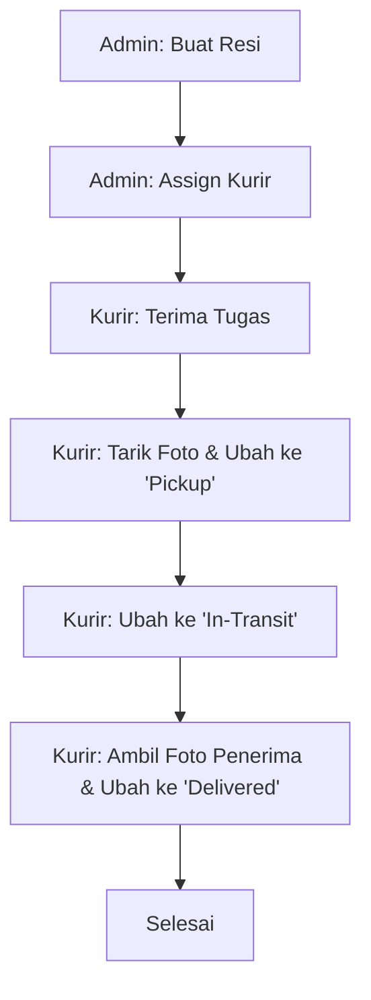
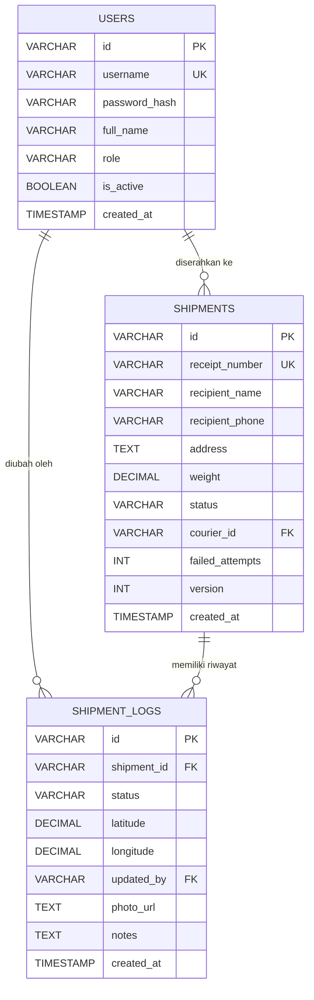

# Product Requirements Document: KirimCepat
Version: 1.0, Status: Draft, Tanggal: 24 Oktober 2023

## 1. Overview
### Problem Statement
Pemilik toko online skala kecil (UMKM) sering mengalami kesulitan dalam melacak pengiriman barang yang dilakukan secara mandiri. Saat ini, proses pembuatan resi, penugasan kurir (yang terbatas pada 2 kurir tetap), dan pelacakan status pengiriman masih dilakukan secara manual menggunakan aplikasi chat WhatsApp. Hal ini menyebabkan sering terjadinya kehilangan bukti pengiriman (foto penerimaan), ketidakjelasan status barang (apakah sudah di-pickup, sedang di jalan, atau sudah diterima), serta kesulitan dalam menghitung performa harian dan bulanan dari masing-masing kurir.

### Solution
KirimCepat adalah aplikasi manajemen pengiriman berbasis web (untuk Admin/Owner Toko) dan web-responsive mobile (untuk Kurir). Sistem ini mendigitalisasi pembuatan resi otomatis, penugasan langsung ke salah satu dari 2 kurir aktif, pembaruan status pengiriman real-time (pickup, in-transit, delivered), pengunggahan foto bukti pengiriman/penerimaan langsung dari kamera handphone kurir, serta penyediaan laporan performa pengiriman per kurir secara otomatis.

### Goals
*   Mengurangi waktu administrasi pembuatan resi dan penugasan kurir sebesar 70% (dari rata-rata 10 menit per pesanan menjadi kurang dari 3 menit).
*   Mencapai 100% digitalisasi bukti pengiriman (Proof of Delivery) melalui unggahan foto wajib saat status berubah menjadi 'Delivered'.
*   Memastikan akurasi pelacakan dengan waktu pembaruan status (latency) di bawah 2 detik dari aplikasi kurir ke dashboard admin.
*   Menghilangkan kehilangan data resi fisik dengan penyimpanan cloud terpusat.

### Non-Goals
*   Aplikasi ini tidak menyediakan fitur optimasi rute otomatis (Route Optimization/Traveling Salesperson Problem).
*   Aplikasi ini tidak terintegrasi dengan ekspedisi pihak ketiga (seperti JNE, J&T, atau GoSend).
*   Aplikasi ini tidak menangani rekonsiliasi uang COD (Cash on Delivery) secara otomatis dengan perbankan; pencatatan transaksi COD hanya bersifat pencatatan status manual.

### Target Users
*   **Admin / Owner Toko**: Pengelola toko yang menginput data pengiriman, menugaskan kurir, dan melihat laporan.
*   **Kurir (Maksimal 2 User)**: Petugas lapangan yang melakukan pickup, membawa barang, dan menyerahkan barang ke pelanggan.

### Personas
1.  **Nama**: Ibu Ratna (Owner Toko)
    *   **Peran**: Admin & Pemilik Toko
    *   **Kebutuhan**: Memantau paket yang sedang dikirim oleh 2 kurirnya tanpa harus terus-menerus mengirim pesan WhatsApp ke kurir.
    *   **Pain Points**: Sering mendapat komplain dari pelanggan bahwa barang belum sampai, sementara kurir sulit dihubungi saat di jalan. Bukti foto pengiriman sering hilang di galeri HP kurir.
    *   **Konteks**: Mengakses aplikasi melalui laptop di toko.
2.  **Nama**: Andi (Kurir 1)
    *   **Peran**: Kurir Operasional
    *   **Kebutuhan**: Melihat daftar alamat pengiriman hari ini dengan jelas dan memperbarui status pengiriman dengan cepat menggunakan handphone saat di motor.
    *   **Pain Points**: Kesulitan mencari alamat karena format penulisan admin di WhatsApp tidak rapi, dan malas mengetik laporan status satu per satu.
    *   **Konteks**: Mengakses aplikasi melalui HP Android entry-level dengan koneksi internet seluler yang tidak stabil.

### User Stories
*   **US-01**: Sebagai Admin, saya ingin membuat resi pengiriman baru dengan menginput data penerima agar sistem dapat mencatat pesanan tersebut secara digital.
*   **US-02**: Sebagai Admin, saya ingin menugaskan resi pengiriman ke salah satu dari 2 kurir yang tersedia agar kurir tersebut menerima notifikasi tugas di aplikasinya.
*   **US-03**: Sebagai Kurir, saya ingin melihat daftar tugas pengiriman yang ditugaskan kepada saya hari ini agar saya dapat merencanakan rute perjalanan saya.
*   **US-04**: Sebagai Kurir, saya ingin mengubah status pengiriman menjadi 'Pickup', 'In-Transit', dan 'Delivered' langsung dari HP agar Admin dapat melihat progres secara real-time.
*   **US-05**: Sebagai Kurir, saya ingin mengunggah foto bukti penerimaan barang saat menyerahkannya kepada pelanggan agar pesanan dapat diselesaikan secara sah.
*   **US-06**: Sebagai Admin, saya ingin melihat dashboard laporan performa (jumlah sukses/gagal) dari masing-masing kurir setiap bulan untuk menghitung insentif mereka.

---

## 2. Scope
### In-Scope
*   Manajemen Autentikasi: Login untuk Admin dan 2 Kurir (menggunakan kredensial yang dibuat oleh Admin).
*   Manajemen Resi: Pembuatan resi manual, pencetakan label resi sederhana (format PDF/Thermal 80mm).
*   Penugasan Kurir: Fitur dropdown untuk memilih Kurir A atau Kurir B untuk setiap resi.
*   Pelacakan Status: Alur status pengiriman: `Draft` -> `Assigned` -> `Pickup` -> `In-Transit` -> `Delivered` / `Failed`.
*   Bukti Pengiriman (Proof of Delivery): Fitur kamera langsung pada aplikasi kurir untuk mengambil foto saat pickup dan saat barang diterima (delivered) atau gagal (failed).
*   Laporan Sederhana: Halaman visualisasi performa kurir (total pengiriman, persentase sukses, waktu rata-rata pengiriman).

### Out-of-Scope
*   Registrasi mandiri (Sign Up) untuk umum (User kurir dibatasi maksimal 2 dan didaftarkan langsung melalui database/seeding).
*   Pelacakan GPS real-time di atas peta (Live Map Tracking) untuk pelanggan. Pelanggan hanya bisa melacak lewat halaman web statis menggunakan nomor resi.
*   Sistem manajemen inventaris barang (Inventory Management).

### Assumptions
*   Jumlah kurir aktif di lapangan tidak akan melebihi 2 orang untuk fase rilis ini.
*   Kurir memiliki smartphone Android/iOS dengan browser modern (Chrome/Safari) yang memiliki izin akses kamera dan lokasi aktif.
*   Koneksi internet kurir di lapangan minimal menggunakan jaringan 3G.

### Dependencies
*   **Cloud Storage Service** (misalnya Supabase Storage atau AWS S3) untuk menyimpan foto bukti pengiriman.
*   **PDF Generator Library** (seperti PDFKit atau jsPDF) untuk mencetak label resi.

---

## 3. Functional Requirements

| ID | Fitur | Deskripsi Detail | Prioritas | Acceptance Criteria |
| :--- | :--- | :--- | :--- | :--- |
| FR-01 | Pembuatan Resi Baru | Admin dapat menginput data nama penerima, alamat lengkap, nomor telepon, berat barang, dan tipe layanan pengiriman melalui form web. | P0 | * **Given**: Admin berada di halaman tambah resi. * **When**: Admin mengisi semua field wajib dengan benar dan menekan tombol "Simpan". * **Then**: Sistem menghasilkan nomor resi unik (format: KC-YYYYMMDD-XXXX) dan status resi diatur menjadi `Draft`. |
| FR-02 | Penugasan Kurir | Admin dapat memilih salah satu dari 2 kurir yang terdaftar untuk ditugaskan mengirimkan paket berdasarkan resi tertentu. | P0 | * **Given**: Resi berstatus `Draft` atau `Unassigned`. * **When**: Admin memilih "Kurir A" atau "Kurir B" dari dropdown dan menekan "Assign". * **Then**: Status resi berubah menjadi `Assigned` dan resi tersebut muncul di daftar tugas kurir yang bersangkutan. |
| FR-03 | Daftar Tugas Kurir | Kurir dapat melihat daftar paket yang ditugaskan kepada mereka, diurutkan berdasarkan tanggal penugasan terbaru. | P0 | * **Given**: Kurir telah login ke aplikasi mobile. * **When**: Kurir membuka halaman "Tugas Saya". * **Then**: Sistem menampilkan daftar resi dengan status `Assigned`, `Pickup`, dan `In-Transit` yang ditugaskan kepadanya. |
| FR-04 | Pembaruan Status ke 'Pickup' | Kurir dapat memperbarui status barang ketika mengambil barang dari gudang/toko ke dalam kendaraan. | P0 | * **Given**: Resi berstatus `Assigned` dan kurir berada di lokasi toko. * **When**: Kurir menekan tombol "Mulai Pickup" dan mengambil foto barang di toko. * **Then**: Status resi berubah menjadi `Pickup` dan foto tersimpan di sistem. |
| FR-05 | Pembaruan Status ke 'In-Transit' | Kurir memperbarui status ketika mulai berkendara mengantarkan barang menuju alamat penerima. | P1 | * **Given**: Resi berstatus `Pickup`. * **When**: Kurir menekan tombol "Kirim Barang". * **Then**: Status resi berubah menjadi `In-Transit` dan waktu keberangkatan tercatat di database. |
| FR-06 | Konfirmasi 'Delivered' dengan Foto | Kurir menyelesaikan pengiriman dengan mengambil foto penerima/depan rumah sebagai bukti sah. | P0 | * **Given**: Resi berstatus `In-Transit`. * **When**: Kurir menekan tombol "Selesai Kirim", mengambil foto bukti melalui kamera HP, menginput nama penerima akhir, lalu menekan "Submit". * **Then**: Status resi berubah menjadi `Delivered`, foto bukti terunggah ke cloud storage, dan waktu selesai tercatat. |
| FR-07 | Laporan Status 'Failed' | Kurir dapat menandai pengiriman gagal jika penerima tidak ada di tempat atau alamat tidak ditemukan. | P0 | * **Given**: Resi berstatus `In-Transit`. * **When**: Kurir menekan tombol "Gagal Kirim", memilih alasan kegagalan dari dropdown, mengambil foto lokasi/rumah kosong, lalu menekan "Submit". * **Then**: Status resi berubah menjadi `Failed`, dan sistem mencatat alasan kegagalan tersebut. |
| FR-08 | Pelacakan Resi Publik | Pelanggan dapat melacak status paket mereka melalui halaman web publik tanpa perlu login, cukup dengan memasukkan nomor resi. | P1 | * **Given**: Pengguna membuka halaman pelacakan publik. * **When**: Pengguna memasukkan nomor resi valid dan menekan "Cari". * **Then**: Sistem menampilkan riwayat perjalanan paket lengkap dengan timestamp status terakhir tanpa menampilkan informasi sensitif nomor telepon penerima. |
| FR-09 | Cetak Label Resi | Admin dapat mencetak label pengiriman berukuran 80mm untuk ditempelkan pada paket. | P1 | * **Given**: Admin melihat detail resi. * **When**: Admin menekan tombol "Cetak Label". * **Then**: Sistem menghasilkan file PDF yang berisi barcode nomor resi, nama penerima, alamat, nomor telepon, dan nama kurir yang ditugaskan. |
| FR-10 | Laporan Performa Kurir | Admin dapat melihat grafik dan tabel performa dari 2 kurir berdasarkan filter rentang tanggal. | P1 | * **Given**: Admin berada di halaman "Laporan". * **When**: Admin memilih rentang tanggal dan menekan "Filter". * **Then**: Sistem menampilkan total resi yang dikirim, jumlah sukses, jumlah gagal, dan rata-rata durasi pengiriman per kurir. |

---

## 4. Non-Functional Requirements
### Performance
*   **Response Time**: API response time untuk operasi baca/tulis (kecuali upload gambar) harus memiliki p95 < 500ms.
*   **Image Upload**: Proses kompresi gambar dilakukan di sisi klien (client-side) hingga ukuran file maksimal 500KB sebelum diunggah, dengan target waktu unggah ke cloud storage < 3 detik pada jaringan 3G.
*   **Concurrent Users**: Sistem harus mendukung hingga 50 pengguna aktif secara bersamaan tanpa penurunan performa (mengingat batas operasional hanya untuk admin dan 2 kurir).

### Security
*   **Authentication**: Menggunakan JSON Web Tokens (JWT) dengan masa berlaku token (session lifetime) selama 24 jam.
*   **Authorization**: Penerapan Role-Based Access Control (RBAC) yang ketat. Kurir dilarang mengakses API pembuatan resi dan laporan performa kurir lainnya.
*   **Data Encryption**: Semua transmisi data wajib menggunakan HTTPS (TLS 1.3). Data sensitif seperti password pengguna wajib di-hash menggunakan bcrypt dengan salt round minimal 10.
*   **Rate-Limiting**: Batasan request rate-limiting sebesar 60 request per menit per alamat IP untuk mencegah serangan Brute Force dan DoS pada endpoint publik.
*   **Input Sanitization**: Semua input teks dari pengguna harus disanitasi untuk mencegah serangan Cross-Site Scripting (XSS) dan SQL Injection.

### Scalability
*   **Database Capacity**: Database dirancang untuk menangani penyimpanan hingga 100.000 transaksi resi tanpa penurunan kecepatan query indeks.
*   **Storage Capacity**: Cloud storage harus mampu menampung hingga 200.000 file foto bukti pengiriman (rata-rata 500KB per foto, total estimasi ~100GB).

### Reliability/Availability
*   **Uptime**: Target ketersediaan sistem (Service Level Objective) adalah 99.9% uptime tahunan.
*   **Backup**: Sistem pencadangan database otomatis (automated daily backup) dilakukan setiap hari pada pukul 02:00 WIB dengan masa penyimpanan cadangan (retention) selama 30 hari.
*   **Recovery**: Recovery Time Objective (RTO) maksimal 2 jam dan Recovery Point Objective (RPO) maksimal 24 jam.

### Usability & Accessibility
*   **Mobile Responsiveness**: Tampilan aplikasi kurir harus dioptimalkan untuk mobile web (viewport width 360px - 480px) dengan ukuran tombol minimal 44x44 piksel agar mudah ditekan saat kurir menggunakan sarung tangan.
*   **Accessibility**: Memenuhi standar WCAG 2.1 Level AA untuk kontras warna teks dan elemen UI guna memudahkan pembacaan di bawah terik sinar matahari.

### Compliance
*   **Data Protection**: Data pribadi pelanggan (nama, alamat, nomor telepon) harus dilindungi sesuai regulasi UU Pelindungan Data Pribadi (UU PDP). Nomor telepon pelanggan pada halaman pelacakan publik wajib disamarkan (masking), contoh: `0812****5678`.

---

## 5. Business Rules
*   **BR-01 (Courier Limit)**: Sistem hanya memperbolehkan maksimal 2 akun dengan role `Courier` berstatus aktif di dalam sistem database pada satu waktu. Pendaftaran kurir ke-3 akan ditolak oleh sistem secara otomatis.
*   **BR-02 (State Transition)**: Perubahan status resi harus mengikuti alur linear yang ketat: `Draft` -> `Assigned` -> `Pickup` -> `In-Transit` -> `Delivered` atau `Failed`. Status tidak boleh melompat (misal dari `Draft` langsung ke `In-Transit`).
*   **BR-03 (Proof of Delivery)**: Transisi status resi menjadi `Delivered` atau `Failed` wajib menyertakan parameter koordinat GPS (latitude & longitude) kurir saat menekan tombol dan minimal 1 file gambar bukti pengiriman sebagai payload API.
*   **BR-04 (Assignment Ownership)**: Kurir hanya diperbolehkan memperbarui status resi yang ditugaskan kepada dirinya sendiri. Kurir A tidak dapat mengubah status resi milik Kurir B.
*   **BR-05 (Resi Uniqueness)**: Nomor resi harus unik secara global dan tidak dapat diubah setelah resi pertama kali dibuat (read-only setelah operasi insert).
*   **BR-06 (Failed Redelivery Limit)**: Resi yang memiliki status `Failed` dapat ditugaskan kembali (re-assign) oleh Admin maksimal sebanyak 3 kali. Setelah 3 kali gagal, status resi akan terkunci menjadi `Returned` (barang dikembalikan ke toko).

---

## 6. Edge Cases

| Skenario | Perilaku Diharapkan |
| :--- | :--- |
| **Offline/Lost Signal di Lapangan** | Aplikasi mobile kurir menyimpan status pembaruan dan path foto secara lokal di browser LocalStorage. Begitu koneksi internet terdeteksi kembali (online event), aplikasi otomatis melakukan sinkronisasi data ke server. |
| **Nomor Resi Duplikat** | Database menggunakan constraint `UNIQUE` pada kolom `receipt_number`. Jika terjadi tabrakan nomor resi saat generate, sistem menangkap error 409 dan melakukan retry generate kode baru secara otomatis hingga 3 kali sebelum memberikan error ke admin. |
| **Penugasan Kurir Bersamaan (Concurrent Edit)** | Jika Admin A menugaskan Resi 01 ke Kurir A, dan pada saat yang sama Admin B menugaskan Resi 01 ke Kurir B, sistem akan menerapkan mekanisme *Optimistic Locking* menggunakan kolom `version`. Transaksi pertama yang masuk akan berhasil, transaksi kedua akan ditolak dengan pesan: "Data resi telah diperbarui oleh pengguna lain". |
| **Ukuran Gambar Sangat Besar** | Jika kurir mengunggah foto mentah berukuran > 10MB dari kamera resolusi tinggi, library Javascript di browser kurir wajib melakukan kompresi (resize dimensi maksimal 1280px lebar/tinggi dan kualitas JPEG 75%) sebelum dikirim ke server. |
| **Perubahan Waktu Lokal HP Kurir** | Seluruh pencatatan waktu transaksi di database menggunakan UTC timestamp server (`CURRENT_TIMESTAMP`), bukan waktu lokal perangkat kurir, untuk mencegah kecurangan manipulasi waktu pengiriman oleh kurir. |
| **Kurir Dihapus Saat Memiliki Tugas Aktif** | Sistem menolak proses penonaktifan/penghapusan akun kurir jika kurir tersebut masih memiliki resi dengan status aktif (`Assigned`, `Pickup`, `In-Transit`). Admin harus memindahkan tugas tersebut ke kurir lain terlebih dahulu. |
| **Kegagalan Upload Gambar ke Cloud Storage** | Jika database berhasil diperbarui tetapi unggahan gambar ke S3 gagal, seluruh transaksi database dibatalkan (database rollback) menggunakan database transaction, dan kurir diminta untuk menekan tombol submit ulang. |
| **Input Alamat Mengandung Karakter Aneh** | Sistem melakukan pembersihan input (sanitization) dan menolak karakter khusus script (`<script>`, `SELECT`, `DROP TABLE`) namun tetap mengizinkan tanda baca alamat standar seperti `/`, `.`, `-`, `,`. |

---

## 7. User Flow & Screen List
### Primary Flow (Happy Path)
1.  Admin masuk ke aplikasi web dashboard -> Membuat resi baru.
2.  Admin memilih Kurir A dari menu dropdown penugasan pada detail resi.
3.  Kurir A login di HP -> Melihat resi baru di daftar tugasnya.
4.  Kurir A mengonfirmasi pengambilan barang dengan menekan tombol "Pickup" dan mengambil foto barang.
5.  Kurir A membawa barang dan mengubah status menjadi "In-Transit".
6.  Kurir A tiba di alamat tujuan -> Menyerahkan barang -> Mengambil foto penerima -> Menekan tombol "Delivered".
7.  Admin melihat status resi berubah menjadi "Delivered" beserta foto bukti penerimaan di dashboard.

### Alternative Flow (Delivery Failed)
1.  Kurir A membawa barang ("In-Transit") -> Tiba di lokasi tetapi rumah kosong.
2.  Kurir A menekan "Gagal Kirim" -> Mengambil foto pagar rumah terkunci -> Memilih alasan "Penerima Tidak Ditempat".
3.  Status berubah menjadi "Failed".
4.  Admin di dashboard melihat status "Failed" -> Melakukan koordinasi dengan pelanggan -> Melakukan re-assign tugas ke Kurir B untuk pengiriman ulang keesokan harinya.

### Screen List

| Nama Layar | Layar Tujuan | Elemen Utama | Navigasi |
| :--- | :--- | :--- | :--- |
| **Layar Login** | Dashboard Admin / List Tugas Kurir | Input Username, Input Password, Tombol Login | Setelah sukses login, Admin diarahkan ke Dashboard, Kurir diarahkan ke List Tugas Kurir. |
| **Dashboard Admin** | Detail Resi, Form Buat Resi | Ringkasan statistik (Total Resi, Aktif, Selesai, Gagal), Tabel daftar resi terbaru, Tombol "Buat Resi". | Klik baris tabel mengarah ke Detail Resi; klik tombol mengarah ke Form Buat Resi; Sidebar menu untuk Laporan. |
| **Form Buat Resi (Admin)**| Dashboard Admin | Form input (Nama, Alamat, No HP, Berat, Dropdown Kurir), Tombol Simpan, Tombol Batal. | Tombol Simpan/Batal mengarahkan kembali ke Dashboard Admin. |
| **Detail Resi (Admin)** | Dashboard Admin | Informasi lengkap pengirim/penerima, Riwayat status pengiriman beserta timestamp, Penunjuk koordinat GPS, Foto bukti pickup/delivery. | Tombol "Kembali" mengarahkan ke Dashboard Admin. |
| **List Tugas Kurir (Mobile)**| Detail Tugas Kurir | Filter Status (Tugas Baru, Sedang Dikirim), List card resi (No Resi, Nama Penerima, Alamat Singkat). | Klik card resi mengarahkan ke Detail Tugas Kurir. |
| **Detail Tugas Kurir (Mobile)**| List Tugas Kurir, Layar Kamera | Informasi lengkap pelanggan, Tombol aksi dinamis berdasarkan status (`Mulai Pickup` / `Kirim` / `Selesai` / `Gagal`). | Klik tombol aksi tertentu akan membuka Layar Kamera untuk konfirmasi foto. |
| **Layar Kamera (Mobile)** | Detail Tugas Kurir | Viewfinder Kamera Aktif, Tombol jepret foto, Preview foto hasil jepretan, Tombol konfirmasi upload. | Setelah konfirmasi upload berhasil, otomatis kembali ke Detail Tugas Kurir dengan status ter-update. |
| **Laporan Performa (Admin)**| Dashboard Admin | Grafik garis tren pengiriman harian, Tabel performa 2 kurir (Total, Sukses, Gagal, Rata-rata durasi). | Akses via sidebar menu Admin. |
| **Pelacakan Publik (Web)** | Hasil Pelacakan | Input Nomor Resi, Tombol Cari. | Membuka Halaman Hasil Pelacakan jika resi ditemukan. |

---

## 8. API Requirements
Semua base URL API menggunakan prefix `/api/v1`. Format data request dan response menggunakan JSON.

### API Endpoints

| Method | Endpoint | Auth | Deskripsi | Request Body (JSON) | Response Body (JSON) |
| :--- | :--- | :--- | :--- | :--- | :--- |
| **POST** | `/api/v1/auth/login` | Public | Autentikasi Admin dan Kurir untuk mendapatkan token JWT. | `{"username": "kurira", "password": "securepassword"}` | `{"token": "eyJhbGciOi...", "role": "courier", "expires_in": 86400}` |
| **POST** | `/api/v1/shipments` | Admin | Membuat data resi pengiriman baru. | `{"recipient_name": "Budi", "address": "Jl. Mawar No. 10", "phone": "08123456789", "weight": 1.5}` | `{"id": "ship_001", "receipt_number": "KC-20231024-0001", "status": "Draft", "created_at": "2023-10-24T10:00:00Z"}` |
| **PUT** | `/api/v1/shipments/{id}/assign` | Admin | Menugaskan resi pengiriman kepada kurir tertentu. | `{"courier_id": "usr_kurir1"}` | `{"id": "ship_001", "status": "Assigned", "assigned_to": "usr_kurir1"}` |
| **GET** | `/api/v1/shipments/courier` | Courier | Mendapatkan daftar tugas pengiriman milik kurir yang sedang login. | None | `[{"id": "ship_001", "receipt_number": "KC-20231024-0001", "recipient_name": "Budi", "address": "Jl. Mawar No. 10", "status": "Assigned"}]` |
| **PUT** | `/api/v1/shipments/{id}/status` | Courier | Memperbarui status pengiriman (Pickup, In-Transit, Delivered, Failed) beserta data pendukung. | `{"status": "Delivered", "latitude": -6.2088, "longitude": 106.8456, "photo_url": "https://storage.kirimcepat.com/proofs/pic01.jpg", "notes": "Diterima oleh Istri"}` | `{"id": "ship_001", "status": "Delivered", "updated_at": "2023-10-24T11:30:00Z"}` |
| **GET** | `/api/v1/track/{receipt_number}` | Public | Melacak status pengiriman berdasarkan nomor resi publik (tanpa login). | None | `{"receipt_number": "KC-20231024-0001", "status": "Delivered", "history": [{"status": "Draft", "time": "2023-10-24T10:00:00Z"}, {"status": "Delivered", "time": "2023-10-24T11:30:00Z"}]}` |

### Error Codes

*   **400 Bad Request**: Request body tidak valid atau melanggar aturan validasi schema.
*   **401 Unauthorized**: JWT token tidak dikirimkan, tidak valid, atau sudah kedaluwarsa.
*   **403 Forbidden**: Pengguna tidak memiliki role yang sesuai untuk mengakses endpoint (misal kurir mencoba membuat resi).
*   **404 Not Found**: Resource yang dicari (nomor resi atau ID pengiriman) tidak ditemukan di database.
*   **409 Conflict**: Terjadi bentrokan versi data (concurrent update) atau nomor resi duplikat.
*   **422 Unprocessable Entity**: Aturan bisnis dilanggar (misal mengubah status resi melompati alur status, atau mendaftarkan kurir ke-3).
*   **500 Internal Server Error**: Terjadi kesalahan internal pada server aplikasi atau kegagalan koneksi database.

---

## 9. Database Schema
Database menggunakan PostgreSQL dengan desain normalisasi 3NF.

### Table: `users`
Menyimpan data pengguna sistem (Admin dan Kurir).

| Kolom | Tipe | Constraint | Keterangan |
| :--- | :--- | :--- | :--- |
| `id` | VARCHAR(36) | PRIMARY KEY, NOT NULL | UUID v4 |
| `username` | VARCHAR(50) | UNIQUE, NOT NULL | Username login |
| `password_hash` | VARCHAR(255) | NOT NULL | Hash password bcrypt |
| `full_name` | VARCHAR(100) | NOT NULL | Nama lengkap pengguna |
| `role` | VARCHAR(20) | CHECK (role IN ('Admin', 'Courier')), NOT NULL | Role pengguna |
| `is_active` | BOOLEAN | DEFAULT TRUE, NOT NULL | Status aktif pengguna |
| `created_at` | TIMESTAMP | DEFAULT CURRENT_TIMESTAMP, NOT NULL | Waktu pembuatan data |
| `updated_at` | TIMESTAMP | DEFAULT CURRENT_TIMESTAMP, NOT NULL | Waktu pembaruan data |

### Table: `shipments`
Menyimpan data transaksi pengiriman paket.

| Kolom | Tipe | Constraint | Keterangan |
| :--- | :--- | :--- | :--- |
| `id` | VARCHAR(36) | PRIMARY KEY, NOT NULL | UUID v4 |
| `receipt_number` | VARCHAR(30) | UNIQUE, NOT NULL | Format: KC-YYYYMMDD-XXXX |
| `recipient_name` | VARCHAR(100) | NOT NULL | Nama penerima paket |
| `recipient_phone`| VARCHAR(20) | NOT NULL | Nomor telepon penerima |
| `address` | TEXT | NOT NULL | Alamat lengkap tujuan |
| `weight` | DECIMAL(5,2) | DEFAULT 1.0, NOT NULL | Berat paket dalam kilogram |
| `status` | VARCHAR(20) | CHECK (status IN ('Draft', 'Assigned', 'Pickup', 'In-Transit', 'Delivered', 'Failed', 'Returned')), DEFAULT 'Draft', NOT NULL | Status pengiriman saat ini |
| `courier_id` | VARCHAR(36) | FOREIGN KEY REFERENCES users(id) ON DELETE RESTRICT | ID kurir yang ditugaskan |
| `failed_attempts`| INT | DEFAULT 0, NOT NULL | Jumlah kegagalan pengiriman |
| `version` | INT | DEFAULT 1, NOT NULL | Kolom untuk optimistic locking |
| `created_at` | TIMESTAMP | DEFAULT CURRENT_TIMESTAMP, NOT NULL | Waktu pembuatan resi |
| `updated_at` | TIMESTAMP | DEFAULT CURRENT_TIMESTAMP, NOT NULL | Waktu modifikasi terakhir |

### Table: `shipment_logs`
Menyimpan riwayat perubahan status pengiriman secara kronologis (Audit Trail).

| Kolom | Tipe | Constraint | Keterangan |
| :--- | :--- | :--- | :--- |
| `id` | VARCHAR(36) | PRIMARY KEY, NOT NULL | UUID v4 |
| `shipment_id` | VARCHAR(36) | FOREIGN KEY REFERENCES shipments(id) ON DELETE CASCADE, NOT NULL | ID pengiriman terkait |
| `status` | VARCHAR(20) | NOT NULL | Status baru yang diterapkan |
| `latitude` | DECIMAL(10, 8) | NULL | Koordinat latitude kurir saat update |
| `longitude` | DECIMAL(11, 8) | NULL | Koordinat longitude kurir saat update |
| `updated_by` | VARCHAR(36) | FOREIGN KEY REFERENCES users(id) ON DELETE RESTRICT, NOT NULL | User yang melakukan perubahan |
| `photo_url` | TEXT | NULL | URL foto bukti yang diunggah |
| `notes` | TEXT | NULL | Catatan tambahan (alasan gagal, nama penerima asli) |
| `created_at` | TIMESTAMP | DEFAULT CURRENT_TIMESTAMP, NOT NULL | Waktu perubahan terjadi |

### Indexes
*   `idx_shipments_receipt_number`: Indeks unik pada `shipments(receipt_number)` untuk pencarian cepat pelacakan publik.
*   `idx_shipments_courier_status`: Indeks komposit pada `shipments(courier_id, status)` untuk optimasi query list tugas kurir.
*   `idx_shipment_logs_shipment_id`: Indeks pada `shipment_logs(shipment_id)` untuk mempercepat query timeline pelacakan resi.

### Entity Relationship Diagram (ERD)

---

## 10. Roles & Permissions

| Role | Modul | Hak (CRUD) | Keterangan |
| :--- | :--- | :--- | :--- |
| **Admin** | Manajemen Pengguna (Kurir) | CREATE, READ, UPDATE | Membuat kredensial login untuk 2 kurir tetap. Tidak bisa menghapus kurir jika masih ada tugas aktif. |
| **Admin** | Manajemen Resi | CREATE, READ, UPDATE | Membuat resi, memperbarui informasi data pengiriman, mencetak label. |
| **Admin** | Penugasan Kurir | UPDATE | Menugaskan resi ke Kurir A atau Kurir B. |
| **Admin** | Laporan Performa | READ | Melihat visualisasi data performa kurir secara keseluruhan. |
| **Courier**| Manajemen Resi (Tugas) | READ | Hanya dapat melihat detail resi yang ditugaskan kepada dirinya sendiri. |
| **Courier**| Status Update | CREATE, UPDATE | Menambahkan log perubahan status (`Pickup`, `In-Transit`, `Delivered`, `Failed`) serta mengunggah foto bukti. |
| **Courier**| Laporan Performa | NONE | Tidak memiliki akses ke halaman laporan performa global. |

---

## 11. Validation Rules

| Field | Aturan Validasi | Pesan Error |
| :--- | :--- | :--- |
| `recipient_name` | Wajib diisi, tipe data string, minimal 3 karakter, maksimal 100 karakter. | "Nama penerima harus diisi dan minimal terdiri dari 3 karakter." |
| `recipient_phone`| Wajib diisi, format nomor telepon Indonesia (diawali `08` atau `+62`), minimal 9 digit, maksimal 15 digit. | "Nomor telepon tidak valid. Gunakan format Indonesia yang benar (contoh: 08123456789)." |
| `address` | Wajib diisi, minimal 10 karakter, maksimal 500 karakter. | "Alamat pengiriman terlalu pendek. Berikan informasi alamat yang lebih lengkap." |
| `weight` | Wajib diisi, tipe data float/decimal, nilai minimal `0.1` kg, nilai maksimal `50.0` kg. | "Berat barang harus diisi antara 0.1 kg hingga 50.0 kg." |
| `courier_id` | Opsional saat draft, namun wajib diisi dengan ID kurir valid yang terdaftar di database saat status diubah menjadi `Assigned`. | "Kurir yang ditugaskan tidak valid atau tidak terdaftar di sistem." |
| `photo_url` | Wajib diisi jika status pengiriman diubah menjadi `Delivered` atau `Failed`. Harus berupa format URL valid dengan ekstensi `.jpg`, `.jpeg`, atau `.png`. | "Bukti foto pengiriman wajib diunggah untuk menyelesaikan pengiriman." |
| `latitude` / `longitude` | Wajib diisi jika status diubah menjadi `Delivered` atau `Failed`. Nilai latitude harus di kisaran -90 s/d 90, longitude -180 s/d 180. | "Koordinat lokasi GPS tidak valid atau tidak terdeteksi." |

---

## 12. Error Handling
### Strategy
*   **Toast Notifications**: Untuk error yang dipicu oleh tindakan user di frontend (misal: input form salah, upload gagal), sistem akan memunculkan toast notification berwarna merah di pojok kanan atas yang otomatis hilang dalam 5 detik.
*   **Inline Validation**: Input form yang tidak valid akan langsung menampilkan pesan error berwarna merah tepat di bawah input field yang bersangkutan sebelum form di-submit.
*   **Retry Policy**: Untuk pengunggahan foto bukti pengiriman oleh kurir, jika terjadi kegagalan jaringan, aplikasi mobile akan secara otomatis mencoba mengunggah kembali (auto-retry) sebanyak 3 kali dengan interval jeda 5 detik sebelum menampilkan dialog opsi "Coba Lagi" manual kepada kurir.
*   **Idempotency**: Endpoint penugasan kurir dan pembaruan status menggunakan mekanisme token idempoten (`X-Idempotency-Key` pada header HTTP) untuk mencegah duplikasi eksekusi akibat double-tap pada tombol aplikasi kurir.

### Error Scenarios

| Skenario Error | Code | Pesan ke User | Aksi Sistem |
| :--- | :--- | :--- | :--- |
| Percobaan mendaftarkan kurir ke-3 | `422 Unprocessable Entity` | "Batas maksimal sistem adalah 2 kurir aktif. Tidak dapat menambahkan kurir baru." | Membatalkan operasi insert dan mengirimkan respons error ke admin. |
| Token JWT kedaluwarsa saat kurir sedang bekerja | `401 Unauthorized` | "Sesi Anda telah berakhir. Silakan login kembali." | Menghapus token lokal dari browser/device storage dan mengarahkan paksa pengguna ke halaman Login. |
| Konflik pembaruan status (optimistic lock failed) | `409 Conflict` | "Data pengiriman ini telah diperbarui oleh Admin/Kurir lain. Halaman akan disegarkan." | Menggagalkan update database, memicu reload data terbaru dari server di layar pengguna. |
| Koneksi database terputus di server | `500 Internal Server Error` | "Terjadi gangguan koneksi pada server. Silakan coba beberapa saat lagi." | Mengirimkan log error ke Sentry untuk penanganan tim developer, memberikan respons error standar ke client. |
| Format file foto yang diunggah bukan gambar | `400 Bad Request` | "Format berkas tidak didukung. Hanya diperbolehkan mengunggah file gambar (JPG/PNG)." | Menolak file di sisi server, menghapus file temporary jika sempat terunggah ke server. |

---

## 13. Analytics & Monitoring
### Events Table

| Event Name | Trigger | Properties |
| :--- | :--- | :--- |
| `shipment_created` | Admin menekan tombol simpan resi baru dan sukses tersimpan di database. | `shipment_id`, `weight`, `created_by` |
| `shipment_assigned`| Admin berhasil menugaskan resi ke salah satu kurir. | `shipment_id`, `courier_id`, `assigned_by` |
| `shipment_pickup` | Kurir menekan konfirmasi pickup barang dan mengunggah foto. | `shipment_id`, `courier_id`, `timestamp` |
| `shipment_delivered`| Kurir sukses menyelesaikan pengiriman (status delivered). | `shipment_id`, `courier_id`, `duration_minutes`, `latitude`, `longitude` |
| `shipment_failed` | Kurir melaporkan kegagalan pengiriman. | `shipment_id`, `courier_id`, `reason_code`, `attempts_count` |

### Monitoring Setup
*   **Health Checks**: Menyediakan endpoint `/health` yang mengembalikan status konektivitas server ke database PostgreSQL dan Cloud Storage. Endpoint ini dipantau setiap 5 menit menggunakan UptimeRobot.
*   **Error Tracking**: Mengintegrasikan SDK Sentry pada backend dan frontend untuk menangkap exception secara real-time. Ambang batas toleransi error rate adalah < 1% dari total request harian.
*   **Business Metrics Dashboard**: Menyediakan visualisasi metrik bisnis utama untuk Admin:
    *   Rata-rata waktu penyelesaian tugas (sejak status `Assigned` hingga `Delivered`).
    *   Tingkat kesuksesan pengiriman harian (Total Delivered / Total Assigned).

---

## 14. Tech Stack

| Layer | Pilihan Teknologi | Alasan Pemilihan vs Kebutuhan Aplikasi |
| :--- | :--- | :--- |
| **Frontend Web (Admin)** | Next.js (React) + TailwindCSS | Next.js mempermudah pembuatan dashboard admin yang cepat dengan Server-Side Rendering (SSR) untuk performa memuat data transaksi yang efisien. TailwindCSS mempercepat implementasi desain responsif. |
| **Frontend Mobile (Kurir)**| React (PWA - Progressive Web App) | Menggunakan PWA agar kurir tidak perlu mengunduh aplikasi dari Play Store (cukup buka browser HP dan add to home screen). PWA mendukung penyimpanan offline (LocalStorage) dan akses kamera bawaan HP secara native. |
| **Backend API** | Node.js dengan Express.js | Ringan, memiliki ekosistem packages yang kaya, dan sangat efisien dalam menangani I/O non-blocking untuk API pembaruan status real-time. |
| **Database** | PostgreSQL | Menyediakan integritas data relasional yang kuat (ACID compliance) yang penting untuk pencatatan transaksi resi. Mendukung tipe data geografis untuk menyimpan titik koordinat lokasi kurir. |
| **Object Storage** | Supabase Storage (S3-compatible) | Menyediakan API unggah file yang mudah digunakan secara langsung dari client dengan token berbatas waktu (presigned URL) untuk keamanan unggahan foto bukti dari kurir. |
| **Hosting & Deployment** | Vercel (Frontend) & Railway (Backend & DB) | Deployment mudah, mendukung auto-scaling kecil, dan memiliki latensi server yang rendah untuk wilayah pengguna di Indonesia. |

---

## 15. Future Improvements
*   **Fase 2 (Auto-Routing & Multi-Courier)**: Mengimplementasikan algoritma optimasi rute pengantaran (Traveling Salesperson Problem) menggunakan Google Maps API untuk mengurutkan alamat pengantaran kurir secara otomatis, serta membuka batasan sistem agar dapat mendukung lebih dari 2 kurir.
*   **Fase 3 (Customer Live Tracking & COD Settlement)**: Menyediakan halaman pelacakan interaktif dengan peta real-time (menggunakan WebSocket) bagi pelanggan untuk memantau posisi kurir saat status `In-Transit`, serta sistem pencatatan keuangan COD yang terintegrasi dengan Payment Gateway untuk settlement instan.