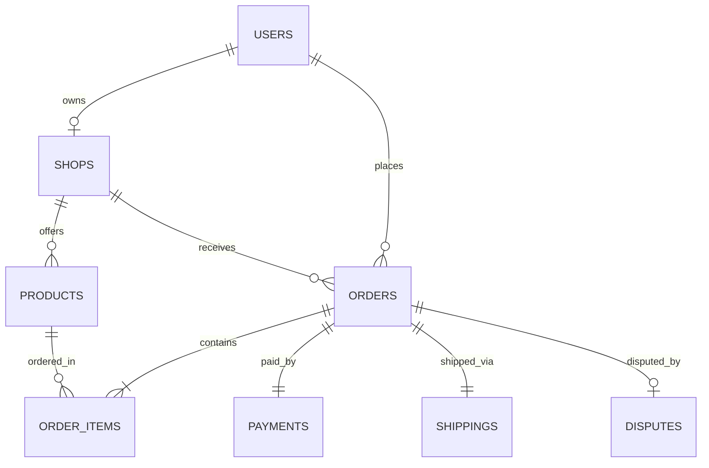

# Product Requirements Document: TokoRame - Multi-Vendor Marketplace Platform
Version: 1.0, Status: Draft, Tanggal: 24 Oktober 2023

## 1. Overview
### Problem Statement
UMKM dan penjual lokal di Indonesia sering kali kesulitan memperluas jangkauan pasar mereka karena keterbatasan infrastruktur digital yang mudah digunakan, biaya operasional yang tinggi, dan kurangnya rasa aman dari pembeli saat bertransaksi langsung. Di sisi lain, pembeli sering menghadapi risiko penipuan transaksi online, kesulitan melacak pengiriman secara real-time, dan tidak adanya mekanisme penyelesaian sengketa (dispute) yang adil ketika barang yang diterima tidak sesuai pesanan.

### Solution
TokoRame adalah platform marketplace multi-vendor terintegrasi yang memfasilitasi pembukaan toko online instan bagi penjual dengan sistem manajemen inventaris mandiri. Platform ini menjamin keamanan transaksi pembeli melalui rekening bersama (escrow) otomatis, integrasi pelacakan kurir pihak ketiga melalui API, sistem rating produk yang transparan, serta pusat resolusi sengketa (dispute center) terkelola untuk menangani pengembalian dana atau barang secara adil.

### Goals
- **Waktu Verifikasi Toko**: Mengurangi waktu verifikasi pembukaan toko baru hingga di bawah 10 menit menggunakan validasi NIK otomatis.
- **Keamanan Transaksi**: Mencapai tingkat keberhasilan transaksi tanpa penipuan (fraud rate) di bawah 0.05% melalui implementasi pembayaran escrow.
- **Kecepatan Pencarian**: Menjamin p95 latensi pencarian produk di bawah 300 ms dengan katalog berisi hingga 100.000 produk aktif.
- **Resolusi Sengketa**: Menyelesaikan sengketa transaksi dalam waktu maksimal 48 jam sejak laporan diajukan ke Dispute Center.

### Non-Goals
- Versi ini tidak menyediakan layanan pengiriman mandiri (fleet logistik internal). Semua pengiriman wajib menggunakan kurir pihak ketiga yang terintegrasi (JNE, J&T, Sicepat).
- Tidak mendukung penjualan produk digital (e-voucher, pulsa, lisensi software) atau produk jasa. Hanya produk fisik yang membutuhkan pengiriman fisik yang diizinkan.
- Tidak menyediakan fitur multi-currency; seluruh transaksi wajib menggunakan mata uang Rupiah (IDR).

### Target Users
- **Penjual (Sellers)**: Pemilik usaha mikro, kecil, dan menengah (UMKM) yang ingin menjual produk fisik secara online dengan kontrol penuh atas stok dan toko mereka.
- **Pembeli (Buyers)**: Konsumen retail yang mencari produk lokal berkualitas dengan jaminan transaksi aman dan pelacakan pengiriman yang transparan.
- **Admin Platform**: Tim internal TokoRame yang bertugas melakukan moderasi konten, manajemen komisi, dan persetujuan penarikan dana.
- **Customer Service / Mediator**: Tim penengah yang memoderasi proses sengketa (dispute) antara penjual dan pembeli.

### Personas
1. **Nama: Budi Santoso**
   - **Peran**: Penjual (UMKM Kerajinan Tangan)
   - **Kebutuhan**: Mengunggah produk dengan cepat, memantau sisa stok otomatis, dan mencairkan dana hasil penjualan ke rekening bank lokal tanpa birokrasi rumit.
   - **Pain Points**: Sering mengalami keterlambatan pencairan dana di platform lain dan kesulitan mencetak label pengiriman massal.
   - **Konteks**: Mengelola operasional toko dari laptop dan smartphone berspesifikasi menengah di Yogyakarta.
2. **Nama: Siti Rahma**
   - **Peran**: Pembeli Retail
   - **Kebutuhan**: Mencari produk berkualitas, membayar dengan e-wallet/QRIS secara instan, dan melacak posisi paket secara real-time.
   - **Pain Points**: Takut ditipu oleh penjual yang mengirimkan barang rusak atau tidak sesuai deskripsi tanpa adanya jaminan refund.
   - **Konteks**: Sering berbelanja kebutuhan rumah tangga menggunakan smartphone Android saat jam istirahat kerja.

### User Stories
- **US-01**: Sebagai Pembeli, saya ingin mendaftar akun menggunakan nomor WhatsApp/Email agar saya dapat mulai berbelanja dalam waktu kurang dari 1 menit.
- **US-02**: Sebagai Penjual, saya ingin membuka toko baru dengan mengunggah KTP dan detail rekening bank agar toko saya terverifikasi secara legal untuk berjualan.
- **US-03**: Sebagai Penjual, saya ingin menambahkan produk baru beserta variasi warna, ukuran, dan jumlah stok agar pembeli mendapatkan informasi produk yang akurat.
- **US-04**: Sebagai Pembeli, saya ingin menyaring pencarian produk berdasarkan lokasi toko, rentang harga, dan rating bintang agar saya dapat menemukan produk terbaik dengan cepat.
- **US-05**: Sebagai Pembeli, saya ingin melakukan pembayaran menggunakan QRIS atau Virtual Account agar transaksi saya terverifikasi secara otomatis oleh sistem escrow.
- **US-06**: Sebagai Penjual, saya ingin mencetak label pengiriman otomatis yang berisi nomor resi kurir terintegrasi agar proses packing barang menjadi lebih cepat.
- **US-07**: Sebagai Pembeli, saya ingin mengajukan komplain/dispute jika barang yang diterima rusak agar dana pembayaran saya ditahan di escrow dan tidak langsung diteruskan ke penjual.
- **US-08**: Sebagai Admin Platform, saya ingin menetapkan komisi platform sebesar 2.5% per transaksi sukses agar platform mendapatkan pendapatan operasional secara otomatis.

---

## 2. Scope
### In-Scope
- Sistem autentikasi pengguna (Registrasi, Login, Reset Password) dengan JWT dan OTP SMS/WhatsApp.
- Manajemen Toko (Buka Toko, Edit Profil Toko, Jam Operasional).
- Katalog & Manajemen Produk (CRUD Produk, Manajemen Stok, Variasi Produk, Upload Foto Maksimal 5MB).
- Fitur Pencarian & Filter Produk (Berdasarkan Kategori, Harga, Lokasi, Rating).
- Keranjang Belanja & Checkout Engine (Mendukung checkout dari beberapa toko sekaligus dengan kalkulasi ongkir terpisah).
- Integrasi Payment Gateway (Midtrans) untuk Escrow (QRIS, Virtual Account, Credit Card).
- Integrasi Layanan Logistik (Biteship API) untuk cek tarif, request pickup, dan pelacakan resi real-time.
- Sistem Rating & Review (Skala 1-5 disertai teks dan foto produk setelah transaksi selesai).
- Dispute Center (Pengajuan komplain, unggah bukti foto/video, chat mediasi, opsi refund/resend).
- Sistem Komisi Platform (Pemotongan otomatis persentase komisi dari setiap transaksi sukses).

### Out-of-Scope (with reason)
- Fitur Live Chat real-time antar pengguna menggunakan WebSocket (Ditiadakan pada fase ini untuk mengurangi kompleksitas beban server; komunikasi dibatasi melalui sistem pesan terstruktur pada order dan dispute).
- Fitur Affiliate Marketing (Ditiadakan untuk fokus pada kestabilan transaksi inti marketplace).
- Aplikasi Mobile Native iOS/Android (Fokus pada Web Responsive yang ramah mobile untuk menghemat biaya pengembangan awal).

### Assumptions
- Pengguna memiliki koneksi internet stabil (minimal 3G) untuk mengakses platform.
- Partner Payment Gateway (Midtrans) dan API Logistik (Biteship) memiliki uptime minimal 99.5%.
- Kurs mata uang tetap IDR (Rupiah) selama masa operasional awal.

### Dependencies
- **Midtrans API**: Untuk pemrosesan pembayaran escrow dan deteksi status pembayaran via webhook.
- **Biteship API**: Untuk kalkulasi ongkos kirim berdasarkan berat produk dan koordinat lokasi toko-pembeli, serta sinkronisasi status pengiriman kurir.
- **Twilio / WhatsApp API Provider**: Untuk pengiriman OTP autentikasi dan notifikasi status pesanan kritis.

---

## 3. Functional Requirements

| ID | Fitur | Deskripsi Detail | Prioritas | Acceptance Criteria |
| :--- | :--- | :--- | :--- | :--- |
| **FR-01** | Autentikasi Pengguna | Sistem memfasilitasi registrasi dan login menggunakan email/password atau nomor WhatsApp dengan verifikasi OTP 6 digit. | P0 | - Given: Pengguna berada di halaman login.<br>- When: Pengguna memasukkan nomor WhatsApp valid dan menekan "Kirim OTP".<br>- Then: Sistem mengirimkan OTP via WhatsApp dan menampilkan input OTP dengan countdown timer 60 detik. |
| **FR-02** | Manajemen Toko | Pengguna dapat mengaktifkan mode Penjual dengan mengisi nama toko, domain unik toko, alamat lengkap (koordinat latitude/longitude), dan nomor rekening bank. | P0 | - Given: Pengguna terautentikasi mengisi form toko baru.<br>- When: Pengguna mengirimkan data dengan nama toko yang sudah terpakai.<br>- Then: Sistem menampilkan error "Nama toko sudah digunakan" dan menolak pendaftaran. |
| **FR-03** | Manajemen Produk | Penjual dapat menambahkan, mengubah, dan menghapus produk dengan data nama, deskripsi, harga, stok, berat (gram), dimensi, dan maksimal 5 foto produk. | P0 | - Given: Penjual berada di dashboard produk.<br>- When: Penjual menyimpan produk dengan stok kurang dari 0 atau harga di bawah Rp 1.000.<br>- Then: Sistem memblokir penyimpanan dan menampilkan pesan validasi yang sesuai. |
| **FR-04** | Pencarian Produk | Pembeli dapat mencari produk menggunakan kata kunci dengan pencarian berbasis teks penuh (full-text search) serta filter kategori, harga, dan lokasi toko. | P1 | - Given: Pembeli mengetikkan kata kunci di kolom pencarian.<br>- When: Pembeli menekan enter.<br>- Then: Sistem menampilkan daftar produk yang relevan dalam waktu < 300 ms dengan pagination 20 produk per halaman. |
| **FR-05** | Keranjang & Checkout | Pembeli dapat memasukkan produk dari toko berbeda ke dalam keranjang belanja dan melakukan kalkulasi ongkos kirim otomatis untuk masing-masing toko. | P0 | - Given: Pembeli memiliki produk dari Toko A dan Toko B di keranjang.<br>- When: Pembeli menekan tombol "Checkout".<br>- Then: Sistem menampilkan rincian subtotal produk, biaya pengiriman terpisah per toko, dan total tagihan secara akurat. |
| **FR-06** | Pembayaran Escrow | Sistem mengintegrasikan payment gateway untuk menampung dana pembayaran di rekening penampung (escrow) TokoRame sebelum diteruskan ke penjual. | P0 | - Given: Pembeli memilih metode pembayaran QRIS.<br>- When: Pembeli menyelesaikan pembayaran sebelum masa kedaluwarsa (15 menit).<br>- Then: Sistem menerima webhook dari Midtrans, mengubah status pesanan menjadi `PAID`, dan mengirimkan notifikasi ke penjual untuk memproses pesanan. |
| **FR-07** | Integrasi Pengiriman | Penjual dapat meminta penjemputan barang (request pickup) melalui sistem yang terhubung langsung ke API kurir logistik. | P1 | - Given: Pesanan berstatus `PAID` dan penjual menekan "Request Pickup".<br>- When: API kurir berhasil merespon.<br>- Then: Sistem menghasilkan nomor resi (AWB) otomatis, mencetak label pengiriman, dan mengubah status pesanan menjadi `SHIPPED`. |
| **FR-08** | Konfirmasi Penerimaan | Pembeli dapat mengonfirmasi bahwa barang telah diterima dengan baik, yang memicu pelepasan dana dari escrow ke saldo penjual. | P0 | - Given: Pesanan memiliki status pengiriman `DELIVERED`.<br>- When: Pembeli menekan tombol "Selesai & Konfirmasi".<br>- Then: Sistem memotong komisi platform 2.5%, meneruskan sisa dana 97.5% ke saldo akun penjual, dan mengubah status pesanan menjadi `COMPLETED`. |
| **FR-09** | Pusat Sengketa (Dispute) | Pembeli dapat mengajukan sengketa jika barang rusak atau tidak sesuai, menahan dana di escrow sampai ada keputusan mediasi. | P1 | - Given: Pesanan berstatus `DELIVERED` dan belum melewati batas 48 jam.<br>- When: Pembeli menekan tombol "Ajukan Komplain" dan mengunggah video unboxing.<br>- Then: Sistem mengubah status pesanan menjadi `DISPUTED` dan membekukan dana transaksi di escrow. |
| **FR-10** | Penarikan Saldo (Withdrawal) | Penjual dapat menarik saldo hasil penjualan ke rekening bank terdaftar yang diproses secara batch oleh sistem. | P1 | - Given: Penjual memiliki saldo aktif sebesar Rp 500.000.<br>- When: Penjual mengajukan penarikan sebesar Rp 200.000.<br>- Then: Sistem memotong saldo penjual sebesar Rp 200.000 + Rp 6.500 (biaya transfer) dan membuat entri penarikan berstatus `PENDING` untuk diproses Admin. |
| **FR-11** | Rating & Ulasan | Pembeli memberikan penilaian bintang 1-5 dan ulasan tekstual beserta foto setelah status pesanan menjadi `COMPLETED`. | P2 | - Given: Pesanan berstatus `COMPLETED` dan pembeli belum memberikan ulasan.<br>- When: Pembeli mengirimkan ulasan dengan rating bintang 5.<br>- Then: Sistem menyimpan ulasan, memperbarui rata-rata rating produk secara real-time, dan mematikan opsi ulasan untuk transaksi tersebut. |
| **FR-12** | Dasbor Admin | Admin dapat memantau total transaksi, memoderasi toko/produk yang melanggar aturan, dan menyetujui penarikan dana penjual. | P1 | - Given: Admin berada di halaman pengelolaan penarikan dana.<br>- When: Admin menyetujui pengajuan penarikan dana yang valid.<br>- Then: Sistem mengubah status penarikan menjadi `SUCCESS` dan memicu transfer dana via API bank/disbursement gateway. |

---

## 4. Non-Functional Requirements
### Performance
- **Response Time**: Latensi p95 untuk semua endpoint API baca (GET) harus < 500 ms di bawah beban normal. Latensi pencarian produk p95 harus < 300 ms.
- **Throughput**: Sistem harus mampu menangani minimal 1.000 request per detik (RPS) secara bersamaan tanpa penurunan performa yang signifikan.
- **Upload Limit**: Batas maksimal unggahan file gambar produk adalah 5MB per file dengan konversi otomatis ke format WebP di sisi server untuk optimasi penyimpanan.

### Security
- **Authentication & Authorization**: Menggunakan JSON Web Tokens (JWT) dengan masa kedaluwarsa 24 jam untuk otorisasi API. Penyimpanan password wajib menggunakan algoritma hashing Argon2id atau bcrypt dengan work factor minimal 12.
- **Data Encryption**: Semua data yang dikirimkan wajib menggunakan protokol HTTPS dengan TLS 1.3. Data sensitif seperti nomor rekening bank penjual wajib dienkripsi di database menggunakan algoritma AES-256-GCM.
- **Rate-Limiting**: Membatasi request API maksimal 100 request per menit per alamat IP untuk mencegah serangan Denial of Service (DoS) dan brute force login.
- **Input Sanitization**: Semua input pengguna wajib disaring di tingkat API untuk mencegah serangan SQL Injection dan Cross-Site Scripting (XSS).

### Scalability
- **Database Scaling**: Database harus dikonfigurasi dengan arsitektur read-replica untuk memisahkan beban query baca dan tulis.
- **Storage**: Penyimpanan aset gambar menggunakan Object Storage (seperti AWS S3 atau Cloudflare R2) yang terintegrasi dengan Content Delivery Network (CDN) untuk distribusi gambar yang cepat secara global.

### Reliability & Availability
- **Uptime**: Menargetkan tingkat ketersediaan sistem (uptime) minimal 99.9% setiap bulan (maksimal downtime tidak terencana adalah 43.8 menit per bulan).
- **Backup**: Backup database otomatis dilakukan setiap hari pada pukul 02:00 WIB (differential backup) dan disimpan di server penyimpanan terpisah dengan retensi data selama 30 hari.
- **RTO & RPO**: Recovery Time Objective (RTO) maksimal 4 jam dan Recovery Point Objective (RPO) maksimal 1 jam jika terjadi kegagalan sistem total.

### Usability & Accessibility
- **Responsive Design**: Aplikasi harus sepenuhnya responsif dan dapat diakses dengan baik di layar beresolusi minimal 360px (mobile) hingga 1920px (desktop).
- **Accessibility**: Memenuhi standar WCAG 2.1 Level AA, termasuk kontras warna minimal 4.5:1 untuk teks biasa dan dukungan navigasi keyboard penuh untuk alur checkout.

### Compliance
- **Data Protection**: Kepatuhan terhadap UU PDP (Pelindungan Data Pribadi) Indonesia. Sistem harus menyediakan opsi bagi pengguna untuk menghapus akun secara permanen (right to be forgotten) dan mengekspor data pribadi mereka.
- **Data Retention**: Data transaksi keuangan wajib disimpan minimal selama 5 tahun untuk kebutuhan audit kepatuhan hukum dan perpajakan di Indonesia.

---

## 5. Business Rules (BR)
- **BR-01 (Komisi Platform)**: Setiap transaksi yang berhasil diselesaikan (`COMPLETED`) dikenakan biaya komisi platform flat sebesar 2.5% dari subtotal harga produk (tidak termasuk ongkos kirim). Komisi dipotong otomatis sebelum dana ditransfer ke saldo penjual.
- **BR-02 (Masa Escrow)**: Dana pembayaran pembeli akan ditahan di escrow dan dilepaskan ke saldo penjual secara otomatis dalam waktu 48 jam setelah kurir menyatakan status pengiriman adalah `DELIVERED`, kecuali jika pembeli mengajukan sengketa (dispute) sebelum batas waktu tersebut berakhir.
- **BR-03 (Batas Pengajuan Sengketa)**: Pembeli hanya dapat mengajukan sengketa transaksi dalam kurun waktu maksimal 48 jam setelah paket dinyatakan `DELIVERED` oleh sistem logistik. Tombol pengajuan sengketa akan dinonaktifkan secara otomatis setelah batas waktu terlewati atau ketika pembeli menekan tombol "Konfirmasi Penerimaan".
- **BR-04 (Batasan Harga Produk)**: Harga produk yang diunggah oleh penjual harus berada dalam rentang minimal Rp 1.000 dan maksimal Rp 100.000.000 per unit produk.
- **BR-05 (Manajemen Stok Minimum)**: Sistem akan otomatis mengubah status visibilitas produk menjadi "Habis" dan menyembunyikannya dari hasil pencarian publik jika jumlah stok produk mencapai nilai 0.
- **BR-06 (Penangguhan Toko)**: Toko penjual akan otomatis ditangguhkan (`SUSPENDED`) sementara jika persentase sengketa (dispute rate) transaksi toko tersebut melebihi 5% dari total transaksi bulanan (dengan minimal 20 transaksi per bulan).
- **BR-07 (Batas Waktu Pembayaran)**: Transaksi pembelian akan otomatis dibatalkan oleh sistem jika pembayaran tidak diselesaikan dalam waktu 24 jam untuk metode Virtual Account/Bank Transfer, atau 15 menit untuk metode QRIS dan E-Wallet sejak nomor tagihan diterbitkan.
- **BR-08 (Biaya Penarikan Dana)**: Setiap transaksi penarikan saldo (withdrawal) oleh penjual dikenakan biaya administrasi flat sebesar Rp 6.500 untuk transfer antar bank, yang langsung memotong jumlah penarikan yang diajukan.

---

## 6. Edge Cases

| Skenario | Perilaku Diharapkan |
| :--- | :--- |
| **Hasil Pencarian Kosong** | Jika kata kunci pencarian tidak menghasilkan produk apa pun, sistem harus menampilkan halaman "Produk tidak ditemukan" disertai dengan rekomendasi kategori populer dan tombol untuk mereset filter pencarian. |
| **Double Click pada Checkout** | Jika pengguna menekan tombol "Bayar Sekarang" berulang kali dengan cepat, sistem harus mengimplementasikan mekanisme idempotency token di backend untuk memastikan hanya satu transaksi pembayaran yang dibuat di payment gateway. |
| **Stok Habis Saat Bersamaan** | Jika dua pembeli melakukan checkout produk yang tersisa 1 unit secara bersamaan, sistem yang memproses pembayaran pertama kali yang akan mengamankan stok. Pembeli kedua akan menerima pesan error "Stok tidak mencukupi" saat mencoba melakukan pembayaran dan transaksi otomatis dibatalkan. |
| **Koneksi Terputus Saat Pembayaran** | Jika koneksi internet pembeli terputus saat proses pembayaran di payment gateway sedang berlangsung, status transaksi di database lokal tetap `PENDING_PAYMENT`. Sistem akan melakukan sinkronisasi status secara asinkronus via webhook dari Midtrans saat koneksi terhubung kembali. |
| **Input Nilai Ekstrim** | Jika penjual memasukkan angka negatif atau karakter non-numerik pada kolom harga atau stok melalui manipulasi request API, validator skema backend harus menolak request dengan kode HTTP 422 Unprocessable Entity dan memblokir penyimpanan ke database. |
| **Perbedaan Zona Waktu Pengiriman** | Semua pencatatan waktu transaksi dan pengiriman menggunakan format UTC di database. Konversi ke waktu lokal pengguna (WIB/WITA/WIT) dilakukan di sisi klien berdasarkan pengaturan zona waktu perangkat mereka untuk menghindari kebingungan durasi pengiriman. |
| **Akses API Toko Ilegal** | Jika pengguna mencoba mengubah detail produk milik toko lain melalui modifikasi manual payload API `PUT /api/v1/products/{id}`, middleware otorisasi backend wajib mencocokkan `shop_id` pengguna dengan pemilik produk dan mengembalikan kode HTTP 403 Forbidden jika tidak cocok. |
| **Kegagalan Webhook Payment Gateway** | Jika webhook dari Midtrans gagal terkirim ke server TokoRame (misal karena jaringan down), sistem menyediakan cron job terjadwal setiap 10 menit untuk melakukan rekonsiliasi status transaksi aktif langsung ke API Midtrans secara proaktif. |
| **Migrasi Skema Variasi Produk** | Saat sistem melakukan migrasi database untuk menambahkan fitur variasi produk baru, produk lama yang tidak memiliki variasi akan secara otomatis dibuatkan satu entitas variasi default ("Default", harga sama, stok sama) untuk menjaga integritas relasi database tanpa merusak data lama. |

---

## 7. User Flow & Screen List
### Primary Flow: Pembeli Melakukan Checkout hingga Selesai (Happy Path)
1. Pembeli membuka halaman detail produk dan menekan tombol "Tambah ke Keranjang".
2. Pembeli membuka halaman Keranjang Belanja, memilih opsi kurir pengiriman, lalu menekan "Checkout".
3. Pembeli dialihkan ke halaman Ringkasan Pembayaran, memilih metode pembayaran Virtual Account, lalu menekan "Bayar".
4. Pembeli melakukan transfer dana sesuai nominal tagihan melalui aplikasi bank mereka.
5. Sistem menerima konfirmasi pembayaran dari payment gateway, mengubah status pesanan menjadi `PAID`, dan mengirimkan notifikasi ke Penjual.
6. Penjual mengemas barang, melakukan request pickup kurir, lalu menempelkan label pengiriman pada paket.
7. Kurir mengambil paket dan memperbarui status pengiriman menjadi `SHIPPED` di sistem logistik.
8. Paket tiba di alamat tujuan, kurir memperbarui status menjadi `DELIVERED`.
9. Pembeli membuka aplikasi, menekan tombol "Konfirmasi Penerimaan", dan memberikan ulasan bintang 5.
10. Sistem mentransfer dana penjualan (setelah dikurangi komisi platform 2.5%) ke saldo penjual. Status pesanan berubah menjadi `COMPLETED`.

### Alternative Flow: Pembeli Mengajukan Sengketa (Dispute Path)
1. Paket tiba di alamat tujuan, kurir memperbarui status menjadi `DELIVERED`.
2. Pembeli mendapati barang pecah, kemudian membuka detail pesanan dan menekan tombol "Ajukan Komplain".
3. Pembeli mengisi form sengketa, mengunggah bukti video unboxing, lalu menekan "Kirim".
4. Status pesanan berubah menjadi `DISPUTED` dan dana di escrow dibekukan.
5. Penjual menerima notifikasi sengketa dan masuk ke ruang diskusi mediasi untuk menawarkan solusi pengembalian dana sebagian (partial refund).
6. Pembeli menyetujui tawaran partial refund sebesar 50% dari harga barang.
7. Mediator platform menyetujui kesepakatan tersebut melalui dasbor admin.
8. Sistem mentransfer 50% dana ke saldo pembeli dan 50% dana sisanya (dikurangi komisi platform) ke saldo penjual. Status pesanan berubah menjadi `COMPLETED`.

### Screen List

| Nama Layar | Layar Tujuan (Navigasi) | Elemen Utama | Deskripsi Navigasi |
| :--- | :--- | :--- | :--- |
| **Halaman Beranda** | Detail Produk, Pencarian | Search bar, banner promosi, kategori produk, daftar produk rekomendasi grid. | Menekan kartu produk akan mengarahkan pengguna ke halaman Detail Produk. Menekan search bar mengaktifkan mode pencarian. |
| **Halaman Detail Produk** | Keranjang Belanja, Toko | Galeri foto produk, nama, harga, deskripsi, ulasan pembeli, tombol "Beli Sekarang" & "+ Keranjang". | Button "+ Keranjang" menambahkan item ke DB/Local Storage. Button "Beli Sekarang" mengarahkan langsung ke halaman Checkout. |
| **Halaman Keranjang** | Checkout | Daftar item per toko, checkbox pilih produk, input jumlah barang, kalkulator subtotal. | Button "Checkout" mengarahkan pengguna ke Halaman Checkout jika minimal satu item dipilih. |
| **Halaman Checkout** | Pembayaran | Pilihan alamat pengiriman, pilihan opsi kurir logistik (JNE/J&T), ringkasan biaya, tombol "Pilih Pembayaran". | Button "Pilih Pembayaran" membuka modal/halaman pilihan metode pembayaran. |
| **Halaman Pembayaran** | Riwayat Transaksi | Nomor invoice, nominal total, instruksi pembayaran (nomor VA/QRIS), countdown timer pembayaran. | Setelah sukses bayar, otomatis dialihkan ke Riwayat Transaksi. |
| **Dashboard Penjual** | Kelola Produk, Kelola Pesanan | Grafik penjualan, daftar pesanan masuk, status stok produk, tombol "Tambah Produk Baru". | Sidebar navigasi untuk berpindah ke kelola produk atau pesanan. |
| **Halaman Dispute Center** | Riwayat Transaksi | Informasi pesanan bermasalah, bukti foto/video dari pembeli, chat room mediasi, tombol aksi solusi. | Akses dari tombol "Komplain" di halaman detail transaksi pembeli atau penjual. |

---

## 8. API Requirements
Semua endpoint API menggunakan prefix `/api/v1/` dan mengembalikan respon berformat JSON.

### REST API Endpoints

| Method | Endpoint | Auth | Deskripsi | Request Body (JSON) | Response Body (JSON - 200/201) |
| :--- | :--- | :--- | :--- | :--- | :--- |
| **POST** | `/api/v1/auth/register` | Public | Mendaftarkan akun pengguna baru. | `{"email": "user@mail.com", "password": "securepassword", "name": "User Baru", "phone": "081234567890"}` | `{"status": "success", "data": {"user_id": "usr_001", "email": "user@mail.com"}}` |
| **POST** | `/api/v1/auth/login` | Public | Autentikasi pengguna untuk mendapatkan token JWT. | `{"email": "user@mail.com", "password": "securepassword"}` | `{"status": "success", "data": {"token": "jwt_token_string", "expires_in": 86400}}` |
| **POST** | `/api/v1/shops` | User JWT | Membuat toko baru untuk pengguna terautentikasi. | `{"name": "Toko Buku Budi", "address": "Jl. Melati No. 5", "latitude": -6.2088, "longitude": 106.8456, "bank_account_number": "12345678", "bank_name": "BCA"}` | `{"status": "success", "data": {"shop_id": "shp_001", "name": "Toko Buku Budi"}}` |
| **POST** | `/api/v1/products` | Seller JWT | Menambahkan produk baru ke toko penjual. | `{"name": "Buku Algoritma", "description": "Buku panduan coding", "price": 150000, "stock": 50, "weight": 500}` | `{"status": "success", "data": {"product_id": "prd_001", "name": "Buku Algoritma"}}` |
| **GET** | `/api/v1/products` | Public | Mencari dan menyaring daftar produk aktif. | Query params: `search`, `category`, `min_price`, `max_price`, `page` | `{"status": "success", "data": [{"product_id": "prd_001", "name": "Buku Algoritma", "price": 150000}], "meta": {"page": 1, "total": 100}}` |
| **POST** | `/api/v1/orders` | Buyer JWT | Membuat pesanan baru (checkout). | `{"items": [{"product_id": "prd_001", "quantity": 2}], "shipping_address_id": "adr_001", "shipping_courier": "jne", "shipping_service": "REG"}` | `{"status": "success", "data": {"order_id": "ord_001", "total_amount": 315000}}` |
| **POST** | `/api/v1/payments/webhook` | Public | Menerima notifikasi status pembayaran dari Midtrans. | Payload dari Midtrans (status transaksi, order_id, signature key) | `{"status": "ok"}` |
| **POST** | `/api/v1/orders/{id}/complete` | Buyer JWT | Mengonfirmasi penerimaan barang dan menyelesaikan pesanan. | `{}` | `{"status": "success", "message": "Order completed, funds released to seller"}` |
| **POST** | `/api/v1/disputes` | Buyer JWT | Mengajukan sengketa atas pesanan yang bermasalah. | `{"order_id": "ord_001", "reason": "Barang pecah", "evidence_urls": ["https://s3.com/evidence1.jpg"]}` | `{"status": "success", "data": {"dispute_id": "dsp_001", "status": "OPEN"}}` |

### Standard Error Responses
Semua error response harus menggunakan format standar berikut:
```json
{
  "status": "error",
  "code": "ERROR_CODE_NAME",
  "message": "Deskripsi pesan error yang ramah pengguna."
}
```

- **400 Bad Request**: Parameter input tidak lengkap atau format salah. (`INVALID_PAYLOAD`)
- **401 Unauthorized**: Token JWT tidak disertakan atau sudah kedaluwarsa. (`UNAUTHORIZED`)
- **403 Forbidden**: Pengguna tidak memiliki hak akses untuk resource tersebut (misal, mengedit produk toko lain). (`FORBIDDEN_ACCESS`)
- **404 Not Found**: Resource yang dicari (produk, order, toko) tidak ditemukan. (`RESOURCE_NOT_FOUND`)
- **409 Conflict**: Konflik data seperti mencoba mendaftarkan domain toko yang sudah terpakai. (`DATA_CONFLICT`)
- **422 Unprocessable Entity**: Kegagalan aturan validasi bisnis (misal, stok kurang dari 0). (`VALIDATION_ERROR`)
- **500 Internal Server Error**: Kegagalan sistem internal atau service pihak ketiga mati. (`SERVER_ERROR`)

---

## 9. Database Schema
Desain database menggunakan PostgreSQL relasional dalam bentuk normalisasi 3NF.

### Tables Specification

#### 1. Table: `users`
| Kolom | Tipe | Constraint | Keterangan |
| :--- | :--- | :--- | :--- |
| `id` | VARCHAR(50) | PRIMARY KEY | ID unik user dengan prefix `usr_` |
| `email` | VARCHAR(100) | UNIQUE, NOT NULL | Alamat email user |
| `password_hash`| VARCHAR(255) | NOT NULL | Hash password Argon2id |
| `name` | VARCHAR(100) | NOT NULL | Nama lengkap user |
| `phone` | VARCHAR(20) | UNIQUE, NOT NULL | Nomor telepon/WhatsApp |
| `role` | VARCHAR(20) | NOT NULL | Nilai: `BUYER`, `SELLER`, `ADMIN`, `MEDIATOR` |
| `created_at` | TIMESTAMP | DEFAULT CURRENT_TIMESTAMP | Waktu pendaftaran |
| `updated_at` | TIMESTAMP | DEFAULT CURRENT_TIMESTAMP | Waktu pembaruan data |
| `deleted_at` | TIMESTAMP | NULL | Soft delete support |

#### 2. Table: `shops`
| Kolom | Tipe | Constraint | Keterangan |
| :--- | :--- | :--- | :--- |
| `id` | VARCHAR(50) | PRIMARY KEY | ID unik toko dengan prefix `shp_` |
| `user_id` | VARCHAR(50) | FK -> `users(id)` ON DELETE RESTRICT | Pemilik toko (1 user = 1 toko) |
| `name` | VARCHAR(100) | UNIQUE, NOT NULL | Nama toko |
| `address` | TEXT | NOT NULL | Alamat fisik toko |
| `latitude` | NUMERIC(10, 8) | NOT NULL | Koordinat lintang untuk ongkir |
| `longitude` | NUMERIC(11, 8) | NOT NULL | Koordinat bujur untuk ongkir |
| `bank_name` | VARCHAR(50) | NOT NULL | Nama bank terdaftar |
| `bank_account_number` | VARCHAR(50) | NOT NULL | Nomor rekening terenkripsi |
| `status` | VARCHAR(20) | DEFAULT 'ACTIVE' | Nilai: `ACTIVE`, `SUSPENDED` |
| `created_at` | TIMESTAMP | DEFAULT CURRENT_TIMESTAMP | Waktu pembuatan toko |
| `updated_at` | TIMESTAMP | DEFAULT CURRENT_TIMESTAMP | Waktu edit toko |

#### 3. Table: `products`
| Kolom | Tipe | Constraint | Keterangan |
| :--- | :--- | :--- | :--- |
| `id` | VARCHAR(50) | PRIMARY KEY | ID unik produk dengan prefix `prd_` |
| `shop_id` | VARCHAR(50) | FK -> `shops(id)` ON DELETE CASCADE | Pemilik produk |
| `name` | VARCHAR(150) | NOT NULL | Nama produk |
| `description` | TEXT | NOT NULL | Deskripsi lengkap produk |
| `price` | NUMERIC(12, 2) | NOT NULL, CHECK (price >= 1000) | Harga jual produk |
| `stock` | INT | NOT NULL, CHECK (stock >= 0) | Jumlah stok aktif |
| `weight` | INT | NOT NULL, CHECK (weight > 0) | Berat produk dalam satuan gram |
| `image_urls` | TEXT[] | NOT NULL | Array URL foto produk di CDN |
| `created_at` | TIMESTAMP | DEFAULT CURRENT_TIMESTAMP | Waktu pembuatan produk |
| `updated_at` | TIMESTAMP | DEFAULT CURRENT_TIMESTAMP | Waktu edit produk |

#### 4. Table: `orders`
| Kolom | Tipe | Constraint | Keterangan |
| :--- | :--- | :--- | :--- |
| `id` | VARCHAR(50) | PRIMARY KEY | ID unik pesanan dengan prefix `ord_` |
| `buyer_id` | VARCHAR(50) | FK -> `users(id)` ON DELETE RESTRICT | Pembeli yang memesan |
| `shop_id` | VARCHAR(50) | FK -> `shops(id)` ON DELETE RESTRICT | Toko tempat membeli |
| `status` | VARCHAR(30) | NOT NULL | Nilai: `PENDING_PAYMENT`, `PAID`, `SHIPPED`, `DELIVERED`, `COMPLETED`, `DISPUTED`, `CANCELLED` |
| `total_product_price`| NUMERIC(12, 2)| NOT NULL | Subtotal harga barang |
| `shipping_fee` | NUMERIC(12, 2) | NOT NULL | Biaya ongkos kirim |
| `service_fee` | NUMERIC(12, 2) | NOT NULL | Biaya layanan/komisi platform |
| `total_amount` | NUMERIC(12, 2) | NOT NULL | Total bayar (produk + ongkir) |
| `created_at` | TIMESTAMP | DEFAULT CURRENT_TIMESTAMP | Waktu checkout |
| `updated_at` | TIMESTAMP | DEFAULT CURRENT_TIMESTAMP | Waktu perubahan status |

#### 5. Table: `order_items`
| Kolom | Tipe | Constraint | Keterangan |
| :--- | :--- | :--- | :--- |
| `id` | VARCHAR(50) | PRIMARY KEY | ID unik item order dengan prefix `ori_` |
| `order_id` | VARCHAR(50) | FK -> `orders(id)` ON DELETE CASCADE | Referensi ke tabel orders |
| `product_id` | VARCHAR(50) | FK -> `products(id)` ON DELETE RESTRICT | Referensi ke produk |
| `quantity` | INT | NOT NULL, CHECK (quantity > 0) | Jumlah barang dibeli |
| `price_at_purchase`| NUMERIC(12, 2)| NOT NULL | Harga produk saat transaksi |

#### 6. Table: `payments`
| Kolom | Tipe | Constraint | Keterangan |
| :--- | :--- | :--- | :--- |
| `id` | VARCHAR(50) | PRIMARY KEY | ID unik pembayaran dengan prefix `pay_` |
| `order_id` | VARCHAR(50) | FK -> `orders(id)` ON DELETE RESTRICT | Referensi ke order |
| `transaction_id`| VARCHAR(100) | UNIQUE, NOT NULL | ID transaksi dari Midtrans |
| `payment_type` | VARCHAR(50) | NOT NULL | Nilai: `gopay`, `bank_transfer`, `qris`, dll |
| `status` | VARCHAR(30) | NOT NULL | Nilai: `pending`, `settlement`, `expire`, `deny` |
| `paid_at` | TIMESTAMP | NULL | Waktu pembayaran diverifikasi |

#### 7. Table: `shippings`
| Kolom | Tipe | Constraint | Keterangan |
| :--- | :--- | :--- | :--- |
| `id` | VARCHAR(50) | PRIMARY KEY | ID unik pengiriman dengan prefix `shp_` |
| `order_id` | VARCHAR(50) | FK -> `orders(id)` ON DELETE RESTRICT | Referensi ke order |
| `courier_name` | VARCHAR(50) | NOT NULL | JNE, J&T, Sicepat |
| `courier_service`| VARCHAR(30) | NOT NULL | REG, YES, OKE, dll |
| `waybill_number`| VARCHAR(100) | NULL | Nomor resi pengiriman |
| `status` | VARCHAR(30) | NOT NULL | `REQUESTED`, `PICKED_UP`, `IN_TRANSIT`, `DELIVERED` |
| `updated_at` | TIMESTAMP | DEFAULT CURRENT_TIMESTAMP | Waktu pembaruan status kurir |

#### 8. Table: `disputes`
| Kolom | Tipe | Constraint | Keterangan |
| :--- | :--- | :--- | :--- |
| `id` | VARCHAR(50) | PRIMARY KEY | ID unik dispute dengan prefix `dsp_` |
| `order_id` | VARCHAR(50) | FK -> `orders(id)` ON DELETE RESTRICT | Referensi ke order |
| `reason` | TEXT | NOT NULL | Alasan pengajuan komplain |
| `evidence_urls` | TEXT[] | NOT NULL | Bukti foto/video unboxing |
| `status` | VARCHAR(30) | DEFAULT 'OPEN' | Nilai: `OPEN`, `RESOLVED`, `REJECTED` |
| `resolution` | TEXT | NULL | Keputusan akhir mediator |
| `created_at` | TIMESTAMP | DEFAULT CURRENT_TIMESTAMP | Waktu pengajuan dispute |

### Database Indexes
- `idx_users_email` (B-Tree) pada `users(email)` - Mempercepat login.
- `idx_products_shop_id` (B-Tree) pada `products(shop_id)` - Mempercepat query katalog toko.
- `idx_products_name_desc` (GIN) pada `products(name, description)` - Mempercepat full-text search produk.
- `idx_orders_buyer_id` (B-Tree) pada `orders(buyer_id)` - Mempercepat riwayat transaksi pembeli.
- `idx_orders_status` (B-Tree) pada `orders(status)` - Mengoptimalkan query dashboard operasional.

### Entity Relationship Diagram (ERD)


---

## 10. Roles & Permissions

| Role | Modul | Hak Akses (CRUD) | Keterangan |
| :--- | :--- | :--- | :--- |
| **Buyer** | Profil Pengguna | CRU | Dapat mendaftar, melihat, dan memperbarui data profil sendiri. |
| | Produk | R | Hanya dapat membaca dan mencari katalog produk publik. |
| | Keranjang & Order | CRUD | Dapat mengelola keranjang dan membuat order baru. |
| | Dispute Center | CR | Dapat mengajukan komplain dan menulis pesan di forum diskusi mediasi. |
| **Seller** | Toko Saya | RU | Dapat melihat dan mengedit profil toko sendiri, tidak dapat menghapus toko. |
| | Produk Toko | CRUD | Kontrol penuh atas penambahan, edit, dan hapus produk milik tokonya sendiri. |
| | Order Masuk | RU | Dapat melihat order masuk dan memperbarui status pengiriman (request pickup). |
| | Saldo Toko | R | Dapat melihat total saldo penjualan dan mengajukan penarikan dana. |
| **Admin** | Moderasi User/Toko | RUD | Dapat menonaktifkan akun user atau toko yang melanggar ketentuan platform. |
| | Keuangan | RU | Dapat melihat komisi masuk dan menyetujui/menolak penarikan dana penjual. |
| **Mediator**| Dispute Center | RU | Dapat menengahi diskusi sengketa dan menetapkan keputusan resolusi akhir. |

---

## 11. Validation Rules

| Field | Aturan Validasi | Pesan Error (Bahasa Indonesia) |
| :--- | :--- | :--- |
| `user.email` | Wajib diisi, format email valid, maksimal 100 karakter, belum terdaftar. | "Format email tidak valid atau email sudah digunakan." |
| `user.phone` | Wajib diisi, format nomor telepon Indonesia (mulai `08` atau `+62`), panjang 10-14 digit. | "Nomor telepon harus berupa nomor Indonesia yang valid." |
| `shop.name` | Wajib diisi, hanya alfanumerik dan spasi, panjang 3-50 karakter, unik. | "Nama toko hanya boleh berisi huruf dan angka, minimal 3 karakter." |
| `product.price` | Wajib diisi, tipe numerik bulat, minimal Rp 1.000, maksimal Rp 100.000.000. | "Harga produk harus bernilai antara Rp 1.000 dan Rp 100.000.000." |
| `product.stock` | Wajib diisi, tipe integer positif, minimal 0. | "Stok produk tidak boleh kurang dari 0." |
| `product.weight`| Wajib diisi, tipe integer positif, minimal 1 gram, maksimal 50.000 gram. | "Berat produk harus bernilai antara 1 hingga 50.000 gram." |
| `order.quantity`| Wajib diisi, minimal 1, tidak boleh melebihi stok aktif produk terkait. | "Jumlah barang yang dibeli melebihi stok yang tersedia." |
| `dispute.reason`| Wajib diisi, minimal 20 karakter, maksimal 1000 karakter. | "Alasan komplain minimal harus berisi 20 karakter penjelasan." |

---

## 12. Error Handling
### Strategy
- **UI Feedback**: Menampilkan notifikasi berbasis Toast (untuk aksi melayang cepat) atau Banner inline (untuk error kritis di halaman checkout/pembayaran).
- **Retry Policy**: Untuk pengiriman request API pihak ketiga (Midtrans & Biteship) yang gagal akibat masalah jaringan temporal, backend akan menggunakan antrean job (Queue) dengan kebijakan Exponential Backoff (3 kali percobaan ulang: jeda 5s, 15s, 45s).
- **Idempotency**: Semua request pembuatan transaksi (`POST /api/v1/orders`) wajib menyertakan header `X-Idempotency-Key` unik (UUIDv4) untuk mencegah duplikasi order akibat kegagalan koneksi di sisi klien.

### Error Scenarios

| Skenario Error | HTTP / Error Code | Pesan ke Pengguna | Tindakan Sistem |
| :--- | :--- | :--- | :--- |
| **Koneksi Database Down** | `500 INTERNAL_SERVER_ERROR` | "Sistem sedang mengalami gangguan internal. Silakan coba beberapa saat lagi." | Mengirimkan alert otomatis ke sistem log internal (Sentry) dan mengembalikan fallback JSON error. |
| **Token JWT Kedaluwarsa** | `401 TOKEN_EXPIRED` | "Sesi Anda telah berakhir. Silakan login kembali." | Mengarahkan user secara otomatis ke halaman login di sisi web frontend dan menghapus token lokal. |
| **Stok Produk Habis saat Bayar** | `422 STOCK_OUT` | "Maaf, stok produk ini baru saja habis. Transaksi dibatalkan." | Mengembalikan status transaksi ke `CANCELLED`, mengembalikan dana ke pembeli jika terpotong, dan mengembalikan stok yang tersisa. |
| **API Logistik Timeout** | `504 GATEWAY_TIMEOUT` | "Gagal mendapatkan tarif pengiriman. Silakan pilih kurir lain." | Mencatat log kegagalan API eksternal, lalu melakukan fallback ke tarif pengiriman statis berdasarkan estimasi berat jika diperlukan. |
| **Gagal Verifikasi Pembayaran** | `400 PAYMENT_FAILED` | "Pembayaran tidak dapat diverifikasi karena nominal tidak sesuai." | Menandai transaksi sebagai pending review manual oleh tim finance platform. |

---

## 13. Analytics & Monitoring
### Event Tracking Table

| Nama Event | Pemicu (Trigger) | Properti yang Dikirim |
| :--- | :--- | :--- |
| `user_signup` | Akun baru berhasil terverifikasi OTP. | `user_id`, `auth_method` (email/phone), `timestamp` |
| `shop_created` | Toko baru disetujui dan aktif. | `shop_id`, `user_id`, `city`, `timestamp` |
| `product_added` | Penjual berhasil mengunggah produk baru. | `product_id`, `shop_id`, `price`, `category`, `timestamp` |
| `checkout_initiated`| Pembeli menekan tombol "Checkout" di keranjang. | `buyer_id`, `total_items`, `total_product_value`, `timestamp` |
| `payment_completed`| Webhook pembayaran sukses diterima dari Midtrans. | `order_id`, `buyer_id`, `payment_method`, `total_amount`, `timestamp` |
| `dispute_opened` | Pembeli mengirimkan form komplain barang. | `dispute_id`, `order_id`, `buyer_id`, `reason_category`, `timestamp` |

### System Monitoring
- **Health Check Endpoint**: Menyediakan endpoint `/health` yang mengembalikan status konektivitas database PostgreSQL, Redis cache, dan integrasi API pihak ketiga (Midtrans, Biteship). Harus dipantau setiap 1 menit oleh UptimeRobot.
- **Error Tracking**: Menggunakan Sentry untuk menangkap dan mengelompokkan error kode backend (stack trace) dengan prioritas alert instan ke Slack jika tingkat error > 1% dari total traffic dalam 5 menit.
- **Business Dashboard (Grafana)**: Menampilkan metrik bisnis real-time seperti GMV (Gross Merchandise Value) harian, jumlah transaksi sukses, jumlah toko aktif baru, dan rata-rata waktu penyelesaian sengketa.

---

## 14. Tech Stack

| Layer | Pilihan Teknologi | Alasan Pemilihan |
| :--- | :--- | :--- |
| **Frontend** | Next.js (React) | Mendukung Server-Side Rendering (SSR) untuk optimasi SEO katalog produk agar mudah diindeks oleh Google, serta performa cepat di perangkat mobile. |
| **Styling** | Tailwind CSS | Mempercepat pengembangan antarmuka (UI) yang responsif dan konsisten dengan ukuran file CSS hasil build yang sangat minimal. |
| **Backend API** | Node.js dengan NestJS | Framework TypeScript yang terstruktur, memiliki ekosistem middleware yang kaya, efisien dalam menangani request I/O asinkronus skala besar. |
| **Database Utama**| PostgreSQL | Database relasional yang andal, mendukung constraint integritas data yang ketat (penting untuk data keuangan/escrow), dan mendukung tipe data array serta JSONB. |
| **Caching & Queue**| Redis | Digunakan sebagai media penyimpanan session sementara, caching data katalog produk populer untuk mempercepat response time, serta antrean job pengiriman OTP. |
| **Payment Gateway**| Midtrans API | Payment gateway lokal terbesar di Indonesia dengan dokumentasi lengkap, dukungan metode pembayaran lokal terlengkap (QRIS, VA, E-Wallet), dan SDK resmi Node.js. |
| **Logistics API** | Biteship API | Aggregator kurir logistik di Indonesia yang menyatukan tracking resi dan kalkulasi ongkos kirim dari berbagai ekspedisi dalam satu API terpadu. |
| **File Storage** | Cloudflare R2 | Penyimpanan objek yang kompatibel dengan S3 tanpa biaya keluar (egress fees) untuk menghemat biaya hosting gambar produk resolusi tinggi. |

---

## 15. Future Improvements
- **Fase 1 (MVP - Versi Saat Ini)**: Peluncuran platform inti marketplace multi-vendor dengan sistem escrow dasar, integrasi Biteship, dan Dispute Center sederhana.
- **Fase 2 (Skalabilitas & Fitur Sosial)**:
  - Implementasi fitur Chat real-time antar penjual dan pembeli menggunakan WebSocket.
  - Penambahan variasi produk yang lebih dinamis (multi-level variation seperti Warna -> Ukuran).
  - Sistem rekomendasi produk berbasis riwayat pencarian pembeli menggunakan algoritma Machine Learning sederhana.
- **Fase 3 (Ekosistem Finansial & Otomatisasi)**:
  - Integrasi API pencairan dana otomatis (Disbursement Gateway) untuk memproses penarikan saldo penjual secara instan tanpa verifikasi manual Admin.
  - Fitur promosi berbayar bagi penjual (Product Ads) untuk menampilkan produk mereka di baris teratas hasil pencarian.
  - Implementasi chatbot berbasis AI untuk menangani bantuan tingkat pertama (FAQ) pada sengketa transaksi di Dispute Center.