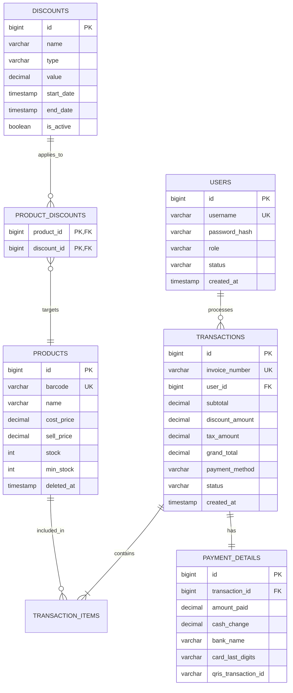

# Product Requirements Document: KasirKilat POS
Version: 1.0, Status: Draft, Tanggal: 24 Oktober 2023

## 1. Overview
- **Problem Statement**: Pemilik minimarket dengan 1 outlet dan 3 karyawan sering mengalami antrean panjang karena proses kasir manual, ketidaksesuaian stok fisik dengan catatan, serta kesulitan memantau laporan penjualan harian secara akurat. Karyawan sering melakukan kesalahan input harga dan perhitungan kembalian uang tunai.
- **Solution**: KasirKilat adalah aplikasi Point of Sale (POS) berbasis web/tablet yang ringan, cepat, dan handal. Aplikasi ini memfasilitasi pemindaian barcode produk secara instan, pengelolaan stok real-time, perhitungan otomatis diskon dan PPN, integrasi pembayaran digital (QRIS/Debit) serta tunai, cetak struk digital/fisik, dan pembuatan laporan harian otomatis guna meminimalkan kesalahan manusia dan mempercepat transaksi.
- **Goals**:
  - Mengurangi waktu transaksi kasir dari rata-rata 3 menit menjadi kurang dari 30 detik per pelanggan.
  - Menurunkan selisih kecocokan stok (stock discrepancy) hingga di bawah 0.5% melalui pencatatan mutasi otomatis.
  - Memastikan waktu pembuatan laporan penjualan harian siap dalam waktu kurang dari 2 detik setelah toko tutup.
  - Menghilangkan kesalahan perhitungan uang kembalian kasir hingga 0% (zero tolerance).
- **Non-Goals**:
  - Manajemen multi-outlet atau multi-cabang (hanya mendukung 1 outlet).
  - Sistem manajemen rantai pasok (Supply Chain Management) dan pemesanan otomatis ke distributor/vendor.
  - Fitur program loyalitas pelanggan (loyalty points/membership tiering).
- **Target Users**: Pemilik minimarket, Kasir/Karyawan minimarket.
- **Personas**:
  - **Nama**: Pak Budi
    - **Peran**: Pemilik Minimarket (Owner)
    - **Kebutuhan**: Melihat laporan penjualan harian yang akurat tanpa perlu datang ke toko, memantau stok kritis, dan mengelola harga/diskon produk.
    - **Pain Points**: Sering mencurigai adanya kebocoran kas (pencurian uang/barang) dan lelah menghitung laporan harian secara manual setiap malam.
    - **Konteks**: Mengakses aplikasi via laptop dari rumah menggunakan koneksi internet seluler.
  - **Nama**: Siti
    - **Peran**: Kasir Utama
    - **Kebutuhan**: Memindai barang dengan cepat, memproses pembayaran berbagai metode dengan instan, dan mencetak struk belanja.
    - **Pain Points**: Pelanggan sering marah karena antrean panjang saat jam pulang kantor dan bingung menghitung diskon manual.
    - **Konteks**: Menggunakan tablet Android 10 inci yang terpasang di meja kasir dengan scanner barcode USB.
- **User Stories**:
  - **US-01**: Sebagai Kasir, saya ingin memindai barcode produk menggunakan barcode scanner agar produk langsung masuk ke keranjang belanja tanpa perlu mencari nama produk secara manual.
  - **US-02**: Sebagai Kasir, saya ingin memilih metode pembayaran (Tunai, QRIS, Debit) agar pelanggan dapat membayar sesuai dengan kenyamanan mereka.
  - **US-03**: Sebagai Kasir, saya ingin sistem menghitung uang kembalian secara otomatis setelah saya memasukkan jumlah uang tunai yang diterima agar menghindari kesalahan hitung.
  - **US-04**: Sebagai Kasir, saya ingin mencetak struk belanja ke printer thermal Bluetooth/USB segera setelah pembayaran sukses agar pelanggan mendapatkan bukti transaksi fisik.
  - **US-05**: Sebagai Owner, saya ingin melihat dasbor laporan penjualan harian yang merinci total omzet, jumlah transaksi, dan metode pembayaran yang digunakan agar saya dapat memantau performa toko secara real-time.
  - **US-06**: Sebagai Owner, saya ingin menambahkan, mengubah, dan menonaktifkan produk beserta stok dan harganya agar katalog produk di kasir selalu mutakhir.
  - **US-07**: Sebagai Owner, saya ingin membuat aturan diskon (misal: potongan nominal atau persentase) yang otomatis aktif pada periode tertentu agar dapat menarik lebih banyak pembeli.
  - **US-08**: Sebagai Kasir, saya ingin melihat peringatan visual jika stok suatu barang berada di bawah batas minimum (misal: sisa 5 pcs) agar saya dapat menginformasikan ke Owner untuk restock.

## 2. Scope
- **In-Scope**:
  - Otentikasi pengguna (Login/Logout) dengan pembagian peran (Owner dan Kasir).
  - Manajemen Katalog Produk (CRUD produk, harga beli, harga jual, barcode, stok minimal).
  - Manajemen Stok (pencatatan stok masuk, penyesuaian stok, dan indikator stok kritis).
  - Modul Transaksi POS (pemindaian barcode, pencarian produk manual, keranjang belanja, kalkulasi diskon otomatis, kalkulasi PPN 11%).
  - Sistem Pembayaran (Input uang tunai + hitung kembalian, integrasi API QRIS dinamis statis-generator, dan pencatatan nomor kartu debit).
  - Pencetakan Struk (integrasi printer thermal POS standar 58mm/80mm) dan Struk Digital (format teks/URL untuk dibagikan via WhatsApp).
  - Laporan Penjualan (laporan harian, mingguan, bulanan, ekspor ke file CSV/Excel).
  - Manajemen Diskon (diskon persentase, diskon nominal langsung, diskon minimal pembelian).
- **Out-of-Scope**:
  - Integrasi langsung dengan mesin EDC Bank (pencatatan nomor kartu debit dilakukan manual oleh kasir).
  - Sinkronisasi otomatis ke e-commerce atau marketplace eksternal.
  - Manajemen absensi karyawan terintegrasi payroll.
- **Assumptions**:
  - Tablet kasir selalu terhubung ke jaringan internet lokal (Wi-Fi) minimarket dengan kecepatan minimal 5 Mbps.
  - Printer thermal terkoneksi melalui protokol Bluetooth atau USB raw printing.
  - Jumlah transaksi per hari tidak melebihi 1.000 transaksi.
- **Dependencies**:
  - API Generator QRIS (menggunakan payment gateway pihak ketiga seperti Midtrans/Xendit untuk penyediaan QR Code dinamis).
  - Library WebUSB / WebBluetooth API pada browser untuk komunikasi langsung dengan printer thermal.

## 3. Functional Requirements

| ID | Fitur | Deskripsi Detail | Prioritas | Acceptance Criteria |
| :--- | :--- | :--- | :--- | :--- |
| FR-01 | Autentikasi Pengguna | Sistem harus membatasi akses aplikasi berdasarkan peran pengguna (Owner dan Kasir) menggunakan login username dan password terenkripsi. Session kasir aktif selama 12 jam. | P0 | - Given halaman login, When memasukkan username dan password yang valid, Then sistem mengarahkan ke dashboard sesuai role.<br>- Given user login sebagai Kasir, When mencoba mengakses menu Laporan Keuangan, Then sistem menampilkan pesan error 403 Forbidden. |
| FR-02 | Pemindaian Barcode | Sistem mendeteksi input dari barcode scanner USB/Bluetooth yang bertindak sebagai keyboard emulator pada halaman transaksi POS dan langsung memasukkan item ke keranjang. | P0 | - Given halaman transaksi aktif, When barcode disorot dan dipindai, Then produk dengan barcode tersebut masuk ke keranjang belanja dengan kuantitas 1.<br>- Given barcode tidak terdaftar, When dipindai, Then sistem memunculkan suara beep peringatan dan toast "Produk tidak ditemukan". |
| FR-03 | Manajemen Keranjang | Kasir dapat menambah kuantitas, mengurangi kuantitas, menghapus item dari keranjang belanja secara langsung di layar monitor. | P0 | - Given produk di keranjang, When tombol '+' ditekan, Then kuantitas bertambah 1 dan subtotal otomatis diperbarui.<br>- Given produk di keranjang dengan kuantitas 1, When tombol '-' ditekan, Then sistem menghapus produk tersebut dari keranjang belanja. |
| FR-04 | Kalkulasi Transaksi | Sistem menghitung subtotal, potongan diskon yang berlaku, PPN 11%, dan total akhir secara real-time saat keranjang berubah. | P0 | - Given keranjang berisi produk A (Rp10.000) dan B (Rp20.000), When transaksi diproses, Then sistem menampilkan Subtotal Rp30.000, PPN Rp3.300, dan Total Rp33.300. |
| FR-05 | Pembayaran Tunai | Kasir memasukkan jumlah uang tunai yang diterima dari pelanggan, dan sistem menghitung kembalian uang secara instan. | P0 | - Given total transaksi Rp33.300, When kasir menginput nominal pembayaran Rp50.000, Then sistem menampilkan nominal kembalian Rp16.700 secara jelas di layar.<br>- Given nominal input kurang dari Rp33.300, When tombol bayar ditekan, Then tombol dinonaktifkan dan muncul pesan error validasi nominal. |
| FR-06 | Pembayaran QRIS | Sistem berintegrasi dengan Payment Gateway untuk menampilkan QRIS dinamis di layar kasir yang valid selama 120 detik. | P1 | - Given metode bayar QRIS dipilih, When kasir menekan tombol "Bayar", Then sistem memanggil API Gateway, menampilkan QR Code di layar, dan melakukan polling status pembayaran setiap 3 detik.<br>- Given status pembayaran sukses dari gateway, Then transaksi otomatis ditutup dan struk dicetak. |
| FR-07 | Cetak Struk Fisik | Sistem mengirimkan instruksi cetak layout struk belanja ke printer thermal POS 58mm/80mm setelah transaksi dinyatakan sukses. | P0 | - Given transaksi berhasil diselesaikan, When sistem masuk ke status "Completed", Then printer thermal otomatis mencetak struk yang berisi nama toko, daftar item, harga, total, metode bayar, dan footer pesan terima kasih. |
| FR-08 | Manajemen Produk | Owner dapat menambah, mengedit, melihat detail, dan menghapus (soft delete) produk di dalam sistem database. | P0 | - Given form tambah produk, When data nama, barcode unik, harga beli, harga jual, dan stok awal diisi lengkap lalu disubmit, Then data tersimpan dan muncul di tabel produk.<br>- Given produk dihapus oleh Owner, When dicari di POS, Then produk tidak muncul namun data historis transaksi lama yang menggunakan produk tersebut tetap aman. |
| FR-09 | Manajemen Diskon | Owner dapat membuat aturan diskon (misal: Diskon Toko 10% untuk produk tertentu dengan masa berlaku tertentu). | P1 | - Given form diskon baru, When Owner mengeset diskon 10% untuk Produk X pada rentang tanggal hari ini, Then saat kasir memasukkan Produk X ke keranjang POS, harga otomatis terpotong 10%. |
| FR-10 | Laporan Penjualan | Sistem menyediakan ringkasan penjualan harian yang dapat difilter berdasarkan tanggal dan diekspor ke format CSV. | P0 | - Given menu Laporan, When Owner memilih rentang tanggal 1-7 Oktober dan menekan "Ekspor CSV", Then sistem mengunduh file CSV berisi kolom Tanggal, ID Transaksi, Kasir, Total Penjualan, Metode Pembayaran. |
| FR-11 | Peringatan Stok Kritis | Sistem menampilkan indikator warna merah pada daftar produk jika stok saat ini sama dengan atau di bawah stok minimum. | P1 | - Given stok Produk Y adalah 3 dan stok minimum diset 5, When kasir melihat daftar produk atau saat memindai, Then sistem menampilkan label "Stok Kritis: sisa 3" berwarna merah tebal. |
| FR-12 | Pembayaran Debit | Kasir dapat memilih metode pembayaran debit dan memasukkan 4 digit terakhir nomor kartu debit serta nama bank penerbit untuk arsip pelaporan. | P1 | - Given metode Debit dipilih, When kasir menginput "BCA" dan "4321" lalu menekan selesaikan, Then transaksi tersimpan dengan detail pembayaran debit bank BCA kartu *4321. |

## 4. Non-Functional Requirements
- **Performance**:
  - Response time API (p95) untuk pencarian produk dan pemindaian barcode harus kurang dari 200 milidetik pada kondisi beban normal.
  - Halaman POS utama harus dapat dimuat (Page Load Time) dalam waktu kurang dari 1.5 detik pada koneksi internet standar (5 Mbps).
  - Sistem harus mampu melayani hingga 10 concurrent requests per outlet tanpa penurunan performa.
- **Security**:
  - Otentikasi menggunakan JSON Web Token (JWT) yang disimpan secara aman di `HttpOnly` cookie dengan masa kedaluwarsa (session lifetime) 12 jam.
  - Enkripsi kata sandi menggunakan algoritma `bcrypt` dengan work factor 10 sebelum disimpan ke database.
  - Semua komunikasi data wajib menggunakan protokol HTTPS (TLS 1.3) dalam proses transit data.
  - Penerapan rate-limiting pada semua endpoint API dengan batas maksimal 60 request per menit per alamat IP untuk mencegah serangan Brute Force.
  - Semua input form wajib disanitasi dari potensi serangan Cross-Site Scripting (XSS) dan SQL Injection menggunakan ORM terpercaya.
- **Scalability**:
  - Database harus dikonfigurasi untuk menangani penyimpanan hingga 50.000 SKU produk dan 1.000.000 data baris transaksi tanpa penurunan performa query.
- **Reliability/Availability**:
  - Uptime SLA aplikasi minimum sebesar 99.9% per bulan.
  - Backup database otomatis wajib berjalan setiap hari pada pukul 01:00 WIB dan disimpan di cloud storage terpisah (misal: AWS S3) dengan retensi penyimpanan selama 30 hari.
  - Jika koneksi internet terputus sewaktu transaksi berjalan, aplikasi POS harus dapat menyimpan data transaksi sementara di local storage browser (IndexedDB) dan menyinkronkannya kembali secara otomatis dalam waktu 5 detik setelah koneksi pulih.
- **Usability**:
  - Antarmuka pengguna (UI) dioptimalkan untuk layar sentuh tablet ukuran 10 inci dengan ukuran tombol minimal 48px x 48px agar mudah ditekan jari kasir.
  - Menyediakan tema kontras tinggi dan opsi ukuran font yang mudah dibaca oleh kasir dalam kondisi pencahayaan minimarket.
- **Accessibility**:
  - Memenuhi standar aksesibilitas WCAG 2.1 Level AA.
  - Navigasi penuh menggunakan keyboard (shortcut keys) wajib disediakan untuk mempercepat proses transaksi tanpa mouse (contoh: `F2` untuk fokus scan, `F8` untuk bayar, `F9` untuk cetak struk).
- **Compliance**:
  - Kepatuhan penuh terhadap regulasi UU Perlindungan Data Pribadi (UU PDP) Indonesia dalam penyimpanan data karyawan dan pelanggan.
  - Penyimpanan log audit transaksi keuangan wajib dipertahankan selama minimum 5 tahun sesuai dengan ketentuan perpajakan di Indonesia.

## 5. Business Rules (BR)
- **BR-01**: Setiap transaksi penjualan wajib dikenakan Pajak Pertambahan Nilai (PPN) sebesar 11% dari nilai subtotal setelah dikurangi diskon produk, kecuali untuk produk berkategori non-pajak yang ditentukan oleh Owner.
- **BR-02**: Diskon produk tidak dapat ditumpuk (*stacking*) dalam satu item produk yang sama. Jika ada dua diskon yang aktif (misal: diskon persentase bawaan produk dan diskon promo hari besar), sistem secara otomatis menerapkan diskon dengan nilai potongan terbesar bagi pelanggan.
- **BR-03**: Pembatalan transaksi (*void*) yang sudah dicetak struknya hanya dapat disetujui dan dieksekusi oleh pengguna dengan peran "Owner". Kasir wajib meminta otorisasi PIN Owner untuk melakukan tindakan *void*.
- **BR-04**: Batas maksimum transaksi tunai dalam satu struk adalah Rp10.000.000 (Sepuluh Juta Rupiah) untuk alasan keamanan operasional kasir di outlet.
- **BR-05**: Stok produk di database tidak boleh bernilai negatif. Jika stok sistem mencapai angka 0, transaksi untuk produk tersebut diblokir oleh sistem kecuali Owner mengaktifkan fitur "Izinkan Stok Negatif" untuk produk tertentu.
- **BR-06**: Transaksi dengan metode pembayaran QRIS yang tidak diselesaikan (tidak dibayar) dalam waktu 120 detik sejak QR Code digenerate akan otomatis diubah statusnya menjadi "Expired" oleh sistem dan stok barang yang sempat dikunci dikembalikan ke database.
- **BR-07**: Perubahan harga jual produk yang dilakukan oleh Owner hanya akan berpengaruh pada transaksi baru yang dibuat setelah waktu perubahan disimpan, dan tidak boleh mengubah nilai harga produk pada transaksi historis yang sudah selesai.

## 6. Edge Cases

| Skenario | Perilaku Diharapkan |
| :--- | :--- |
| **Pencarian Produk Kosong** | Ketika kasir mencari produk dengan kata kunci yang tidak menghasilkan data apapun, layar POS menampilkan visual ilustrasi kotak kosong dengan teks instruktif "Produk tidak ditemukan. Coba scan barcode atau cari kata kunci lain." dan tombol "Tambah Produk Baru" dinonaktifkan untuk kasir. |
| **Barcode Ganda Terdeteksi** | Jika kasir memindai barcode yang sama dua kali dalam waktu kurang dari 0.5 detik (karena scanner sensitif), sistem mendeteksi sebagai *debounce protection* dan hanya menambahkan kuantitas produk tersebut sebanyak 1 unit, bukan membuat baris item baru atau menambah 2 unit. |
| **Edit Stok Bersamaan (Concurrent Edit)** | Ketika Kasir A sedang melakukan transaksi pengurangan stok Produk X di POS, dan pada saat bersamaan Owner sedang mengedit stok Produk X di panel admin. Sistem menggunakan mekanisme *Optimistic Locking* berbasis kolom `version` di database, menolak transaksi terakhir yang masuk dengan pesan error "Data produk telah diperbarui oleh pengguna lain. Layar akan memuat ulang data terbaru." |
| **Koneksi Internet Putus Saat Generate QRIS** | Ketika kasir memilih pembayaran QRIS namun koneksi internet tiba-tiba mati sebelum API payment gateway merespon. Sistem mendeteksi kegagalan koneksi dalam 5 detik, membatalkan loading, menampilkan modal error "Koneksi Bermasalah. Gagal memuat QRIS. Silakan alihkan ke metode pembayaran Tunai atau coba lagi." |
| **Nilai Transaksi Ekstrim (Rp0 / Negatif)** | Jika total belanja setelah diskon bernilai Rp0 atau negatif karena kesalahan konfigurasi diskon nominal oleh Owner. Sistem secara otomatis menolak transaksi tersebut saat kasir menekan tombol bayar, menampilkan pesan error "Total transaksi tidak valid (Rp0 atau kurang). Silakan periksa kembali item belanja dan diskon." |
| **Perbedaan Waktu Server & Lokal (Timezone Crossover)** | Saat kasir melakukan transaksi tepat pada pukul 23:59:59 WIB dan selesai pada pukul 00:00:01 WIB hari berikutnya. Transaksi dicatat menggunakan waktu UTC pada server database untuk konsistensi, namun pada laporan harian disesuaikan dengan zona waktu lokal outlet (WIB - UTC+7) berdasarkan konfigurasi outlet. |
| **Hak Akses Berubah Saat Sesi Aktif** | Ketika Owner mengubah peran Karyawan A dari "Owner" menjadi "Kasir" di panel admin, sementara Karyawan A sedang aktif membuka halaman laporan POS. Pada request API berikutnya yang dikirim oleh Karyawan A, token JWT divalidasi ulang, server mengembalikan error 403, dan aplikasi otomatis me-redirect Karyawan A kembali ke halaman login. |
| **Printer Thermal Mengalami Kertas Habis (Paper Out)** | Saat struk sedang dicetak setelah transaksi sukses, printer mengirimkan sinyal status *paper out* ke aplikasi POS via WebUSB. Aplikasi POS menampilkan modal peringatan di layar kasir: "Printer kehabisan kertas. Transaksi berhasil disimpan. Silakan ganti kertas thermal dan tekan tombol 'Cetak Ulang Struk' di bawah ini." |
| **Migrasi Data dengan Stok Awal Kosong** | Saat produk baru ditambahkan melalui import massal CSV tanpa kolom stok minimal diisi. Sistem secara otomatis menerapkan nilai default stok minimal = 0 dan status stok dinilai "Aman" selama stok fisik > 0. |

## 7. User Flow & Screen List

### Primary Flow (Happy Path: Scan -> Bayar QRIS -> Cetak Struk)
1. Kasir masuk ke aplikasi POS menggunakan akun Kasir.
2. Layar transaksi POS utama terbuka dengan kursor otomatis fokus pada input pemindaian barcode.
3. Kasir memindai barcode produk pertama. Produk langsung masuk ke keranjang belanja.
4. Kasir memindai produk kedua. Kuantitas diperbarui otomatis.
5. Kasir menekan tombol shortcut `F8` atau mengklik tombol "Bayar".
6. Muncul modal pilihan pembayaran. Kasir memilih "QRIS".
7. Sistem memanggil API Payment Gateway dan menampilkan QR Code dinamis di layar beserta timer hitung mundur 120 detik.
8. Pelanggan memindai QR Code menggunakan aplikasi e-wallet mereka dan menyelesaikan pembayaran.
9. Sistem menerima webhook / hasil polling sukses dari gateway pembayaran.
10. Layar menampilkan animasi "Pembayaran Sukses", laci kas otomatis terbuka (jika terhubung), dan printer thermal mencetak struk secara otomatis.
11. Layar kasir kembali bersih dan siap untuk transaksi berikutnya.

### Alternative Flow (Pembayaran Tunai dengan Kembalian)
1. Langkah 1 s.d 5 sama dengan Primary Flow.
2. Kasir memilih metode pembayaran "Tunai".
3. Kasir menginput nominal uang tunai yang diserahkan pelanggan (misal: Rp100.000 untuk total belanja Rp85.500).
4. Sistem menampilkan nominal kembalian secara instan (Rp14.500).
5. Kasir menekan tombol "Selesaikan Transaksi".
6. Sistem menyimpan data ke database, mengurangkan stok produk, memicu printer mencetak struk, dan menampilkan layar kembalian dengan tombol "Transaksi Baru".

```
[Login Screen] --> [POS Transaction Screen] ----(Scan Barcode)----> [Cart Updated]
                          |
                  (Press F8 / Pay)
                          |
             [Payment Selection Modal]
             /           |           \
     (Cash)           (QRIS)          (Debit)
       |                 |               |
[Input Cash]     [Show QR Code]     [Input Card Info]
       |                 |               |
[Calc Change]     [Wait Payment]    [Verify Transaction]
       \                 |               /
        \---> [Transaction Completed] <--/
                         |
                [Auto-Print Receipt]
                         |
               [Reset POS Screen]
```

### Screen List Table

| Nama Layar | Destination Screen | Elemen Utama | Navigasi |
| :--- | :--- | :--- | :--- |
| **Layar Login** | Halaman POS Utama (Kasir) / Dashboard Admin (Owner) | Form Input Username, Input Password, Tombol Login, Pesan Error Validasi. | Redirect otomatis setelah otentikasi berhasil. |
| **Halaman POS Utama** | Layar Pembayaran, Detail Katalog Produk | Input Barcode (Hidden/Fokus), Panel Keranjang Belanja (Tabel Item, Qty, Harga, Diskon, Subtotal), Tombol Cari Produk Manual, Tombol Bayar (`F8`), Tombol Batal Transaksi. | Sidebar navigasi ke Laporan (untuk Owner) atau klik tombol Bayar untuk membuka Modal Pembayaran. |
| **Modal Pembayaran** | Halaman POS Utama (setelah selesai) | Pilihan Pembayaran (Tunai, QRIS, Debit), Input Nominal Uang (Tunai), Tampilan QR Code + Timer (QRIS), Input Nama Bank + 4 Digit Kartu (Debit), Tombol Selesaikan, Tombol Batal. | Tombol Batal menutup modal dan kembali ke Keranjang. Tombol Selesaikan mengarah ke proses cetak struk dan reset halaman POS. |
| **Dashboard Admin (Owner)** | Manajemen Produk, Manajemen Diskon, Laporan | Grafik Penjualan Harian, Indikator Total Omzet, Total Transaksi, Daftar Produk Stok Kritis (< 5 pcs), Log Aktivitas Kasir Terbaru. | Sidebar menu navigasi utama. |
| **Halaman Manajemen Produk** | Form Tambah/Edit Produk | Tabel Produk (Barcode, Nama, Kategori, Harga Beli, Harga Jual, Stok, Stok Min, Aksi Edit/Hapus), Tombol Tambah Produk, Tombol Import CSV. | Klik "Tambah" atau "Edit" membuka halaman form produk. |
| **Halaman Laporan Penjualan** | Ekspor CSV / Print Laporan | Date Range Picker, Ringkasan Penjualan (Total, Tunai, QRIS, Debit), Tabel Riwayat Transaksi (ID, Waktu, Kasir, Total, Status, Detail), Tombol Ekspor CSV. | Klik baris transaksi untuk melihat detail item transaksi di modal popup. |

## 8. API Requirements
- Base URL: `/api/v1`
- Format Request/Response: JSON (Content-Type: `application/json`)
- Model Autentikasi: Bearer Token JWT pada Header `Authorization: Bearer <token>`. Endpoint bertanda `[Public]` tidak memerlukan token.

### API Endpoints Table

| Method | Endpoint | Auth | Description | Request Body (JSON) | Response (JSON - 200/201) |
| :--- | :--- | :--- | :--- | :--- | :--- |
| **POST** | `/api/v1/auth/login` | `[Public]` | Melakukan login pengguna dan mengembalikan token JWT. | `{"username": "siti", "password": "securepassword"}` | `{"status": "success", "token": "eyJhbGci...", "user": {"id": 2, "username": "siti", "role": "kasir"}}` |
| **GET** | `/api/v1/products` | `Bearer` | Mengambil daftar katalog produk dengan paginasi dan pencarian. | Query params: `page`, `limit`, `search` | `{"status": "success", "data": [{"id": 12, "barcode": "8999901020304", "name": "Susu UHT 250ml", "price": 6500, "stock": 45, "min_stock": 5}], "pagination": {"total": 1, "page": 1, "pages": 1}}` |
| **GET** | `/api/v1/products/scan/:barcode` | `Bearer` | Mengambil detail produk secara instan berdasarkan barcode yang dipindai. | *None* | `{"status": "success", "data": {"id": 12, "barcode": "8999901020304", "name": "Susu UHT 250ml", "price": 6500, "stock": 45}}` |
| **POST** | `/api/v1/transactions` | `Bearer` | Membuat transaksi baru, memperbarui stok, dan mengembalikan data transaksi lengkap. | `{"items": [{"product_id": 12, "quantity": 2}], "payment_method": "cash", "cash_received": 15000}` | `{"status": "success", "data": {"transaction_id": "TX-20231024-0001", "total_amount": 13000, "tax_amount": 1430, "grand_total": 14430, "cash_change": 570, "status": "completed"}}` |
| **POST** | `/api/v1/transactions/qris` | `Bearer` | Membuat transaksi dengan metode QRIS dan menghasilkan payload QR Code. | `{"items": [{"product_id": 12, "quantity": 1}]}` | `{"status": "success", "transaction_id": "TX-20231024-0002", "qr_payload": "00020101021226380010...", "expires_at": "2023-10-24T15:32:00Z"}` |
| **GET** | `/api/v1/transactions/qris/:id/status` | `Bearer` | Polling status pembayaran transaksi QRIS. | *None* | `{"status": "success", "transaction_id": "TX-20231024-0002", "payment_status": "completed"}` |
| **GET** | `/api/v1/reports/daily` | `Bearer (Owner)` | Mengambil ringkasan laporan harian untuk dashboard Owner. | Query params: `date` (YYYY-MM-DD) | `{"status": "success", "date": "2023-10-24", "summary": {"total_sales": 1250000, "total_transactions": 45, "cash_sales": 750000, "qris_sales": 500000}}` |

### Standard Errors
- **400 Bad Request**: Input tidak valid atau parameter tidak lengkap.
  `{"status": "error", "code": 400, "message": "Barcode tidak boleh kosong."}`
- **401 Unauthorized**: Token JWT tidak disertakan atau sudah kedaluwarsa.
  `{"status": "error", "code": 401, "message": "Sesi Anda telah berakhir. Silakan login kembali."}`
- **403 Forbidden**: Pengguna tidak memiliki hak akses untuk modul tersebut (misal Kasir membuka laporan).
  `{"status": "error", "code": 403, "message": "Akses ditolak. Hanya Owner yang dapat mengakses halaman ini."}`
- **404 Not Found**: Data yang dicari (produk/transaksi) tidak terdaftar di sistem.
  `{"status": "error", "code": 404, "message": "Produk dengan barcode tersebut tidak ditemukan."}`
- **409 Conflict**: Konflik data seperti duplikasi barcode saat input produk baru atau kegagalan concurrency lock.
  `{"status": "error", "code": 409, "message": "Barcode produk sudah terdaftar di sistem."}`
- **422 Unprocessable Entity**: Validasi logika bisnis gagal (misal transaksi dikirim dengan stok kurang).
  `{"status": "error", "code": 422, "message": "Stok produk Susu UHT tidak mencukupi (Tersedia: 2, Diminta: 5)."}`
- **500 Internal Server Error**: Kegagalan sistem internal database atau server crash.
  `{"status": "error", "code": 500, "message": "Terjadi kesalahan pada server. Silakan coba beberapa saat lagi."}`

## 9. Database Schema
Desain database menggunakan PostgreSQL dalam bentuk ternormalisasi (3NF).

### Tables Specification

#### 1. Table: `users`
| Kolom | Tipe | Constraint | Keterangan |
| :--- | :--- | :--- | :--- |
| `id` | `BIGSERIAL` | PRIMARY KEY | ID unik user. |
| `username` | `VARCHAR(50)` | UNIQUE, NOT NULL | Username login. |
| `password_hash` | `VARCHAR(255)` | NOT NULL | Hash password (bcrypt). |
| `role` | `VARCHAR(20)` | CHECK (role IN ('owner', 'kasir')), NOT NULL | Peran pengguna. |
| `status` | `VARCHAR(20)` | DEFAULT 'active', NOT NULL | Status akun ('active', 'inactive'). |
| `created_at` | `TIMESTAMP` | DEFAULT CURRENT_TIMESTAMP | Waktu data dibuat. |
| `updated_at` | `TIMESTAMP` | DEFAULT CURRENT_TIMESTAMP | Waktu data diubah. |

#### 2. Table: `products`
| Kolom | Tipe | Constraint | Keterangan |
| :--- | :--- | :--- | :--- |
| `id` | `BIGSERIAL` | PRIMARY KEY | ID unik produk. |
| `barcode` | `VARCHAR(50)` | UNIQUE, NOT NULL | Kode barcode produk (EAN-13/UPC). |
| `name` | `VARCHAR(150)` | NOT NULL | Nama barang/produk. |
| `cost_price` | `DECIMAL(12,2)` | NOT NULL, CHECK (cost_price >= 0) | Harga beli modal dari supplier. |
| `sell_price` | `DECIMAL(12,2)` | NOT NULL, CHECK (sell_price >= 0) | Harga jual ke konsumen. |
| `stock` | `INT` | NOT NULL, DEFAULT 0 | Jumlah stok fisik saat ini. |
| `min_stock` | `INT` | NOT NULL, DEFAULT 5 | Batas minimum peringatan stok kritis. |
| `created_at` | `TIMESTAMP` | DEFAULT CURRENT_TIMESTAMP | Waktu data dibuat. |
| `updated_at` | `TIMESTAMP` | DEFAULT CURRENT_TIMESTAMP | Waktu data diubah. |
| `deleted_at` | `TIMESTAMP` | NULL | Untuk soft delete produk. |

#### 3. Table: `discounts`
| Kolom | Tipe | Constraint | Keterangan |
| :--- | :--- | :--- | :--- |
| `id` | `BIGSERIAL` | PRIMARY KEY | ID unik diskon. |
| `name` | `VARCHAR(100)` | NOT NULL | Nama promo/diskon. |
| `type` | `VARCHAR(20)` | CHECK (type IN ('percentage', 'fixed')), NOT NULL | Jenis diskon. |
| `value` | `DECIMAL(12,2)` | NOT NULL, CHECK (value > 0) | Nilai diskon (persen atau nominal). |
| `start_date` | `TIMESTAMP` | NOT NULL | Awal masa berlaku diskon. |
| `end_date` | `TIMESTAMP` | NOT NULL | Akhir masa berlaku diskon. |
| `is_active` | `BOOLEAN` | DEFAULT TRUE, NOT NULL | Status keaktifan diskon secara manual. |
| `created_at` | `TIMESTAMP` | DEFAULT CURRENT_TIMESTAMP | Waktu data dibuat. |
| `updated_at` | `TIMESTAMP` | DEFAULT CURRENT_TIMESTAMP | Waktu data diubah. |

#### 4. Table: `product_discounts`
| Kolom | Tipe | Constraint | Keterangan |
| :--- | :--- | :--- | :--- |
| `product_id` | `BIGINT` | FK -> `products(id)` ON DELETE CASCADE | Relasi ke produk. |
| `discount_id` | `BIGINT` | FK -> `discounts(id)` ON DELETE CASCADE | Relasi ke diskon. |
| PRIMARY KEY | `(product_id, discount_id)` | - | Composite Primary Key. |

#### 5. Table: `transactions`
| Kolom | Tipe | Constraint | Keterangan |
| :--- | :--- | :--- | :--- |
| `id` | `BIGSERIAL` | PRIMARY KEY | ID unik transaksi. |
| `invoice_number` | `VARCHAR(30)` | UNIQUE, NOT NULL | Nomor invoice (format: TX-YYYYMMDD-XXXX). |
| `user_id` | `BIGINT` | FK -> `users(id)` ON DELETE RESTRICT | Kasir yang memproses. |
| `subtotal` | `DECIMAL(12,2)` | NOT NULL | Total sebelum diskon dan pajak. |
| `discount_amount`| `DECIMAL(12,2)` | NOT NULL, DEFAULT 0 | Total potongan diskon. |
| `tax_amount` | `DECIMAL(12,2)` | NOT NULL, DEFAULT 0 | Total PPN 11%. |
| `grand_total` | `DECIMAL(12,2)` | NOT NULL | Total akhir yang dibayar konsumen. |
| `payment_method` | `VARCHAR(20)` | CHECK (payment_method IN ('cash', 'qris', 'debit')), NOT NULL | Metode pembayaran. |
| `status` | `VARCHAR(20)` | CHECK (status IN ('pending', 'completed', 'voided', 'expired')), NOT NULL | Status transaksi. |
| `created_at` | `TIMESTAMP` | DEFAULT CURRENT_TIMESTAMP | Waktu transaksi dibuat. |
| `updated_at` | `TIMESTAMP` | DEFAULT CURRENT_TIMESTAMP | Waktu update status transaksi. |

#### 6. Table: `transaction_items`
| Kolom | Tipe | Constraint | Keterangan |
| :--- | :--- | :--- | :--- |
| `id` | `BIGSERIAL` | PRIMARY KEY | ID item transaksi. |
| `transaction_id` | `BIGINT` | FK -> `transactions(id)` ON DELETE CASCADE | Relasi ke transaksi utama. |
| `product_id` | `BIGINT` | FK -> `products(id)` ON DELETE RESTRICT | Relasi ke produk. |
| `quantity` | `INT` | NOT NULL, CHECK (quantity > 0) | Jumlah item dibeli. |
| `price_at_sale` | `DECIMAL(12,2)` | NOT NULL | Harga jual produk saat transaksi terjadi. |
| `discount_applied`|`DECIMAL(12,2)` | NOT NULL, DEFAULT 0 | Nominal diskon per unit item. |
| `total_price` | `DECIMAL(12,2)` | NOT NULL | (price_at_sale - discount_applied) * quantity. |

#### 7. Table: `payment_details`
| Kolom | Tipe | Constraint | Keterangan |
| :--- | :--- | :--- | :--- |
| `id` | `BIGSERIAL` | PRIMARY KEY | ID detail pembayaran. |
| `transaction_id` | `BIGINT` | FK -> `transactions(id)` ON DELETE CASCADE | Relasi ke transaksi. |
| `amount_paid` | `DECIMAL(12,2)` | NOT NULL | Jumlah uang yang diserahkan/dibayar. |
| `cash_change` | `DECIMAL(12,2)` | DEFAULT 0, CHECK (cash_change >= 0) | Kembalian uang tunai. |
| `bank_name` | `VARCHAR(50)` | NULL | Nama bank untuk debit (misal: BCA, Mandiri). |
| `card_last_digits`| `VARCHAR(4)` | NULL | 4 digit terakhir nomor kartu debit. |
| `qris_transaction_id`| `VARCHAR(100)`| NULL | ID referensi transaksi dari payment gateway. |
| `created_at` | `TIMESTAMP` | DEFAULT CURRENT_TIMESTAMP | Waktu pembayaran tercatat. |

### Indexes List
- `idx_products_barcode` (B-Tree) pada `products(barcode)` - Mempercepat pencarian scan barcode.
- `idx_transactions_created_at` (B-Tree) pada `transactions(created_at)` - Mempercepat query laporan harian.
- `idx_transactions_invoice` (Hash) pada `transactions(invoice_number)` - Pencarian detail struk.

### Database ERD (Mermaid)



## 10. Roles & Permissions

| Role | Modul | Hak Akses (CRUD) | Keterangan |
| :--- | :--- | :--- | :--- |
| **Kasir** | POS Transaksi | Create, Read | Dapat melakukan transaksi, memindai produk, memilih metode pembayaran, mencetak struk belanja. Tidak bisa menghapus transaksi yang sudah selesai. |
| **Kasir** | Katalog Produk | Read | Hanya dapat melihat daftar produk dan stok untuk keperluan cek harga/stok saat melayani pelanggan. |
| **Kasir** | Laporan | None | Tidak dapat melihat laporan keuangan harian, mingguan, bulanan, atau grafik omzet toko. |
| **Kasir** | Manajemen Diskon| Read | Hanya dapat melihat diskon yang sedang aktif di sistem transaksi POS. |
| **Owner** | POS Transaksi | Create, Read, Update | Memiliki semua hak akses kasir ditambah kemampuan melakukan *void* transaksi yang sudah selesai. |
| **Owner** | Katalog Produk | Create, Read, Update, Delete | Hak akses penuh mengelola data produk, mengimpor data produk, dan menyesuaikan stok fisik (stock opname). |
| **Owner** | Laporan | Read, Export | Hak akses penuh melihat dasbor, laporan detail penjualan, mengunduh laporan dalam format CSV/Excel. |
| **Owner** | Manajemen Diskon| Create, Read, Update, Delete | Hak akses penuh membuat program diskon baru, mengubah masa berlaku, dan menghapus diskon. |
| **Owner** | Manajemen User | Create, Read, Update, Delete | Mengelola akun login karyawan (3 karyawan kasir), mereset kata sandi, dan menonaktifkan akun kasir. |

## 11. Validation Rules

| Field | Aturan Validasi | Pesan Error (Indonesian) |
| :--- | :--- | :--- |
| `username` | Wajib diisi, minimal 4 karakter, maksimal 20 karakter, hanya alfanumerik. | "Username harus diisi dengan 4 hingga 20 karakter alfanumerik." |
| `barcode` | Wajib diisi, hanya angka, panjang 8 hingga 15 digit, unik di database. | "Barcode harus berupa angka sepanjang 8 hingga 15 digit dan belum terdaftar." |
| `sell_price` | Wajib diisi, angka desimal, minimal harus lebih besar dari `cost_price`. | "Harga jual tidak boleh lebih rendah dari harga beli modal." |
| `stock` | Wajib diisi, tipe data integer, nilai minimal 0. | "Jumlah stok produk tidak boleh bernilai negatif." |
| `discount_value` | Wajib diisi, jika tipe 'percentage' nilai 1 - 100, jika tipe 'fixed' nilai > 0 dan < harga jual produk. | "Nilai diskon tidak valid (persentase maksimal 100%, nominal tidak boleh melebihi harga jual)." |
| `cash_received` | Wajib diisi jika `payment_method` = 'cash', nilai harus >= `grand_total` transaksi. | "Uang tunai yang diterima kurang dari total tagihan transaksi." |
| `card_last_digits`| Wajib diisi jika `payment_method` = 'debit', harus berupa string angka tepat 4 digit. | "4 digit terakhir nomor kartu debit harus berupa angka." |
| `start_date` & `end_date` | Wajib diisi untuk diskon, `end_date` harus lebih besar dari `start_date` saat ini. | "Tanggal berakhir diskon harus lebih lambat daripada tanggal mulai." |

## 12. Error Handling
- **Strategi Penanganan Error**:
  - **Toast Notification**: Digunakan untuk error ringan/interaksi cepat seperti barang tidak ditemukan saat scan atau koneksi printer terputus sementara. Toast melayang di pojok kanan atas selama 3 detik.
  - **Inline Validation Error**: Ditampilkan langsung di bawah input field yang bermasalah pada form (misal form tambah produk) berwarna merah.
  - **Error Page/Banner**: Untuk error fatal seperti database down atau 403 Forbidden, sistem menampilkan halaman error khusus dengan tombol "Kembali ke Dashboard" atau "Muat Ulang Halaman".
  - **Retry Policy**: Untuk request API yang gagal karena masalah jaringan (misal cek status QRIS), sistem secara otomatis mencoba kembali (retry) sebanyak 3 kali dengan interval 3 detik sebelum menyatakan transaksi gagal.
  - **Idempotency Key**: Untuk transaksi pembayaran digital (QRIS), request API ke payment gateway wajib menyertakan header `Idempotency-Key` (menggunakan UUID transaksi) untuk mencegah penarikan saldo ganda jika terjadi kegagalan jaringan saat request pertama dikirim.

### Error Scenarios Table

| Skenario Error | Error Code | Pesan ke Pengguna | Tindakan Sistem |
| :--- | :--- | :--- | :--- |
| **Koneksi Database Terputus** | `ERR_DB_CONN` | "Sistem sedang mengalami gangguan koneksi database. Data Anda aman. Silakan coba sesaat lagi." | Mengirimkan log error ke server monitoring, mematikan tombol submit transaksi untuk mencegah data korup. |
| **Token Kedaluwarsa** | `ERR_JWT_EXPIRED` | "Sesi masuk Anda telah berakhir demi keamanan. Silakan login kembali." | Menghapus token JWT lokal dari cookie browser, mengarahkan paksa (redirect) pengguna ke Halaman Login. |
| **Stok Habis Saat Checkout** | `ERR_OUT_OF_STOCK` | "Gagal memproses transaksi. Produk [Nama Produk] baru saja habis terjual." | Membatalkan transaksi, mengambil data stok terbaru dari database, dan memperbarui tampilan keranjang belanja kasir. |
| **Gagal Cetak Struk (Printer Offline)** | `ERR_PRINTER_OFFLINE`| "Printer thermal tidak terdeteksi. Pastikan kabel printer terhubung atau Bluetooth aktif." | Menampilkan dialog pilihan: "Coba Lagi" atau "Simpan Transaksi Tanpa Cetak" (struk tetap bisa dicetak nanti melalui riwayat). |
| **QRIS Expired dari Gateway** | `ERR_QRIS_TIMEOUT` | "Waktu pembayaran QRIS telah habis. Silakan buat QRIS baru atau ganti metode pembayaran." | Mengubah status transaksi menjadi `expired`, menutup modal QRIS, dan mengembalikan kuantitas barang ke keranjang aktif. |
| **Input Barcode Duplikat di Katalog**| `ERR_DUP_BARCODE` | "Gagal menyimpan. Produk dengan Barcode [Nomor] sudah terdaftar dengan nama [Nama Produk]." | Menyorot input field barcode pada form, membatalkan proses submit, dan mempertahankan input data lainnya. |

## 13. Analytics & Monitoring

### Events Tracking Table

| Nama Event | Deskripsi | Kategori | Properti yang Dikirim |
| :--- | :--- | :--- | :--- |
| `user_login` | Tercatat setiap kali kasir atau owner berhasil masuk ke sistem. | Authentication | `user_id`, `role`, `device_type`, `timestamp` |
| `scan_item_success` | Tercatat saat kasir berhasil memasukkan produk ke keranjang via scan barcode. | POS Transaction | `product_id`, `barcode`, `invoice_number`, `timestamp` |
| `checkout_completed` | Tercatat saat transaksi berhasil diselesaikan dan status pembayaran sukses. | POS Transaction | `transaction_id`, `payment_method`, `grand_total`, `total_items`, `user_id` |
| `void_transaction` | Tercatat ketika Owner melakukan pembatalan (void) transaksi yang sudah selesai. | Security / Audit | `transaction_id`, `owner_id`, `reason`, `grand_total`, `timestamp` |
| `low_stock_warning` | Dipicu ketika transaksi membuat stok suatu produk turun di bawah batas `min_stock`. | Inventory | `product_id`, `current_stock`, `min_stock`, `timestamp` |
| `report_exported` | Tercatat ketika Owner mengunduh file laporan format CSV. | Report | `owner_id`, `date_range`, `format`, `timestamp` |

### Monitoring Setup
- **Health Checks**: Endpoint `/health` disediakan untuk mengecek status kesehatan server node, konektivitas database PostgreSQL, dan koneksi ke API Payment Gateway pihak ketiga. Response harus mengembalikan status `200 OK` dengan format data:
  ```json
  {"status": "UP", "database": "connected", "payment_gateway": "connected"}
  ```
- **Error Tracking**: Integrasi dengan library Sentry untuk menangkap error runtime baik di frontend (Javascript crash) maupun backend (uncaught exception) secara real-time.
- **Business Metrics Dashboard**: Grafana dikonfigurasi untuk memonitor total transaksi per jam, tingkat kegagalan pembayaran QRIS, rata-rata durasi transaksi kasir (dari scan item pertama hingga struk dicetak), dan jumlah peringatan stok kritis harian.

## 14. Tech Stack

| Layer | Pilihan Teknologi | Alasan Pemilihan |
| :--- | :--- | :--- |
| **Frontend Framework** | React.js (Vite) | Memiliki performa rendering yang sangat cepat untuk SPA (Single Page Application) yang dinamis, ekosistem library barcode scanner yang luas, dan ukuran bundle kecil sehingga cepat dimuat di tablet. |
| **State Management** | Zustand | Library manajemen state yang sangat ringan, minim boilerplate, dan sangat handal untuk mengelola data keranjang belanja POS yang berubah secara instan tanpa menurunkan performa UI. |
| **Backend Framework** | Node.js dengan Express.js | I/O non-blocking yang sangat efisien untuk menangani polling status QRIS dan request transaksi kasir secara konkuren. Mudah dideploy di server berspesifikasi rendah. |
| **Database** | PostgreSQL (v15) | Database relasional dengan konsistensi data tinggi (ACID compliant) yang sangat penting untuk pencatatan transaksi keuangan dan manajemen stok tanpa risiko data korup/hilang. |
| **ORM** | Prisma | Mempermudah migrasi database schema, menyediakan auto-generated typesafe database client, dan mencegah celah keamanan SQL injection secara bawaan. |
| **Styling & UI Components** | Tailwind CSS + Shadcn UI | Mempercepat pembuatan antarmuka POS yang responsif, minimalis, dan mudah dikustomisasi agar ramah layar sentuh tablet ukuran 10 inci. |
| **QRIS & Payment Gateway** | Midtrans API | Payment gateway lokal terpopuler di Indonesia dengan dokumentasi lengkap, mendukung generate QRIS dinamis secara instan, dan memiliki sistem webhook status pembayaran yang aman dan stabil. |
| **Local Storage Sync** | Dexie.js (IndexedDB wrapper) | Menyediakan API database lokal yang mudah digunakan untuk menyimpan data transaksi secara offline di browser kasir dan melakukan sinkronisasi otomatis saat internet terhubung kembali. |

## 15. Future Improvements

```
[Fase 1: Core POS & Inventory] ---> [Fase 2: WhatsApp Struk & Multi-User] ---> [Fase 3: Smart Analytics & Loyalty]
```

- **Fase 1 (Rilis Saat Ini)**:
  - Fokus pada kestabilan transaksi POS offline-first, pemindaian barcode cepat, cetak struk thermal fisik, integrasi QRIS dinamis, dan laporan penjualan harian dasar untuk 1 outlet.
- **Fase 2 (Rencana 6 Bulan ke Depan)**:
  - **Struk Digital WhatsApp**: Integrasi dengan API WhatsApp Business Gateway untuk mengirimkan struk digital langsung ke nomor WhatsApp pelanggan secara otomatis, menghemat penggunaan kertas thermal.
  - **Multi-Kasir Shift Management**: Penambahan fitur manajemen shift kerja kasir (Kasir Pagi, Kasir Sore) lengkap dengan laporan rekonsiliasi uang kas masuk/keluar setiap pergantian shift (*cash drawer reconciliation*).
- **Fase 3 (Rencana 12 Bulan ke Depan)**:
  - **Smart Inventory Forecasting**: Menggunakan algoritma machine learning sederhana untuk memprediksi kapan stok barang tertentu harus dipesan kembali berdasarkan tren penjualan historis harian.
  - **Sistem Membership & Loyalty Point**: Program loyalitas pelanggan berbasis nomor handphone untuk mengumpulkan poin belanja yang dapat ditukarkan dengan potongan harga atau produk gratis.