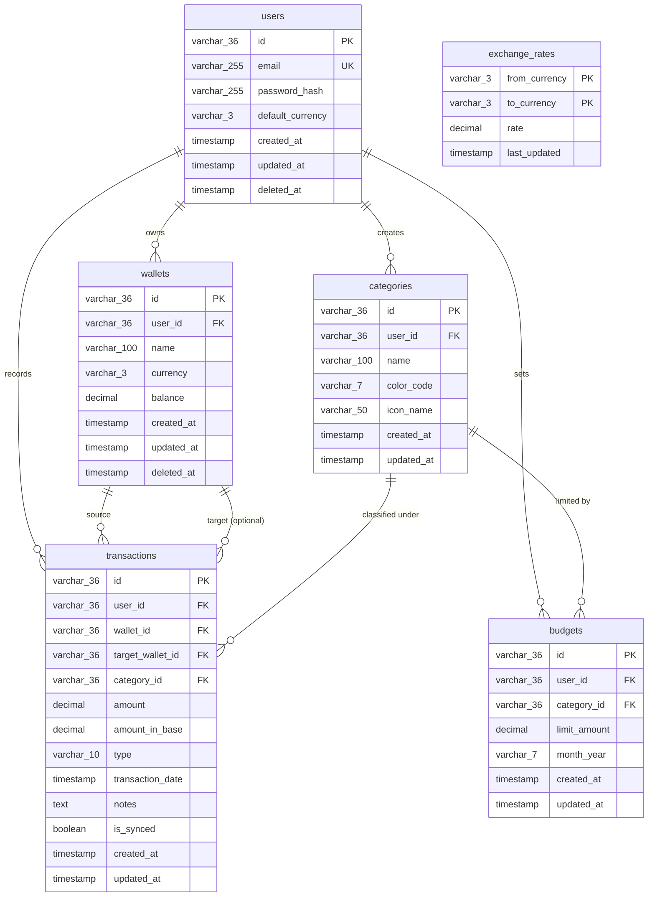

# Product Requirements Document: DompetKu
Version: 1.0, Status: Draft, Tanggal: 24 Oktober 2023

## 1. Overview
### Problem Statement
Banyak individu kelas pekerja muda dan freelancer di Indonesia kesulitan mengelola keuangan pribadi karena tidak mencatat pengeluaran secara konsisten. Mereka sering mengalami "kebocoran halus" (pengeluaran kecil yang tidak disadari namun berakumulasi besar) dan kesulitan memantau sisa anggaran bulanan secara real-time. Masalah ini diperparah bagi mereka yang memiliki beberapa rekening bank/e-wallet (multi-akun) dan melakukan transaksi dalam berbagai mata uang (misal: freelancer yang menerima USD tapi berbelanja dalam IDR).

### Solution
DompetKu adalah aplikasi mobile pencatat keuangan pribadi dan manajemen budget offline-first yang memungkinkan pengguna mencatat transaksi dalam < 5 detik. Aplikasi ini mendukung pengelolaan multi-wallet (rekening bank, e-wallet, uang tunai), konversi multi-mata uang otomatis berbasis kurs harian, pembuatan anggaran (budget) bulanan per kategori dengan sistem peringatan visual, serta visualisasi data pengeluaran interaktif untuk membantu pengguna memotong pengeluaran tidak perlu hingga 15%.

### Goals
*   **Meningkatkan retensi pencatatan**: Mengurangi waktu input transaksi rata-rata menjadi di bawah 5 detik (p95 < 5s) dari pembukaan aplikasi hingga tombol simpan ditekan.
*   **Efisiensi Anggaran**: Membantu minimal 70% pengguna aktif menghindari overspending pada kategori budget utama dalam 3 bulan pertama penggunaan.
*   **Akurasi Finansial**: Menyediakan nilai konversi mata uang real-time dengan selisih variansi kurs maksimal 0.5% dari kurs pasar tengah.
*   **Ketersediaan Offline**: Memastikan 100% fitur pencatatan dan pembacaan data lokal berfungsi penuh tanpa koneksi internet.

### Non-Goals
*   Aplikasi ini tidak menyediakan integrasi otomatis dengan API Bank (Open Banking) atau scraping SMS/mutasi rekening pada versi 1.0. Semua pencatatan dilakukan secara manual atau semi-otomatis via import CSV.
*   Aplikasi tidak bertindak sebagai platform investasi atau memfasilitasi transaksi transfer uang antar rekening bank pengguna secara nyata.
*   Aplikasi tidak mendukung akun bersama (joint account) atau sinkronisasi multi-user pada satu wallet yang sama untuk versi ini.

### Target Users
*   **Young Professionals**: Karyawan kantoran usia 22-35 tahun yang ingin disiplin menabung dan mengontrol pengeluaran gaya hidup.
*   **Freelancer/Digital Nomad**: Pekerja lepas yang memiliki pendapatan tidak teratur, sering menerima pembayaran dalam mata uang asing (USD/SGD), dan menggunakan banyak e-wallet.

### Personas
*   **Persona 1: Rian (26 tahun, Karyawan Swasta)**
    *   *Peran*: Pengguna Utama.
    *   *Kebutuhan*: Mencatat pengeluaran kopi harian, transportasi, dan makan siang dengan cepat. Ingin tahu sisa budget makannya secara instan sebelum memutuskan jajan.
    *   *Pain Points*: Sering malas mencatat karena aplikasi lain terlalu lambat loading dan memiliki terlalu banyak form input.
    *   *Konteks*: Menggunakan iPhone 11, sering mencatat saat sedang berjalan atau mengantre di kasir.
*   **Persona 2: Amanda (29 tahun, Freelance Graphic Designer)**
    *   *Peran*: Pengguna Multi-Currency & Multi-Wallet.
    *   *Kebutuhan*: Memisahkan catatan uang di Jenius, GoPay, dan PayPal. Membutuhkan konversi otomatis ke IDR saat mencatat pengeluaran langganan software asing (USD).
    *   *Pain Points*: Kesulitan menghitung total kekayaan bersih karena saldonya tersebar di berbagai mata uang dan rekening.
    *   *Konteks*: Menggunakan Android kelas menengah (Samsung A53), bekerja dari rumah atau co-working space.

### User Stories
*   **US-01**: Sebagai Rian, saya ingin mencatat transaksi pengeluaran baru dengan memilih kategori dan memasukkan nominal dalam satu layar cepat agar saya bisa mencatat transaksi kurang dari 5 detik saat di kasir.
*   **US-02**: Sebagai Rian, saya ingin menetapkan budget bulanan sebesar Rp2.000.000 untuk kategori "Makanan & Minuman" agar saya menerima peringatan visual saat pengeluaran kategori tersebut mencapai 80% dan 100%.
*   **US-03**: Sebagai Amanda, saya ingin membuat dompet digital terpisah untuk "PayPal (USD)" dan "BCA (IDR)" agar saya bisa memantau saldo riil di masing-masing akun tanpa tercampur.
*   **US-04**: Sebagai Amanda, saya ingin mencatat pengeluaran langganan Adobe Creative Cloud sebesar $20.99 USD ke dompet PayPal saya, dan melihat nilainya otomatis terkonversi ke Rupiah pada laporan total bulanan saya.
*   **US-05**: Sebagai Rian, saya ingin melihat grafik lingkaran (pie chart) distribusi pengeluaran bulanan saya agar saya bisa mengidentifikasi kategori apa yang paling banyak menghabiskan uang saya.
*   **US-06**: Sebagai Amanda, saya ingin mengekspor seluruh data transaksi bulanan saya ke format CSV agar saya bisa mengolahnya lebih lanjut di Microsoft Excel untuk keperluan pelaporan pajak.

---

## 2. Scope
### In-Scope
*   Autentikasi pengguna menggunakan Email/Password dan Google Sign-In.
*   Manajemen Dompet (Wallet): Tambah, ubah, hapus, dan urutkan dompet dengan mata uang default yang berbeda.
*   Manajemen Kategori: Kustomisasi nama kategori, ikon, dan warna.
*   Pencatatan Transaksi: Pemasukan, Pengeluaran, dan Transfer antar dompet dengan dukungan multi-mata uang.
*   Manajemen Budget: Pengaturan limit budget bulanan per kategori dengan progress bar.
*   Laporan Finansial: Grafik lingkaran (distribusi pengeluaran) dan grafik batang (perbandingan pemasukan vs pengeluaran bulanan).
*   Sinkronisasi Cloud: Sinkronisasi data lokal SQLite ke PostgreSQL backend secara otomatis saat online.
*   Kurs Mata Uang: Update otomatis harian untuk nilai tukar mata uang asing (IDR, USD, SGD, EUR, JPY).

### Out-of-Scope (with reason)
*   **Bank Scraping / Auto-sync**: Tidak diimplementasikan karena regulasi keamanan perbankan di Indonesia yang ketat dan biaya API pihak ketiga (seperti Brick atau Ayoconnect) yang mahal untuk tahap awal.
*   **OCR Struk Pembelian**: Pemindaian struk menggunakan kamera ditunda ke Fase 2 untuk menghindari kompleksitas model AI pada rilis perdana.
*   **Shared Wallet**: Fitur kolaborasi budget keluarga ditunda karena membutuhkan arsitektur WebSocket dan penanganan konflik data yang lebih kompleks.

### Assumptions
*   Pengguna memiliki smartphone dengan sistem operasi minimal Android 8.0 (Oreo) atau iOS 14.
*   Nilai tukar mata uang asing diperbarui sekali sehari pada pukul 00:00 UTC menggunakan API pihak ketiga dan disimpan di cache lokal aplikasi.
*   Pengguna akan melakukan sinkronisasi data ke cloud setidaknya sekali dalam 30 hari untuk mencegah kehilangan data lokal.

### Dependencies
*   **API Kurs**: ExchangeRate-API (atau layanan sejenis) untuk mendapatkan data kurs harian.
*   **Push Notification**: Firebase Cloud Messaging (FCM) untuk mengirimkan notifikasi pengingat mencatat dan peringatan budget.
*   **Database Engine**: SQLite (lokal pada perangkat) dan PostgreSQL (server backend).

---

## 3. Functional Requirements

| ID | Fitur | Deskripsi Detail | Prioritas | Acceptance Criteria |
| :--- | :--- | :--- | :--- | :--- |
| **FR-01** | Registrasi & Login | Pengguna dapat membuat akun baru menggunakan email & password atau menggunakan akun Google. Sistem harus memverifikasi email pengguna. | P0 | - Given: Pengguna berada di halaman registrasi. - When: Memasukkan email valid dan password >= 8 karakter lalu menekan "Daftar". - Then: Sistem mengirimkan email verifikasi dan mengarahkan ke halaman login. |
| **FR-02** | Manajemen Wallet | Pengguna dapat membuat lebih dari satu dompet (wallet) dengan nama unik, jenis saldo (Cash, Bank, E-Wallet), mata uang dasar (IDR, USD, SGD, EUR, JPY), dan saldo awal. | P0 | - Given: Pengguna berada di layar "Tambah Wallet". - When: Mengisi nama "BCA Rian", memilih mata uang "IDR", memasukkan saldo awal "5.000.000", lalu menekan "Simpan". - Then: Wallet baru terbuat dan saldo total pengguna bertambah sesuai konversi mata uang utama. |
| **FR-03** | Pencatatan Transaksi | Pengguna dapat mencatat transaksi pengeluaran, pemasukan, atau transfer antar wallet dengan mengisi jumlah, kategori, tanggal, wallet asal/tujuan, dan catatan opsional. | P0 | - Given: Pengguna berada di form transaksi cepat. - When: Memasukkan nominal "50.000", memilih kategori "Makanan", memilih wallet "Cash", lalu klik "Simpan". - Then: Saldo wallet "Cash" berkurang Rp50.000, transaksi tercatat di riwayat, dan budget "Makanan" terupdate. |
| **FR-04** | Konversi Multi-Mata Uang | Sistem otomatis mengonversi transaksi dengan mata uang berbeda ke mata uang dasar akun pengguna menggunakan kurs harian yang disimpan di lokal database. | P0 | - Given: Mata uang dasar akun adalah IDR, kurs 1 USD = Rp15.000. - When: Pengguna mencatat pengeluaran sebesar "$10 USD" pada wallet PayPal. - Then: Sistem mencatat transaksi $10 USD dan menampilkan nilai ekuivalen Rp150.000 pada visualisasi laporan bulanan. |
| **FR-05** | Manajemen Kategori | Pengguna dapat menambah, mengedit, atau menghapus kategori transaksi. Setiap kategori memiliki nama, warna hex, dan pilihan ikon dari library yang disediakan. | P1 | - Given: Pengguna ingin membedakan pengeluaran kopi. - When: Membuat kategori baru bernama "Kopi", memilih warna kuning, dan ikon cangkir. - Then: Kategori "Kopi" muncul di daftar pilihan saat mencatat transaksi baru. |
| **FR-06** | Pengaturan Budget | Pengguna dapat menentukan batas pengeluaran bulanan (budget) untuk setiap kategori. Sistem menghitung akumulasi pengeluaran kategori tersebut secara real-time. | P0 | - Given: Pengguna menetapkan budget "Transportasi" sebesar Rp500.000. - When: Total transaksi kategori Transportasi mencapai Rp410.000 (82%). - Then: Progress bar budget berubah warna menjadi kuning dan sistem mengirimkan notifikasi peringatan. |
| **FR-07** | Laporan Visual (Charts) | Menampilkan grafik lingkaran untuk persentase pengeluaran per kategori dan grafik batang untuk perbandingan pemasukan vs pengeluaran bulanan. | P1 | - Given: Pengguna membuka tab "Laporan". - When: Memilih filter bulan "Oktober 2023". - Then: Sistem merender grafik lingkaran yang menunjukkan kontribusi tiap kategori secara akurat berdasarkan total transaksi terkonversi. |
| **FR-08** | Sinkronisasi Offline-First | Aplikasi menyimpan semua data transaksi baru ke database SQLite lokal terlebih dahulu. Saat koneksi internet terdeteksi, data otomatis disinkronkan ke server cloud. | P0 | - Given: Aplikasi dalam mode offline (airplane mode). - When: Pengguna membuat 3 transaksi baru. - Then: Transaksi berhasil disimpan di lokal. Saat koneksi kembali aktif, data langsung terunggah ke database PostgreSQL cloud tanpa duplikasi. |
| **FR-09** | Ekspor Data | Pengguna dapat mengekspor data transaksi berdasarkan rentang tanggal tertentu ke dalam format file CSV atau PDF. | P1 | - Given: Pengguna berada di layar pengaturan ekspor. - When: Memilih rentang tanggal "1-30 September" dan format "CSV" lalu menekan "Ekspor". - Then: Aplikasi menghasilkan file CSV berisi kolom: Tanggal, Dompet, Kategori, Jenis, Jumlah, Mata Uang, Jumlah (IDR), Catatan. |
| **FR-10** | Hapus Akun & Data | Pengguna dapat mengajukan penghapusan akun secara permanen. Semua data transaksi, wallet, dan profil di server akan dihapus secara fisik setelah konfirmasi. | P2 | - Given: Pengguna menekan tombol "Hapus Akun" di pengaturan. - When: Memasukkan password akun sebagai konfirmasi akhir. - Then: Akun dihapus dari database cloud dan lokal, lalu pengguna diarahkan kembali ke layar onboarding. |

---

## 4. Non-Functional Requirements
### Performance
*   **Response Time (API)**: Waktu respons API backend untuk p95 harus di bawah 300ms untuk operasi Write (POST/PUT/DELETE) dan di bawah 150ms untuk operasi Read (GET) pada kondisi jaringan 4G stabil.
*   **App Startup Time**: Aplikasi mobile harus siap digunakan (interactive state) dalam waktu maksimal 1.5 detik sejak ikon aplikasi ditekan pada perangkat dengan RAM minimal 3GB.
*   **Concurrency**: Infrastruktur backend harus mampu menangani minimal 2.000 request per detik (RPS) secara bersamaan tanpa penurunan performa (error rate < 0.1%).

### Security
*   **Authentication & Authorization**: Menggunakan JSON Web Token (JWT) dengan masa berlaku 24 jam untuk otorisasi API. Refresh token disimpan dengan aman di Secure Store (iOS) / Shared Preferences Encrypted (Android).
*   **Data Encryption**: Data sensitif pengguna (seperti detail saldo dan password) harus dienkripsi saat transit menggunakan TLS 1.3 dan dienkripsi saat istirahat (at rest) menggunakan AES-256 pada database server. Database lokal SQLite menggunakan SQLCipher dengan enkripsi tingkat perangkat.
*   **Rate-Limiting**: Membatasi request API maksimal 100 request per menit per IP address untuk mencegah serangan brute force dan DDoS.
*   **Input Sanitization**: Seluruh input teks pada form transaksi wajib disanitasi di sisi klien dan divalidasi ulang di sisi server untuk mencegah SQL Injection dan Cross-Site Scripting (XSS).

### Scalability
*   **Database Scalability**: Skema database dirancang untuk mendukung hingga 1.000.000 baris transaksi per pengguna tanpa penurunan performa query dengan menerapkan indexing yang tepat pada kolom kunci.
*   **Horizontal Scaling**: Service backend dikemas menggunakan Docker container sehingga dapat diskalakan secara horizontal menggunakan Kubernetes atau AWS ECS berdasarkan utilisasi CPU > 70%.

### Reliability/Availability
*   **Uptime**: Menjamin ketersediaan layanan backend (API & Database Sync) minimal 99.9% setiap bulan (maksimal downtime 43 menit dalam sebulan).
*   **Automated Backup**: Backup database PostgreSQL otomatis dilakukan setiap hari pada pukul 02:00 WIB (UTC+7). File backup disimpan di AWS S3 dengan retensi data selama 30 hari.
*   **Disaster Recovery**: Target Recovery Time Objective (RTO) adalah maksimal 2 jam, dan Recovery Point Objective (RPO) adalah maksimal 24 jam.

### Usability & Accessibility
*   **System Usability Scale (SUS)**: Aplikasi harus mencapai skor evaluasi minimal 80 pada pengujian kegunaan dengan pengguna target.
*   **WCAG Target**: Memenuhi standar aksesibilitas WCAG 2.1 Level AA. Kontras warna teks terhadap latar belakang minimal harus 4.5:1.
*   **Dynamic Font Support**: Antarmuka aplikasi harus dapat menyesuaikan ukuran font sistem operasi yang diatur oleh pengguna tanpa merusak tata letak (layout) UI.

### Compliance
*   **Data Protection**: Kepatuhan penuh terhadap UU Pelindungan Data Pribadi (UU PDP) Indonesia. Data pribadi pengguna tidak boleh dibagikan kepada pihak ketiga tanpa persetujuan eksplisit (opt-in).
*   **Data Retention**: Jika pengguna menghapus akunnya, semua data terkait harus dihapus secara permanen dari server utama dalam waktu maksimal 30 hari kerja.

---

## 5. Business Rules (BR)
*   **BR-01 (Budget Limit Warning)**: Sistem wajib mengirimkan notifikasi push dan mengubah warna indikator budget menjadi kuning jika pengeluaran kategori mencapai 80% dari batas budget bulanan yang ditentukan. Jika pengeluaran telah mencapai >= 100%, indikator harus berwarna merah dan memunculkan peringatan pop-up saat transaksi baru dicatat.
*   **BR-02 (Negative Balance)**: Wallet diperbolehkan memiliki saldo negatif (misalnya untuk mencatat hutang atau transaksi kartu kredit), namun sistem harus menampilkan tanda minus (-) berwarna merah pada saldo wallet tersebut dan tidak menyertakannya dalam perhitungan total aset bersih kecuali dipilih oleh pengguna.
*   **BR-03 (Exchange Rate Cache)**: Kurs mata uang asing diperbarui otomatis sekali sehari pada pukul 00:05 UTC. Jika aplikasi dalam keadaan offline saat update dijadwalkan, aplikasi harus tetap menggunakan kurs terakhir yang berhasil diunduh (cached rate) dan mencantumkan tanggal kurs tersebut pada detail transaksi.
*   **BR-04 (Category Deletion)**: Jika pengguna menghapus suatu kategori yang sudah memiliki riwayat transaksi, sistem tidak boleh menghapus transaksi tersebut. Transaksi terkait otomatis dipindahkan ke kategori sistem bawaan bernama "Lain-lain" (Uncategorized).
*   **BR-05 (Transaction Date Future Limit)**: Pengguna tidak diperbolehkan mencatat transaksi dengan tanggal masa depan (future date) melebihi H+1 dari tanggal hari ini berdasarkan zona waktu lokal perangkat pengguna.
*   **BR-06 (Base Currency Consolidation)**: Semua perhitungan statistik, grafik laporan, dan total akumulasi budget wajib dikonsolidasikan ke dalam satu mata uang dasar (Default Currency) yang dipilih pengguna di pengaturan profil.
*   **BR-07 (Wallet Deletion Constraint)**: Sebuah wallet tidak dapat dihapus jika masih memiliki transaksi aktif di dalamnya. Pengguna harus memindahkan semua transaksi ke wallet lain terlebih dahulu, atau memilih opsi "Hapus Wallet beserta seluruh transaksinya" secara eksplisit dengan konfirmasi PIN/Password.

---

## 6. Edge Cases

| Skenario | Perilaku Diharapkan |
| :--- | :--- |
| **Empty State Baru** | Saat pengguna baru pertama kali mendaftar dan belum memiliki transaksi atau wallet, layar Dashboard harus menampilkan ilustrasi kosong yang bersih dengan tombol aksi yang jelas: "Buat Dompet Pertama Anda" dan panduan langkah demi langkah (tour guide). |
| **Transaksi Duplikat Akibat Double Tap** | Tombol "Simpan" pada form transaksi akan langsung dinonaktifkan (disabled) selama 3 detik setelah ketukan pertama untuk mencegah pengiriman data duplikat ke database lokal akibat ketukan berulang yang cepat. |
| **Pencatatan Offline & Konflik Sync** | Jika pengguna mengubah nominal transaksi A saat offline pada perangkat 1, dan menghapus transaksi A saat online pada perangkat 2, maka saat perangkat 1 kembali online, sistem cloud akan memprioritaskan status terakhir dari server (transaksi dihapus) dan menghapus data lokal perangkat 1. |
| **Nilai Transaksi Ekstrim** | Input nominal transaksi dibatasi maksimal 15 digit angka (999.999.999.999.999). Jika pengguna memasukkan angka lebih besar dari batas tersebut, sistem akan menolak input, menampilkan pesan error inline, dan memotong nilai input kembali ke batas maksimum. |
| **Perbedaan Timezone Perangkat** | Transaksi disimpan di database menggunakan format UTC ISO 8601 (`YYYY-MM-DDTHH:mm:ss.sssZ`). Saat ditampilkan di aplikasi, waktu transaksi disesuaikan dengan zona waktu lokal perangkat pengguna saat itu agar laporan bulanan tetap konsisten. |
| **Kegagalan API Kurs Harian** | Jika API kurs harian gagal diakses (misal: server API down atau limit kuota habis), sistem akan beralih menggunakan backup database lokal berisi nilai kurs statis terakhir yang berhasil disimpan, dan mencatat log error ke sistem monitoring. |
| **Penghapusan Kategori Default** | Sistem melarang keras penghapusan kategori sistem bawaan (seperti: "Makanan & Minuman", "Transportasi", "Lain-lain"). Tombol hapus untuk kategori ini akan disembunyikan dari UI. |
| **Input Budget Nol atau Negatif** | Form pembuatan budget akan langsung menolak nilai <= 0 dengan validasi error real-time di bawah input field: "Nilai budget bulanan harus lebih besar dari Rp0". |
| **Migrasi Database Saat Pending Sync** | Jika ada pembaruan skema database lokal SQLite melalui update aplikasi di App Store/Play Store sementara ada data transaksi lokal yang belum disinkronkan ke cloud, proses migrasi database lokal harus berjalan dengan skema baru tanpa menghapus baris tabel transaksi yang berstatus `is_synced = false`. |

---

## 7. User Flow & Screen List
### Primary Flow: Mencatat Pengeluaran Baru (Happy Path)
1. Pengguna membuka aplikasi -> Masuk ke layar Dashboard.
2. Pengguna menekan tombol "+" (Floating Action Button) di bagian bawah layar.
3. Layar Form Transaksi terbuka. Secara default, jenis transaksi diatur ke "Pengeluaran", tanggal diatur ke "Hari Ini", dan Wallet diatur ke wallet yang paling sering digunakan.
4. Pengguna memasukkan nominal transaksi (misal: 25000).
5. Pengguna memilih kategori "Makanan & Minuman".
6. Pengguna memilih Wallet "Gopay (IDR)".
7. Pengguna memasukkan catatan opsional "Beli Kopi Susu".
8. Pengguna menekan tombol "Simpan".
9. Sistem memproses penyimpanan data ke SQLite lokal, memperbarui sisa budget kategori terkait, dan kembali ke Dashboard sambil menampilkan Toast Notification: "Transaksi berhasil disimpan".

### Alternative Flow: Batas Budget Terlampaui (Warning Flow)
1. Pengguna melakukan langkah 1-7 pada Primary Flow.
2. Saat nominal dimasukkan dan kategori dipilih (misal: "Belanja" senilai Rp600.000, sisa budget kategori tersebut adalah Rp100.000).
3. Sistem mendeteksi bahwa transaksi ini akan membuat budget melebihi batas (overbudget).
4. Di bawah input nominal, muncul teks peringatan berwarna merah secara real-time: "Peringatan: Transaksi ini akan melebihi budget bulanan Anda sebesar Rp500.000".
5. Pengguna tetap menekan tombol "Simpan".
6. Transaksi berhasil disimpan, sistem memicu notifikasi push peringatan overbudget, dan progress bar kategori "Belanja" di dashboard berubah menjadi warna merah penuh.

### Screen List Table

| Nama Layar | Layar Tujuan | Elemen Utama | Navigasi |
| :--- | :--- | :--- | :--- |
| **Layar Splash / Onboarding** | Layar Login | Logo DompetKu, Tombol "Mulai Sekarang", Ilustrasi Fitur. | Otomatis ke Login setelah 2 detik atau klik "Mulai". |
| **Layar Login / Register** | Layar Dashboard | Input Email, Input Password, Tombol Login Google, Link Daftar Akun. | Menuju Dashboard setelah autentikasi berhasil. |
| **Layar Dashboard (Home)** | Form Transaksi, Detail Wallet, Notifikasi | Total Saldo (Base Currency), Daftar Wallet (carousel), Transaksi Terbaru (list), Floating Action Button "+". | Navigasi bawah: Home, Laporan, Budget, Pengaturan. |
| **Layar Form Transaksi** | Layar Dashboard | Toggle Jenis (Pemasukan/Pengeluaran/Transfer), Input Nominal, Dropdown Wallet, Dropdown Kategori, Date Picker, Input Catatan, Tombol "Simpan". | Tombol "Kembali" di pojok kiri atas membatalkan input. |
| **Layar Laporan (Analytics)** | Detail Transaksi Kategori | Filter Bulan/Tahun, Pie Chart Pengeluaran, Bar Chart Pemasukan vs Pengeluaran, List Kategori Terboros. | Klik segmen Pie Chart menuju ke daftar transaksi kategori tersebut. |
| **Layar Budgeting** | Form Tambah Budget | Daftar Kategori dengan Progress Bar Budget, Tombol "Set Budget Baru", Angka Sisa Budget. | Klik salah satu progress bar untuk mengubah batas budget. |
| **Layar Pengaturan** | Edit Profil, Manajemen Kategori, Ekspor Data | Pilihan Default Currency, Tombol Ekspor CSV/PDF, Switch Mode Gelap, Tombol Hapus Akun, Tombol Logout. | Klik "Ekspor Data" membuka modal konfigurasi tanggal ekspor. |

---

## 8. API Requirements
Semua endpoint API menggunakan base URL `https://api.dompetku.com/api/v1/` dan membutuhkan header Authorization `Bearer <token>` kecuali untuk endpoint registrasi dan login.

### API Endpoint List

| Method | Endpoint | Auth | Deskripsi | Request Body (JSON) | Response (JSON, 200 OK / 201 Created) |
| :--- | :--- | :--- | :--- | :--- | :--- |
| **POST** | `/auth/register` | No | Mendaftarkan pengguna baru dengan email dan password. | `{"email": "user@mail.com", "password": "SecurePassword123"}` | `{"status": "success", "message": "Verification email sent", "data": {"user_id": "usr_998877"}}` |
| **POST** | `/auth/login` | No | Autentikasi pengguna dan mengembalikan JWT Token. | `{"email": "user@mail.com", "password": "SecurePassword123"}` | `{"status": "success", "data": {"token": "eyJhbGci...", "expires_in": 86400}}` |
| **GET** | `/wallets` | Yes | Mengambil daftar semua wallet milik pengguna aktif beserta saldonya. | None | `{"status": "success", "data": [{"id": "wlt_01", "name": "BCA Rian", "balance": 5000000.00, "currency": "IDR"}]}` |
| **POST** | `/transactions/sync` | Yes | Sinkronisasi batch transaksi dari lokal SQLite ke cloud server. | `{"transactions": [{"local_id": "tx_01", "amount": 25000.00, "type": "expense", "category_id": "cat_03", "wallet_id": "wlt_01", "transaction_date": "2023-10-24T12:00:00Z", "notes": "Kopi"}]}` | `{"status": "success", "synced_ids": ["tx_01"], "server_timestamps": {"tx_01": "2023-10-24T12:05:00Z"}}` |
| **GET** | `/budgets` | Yes | Mengambil daftar budget bulanan per kategori untuk bulan berjalan. | None | `{"status": "success", "data": [{"category_id": "cat_03", "limit_amount": 1000000.00, "spent_amount": 450000.00, "month_year": "10-2023"}]}` |
| **PUT** | `/budgets` | Yes | Membuat atau memperbarui limit budget bulanan untuk kategori tertentu. | `{"category_id": "cat_03", "limit_amount": 1200000.00, "month_year": "10-2023"}` | `{"status": "success", "data": {"category_id": "cat_03", "limit_amount": 1200000.00}}` |

### Standard Error Responses
*   **400 Bad Request**: Request body tidak sesuai format atau ada field wajib yang kosong.
    `{"error": "INVALID_INPUT", "message": "Field 'amount' harus berupa angka positif."}`
*   **401 Unauthorized**: Token JWT tidak valid, kedaluwarsa, atau tidak disertakan pada header.
    `{"error": "UNAUTHORIZED", "message": "Token tidak valid atau telah kedaluwarsa."}`
*   **403 Forbidden**: Pengguna tidak memiliki hak akses untuk resource yang diminta (misal: mengakses wallet user lain).
    `{"error": "FORBIDDEN", "message": "Anda tidak memiliki akses ke wallet ini."}`
*   **404 Not Found**: Resource yang dicari (wallet, transaksi, kategori) tidak ditemukan di database.
    `{"error": "NOT_FOUND", "message": "Transaksi dengan ID tx_99 tidak ditemukan."}`
*   **409 Conflict**: Terjadi bentrokan data (misal: mendaftarkan email yang sudah terdaftar).
    `{"error": "EMAIL_ALREADY_EXISTS", "message": "Email tersebut sudah terdaftar di sistem."}`
*   **422 Unprocessable Entity**: Validasi bisnis gagal (misal: tanggal transaksi melebihi batas H+1).
    `{"error": "VALIDATION_FAILED", "message": "Tanggal transaksi tidak boleh melebihi H+1 hari ini."}`
*   **500 Internal Server Error**: Terjadi kesalahan sistem pada server backend.
    `{"error": "SERVER_ERROR", "message": "Terjadi kesalahan internal pada server kami. Silakan coba lagi nanti."}`

---

## 9. Database Schema
Desain database menggunakan normalisasi tingkat ketiga (3NF) untuk menjamin konsistensi data dan menghindari redundansi.

### Tables

#### 1. Table: `users`
| Kolom | Tipe | Constraint | Keterangan |
| :--- | :--- | :--- | :--- |
| `id` | VARCHAR(36) | PRIMARY KEY, NOT NULL | UUID v4 sebagai identifier unik user. |
| `email` | VARCHAR(255) | UNIQUE, NOT NULL | Alamat email terdaftar. |
| `password_hash` | VARCHAR(255) | NOT NULL | Password yang di-hash dengan bcrypt. |
| `default_currency` | VARCHAR(3) | NOT NULL, DEFAULT 'IDR' | Kode mata uang dasar user (ISO 4217). |
| `created_at` | TIMESTAMP | NOT NULL, DEFAULT CURRENT_TIMESTAMP | Waktu pendaftaran user. |
| `updated_at` | TIMESTAMP | NOT NULL, DEFAULT CURRENT_TIMESTAMP | Waktu pembaruan data user. |
| `deleted_at` | TIMESTAMP | NULL | Timestamp soft-delete akun. |

#### 2. Table: `wallets`
| Kolom | Tipe | Constraint | Keterangan |
| :--- | :--- | :--- | :--- |
| `id` | VARCHAR(36) | PRIMARY KEY, NOT NULL | UUID v4 identifier unik wallet. |
| `user_id` | VARCHAR(36) | FOREIGN KEY REFERENCES `users`(id) ON DELETE CASCADE, NOT NULL | Pemilik wallet. |
| `name` | VARCHAR(100) | NOT NULL | Nama wallet (misal: BCA Tabungan). |
| `currency` | VARCHAR(3) | NOT NULL | Kode mata uang wallet (ISO 4217). |
| `balance` | DECIMAL(15, 2) | NOT NULL, DEFAULT 0.00 | Saldo saat ini dalam mata uang wallet. |
| `created_at` | TIMESTAMP | NOT NULL, DEFAULT CURRENT_TIMESTAMP | Waktu pembuatan wallet. |
| `updated_at` | TIMESTAMP | NOT NULL, DEFAULT CURRENT_TIMESTAMP | Waktu perubahan saldo/nama wallet. |
| `deleted_at` | TIMESTAMP | NULL | Timestamp soft-delete wallet. |

#### 3. Table: `categories`
| Kolom | Tipe | Constraint | Keterangan |
| :--- | :--- | :--- | :--- |
| `id` | VARCHAR(36) | PRIMARY KEY, NOT NULL | UUID v4 identifier unik kategori. |
| `user_id` | VARCHAR(36) | FOREIGN KEY REFERENCES `users`(id) ON DELETE CASCADE, NULL | Pembuat kategori (NULL untuk kategori default sistem). |
| `name` | VARCHAR(100) | NOT NULL | Nama kategori (misal: Makanan). |
| `color_code` | VARCHAR(7) | NOT NULL, DEFAULT '#FFFFFF' | Kode warna hex untuk UI (misal: #FF5733). |
| `icon_name` | VARCHAR(50) | NOT NULL, DEFAULT 'tag' | Nama key icon dari icon library. |
| `created_at` | TIMESTAMP | NOT NULL, DEFAULT CURRENT_TIMESTAMP | Waktu pembuatan kategori. |
| `updated_at` | TIMESTAMP | NOT NULL, DEFAULT CURRENT_TIMESTAMP | Waktu pembaruan kategori. |

#### 4. Table: `transactions`
| Kolom | Tipe | Constraint | Keterangan |
| :--- | :--- | :--- | :--- |
| `id` | VARCHAR(36) | PRIMARY KEY, NOT NULL | UUID v4 identifier unik transaksi. |
| `user_id` | VARCHAR(36) | FOREIGN KEY REFERENCES `users`(id) ON DELETE CASCADE, NOT NULL | Pemilik transaksi. |
| `wallet_id` | VARCHAR(36) | FOREIGN KEY REFERENCES `wallets`(id) ON DELETE RESTRICT, NOT NULL | Wallet asal transaksi. |
| `target_wallet_id` | VARCHAR(36) | FOREIGN KEY REFERENCES `wallets`(id) ON DELETE RESTRICT, NULL | Wallet tujuan (hanya diisi untuk jenis 'transfer'). |
| `category_id` | VARCHAR(36) | FOREIGN KEY REFERENCES `categories`(id) ON DELETE SET NULL, NULL | Kategori transaksi. |
| `amount` | DECIMAL(15, 2) | NOT NULL | Nominal transaksi dalam mata uang wallet asal. |
| `amount_in_base` | DECIMAL(15, 2) | NOT NULL | Nominal terkonversi ke mata uang dasar user. |
| `type` | VARCHAR(10) | NOT NULL, CHECK (type IN ('income', 'expense', 'transfer')) | Jenis transaksi. |
| `transaction_date` | TIMESTAMP | NOT NULL | Tanggal dan waktu transaksi terjadi. |
| `notes` | TEXT | NULL | Catatan tambahan transaksi. |
| `is_synced` | BOOLEAN | NOT NULL, DEFAULT FALSE | Status sinkronisasi lokal ke cloud. |
| `created_at` | TIMESTAMP | NOT NULL, DEFAULT CURRENT_TIMESTAMP | Waktu pembuatan log transaksi. |
| `updated_at` | TIMESTAMP | NOT NULL, DEFAULT CURRENT_TIMESTAMP | Waktu pembaruan log transaksi. |

#### 5. Table: `budgets`
| Kolom | Tipe | Constraint | Keterangan |
| :--- | :--- | :--- | :--- |
| `id` | VARCHAR(36) | PRIMARY KEY, NOT NULL | UUID v4 identifier unik budget. |
| `user_id` | VARCHAR(36) | FOREIGN KEY REFERENCES `users`(id) ON DELETE CASCADE, NOT NULL | Pemilik budget. |
| `category_id` | VARCHAR(36) | FOREIGN KEY REFERENCES `categories`(id) ON DELETE CASCADE, NOT NULL | Kategori yang dibatasi. |
| `limit_amount` | DECIMAL(15, 2) | NOT NULL | Batas nominal pengeluaran maksimum (dalam mata uang dasar). |
| `month_year` | VARCHAR(7) | NOT NULL | Periode budget dengan format 'MM-YYYY' (misal: '10-2023'). |
| `created_at` | TIMESTAMP | NOT NULL, DEFAULT CURRENT_TIMESTAMP | Waktu pembuatan budget. |
| `updated_at` | TIMESTAMP | NOT NULL, DEFAULT CURRENT_TIMESTAMP | Waktu pembaruan limit budget. |

#### 6. Table: `exchange_rates`
| Kolom | Tipe | Constraint | Keterangan |
| :--- | :--- | :--- | :--- |
| `from_currency` | VARCHAR(3) | PRIMARY KEY, NOT NULL | Kode mata uang asal (misal: USD). |
| `to_currency` | VARCHAR(3) | PRIMARY KEY, NOT NULL | Kode mata uang tujuan (misal: IDR). |
| `rate` | DECIMAL(18, 6) | NOT NULL | Nilai tukar (kurs). |
| `last_updated` | TIMESTAMP | NOT NULL, DEFAULT CURRENT_TIMESTAMP | Waktu pembaruan kurs terakhir kali. |

### Indexes
*   `idx_transactions_user_date`: `transactions(user_id, transaction_date DESC)` - Mempercepat render riwayat transaksi terbaru pada Dashboard.
*   `idx_transactions_category_date`: `transactions(user_id, category_id, transaction_date)` - Mempercepat perhitungan akumulasi spending untuk budget per kategori.
*   `idx_budgets_user_period`: `budgets(user_id, month_year)` - Mempercepat pemuatan daftar budget bulanan aktif.

### Entity Relationship Diagram (ERD)

---

## 10. Roles & Permissions
Aplikasi menggunakan sistem Role-Based Access Control (RBAC) dasar untuk mengontrol fungsionalitas pengguna akhir dan administrator sistem.

| Role | Modul | Hak (CRUD) | Keterangan |
| :--- | :--- | :--- | :--- |
| **Free User** | Wallets | CRU | Dapat membuat maksimal 3 wallet aktif. Tidak dapat menghapus wallet yang memiliki riwayat transaksi (harus diarsipkan). |
| | Transactions | CRUD | Akses penuh untuk mencatat, melihat, mengubah, dan menghapus transaksinya sendiri. |
| | Budgets | CRUD | Dapat menetapkan budget maksimal untuk 5 kategori aktif per bulan. |
| | Reports | R | Dapat melihat laporan grafis bulanan versi standar (tanpa fitur ekspor PDF). |
| **Premium User** | Wallets | CRUD | Akses tak terbatas untuk membuat wallet baru dalam mata uang apapun. |
| | Transactions | CRUD | Akses penuh tanpa batasan transaksi. |
| | Budgets | CRUD | Akses tak terbatas untuk budgeting semua kategori. |
| | Reports | R | Akses penuh ke seluruh analisis grafis dan fitur ekspor CSV/PDF tanpa batas. |
| **Admin** | Users | RU | Dapat menonaktifkan akun pengguna yang melanggar ketentuan layanan. |
| | Exchange Rates | RU | Dapat memperbarui nilai kurs mata uang secara manual jika API otomatis mengalami masalah. |
| | System Logs | R | Dapat memantau error log sistem dan metrik performa API. |

---

## 11. Validation Rules

| Field | Aturan Validasi | Pesan Error (UI Bahasa Indonesia) |
| :--- | :--- | :--- |
| **Email** | Wajib diisi, format email valid (`^[^\s@]+@[^\s@]+\.[^\s@]+$`), maksimal 255 karakter. | "Format email tidak valid. Pastikan menggunakan '@' dan domain yang benar." |
| **Password** | Wajib diisi, minimal 8 karakter, mengandung minimal 1 huruf besar, 1 huruf kecil, dan 1 angka. | "Password minimal harus 8 karakter dan mengandung kombinasi huruf besar, kecil, serta angka." |
| **Wallet Name** | Wajib diisi, minimal 3 karakter, maksimal 50 karakter, tidak boleh mengandung karakter spesial selain spasi. | "Nama dompet harus berukuran 3-50 karakter tanpa karakter spesial." |
| **Transaction Amount** | Wajib diisi, bertipe data numeric, nilai harus > 0, maksimal 15 digit. | "Nominal transaksi harus berupa angka positif lebih dari Rp0." |
| **Transaction Date** | Wajib diisi, format tanggal valid, tidak boleh melebihi H+1 dari tanggal hari ini. | "Tanggal transaksi tidak boleh melebihi esok hari." |
| **Budget Limit Amount** | Wajib diisi, bertipe data numeric, nilai harus > 0. | "Batas budget bulanan harus berupa nominal angka positif." |
| **Export Date Range** | Rentang tanggal maksimal adalah 365 hari (1 tahun) dalam satu kali ekspor. | "Rentang waktu ekspor maksimal adalah 1 tahun." |

---

## 12. Error Handling
### Strategy
*   **Toast Notification**: Digunakan untuk error minor yang tidak menghalangi alur kerja utama pengguna (misal: "Gagal memperbarui kurs harian, menggunakan kurs kemarin").
*   **Inline Validation Error**: Ditampilkan langsung di bawah input field pada form ketika ada data yang tidak memenuhi aturan validasi saat tombol submit ditekan.
*   **Full Screen Error Banner**: Digunakan jika terjadi kegagalan sistem fatal (seperti kegagalan memuat database lokal SQLite saat aplikasi dibuka). Menyediakan tombol "Coba Lagi" (Retry).
*   **Idempotency Key**: Setiap transaksi pengiriman sinkronisasi dari lokal ke cloud menyertakan `idempotency_key` (berupa UUID transaksi itu sendiri). Server akan menolak request jika UUID tersebut sudah terdaftar di database cloud untuk mencegah pencatatan ganda akibat kegagalan koneksi di tengah-tengah proses request.

### Error Scenarios Table

| Skenario Error | Error Code | Pesan ke User | Aksi Sistem |
| :--- | :--- | :--- | :--- |
| **Koneksi internet terputus saat sinkronisasi** | `ERR_NETWORK_DISCONNECTED` | "Koneksi terputus. Data Anda disimpan di memori lokal dan akan disinkronkan saat online kembali." | Aplikasi beralih ke mode offline, mengubah status transaksi menjadi `is_synced = false` di SQLite, dan memantau status jaringan menggunakan event listener. |
| **Token JWT Kedaluwarsa** | `ERR_AUTH_EXPIRED` | "Sesi Anda telah berakhir. Silakan login kembali." | Aplikasi menghapus token lama dari Secure Store, mengarahkan pengguna ke layar Login, dan membersihkan sisa state sensitif di memori. |
| **Saldo Wallet Tidak Cukup (Untuk Transfer)** | `ERR_INSUFFICIENT_BALANCE` | "Saldo dompet asal tidak mencukupi untuk melakukan transfer ini." | Sistem menggagalkan proses penyimpanan transaksi transfer dan menampilkan pop-up konfirmasi jika pengguna tetap ingin melanjutkan transaksi dengan risiko saldo negatif. |
| **Gagal Menghubungi API Kurs** | `ERR_EXCHANGE_RATE_API_FAIL` | "Gagal memperbarui nilai kurs terbaru. Menampilkan data berdasarkan kurs tanggal [Tanggal_Kurs_Lokal]." | Sistem menulis error log ke Sentry, memuat kurs terakhir dari cache database lokal, dan melanjutkan proses kalkulasi tanpa memblokir UI. |
| **Konflik Data Pengeditan Transaksi** | `ERR_SYNC_CONFLICT` | "Transaksi ini telah diubah di perangkat lain. Memperbarui data ke versi terbaru." | Sistem mendeteksi konflik timestamp `updated_at`, mengunduh data versi terbaru dari server cloud, dan menimpa perubahan lokal yang lebih lama. |

---

## 13. Analytics & Monitoring
### Analytics Events Table

| Event Name | Trigger | Properties |
| :--- | :--- | :--- |
| `user_signup` | Pengguna berhasil membuat akun baru. | `auth_method` (Email/Google), `device_os` (Android/iOS) |
| `wallet_created` | Pengguna berhasil membuat dompet baru. | `currency` (IDR/USD/etc), `wallet_type` (Cash/Bank/E-Wallet) |
| `transaction_added` | Pengguna menyimpan transaksi baru. | `transaction_type` (income/expense/transfer), `category_name`, `currency`, `amount_in_base` |
| `budget_exceeded` | Total transaksi bulanan melebihi limit budget kategori. | `category_name`, `limit_amount`, `excess_amount` |
| `data_exported` | Pengguna mengunduh/membagikan laporan CSV/PDF. | `export_format` (CSV/PDF), `date_range_days` |

### Monitoring Requirements
*   **Error Tracking**: Integrasi dengan Sentry SDK di sisi mobile client dan backend server. Setiap error dengan tingkat keparahan "Error" atau "Fatal" harus memicu peringatan instan ke channel Slack tim developer.
*   **Health Checks**: Endpoint `/health` pada backend API dipantau setiap 60 detik menggunakan UptimeRobot. Jika endpoint mengembalikan status selain `200 OK` sebanyak 3 kali berturut-turut, sistem harus mengirimkan SMS/Email alert ke DevOps engineer on-duty.
*   **Business Metrics Dashboard**: Menggunakan Grafana untuk memantau metrik bisnis harian secara real-time: jumlah pengguna aktif harian (DAU), total volume transaksi yang dicatat dalam sistem (IDR), dan rasio kegagalan sinkronisasi database.

---

## 14. Tech Stack

| Layer | Pilihan Teknologi | Alasan Pemilihan |
| :--- | :--- | :--- |
| **Mobile App (Frontend)** | React Native (v0.72+) | Memungkinkan pengembangan lintas platform (iOS & Android) dengan satu codebase, performa native yang baik, dan ekosistem library SQLite yang matang. |
| **State Management** | Redux Toolkit | Mengelola state aplikasi yang kompleks (seperti data transaksi, status sinkronisasi, dan tema aplikasi) secara terpusat dan terprediksi. |
| **Local Database** | WatermelonDB (berbasis SQLite) | Database offline-first berkinerja sangat tinggi untuk React Native. Mampu menangani ribuan data transaksi tanpa membuat UI thread menjadi lambat (blocking). |
| **Backend API** | Node.js dengan Express.js (TypeScript) | Non-blocking I/O yang handal untuk menangani request sinkronisasi batch dalam jumlah besar secara efisien. TypeScript menjamin keamanan tipe data. |
| **Database Server** | PostgreSQL (v15) | Database relasional yang tangguh, mendukung query kompleks untuk laporan keuangan, dan memiliki dukungan penuh untuk indexing serta integritas data relasional (foreign keys). |
| **Caching & Session** | Redis | Digunakan untuk menyimpan cache nilai kurs mata uang asing harian dan mengelola blacklist token JWT yang telah logout. |
| **Cloud Hosting** | AWS (EC2 untuk API, RDS untuk PostgreSQL, S3 untuk Backup) | Infrastruktur cloud dengan skalabilitas tinggi, jaminan keamanan data, dan tingkat ketersediaan yang tinggi (high availability). |

---

## 15. Future Improvements
*   **Fase 2 (Smart Scanner & Automation)**:
    *   Implementasi OCR (Optical Character Recognition) berbasis model on-device AI untuk membaca data nominal, tanggal, dan merchant dari foto struk belanja secara otomatis.
    *   Integrasi parser SMS/Notifikasi bank untuk otomatis mendeteksi transaksi masuk/keluar dari e-wallet/bank lokal Indonesia.
*   **Fase 3 (Social Budgeting & AI Advisor)**:
    *   Fitur "Shared Wallet" yang memungkinkan pasangan atau keluarga patungan mengelola anggaran belanja rumah tangga bersama dengan sinkronisasi real-time.
    *   Penerapan model Machine Learning ringan untuk memberikan rekomendasi finansial personal (misal: "Pengeluaran kopi Anda bulan ini naik 30% dibanding bulan lalu, kami sarankan kurangi jajan kopi untuk menghemat Rp200.000").