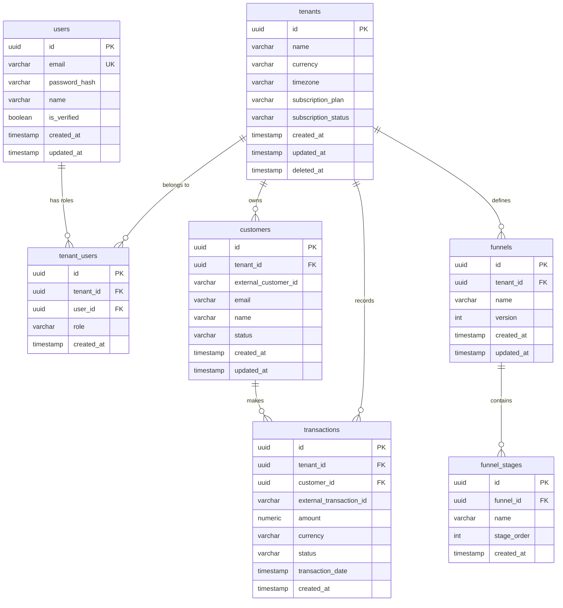

# Product Requirements Document: ServiMetrix
Version: 1.0, Status: Draft, Tanggal: 24 Oktober 2023

## 1. Overview
- **Problem Statement**: Pemilik bisnis jasa (seperti agensi, konsultan, dan penyedia jasa berbasis langganan) sering kali kesulitan memantau kesehatan finansial secara real-time. Data transaksi, retensi pelanggan (churn rate), dan konversi corong pemasaran (funnels) tersebar di berbagai platform (sistem pembayaran, CRM, spreadsheet manual). Hal ini mengakibatkan keterlambatan pengambilan keputusan bisnis, kebocoran pendapatan yang terlambat dideteksi, dan tingginya waktu yang terbuang untuk konsolidasi data manual.
- **Solution**: ServiMetrix adalah dashboard analitik B2B SaaS multi-tenant yang mengonsolidasikan data transaksi, aktivitas pelanggan, dan tahapan funnel pemasaran ke dalam satu visualisasi real-time. Platform ini otomatis menghitung metrik krusial seperti Monthly Recurring Revenue (MRR), Churn Rate harian/bulanan, jumlah pelanggan aktif, serta menyajikan konversi funnel secara visual dan menyediakan fitur ekspor laporan instan untuk mendukung keputusan strategis berbasis data.
- **Goals**:
  - Mengurangi waktu konsolidasi laporan manual pemilik bisnis dari rata-rata 8 jam per minggu menjadi 0 jam (otomatisasi penuh).
  - Menyajikan pembaruan data dashboard dengan latensi data (data latency) p95 < 5 detik setelah data transaksi masuk melalui webhook/API.
  - Mempertahankan ketersediaan sistem (system availability) sebesar 99.9% setiap bulan.
  - Membantu admin menghasilkan dokumen ekspor laporan (CSV/PDF) berisi hingga 100.000 baris data dalam waktu kurang dari 3 detik.
  - Mengurangi churn sistem sendiri dengan menyediakan alur onboarding mandiri (self-service subscription) yang selesai dalam waktu kurang dari 5 menit.
- **Non-Goals**:
  - Aplikasi ini tidak berfungsi sebagai aplikasi kasir (Point of Sale/POS) langsung atau pembuat invoice (billing engine). ServiMetrix hanya menerima data transaksi yang sudah terjadi dari sistem pihak ketiga.
  - Aplikasi ini tidak menyediakan aplikasi mobile native (Android/iOS) pada Fase 1 (hanya responsif web dashboard).
  - Aplikasi ini tidak menyediakan prediksi pendapatan berbasis Machine Learning/AI pada rilis pertama.
- **Target Users**: Pemilik Bisnis Jasa (CEO/Founder), Manajer Operasional (Operations Lead), dan Admin Keuangan (Finance Admin).
- **Personas**:
  1. **Nama**: Budi Santoso
     - **Peran**: Owner & CEO JasaDigital Agency
     - **Kebutuhan**: Memantau real-time revenue harian, MRR, dan grafik churn rate bulanan untuk menentukan strategi retensi klien.
     - **Pain Points**: Harus menunggu laporan akhir bulan dari tim finance yang sering terlambat dan tidak akurat karena dihitung manual di Excel.
     - **Konteks**: Mengakses dashboard setiap pagi melalui laptop sebelum rapat koordinasi harian.
  2. **Nama**: Sarah Wijaya
     - **Peran**: Operations Lead
     - **Kebutuhan**: Melihat konversi dari leads masuk hingga menjadi pelanggan aktif di setiap tahap funnel penjualan jasa.
     - **Pain Points**: Kehilangan jejak calon klien di tengah-tengah proses negosiasi tanpa tahu tahapan mana yang memiliki bottleneck terbesar.
     - **Konteks**: Memantau dashboard sepanjang hari kerja untuk memantau performa tim sales.
  3. **Nama**: Rian Pratama
     - **Peran**: Finance Admin
     - **Kebutuhan**: Mengekspor data transaksi bulanan ke format CSV dan PDF untuk kebutuhan pelaporan pajak dan audit internal.
     - **Pain Points**: Sistem lama sering mengalami timeout atau error saat mengekspor data transaksi berjumlah ribuan baris.
     - **Konteks**: Menggunakan fitur ekspor data pada tanggal 1 setiap bulan via komputer desktop kantor.
- **User Stories**:
  - **US-01**: Sebagai Owner, saya ingin melihat total revenue dan MRR secara real-time di dashboard utama agar saya dapat memantau kesehatan keuangan bisnis secara instan tanpa menunggu laporan manual.
  - **US-02**: Sebagai Owner, saya ingin melihat metrik churn rate yang dihitung otomatis setiap bulan agar saya dapat mengevaluasi seberapa baik layanan kami mempertahankan pelanggan.
  - **US-03**: Sebagai Operations Lead, saya ingin membuat dan melihat visualisasi tahapan funnel penjualan agar saya dapat mengidentifikasi pada tahap mana calon pelanggan paling banyak drop-off.
  - **US-04**: Sebagai Finance Admin, saya ingin mengekspor laporan transaksi ke format CSV dan PDF berdasarkan filter rentang tanggal tertentu agar saya dapat melakukan rekonsiliasi keuangan bulanan dengan cepat.
  - **US-05**: Sebagai Owner, saya ingin mengundang anggota tim baru ke dalam organisasi bisnis saya dan menentukan perannya (Admin, Member, atau Viewer) agar setiap staf memiliki hak akses yang sesuai dengan tanggung jawabnya.
  - **US-06**: Sebagai Owner, saya ingin memilih dan mengubah paket langganan (Basic, Pro, Enterprise) secara mandiri menggunakan kartu kredit/e-wallet melalui integrasi payment gateway agar layanan tidak terputus saat kebutuhan bisnis meningkat.

---

## 2. Scope
- **In-Scope**:
  - Arsitektur multi-tenant berbasis database schema isolation atau row-level security (tenant_id pada setiap tabel).
  - Dashboard analitik real-time: Total Revenue, MRR, Churn Rate harian/bulanan, Jumlah Pelanggan Aktif.
  - Modul Manajemen Funnel: Pembuatan tahapan funnel kustom (maksimal 10 tahapan per funnel) dan visualisasi conversion rate.
  - Fitur Ekspor Data: Format CSV dan PDF untuk data transaksi, daftar pelanggan, dan performa funnel.
  - Sistem Manajemen Pengguna (RBAC): Konfigurasi peran Owner/Admin, Member, dan Viewer.
  - Integrasi Sistem Pembayaran (Stripe & Xendit Webhooks) untuk memperbarui status paket subscription tenant secara otomatis.
  - API Ingestion Endpoint: Endpoint publik ber-API Key bagi tenant untuk mengirimkan data transaksi dan aktivitas pelanggan dari sistem eksternal mereka.
- **Out-of-Scope (with reason)**:
  - Integrasi API bank langsung secara dua arah (Open Banking) -> Dikecualikan karena kompleksitas regulasi keamanan perbankan lokal yang memerlukan lisensi khusus pada fase awal.
  - Sistem penagihan langsung (invoicing engine) ke pelanggan akhir -> Dikecualikan karena fokus produk adalah murni dashboard analitik (analytics read-only), bukan payment gateway aggregator.
- **Assumptions**:
  - Pengguna memiliki koneksi internet stabil (minimal 2 Mbps) untuk memuat grafik visualisasi dashboard yang interaktif.
  - Semua data transaksi eksternal dikirimkan dalam format mata uang tunggal per tenant (IDR atau USD) untuk menghindari kompleksitas konversi nilai tukar mata uang asing secara real-time pada Fase 1.
- **Dependencies**:
  - Layanan Payment Gateway (Stripe/Xendit) untuk penanganan transaksi langganan B2B SaaS.
  - Layanan Cloud Object Storage (AWS S3 / Google Cloud Storage) untuk penyimpanan berkas ekspor PDF/CSV sementara sebelum diunduh oleh pengguna.

---

## 3. Functional Requirements

| ID | Fitur | Deskripsi Detail | Prioritas | Acceptance Criteria |
| :--- | :--- | :--- | :--- | :--- |
| **FR-01** | Registrasi & Pembuatan Tenant | Memungkinkan pengguna baru mendaftar akun, membuat entitas organisasi bisnis (tenant) baru, dan menentukan pengaturan mata uang dasar (IDR/USD). | P0 | **Given**: Pengguna berada di halaman registrasi. **When**: Pengguna mengisi email unik, password kuat, nama tenant, dan memilih mata uang dasar, lalu menekan tombol "Daftar". **Then**: Akun dibuat, entitas tenant baru terdaftar di database, token verifikasi dikirim ke email, dan halaman diarahkan ke setup subscription. |
| **FR-02** | Manajemen Autentikasi & Sesi | Menyediakan login aman dengan email/password, proteksi session dengan JWT, fitur reset password via email, dan logout untuk menghapus sesi aktif. | P0 | **Given**: Pengguna memiliki akun terverifikasi. **When**: Pengguna login dengan kredensial valid. **Then**: Sistem mengembalikan JWT token di HttpOnly cookie, mengarahkan ke dashboard utama, dan membatasi sesi aktif maksimal 3 perangkat bersamaan. |
| **FR-03** | Dashboard Metrik Finansial | Menampilkan ringkasan metrik real-time: Total Revenue, MRR, Active Customers, dan Churn Rate dalam rentang waktu yang dapat difilter (Hari ini, 7 hari terakhir, 30 hari terakhir, kustom). | P0 | **Given**: Pengguna dengan role apa saja masuk ke dashboard utama. **When**: Memilih filter rentang tanggal "30 hari terakhir". **Then**: Dashboard memperbarui angka metrik dan grafik garis tren dalam waktu < 1 detik berdasarkan data transaksi di database tenant tersebut. |
| **FR-04** | API Key Generator | Memungkinkan Admin membuat, melihat (sekali saja saat dibuat), dan me-revoke API Key yang digunakan untuk otentikasi pengiriman data via API Ingestion. | P0 | **Given**: Pengguna login sebagai Admin/Owner di halaman pengaturan integrasi. **When**: Menekan tombol "Generate API Key" dan memberikan label nama. **Then**: API Key baru berformat `sk_live_...` dibuat, dienkripsi satu arah di database, dan ditampilkan ke pengguna sekali saja dalam modal pop-up. |
| **FR-05** | API Ingestion Transaksi | Endpoint REST API publik untuk menerima data transaksi masuk dari sistem eksternal milik tenant secara real-time. | P0 | **Given**: Sistem eksternal mengirim HTTP POST ke `/api/v1/ingest/transactions` dengan API Key valid pada header. **When**: Payload JSON berisi detail transaksi lengkap dikirimkan. **Then**: Sistem memvalidasi data, menyimpan transaksi ke DB, memperbarui metrik dashboard secara asinkronus, dan membalas dengan status `201 Created`. |
| **FR-06** | Manajemen Funnel Kustom | Menyediakan antarmuka untuk membuat corong konversi (funnel) dengan menentukan nama funnel dan tahapan-tahapan berurutan (misal: Lead -> Proposal -> Negosiasi -> Won). | P1 | **Given**: Pengguna dengan role Admin/Member berada di menu Funnel. **When**: Mengisi nama funnel dan menambahkan 4 tahapan berurutan, lalu menekan "Simpan". **Then**: Funnel baru terdaftar di database dan visualisasi grafik corong kosong langsung ditampilkan di halaman detail funnel. |
| **FR-07** | Ekspor Laporan CSV | Mengonversi data transaksi yang terfilter ke dalam format file CSV dan mengirimkannya langsung sebagai unduhan browser. | P1 | **Given**: Pengguna berada di halaman laporan transaksi dan telah memfilter data. **When**: Mengklik tombol "Ekspor CSV". **Then**: Sistem memproses data di background, membuat file CSV, menyimpannya di Object Storage, dan mengunduh file secara otomatis ke perangkat pengguna dalam < 3 detik. |
| **FR-08** | Ekspor Laporan PDF | Menghasilkan dokumen PDF formal yang berisi ringkasan dashboard, grafik performa keuangan, dan tabel transaksi teratas. | P1 | **Given**: Pengguna berada di dashboard utama. **When**: Mengklik tombol "Unduh Laporan PDF". **Then**: Sistem merender halaman dashboard ke format PDF terstruktur A4 menggunakan pustaka backend, menyimpannya di Cloud Storage, dan memulai unduhan file. |
| **FR-09** | Manajemen Anggota Tim (RBAC) | Memungkinkan Owner mengundang anggota tim baru melalui email, menentukan peran (Admin, Member, Viewer), dan menghapus akses anggota yang ada. | P0 | **Given**: Owner berada di halaman manajemen tim. **When**: Memasukkan email calon anggota, memilih role "Viewer", dan menekan "Kirim Undangan". **Then**: Sistem mengirim email undangan berisi link aktivasi unik yang berlaku selama 48 jam dan mencatat status undangan sebagai "Pending". |
| **FR-10** | Integrasi Billing & Subscription | Integrasi dengan payment gateway untuk mengelola paket subscription tenant (Basic, Pro, Enterprise) dan melacak status pembayaran secara otomatis via webhook. | P0 | **Given**: Tenant berada pada plan "Basic" dan ingin upgrade ke "Pro". **When**: Memilih plan "Pro" di halaman billing, menyelesaikan pembayaran di portal Stripe/Xendit. **Then**: Webhook payment gateway mengirimkan notifikasi sukses ke sistem, sistem mengupdate field `subscription_plan` tenant menjadi "Pro", dan membuka limitasi fitur Pro secara instan. |
| **FR-11** | Sinkronisasi Data Pelanggan | Endpoint REST API publik untuk mendaftarkan atau memperbarui status pelanggan (aktif/churn) secara langsung dari CRM eksternal tenant. | P1 | **Given**: Sistem CRM eksternal mengirim HTTP POST ke `/api/v1/ingest/customers`. **When**: Payload berisi status pelanggan terbaru dikirimkan. **Then**: Database memperbarui status pelanggan terkait, menghitung ulang metrik churn harian tenant, dan membalas dengan status `200 OK`. |
| **FR-12** | Log Aktivitas Audit | Mencatat setiap tindakan sensitif yang dilakukan oleh pengguna di dalam tenant (seperti pembuatan API Key, perubahan paket langganan, penghapusan anggota tim). | P2 | **Given**: Pengguna melakukan tindakan sensitif (misal: menghapus anggota tim). **When**: Tindakan berhasil dieksekusi oleh sistem. **Then**: Sistem menulis baris baru ke tabel log audit yang mencatat ID pengguna, jenis tindakan, stempel waktu UTC, dan alamat IP pelaku. |

---

## 4. Non-Functional Requirements
- **Performance**:
  - Waktu respon API (API Response Time) untuk endpoint dashboard utama harus memiliki nilai p95 < 300 milidetik saat melayani beban hingga 500 requests per second (RPS) per tenant.
  - Waktu muat halaman pertama dashboard (First Contentful Paint) harus < 1.5 detik pada koneksi internet seluler 4G standar.
  - Batas ukuran unggahan file logo tenant maksimal 2MB dengan tipe file dibatasi hanya PNG dan JPEG.
- **Security**:
  - Autentikasi menggunakan JSON Web Token (JWT) yang disimpan di dalam cookie bersertifikat `HttpOnly`, `Secure`, dan `SameSite=Strict` guna mencegah serangan XSS dan CSRF. JWT memiliki masa berlaku 15 menit, didukung oleh Refresh Token yang disimpan di database dengan masa berlaku 7 hari.
  - Enkripsi data sensitif (seperti API Key dan kredensial integrasi) menggunakan algoritma AES-256-GCM pada tingkat database (encryption at rest).
  - Seluruh komunikasi data wajib menggunakan protokol HTTPS dengan enkripsi TLS 1.3 (encryption in transit).
  - Menerapkan pembatasan laju permintaan (Rate-limiting) maksimal 100 requests per menit per alamat IP untuk endpoint publik `/api/v1/ingest/*`. Jika terlampaui, sistem mengembalikan status HTTP 429 Too Many Requests.
  - Melakukan sanitasi input ketat pada semua parameter request untuk mencegah SQL Injection dan Cross-Site Scripting (XSS).
  - Manajemen rahasia (secrets management) menggunakan AWS Secrets Manager; dilarang keras menyimpan kredensial mentah di dalam repositori kode.
- **Scalability**:
  - Arsitektur backend berbasis stateless microservices / containers (Docker) yang mendukung horizontal auto-scaling ketika penggunaan CPU rata-rata melebihi 70%.
  - Database PostgreSQL dikonfigurasi dengan skema Read-Replicas untuk memisahkan beban penulisan data (write) dari ingestion API dan pembacaan data (read) yang berat untuk query dashboard analitik.
  - Menggunakan Redis Cache untuk menyimpan hasil kalkulasi metrik dashboard yang jarang berubah selama maksimal 5 menit untuk mengurangi beban query database langsung.
- **Reliability/Availability**:
  - Target ketersediaan sistem (system availability) adalah 99.9% uptime tahunan, setara dengan maksimal 8.76 jam downtime dalam setahun.
  - Backup database dilakukan secara otomatis setiap hari pada pukul 01:00 UTC dengan metode incremental backup, disimpan di lokasi penyimpanan terpisah (multi-region cloud storage) dengan masa retensi data cadangan selama 30 hari.
  - Recovery Time Objective (RTO) ditargetkan < 2 jam dan Recovery Point Objective (RPO) ditargetkan < 24 jam dalam skenario pemulihan bencana (disaster recovery).
- **Usability**:
  - Antarmuka dashboard harus sepenuhnya responsif dan berfungsi dengan baik pada resolusi layar desktop (1920x1080, 1366x768) serta tablet (768x1024).
  - Desain UI mengikuti pedoman aksesibilitas dasar dengan kontras warna teks terhadap latar belakang minimal berasio 4.5:1.
- **Accessibility**:
  - Memenuhi standar WCAG 2.1 Level AA.
  - Seluruh elemen kontrol interaktif (tombol, input form, dropdown) harus dapat dinavigasi sepenuhnya menggunakan keyboard (tanpa mouse) dengan indikator fokus visual yang jelas.
  - Menyediakan atribut `aria-label` yang deskriptif pada elemen grafik interaktif agar dapat dibaca dengan benar oleh perangkat pembaca layar (screen readers).
- **Compliance**:
  - Memenuhi kepatuhan terhadap regulasi pelindungan data pribadi (UU PDP Indonesia dan GDPR) dengan menyediakan fitur penghapusan akun permanen (right to be forgotten) yang akan menghapus seluruh data transaksi terkait tenant dari database utama dalam waktu maksimal 30 hari kalender setelah pengajuan disetujui.

---

## 5. Business Rules (BR)
- **BR-01 (Subscription Limits)**: Batasan penggunaan sistem ditentukan berdasarkan paket langganan aktif tenant sebagai berikut:
  - **Basic**: Maksimal 1.000 pelanggan aktif (customers), maksimal 1 funnel kustom, tidak ada fitur ekspor PDF (hanya CSV), retensi data 90 hari.
  - **Pro**: Maksimal 10.000 pelanggan aktif, maksimal 5 funnel kustom, mendukung ekspor CSV & PDF, retensi data 365 hari.
  - **Enterprise**: Jumlah pelanggan aktif tidak terbatas, jumlah funnel tidak terbatas, mendukung ekspor CSV & PDF dengan kustomisasi logo, retensi data tidak terbatas selama berlangganan aktif.
- **BR-02 (Role Permissions)**: Hak akses terhadap fitur diatur secara ketat berdasarkan peran pengguna:
  - **Owner/Admin**: Memiliki kontrol penuh CRUD (Create, Read, Update, Delete) pada seluruh data tenant, pengaturan billing, pembuatan API Key, dan manajemen anggota tim.
  - **Member**: Dapat melakukan CRUD pada modul Funnel, melihat dashboard metrik, mengunggah data transaksi manual, dan mengekspor laporan. Tidak dapat mengakses pengaturan billing, API Key, atau mengubah anggota tim.
  - **Viewer**: Hanya memiliki akses membaca (Read-only) pada dashboard metrik dan modul Funnel. Tidak dapat membuat data baru, mengekspor laporan, atau mengakses menu pengaturan apa pun.
- **BR-03 (Churn Rate Calculation)**: Formula perhitungan Churn Rate bulanan wajib menggunakan rumus standar industri:
  $$\text{Churn Rate} = \left( \frac{\text{Jumlah pelanggan yang berhenti berlangganan selama bulan berjalan}}{\text{Jumlah pelanggan aktif pada awal bulan berjalan}} \right) \times 100$$
  - Pelanggan dianggap berhenti berlangganan (churned) jika status pelanggan diubah menjadi `inactive` atau jika langganan mereka melewati masa tenggang (grace period) pembayaran selama 3 hari setelah tanggal jatuh tempo tanpa ada pembayaran sukses.
- **BR-04 (Revenue Recognition)**: Nilai Total Revenue dihitung berdasarkan jumlah nominal dari semua transaksi yang memiliki status `completed` atau `succeeded` pada rentang waktu terpilih. Transaksi dengan status `refunded`, `failed`, atau `pending` wajib dikecualikan dari perhitungan pendapatan kotor maupun MRR.
- **BR-05 (Tenant Deletion)**: Ketika pemilik tenant mengajukan penghapusan akun, sistem akan mengubah status tenant menjadi `suspended` selama 30 hari (masa tenggang pemulihan). Selama masa ini, seluruh akses API Key ditutup. Setelah melewati 30 hari tanpa pembatalan dari pemilik, sistem akan menjalankan job otomatis untuk menghapus seluruh data transaksi, pelanggan, funnel, dan user-tenant-association secara permanen dari database (hard-delete).
- **BR-06 (Invitation Link Expiration)**: Tautan undangan anggota tim baru (invitation token) yang dikirimkan via email hanya dapat digunakan sekali. Jika tidak diaktivasi dalam waktu 48 jam sejak pembuatan, token tersebut kedaluwarsa, status undangan diubah menjadi `expired`, dan admin harus mengirim ulang undangan untuk membuat token baru.
- **BR-07 (Concurrent Session Limit)**: Satu akun pengguna individual (user account) hanya diizinkan memiliki maksimal 3 sesi login aktif (session tokens) secara bersamaan. Jika pengguna melakukan login pada perangkat ke-4, sesi terlama (berdasarkan atribut `last_used_at`) secara otomatis akan dicabut status validitasnya oleh server (token dinonaktifkan).

---

## 6. Edge Cases

| Skenario | Perilaku Diharapkan |
| :--- | :--- |
| **Data Kosong (Empty State)** | Saat tenant baru pertama kali masuk dan belum mengirimkan data transaksi apa pun, dashboard tidak boleh menampilkan grafik kosong atau error 500. Sistem wajib menampilkan komponen visual "Empty State" yang berisi instruksi langkah demi langkah cara mengintegrasikan API Key mereka bersama dengan potongan kode (code snippet) integrasi API. |
| **Duplikasi Request Transaksi** | Jika API Ingestion menerima request transaksi dengan `transaction_id` eksternal yang sudah ada sebelumnya di database untuk tenant yang sama, sistem harus mengabaikan penulisan baru (idempotence) dan mengembalikan status HTTP `200 OK` dengan pesan `"Transaction already processed"`, bukan mengembalikan error `409 Conflict` atau menulis data ganda. |
| **Edit Funnel Bersamaan (Concurrent Edit)** | Jika dua pengguna dengan akses edit (Admin/Member) membuka dan mengedit tahapan funnel yang sama pada waktu bersamaan, sistem menerapkan strategi *Optimistic Locking* menggunakan kolom `version` pada tabel `funnels`. Pengguna kedua yang menekan tombol simpan setelah pengguna pertama berhasil menyimpan akan menerima error alert: `"Data telah diperbarui oleh pengguna lain. Silakan muat ulang halaman."` |
| **Koneksi Offline (Offline Mode)** | Jika koneksi internet pengguna terputus saat sedang berinteraksi dengan dashboard, aplikasi web harus mendeteksi status offline menggunakan event browser `navigator.onLine`. Sistem menampilkan banner peringatan merah di bagian atas layar: `"Koneksi internet terputus. Menampilkan data cache terakhir."` dan menonaktifkan tombol ekspor laporan serta penyimpanan form. |
| **Nilai Transaksi Ekstrem (Extreme Values)** | Jika API Ingestion menerima data transaksi dengan nilai nominal sangat besar (misal: Rp 10.000.000.000.000), sistem harus mampu menyimpan nilai tersebut tanpa mengalami overflow (menggunakan tipe data `NUMERIC(15, 2)` di database) dan pada visualisasi dashboard angka tersebut harus diformat secara ringkas (misal: "Rp 10 T") agar tidak merusak tata letak UI. |
| **Perbedaan Zona Waktu (Timezone)** | Jika tenant beroperasi di zona waktu WITA (UTC+8) tetapi server berjalan di UTC, semua filter tanggal pada dashboard wajib dikonversi berdasarkan zona waktu yang diatur pada profil tenant (`tenant_timezone`) sebelum query database dijalankan, sehingga data transaksi harian yang tampil sesuai dengan hari kalender lokal tenant. |
| **Pelanggaran Batas Izin (Permission Boundary)** | Jika pengguna dengan peran `Viewer` mencoba mengirimkan request modifikasi data secara paksa (misal dengan memanipulasi request API manual untuk menghapus funnel), backend wajib memblokir request tersebut di level middleware otorisasi dan mengembalikan status HTTP `403 Forbidden` serta mencatat kejadian ini di log audit sebagai percobaan intrusi keamanan. |
| **Kegagalan Webhook Pembayaran** | Jika webhook dari Stripe/Xendit gagal terkirim karena server ServiMetrix sedang down, payment gateway akan mencoba mengirim ulang webhook secara berkala (exponential backoff). Saat server hidup kembali dan menerima webhook yang terlambat, sistem harus memprosesnya dengan memvalidasi timestamp peristiwa untuk memastikan status subscription tidak ditimpa oleh event yang lebih lama. |
| **Migrasi Skema Database** | Saat melakukan migrasi database (misalnya menambahkan kolom baru pada tabel transaksi), proses migrasi tidak boleh menyebabkan downtime sistem (zero-downtime migration). Migrasi harus berjalan menggunakan strategi pembuatan kolom nullable terlebih dahulu, pengisian data default secara bertahap, baru kemudian penerapan constraint NOT NULL jika diperlukan. |

---

## 7. User Flow & Screen List
### Primary Flow (Happy Path: Onboarding & Setup Funnel)
1. **Registrasi**: Pengguna mengunjungi halaman pendaftaran, mengisi form registrasi tenant dan admin utama, lalu menekan submit.
2. **Verifikasi**: Pengguna mengklik link verifikasi di email mereka, akun aktif, dan dialihkan ke halaman Setup Langganan.
3. **Pilih Paket**: Pengguna memilih paket "Pro", dialihkan ke portal pembayaran Stripe, menyelesaikan transaksi, dan kembali ke dashboard ServiMetrix yang kini berstatus aktif.
4. **Integrasi Data**: Pengguna masuk ke menu Pengaturan Integrasi, menyalin API Key yang digenerate otomatis, dan menempelkannya ke script backend aplikasi jasa milik mereka untuk mulai mengirimkan data transaksi.
5. **Membuat Funnel**: Pengguna masuk ke menu "Funnel", mengklik "Buat Funnel Baru", mengisi nama funnel dan mendefinisikan 3 tahapan (Leads, Proposal, Deal Won), kemudian menyimpan.
6. **Melihat Analitik**: Setelah data transaksi dari API Ingestion mulai mengalir, pengguna membuka Dashboard Utama untuk melihat visualisasi grafik konversi funnel dan metrik MRR yang telah terisi data riil.

### Alternative/Error Flows
- **Pembayaran Ditolak**: Pada langkah 3, jika kartu kredit pengguna ditolak, portal pembayaran menampilkan pesan error. Pengguna diarahkan kembali ke halaman pemilihan paket ServiMetrix dengan banner peringatan: `"Pembayaran Anda gagal diproses. Silakan gunakan metode pembayaran lain."` Status tenant tetap `trial_expired` atau `inactive` sampai pembayaran berhasil.
- **Akses Ditolak (Unauthorized Role)**: Pengguna dengan role `Viewer` mencoba mengakses halaman pengaturan billing lewat URL langsung `/settings/billing`. Sistem mendeteksi role pengguna di level router frontend, membatalkan navigasi, mengarahkan kembali ke dashboard utama, dan memunculkan notifikasi toast merah: `"Anda tidak memiliki izin untuk mengakses halaman tersebut."`

### Screen List
| Nama Layar | Destinasi Navigasi | Elemen Utama | Navigasi |
| :--- | :--- | :--- | :--- |
| **Register Screen** | `/register` | Form input (Nama, Email, Password, Nama Bisnis, Pilihan Mata Uang), Tombol Daftar, Link ke Halaman Login. | Mengarahkan ke `/verify-email` setelah submit sukses. |
| **Login Screen** | `/login` | Form input (Email, Password), Tombol Login, Link Lupa Password, Link Daftar Akun. | Mengarahkan ke `/dashboard` jika sukses, atau `/pricing` jika subscription mati. |
| **Dashboard Utama** | `/dashboard` | Widget metrik (Revenue, MRR, Churn Rate, Active Customers), Grafik Garis Pendapatan, Date Range Picker, Dropdown Export. | Sidebar menu ke Funnel, Pelanggan, Integrasi, Pengaturan Tim, Billing. |
| **Funnel Management** | `/funnels` | Daftar funnel aktif, Tombol "Buat Funnel Baru", Tabel konversi funnel sederhana. | Mengklik salah satu funnel mengarahkan ke `/funnels/:id`. |
| **Detail Funnel & Builder** | `/funnels/:id` | Visual grafik corong konversi, Form edit nama funnel, List tahapan yang bisa di-drag-and-drop untuk diurutkan, Tombol Hapus Funnel. | Tombol Kembali mengarahkan ke `/funnels`. |
| **Integrasi & API Keys** | `/settings/integrations` | Section API Keys, Tombol "Generate New Key", Tabel daftar API Key aktif (Nama, Prefix Key, Tanggal Dibuat, Aksi Revoke), Dokumentasi API singkat. | Akses via Sidebar menu Pengaturan. |
| **Manajemen Tim** | `/settings/team` | Tabel daftar anggota (Nama, Email, Role, Status), Tombol "Undang Anggota", Modal input email dan pemilihan role. | Akses via Sidebar menu Pengaturan. |
| **Billing & Subscription** | `/settings/billing` | Detail paket aktif saat ini, Riwayat Invoice Pembayaran, Tombol "Upgrade/Downgrade Plan", Informasi metode pembayaran tersimpan. | Akses via Sidebar menu Pengaturan. |

---

## 8. API Requirements
Semua endpoint REST API menggunakan prefix `/api/v1/` dan mengembalikan response dalam format JSON. Otentikasi untuk API publik menggunakan header `Authorization: Bearer <API_KEY>`, sedangkan untuk API web aplikasi menggunakan session cookie JWT.

### Daftar Endpoint API

| Method | Endpoint | Auth | Destinasi/Fungsi | Request Body / Query Params | Response HTTP & Body (Sukses) |
| :--- | :--- | :--- | :--- | :--- | :--- |
| **POST** | `/api/v1/auth/login` | Public | Melakukan autentikasi pengguna dan memberikan token akses. | `{"email": "budi@jasa.com", "password": "PasswordSangatKuat123"}` | `200 OK` `{"status": "success", "token": "eyJhbGci...", "user": {"id": "usr_102", "name": "Budi Santoso", "role": "owner"}}` |
| **POST** | `/api/v1/ingest/transactions` | Bearer API Key | Menerima data transaksi baru dari sistem eksternal milik tenant. | `{"transaction_id": "tx_9988", "customer_email": "client@buyer.com", "amount": 1500000.00, "currency": "IDR", "status": "completed", "timestamp": "2023-10-24T08:30:00Z"}` | `201 Created` `{"status": "success", "message": "Transaction ingested", "data": {"id": "tx_internal_550"}}` |
| **POST** | `/api/v1/ingest/customers` | Bearer API Key | Mendaftarkan pelanggan baru atau memperbarui status pelanggan aktif/churn. | `{"customer_id": "cust_443", "email": "client@buyer.com", "name": "Ahmad Dani", "status": "active", "updated_at": "2023-10-24T08:30:00Z"}` | `200 OK` `{"status": "success", "message": "Customer status updated"}` |
| **GET** | `/api/v1/dashboard/metrics` | JWT Session | Mengambil data agregasi metrik untuk visualisasi dashboard utama. | Query: `?start_date=2023-10-01&end_date=2023-10-31` | `200 OK` `{"status": "success", "data": {"total_revenue": 45000000.00, "mrr": 15000000.00, "active_customers": 120, "churn_rate": 2.5}}` |
| **POST** | `/api/v1/funnels` | JWT Session | Membuat struktur funnel baru beserta tahapan awalnya. | `{"name": "Funnel Penjualan Agensi", "stages": [{"name": "Leads", "order": 1}, {"name": "Proposal", "order": 2}, {"name": "Won", "order": 3}]}` | `201 Created` `{"status": "success", "data": {"funnel_id": "fn_701", "name": "Funnel Penjualan Agensi"}}` |
| **GET** | `/api/v1/exports/revenue` | JWT Session | Menghasilkan file laporan transaksi keuangan dalam format CSV/PDF. | Query: `?format=csv&start_date=2023-10-01&end_date=2023-10-31` | `200 OK` `{"status": "success", "download_url": "https://s3.amazonaws.com/servimetrix-reports/report_123.csv"}` |

### Penanganan Error Standar
Jika terjadi kesalahan pemrosesan, API akan mengembalikan kode status HTTP yang sesuai beserta payload error terstruktur berikut:
`{"status": "error", "code": "<ERROR_CODE>", "message": "<Pesan kesalahan detail dalam Bahasa Indonesia>", "errors": []}`

- **400 Bad Request**: Payload request tidak valid atau tidak lengkap. (Contoh error code: `ERR_BAD_REQUEST`)
- **401 Unauthorized**: Token JWT atau API Key tidak disertakan, tidak valid, atau telah kedaluwarsa. (Contoh error code: `ERR_UNAUTHORIZED`)
- **403 Forbidden**: Pengguna tidak memiliki hak akses (role tidak mencukupi) untuk mengakses endpoint tersebut. (Contoh error code: `ERR_FORBIDDEN`)
- **404 Not Found**: Resource yang diminta (misal: ID funnel atau ID transaksi) tidak ditemukan di database. (Contoh error code: `ERR_NOT_FOUND`)
- **409 Conflict**: Terjadi bentrokan data, misalnya mendaftarkan email user yang sudah terdaftar. (Contoh error code: `ERR_DUPLICATE_RESOURCE`)
- **422 Unprocessable Entity**: Validasi data gagal (misal: format email salah, nilai transaksi negatif). (Contoh error code: `ERR_VALIDATION_FAILED`)
- **500 Internal Server Error**: Kegagalan sistem internal server. (Contoh error code: `ERR_INTERNAL_SERVER`)

---

## 9. Database Schema
Database dirancang menggunakan arsitektur relasional PostgreSQL dengan normalisasi bentuk ketiga (3NF) untuk menjamin konsistensi data.

### Tabel: `tenants`
| Kolom | Tipe | Constraint | Keterangan |
| :--- | :--- | :--- | :--- |
| `id` | UUID | PRIMARY KEY, DEFAULT gen_random_uuid() | ID unik organisasi penyewa (tenant). |
| `name` | VARCHAR(255) | NOT NULL | Nama perusahaan/organisasi jasa. |
| `currency` | VARCHAR(3) | NOT NULL, DEFAULT 'IDR' | Mata uang utama (IDR atau USD). |
| `timezone` | VARCHAR(100) | NOT NULL, DEFAULT 'Asia/Jakarta' | Zona waktu operasional tenant. |
| `subscription_plan` | VARCHAR(50) | NOT NULL, DEFAULT 'basic' | Paket langganan: basic, pro, enterprise. |
| `subscription_status` | VARCHAR(50) | NOT NULL, DEFAULT 'trial' | Status bayar: trial, active, past_due, unpaid. |
| `created_at` | TIMESTAMP WITH TZ | NOT NULL, DEFAULT NOW() | Waktu pembuatan data. |
| `updated_at` | TIMESTAMP WITH TZ | NOT NULL, DEFAULT NOW() | Waktu pembaruan terakhir data. |
| `deleted_at` | TIMESTAMP WITH TZ | NULL | Timestamp soft delete. |

### Tabel: `users`
| Kolom | Tipe | Constraint | Keterangan |
| :--- | :--- | :--- | :--- |
| `id` | UUID | PRIMARY KEY, DEFAULT gen_random_uuid() | ID unik pengguna sistem. |
| `email` | VARCHAR(255) | UNIQUE, NOT NULL | Alamat email unik untuk login. |
| `password_hash` | VARCHAR(255) | NOT NULL | Hash password menggunakan bcrypt. |
| `name` | VARCHAR(255) | NOT NULL | Nama lengkap pengguna. |
| `is_verified` | BOOLEAN | NOT NULL, DEFAULT FALSE | Status verifikasi email pengguna. |
| `created_at` | TIMESTAMP WITH TZ | NOT NULL, DEFAULT NOW() | Waktu pembuatan data. |
| `updated_at` | TIMESTAMP WITH TZ | NOT NULL, DEFAULT NOW() | Waktu pembaruan terakhir data. |

### Tabel: `tenant_users`
| Kolom | Tipe | Constraint | Keterangan |
| :--- | :--- | :--- | :--- |
| `id` | UUID | PRIMARY KEY, DEFAULT gen_random_uuid() | ID unik relasi user-tenant. |
| `tenant_id` | UUID | FK -> `tenants(id)` ON DELETE CASCADE, NOT NULL | Asosiasi ke tabel tenants. |
| `user_id` | UUID | FK -> `users(id)` ON DELETE CASCADE, NOT NULL | Asosiasi ke tabel users. |
| `role` | VARCHAR(50) | NOT NULL | Peran pengguna di tenant: owner, admin, member, viewer. |
| `created_at` | TIMESTAMP WITH TZ | NOT NULL, DEFAULT NOW() | Waktu asosiasi dibuat. |
| `UNIQUE(tenant_id, user_id)` | CONSTRAINT | UNIQUE | Mencegah duplikasi user dalam satu tenant. |

### Tabel: `customers`
| Kolom | Tipe | Constraint | Keterangan |
| :--- | :--- | :--- | :--- |
| `id` | UUID | PRIMARY KEY, DEFAULT gen_random_uuid() | ID internal sistem. |
| `tenant_id` | UUID | FK -> `tenants(id)` ON DELETE CASCADE, NOT NULL | Kepemilikan data tenant. |
| `external_customer_id` | VARCHAR(255) | NOT NULL | ID pelanggan dari sistem luar milik tenant. |
| `email` | VARCHAR(255) | NOT NULL | Email pelanggan. |
| `name` | VARCHAR(255) | NOT NULL | Nama pelanggan. |
| `status` | VARCHAR(50) | NOT NULL, DEFAULT 'active' | Status: active, inactive (churned). |
| `created_at` | TIMESTAMP WITH TZ | NOT NULL, DEFAULT NOW() | Tanggal pendaftaran pelanggan. |
| `updated_at` | TIMESTAMP WITH TZ | NOT NULL, DEFAULT NOW() | Tanggal pembaruan status pelanggan. |
| `UNIQUE(tenant_id, external_customer_id)` | CONSTRAINT | UNIQUE | Mencegah duplikasi pelanggan per tenant. |

### Tabel: `transactions`
| Kolom | Tipe | Constraint | Keterangan |
| :--- | :--- | :--- | :--- |
| `id` | UUID | PRIMARY KEY, DEFAULT gen_random_uuid() | ID internal transaksi. |
| `tenant_id` | UUID | FK -> `tenants(id)` ON DELETE CASCADE, NOT NULL | Kepemilikan data tenant. |
| `customer_id` | UUID | FK -> `customers(id)` ON DELETE SET NULL, NULL | Asosiasi ke pelanggan internal. |
| `external_transaction_id`| VARCHAR(255) | NOT NULL | ID transaksi asli dari sistem luar tenant. |
| `amount` | NUMERIC(15,2) | NOT NULL, CHECK (amount >= 0) | Nominal transaksi. |
| `currency` | VARCHAR(3) | NOT NULL | Mata uang transaksi (IDR/USD). |
| `status` | VARCHAR(50) | NOT NULL | Status: pending, completed, failed, refunded. |
| `transaction_date` | TIMESTAMP WITH TZ | NOT NULL | Waktu terjadinya transaksi di sistem luar. |
| `created_at` | TIMESTAMP WITH TZ | NOT NULL, DEFAULT NOW() | Waktu pencatatan di database internal. |
| `UNIQUE(tenant_id, external_transaction_id)` | CONSTRAINT | UNIQUE | Menjamin idempotensi transaksi per tenant. |

### Tabel: `funnels`
| Kolom | Tipe | Constraint | Keterangan |
| :--- | :--- | :--- | :--- |
| `id` | UUID | PRIMARY KEY, DEFAULT gen_random_uuid() | ID unik funnel. |
| `tenant_id` | UUID | FK -> `tenants(id)` ON DELETE CASCADE, NOT NULL | Kepemilikan data tenant. |
| `name` | VARCHAR(255) | NOT NULL | Nama funnel. |
| `version` | INT | NOT NULL, DEFAULT 1 | Kolom untuk optimistic locking. |
| `created_at` | TIMESTAMP WITH TZ | NOT NULL, DEFAULT NOW() | Tanggal pembuatan. |
| `updated_at` | TIMESTAMP WITH TZ | NOT NULL, DEFAULT NOW() | Tanggal pengeditan. |

### Tabel: `funnel_stages`
| Kolom | Tipe | Constraint | Keterangan |
| :--- | :--- | :--- | :--- |
| `id` | UUID | PRIMARY KEY, DEFAULT gen_random_uuid() | ID unik stage/tahapan. |
| `funnel_id` | UUID | FK -> `funnels(id)` ON DELETE CASCADE, NOT NULL | Asosiasi ke tabel funnels. |
| `name` | VARCHAR(255) | NOT NULL | Nama tahapan (misal: Leads). |
| `stage_order` | INT | NOT NULL, CHECK (stage_order > 0) | Urutan tahapan dalam funnel (1, 2, 3...). |
| `created_at` | TIMESTAMP WITH TZ | NOT NULL, DEFAULT NOW() | Tanggal pembuatan. |
| `UNIQUE(funnel_id, stage_order)` | CONSTRAINT | UNIQUE | Mencegah urutan ganda dalam satu funnel. |

### Daftar Indexes / Kunci Pencarian Cepat
- `idx_transactions_tenant_date`: Composite Index on `transactions(tenant_id, transaction_date)` -> Mempercepat query dashboard revenue berdasarkan range tanggal per tenant.
- `idx_customers_tenant_status`: Composite Index on `customers(tenant_id, status)` -> Mempercepat kalkulasi jumlah pelanggan aktif dan churn rate per tenant.
- `idx_tenant_users_user`: Index on `tenant_users(user_id)` -> Mempercepat proses otorisasi login untuk mengetahui daftar tenant yang dimiliki user.

### Entity Relationship Diagram (ERD)

---

## 10. Roles & Permissions

| Role | Modul | Hak Akses | Keterangan |
| :--- | :--- | :--- | :--- |
| **Owner/Admin** | Pengaturan Tenant & Billing | **CRUD** | Memiliki kontrol penuh untuk merubah nama organisasi, mengganti paket berlangganan, merubah metode pembayaran, serta menghapus seluruh akun tenant. |
| **Owner/Admin** | Manajemen Tim | **CRUD** | Berhak mengundang user baru, membatalkan undangan, merubah role user lain, dan menghapus user dari tenant. |
| **Owner/Admin** | API Keys | **CRUD** | Dapat meng-generate API Key baru dan me-revoke API Key yang aktif. |
| **Owner/Admin** | Dashboard & Laporan | **CRUD** | Akses penuh melihat data, merubah filter, dan melakukan ekspor laporan (CSV/PDF). |
| **Owner/Admin** | Funnel Builder | **CRUD** | Membuat, mengubah urutan tahapan, mengubah nama, dan menghapus funnel. |
| **Member** | Pengaturan Tenant & Billing | **None** | Tidak dapat melihat atau mengedit menu billing dan pengaturan dasar tenant. |
| **Member** | Manajemen Tim | **None** | Halaman manajemen tim disembunyikan dan akses API diblokir. |
| **Member** | API Keys | **None** | Tidak diizinkan mengelola API Key. |
| **Member** | Dashboard & Laporan | **CR-D** | Dapat melihat dashboard, membuat filter kustom, melakukan ekspor laporan, namun tidak bisa menghapus data transaksi. |
| **Member** | Funnel Builder | **CRUD** | Memiliki hak penuh untuk mengelola struktur funnel kustom organisasi. |
| **Viewer** | Pengaturan Tenant & Billing | **None** | Tidak memiliki akses. |
| **Viewer** | Manajemen Tim | **None** | Tidak memiliki akses. |
| **Viewer** | API Keys | **None** | Tidak memiliki akses. |
| **Viewer** | Dashboard & Laporan | **Read-Only** | Hanya bisa melihat visualisasi dashboard dan grafik. Tombol ekspor laporan dinonaktifkan (disabled). |
| **Viewer** | Funnel Builder | **Read-Only** | Hanya bisa melihat visualisasi data funnel yang ada tanpa bisa menambah, mengedit, atau menghapus funnel. |

---

## 11. Validation Rules

| Nama Field | Aturan Validasi | Pesan Error (Bahasa Indonesia) |
| :--- | :--- | :--- |
| `email` (User/Customer) | Harus diisi (Required), format email valid (`^[a-zA-Z0-9._%+-]+@[a-zA-Z0-9.-]+\.[a-zA-Z]{2,}$`), panjang maksimal 255 karakter. | "Format email tidak valid. Pastikan menggunakan format email yang benar (contoh: nama@domain.com)." |
| `password` (User Register) | Harus diisi, minimal 8 karakter, maksimal 64 karakter, mengandung minimal 1 huruf besar, 1 huruf kecil, 1 angka, dan 1 karakter spesial (`@$!%*?&`). | "Password minimal harus terdiri dari 8 karakter, mengandung huruf besar, huruf kecil, angka, dan karakter spesial." |
| `currency` (Tenant Setup) | Harus diisi, nilai harus berupa salah satu dari: `IDR` atau `USD`. | "Mata uang yang dipilih tidak didukung. Pilih IDR atau USD." |
| `amount` (Transaction Ingest) | Harus diisi, tipe data numeric/desimal, nilai minimal `0.00` (tidak boleh negatif). | "Nilai transaksi tidak boleh bernilai negatif dan harus berupa angka desimal valid." |
| `transaction_date` (Ingest)| Harus diisi, format ISO 8601 UTC timestamp (`YYYY-MM-DDTHH:mm:ssZ`), tanggal tidak boleh lebih besar dari waktu server saat ini (no future date). | "Format tanggal transaksi harus ISO 8601 dan tidak boleh berupa tanggal di masa depan." |
| `funnel_name` (Funnel Builder)| Harus diisi, panjang minimal 3 karakter, panjang maksimal 100 karakter, tidak boleh mengandung karakter html/script (sanitized). | "Nama funnel harus terdiri dari 3 hingga 100 karakter dan tidak boleh mengandung karakter khusus HTML." |
| `stage_order` (Stage Builder)| Harus diisi, tipe data integer, nilai minimal 1, harus berurutan tanpa ada angka yang melompat (misal: 1, 2, 3, bukan 1, 3, 4). | "Urutan tahapan harus berupa angka bulat positif berurutan mulai dari angka 1." |
| `logo_file` (Tenant Logo) | Opsional, ukuran file maksimal 2 Megabytes (2MB), format file wajib `.png`, `.jpg`, atau `.jpeg`. | "Ukuran gambar logo tidak boleh melebihi 2MB dan harus berformat PNG atau JPEG." |

---

## 12. Error Handling
### Strategi Penanganan Error
- **UI Error Presentation**:
  - Kesalahan validasi form (seperti salah password/email) disajikan sebagai pesan error inline berwarna merah langsung di bawah input field yang bermasalah.
  - Kesalahan sistem global (seperti server crash atau kegagalan koneksi jaringan) disajikan menggunakan komponen Toast Notification (auto-dismiss dalam 5 detik) atau Banner merah di bagian atas halaman jika sifatnya kritis.
- **Retry Policy**:
  - Untuk kegagalan request API eksternal (seperti pengiriman data transaksi ke backend), sistem client web menerapkan kebijakan *Automatic Retry* dengan strategi *Exponential Backoff* sebanyak maksimal 3 kali percobaan sebelum menampilkan pesan error permanen ke user.
- **Idempotency**:
  - Setiap request transaksi masuk ke API Ingest wajib menyertakan `transaction_id` dari sistem asal. Jika terjadi kegagalan jaringan setelah data tersimpan namun client belum menerima response sukses, client dapat mengirim ulang request yang sama dengan `transaction_id` yang identik tanpa khawatir terjadi duplikasi data nominal di dashboard.

### Tabel Skenario Error & Penanganan

| Skenario Error | Kode Error | Pesan Error ke User | Aksi Sistem |
| :--- | :--- | :--- | :--- |
| Pengguna memasukkan password salah saat login. | `ERR_AUTH_INVALID` | "Email atau password yang Anda masukkan salah. Silakan coba lagi." | Increment failed login attempts di cache rate limit, kosongkan field password di form. |
| Token JWT kedaluwarsa di tengah sesi aktif. | `ERR_TOKEN_EXPIRED` | "Sesi Anda telah berakhir demi keamanan. Silakan login kembali." | Hapus cookie JWT, arahkan paksa (redirect) pengguna ke halaman `/login`. |
| Tenant melebihi limit data pelanggan pada paket Basic. | `ERR_PLAN_LIMIT_REACHED`| "Batas maksimal 1.000 pelanggan aktif untuk paket Basic telah tercapai. Silakan upgrade paket Anda." | Blokir penulisan data pelanggan baru, kirim notifikasi email ke Owner untuk upgrade plan. |
| Gagal mengunduh laporan karena server timeout. | `ERR_EXPORT_TIMEOUT` | "Gagal membuat laporan karena ukuran data yang terlalu besar. Silakan persempit filter tanggal Anda." | Batalkan proses pembuatan file di backend, bersihkan file temporary yang rusak di storage, log error ke sentry. |
| API Key yang dikirim di header tidak terdaftar. | `ERR_API_KEY_INVALID` | "Kunci API (API Key) tidak valid atau telah dinonaktifkan." | Kembalikan response HTTP 401, catat IP pengirim ke security log untuk deteksi brute force. |
| Database bermasalah/down saat query dashboard. | `ERR_DATABASE_DOWN` | "Layanan kami sedang mengalami gangguan teknis. Data Anda aman dan kami akan segera kembali." | Kembalikan response HTTP 500, kirim alert prioritas tinggi ke kanal Slack tim DevOps (PagerDuty). |
| Pengguna mengunggah tipe file logo `.gif`. | `ERR_INVALID_FILE_TYPE` | "Format file tidak didukung. Silakan unggah logo dalam format PNG atau JPEG." | Blokir upload di level client side sebelum file dikirim ke server, bersihkan input file. |
| Request API Ingestion melebihi limit 100 req/menit. | `ERR_RATE_LIMIT_EXCEEDED`| "Terlalu banyak permintaan dalam waktu singkat. Silakan tunggu beberapa saat lagi." | Kembalikan response HTTP 429, set header `Retry-After` dengan waktu tunggu yang disarankan. |

---

## 13. Analytics & Monitoring
### Tabel Event Tracking (Product Analytics)
Event pelacakan perilaku pengguna dikirim secara asinkron ke sistem analitik internal/eksternal (seperti Mixpanel atau PostHog) untuk memantau adopsi fitur.

| Event Name | Trigger | Properties |
| :--- | :--- | :--- |
| `user_signup_completed` | Pengguna berhasil memverifikasi email dan menyelesaikan pembuatan akun tenant. | `tenant_id`, `industry_type`, `currency`, `timestamp` |
| `subscription_upgraded` | Tenant berhasil melakukan upgrade paket subscription (misal Basic ke Pro). | `tenant_id`, `old_plan`, `new_plan`, `payment_gateway`, `amount` |
| `api_key_generated` | Admin menekan tombol generate API Key baru di dashboard. | `tenant_id`, `user_id`, `key_label`, `timestamp` |
| `transaction_ingested_api` | Data transaksi baru berhasil masuk melalui API Ingest. | `tenant_id`, `transaction_amount`, `currency`, `timestamp` |
| `funnel_created` | User berhasil membuat satu corong konversi baru. | `tenant_id`, `funnel_id`, `number_of_stages`, `timestamp` |
| `report_exported` | User berhasil mengunduh laporan transaksi. | `tenant_id`, `user_id`, `export_format` (CSV/PDF), `date_range_days` |

### Monitoring Sistem & Metrik Bisnis
1. **Health Checks**:
   - Menyediakan endpoint `/api/health` yang mengembalikan status kesehatan aplikasi (konektivitas Database PostgreSQL, Redis Cache, dan status penyimpanan Object Storage). Endpoint ini dipantau setiap 30 detik oleh load balancer.
2. **Error Tracking**:
   - Integrasi dengan **Sentry** untuk menangkap semua unhandled exceptions di backend dan frontend secara real-time. Setiap error yang memicu kode status HTTP 5xx wajib mengirimkan detail stack trace ke Sentry.
3. **Business Metrics Dashboard (Grafana)**:
   - Memantau metrik bisnis utama secara agregat di tingkat server: total active tenants harian (DAU), volume transaksi masuk per detik (Ingestion TPS), tingkat kegagalan webhook pembayaran, dan rata-rata waktu respons query database (Slow Queries Log > 500ms).

---

## 14. Tech Stack

| Layer | Pilihan Teknologi | Alasan Pemilihan |
| :--- | :--- | :--- |
| **Frontend** | React.js dengan TypeScript & Tailwind CSS | React memiliki ekosistem visualisasi grafik yang sangat kaya (seperti Recharts / Chart.js) yang penting untuk dashboard. TypeScript menjamin keamanan tipe data saat menangani state metrik keuangan yang kompleks. |
| **State Management** | Zustand | Library state management yang sangat ringan dan mudah dikonfigurasi, jauh lebih sederhana daripada Redux, meminimalkan overhead performa pada browser client saat me-render data dashboard. |
| **Backend API** | Node.js dengan NestJS (TypeScript) | NestJS menyediakan arsitektur modular yang rapi dan terstruktur, sangat mendukung pembuatan REST API yang scalable, serta memiliki dukungan native untuk eksekusi tugas asinkron (queueing) untuk menangani ingestion data transaksi. |
| **Database Utama** | PostgreSQL (v15) | Mendukung integritas data relasional yang ketat (ACID compliance) yang wajib dimiliki untuk data transaksi keuangan. Fitur partisi tabel dan indexing yang matang sangat membantu penanganan query analitik skala besar. |
| **Caching & Queue** | Redis | Digunakan sebagai media penyimpanan session token, caching query metrik dashboard (selama 5 menit), dan bertindak sebagai message broker untuk antrean tugas asinkron (seperti generate PDF/CSV laporan