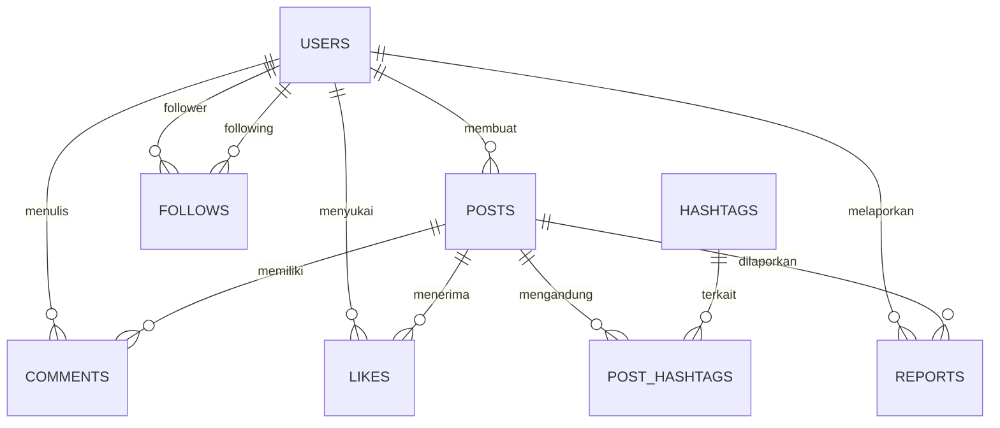

# Product Requirements Document: akuKicau
Version: 1.0, Status: Draft, Tanggal: 24 Oktober 2023

## 1. Overview
### Problem Statement
Pengguna internet di Indonesia membutuhkan platform media sosial alternatif yang ringan, cepat, dan berfokus pada pertukaran informasi teks serta gambar secara real-time tanpa algoritma yang terlalu memanipulasi feed. Platform yang ada saat ini sering kali terasa lambat karena terlalu banyak iklan, algoritma rekomendasi yang membingungkan, dan minimnya kontrol moderasi komunitas lokal yang transparan terhadap konten negatif/spam.

### Solution
akuKicau adalah platform micro-blogging real-time yang menyajikan feed secara kronologis murni untuk memfasilitasi interaksi langsung antar pengguna melalui postingan teks pendek (maksimal 280 karakter) dan unggahan gambar. Platform ini dilengkapi dengan sistem tren tagar (hashtag) otomatis, sistem follow, interaksi komentar dan likes, serta dasbor moderasi khusus bagi administrator untuk menjaga kualitas konten dari laporan spam atau pelanggaran komunitas.

### Goals
*   **G-01**: Mengurangi waktu pemuatan halaman feed utama hingga p95 < 300ms pada koneksi 4G standar.
*   **G-02**: Memastikan 100% postingan baru terdistribusi ke feed pengikut (followers) dalam waktu kurang dari 1 detik.
*   **G-03**: Mencapai retensi pengguna harian (DAU/MAU) sebesar 15% dalam 3 bulan pertama setelah rilis.
*   **G-04**: Mengurangi konten spam yang dilaporkan hingga di bawah 2% dari total postingan harian melalui sistem moderasi cepat (waktu respon admin < 15 menit).

### Non-Goals
*   Aplikasi tidak mendukung fitur panggilan video atau audio (Voice/Video Call).
*   Aplikasi tidak menyediakan fitur pesan langsung (Direct Message) terenkripsi end-to-end pada Fase 1.
*   Aplikasi tidak mendukung format video atau siaran langsung (Live Streaming).

### Target Users
*   **Netizen Aktif**: Pengguna usia 18-35 tahun yang mencari informasi cepat, tren terbaru, dan komunitas hobi.
*   **Kreator Konten Kasual**: Pengguna yang suka membagikan pemikiran pendek, utas (threads), atau karya visual (fotografi/ilustrasi).
*   **Administrator Platform**: Tim internal yang bertugas menjaga kebersihan ekosistem platform dari konten melanggar hukum atau spam.

### Personas
1.  **Nama**: Budi Santoso
    *   **Peran**: Netizen Aktif / Pembaca Informasi
    *   **Kebutuhan**: Mendapatkan informasi terkini mengenai teknologi dan game secara cepat tanpa terdistraksi algoritma rekomendasi yang tidak relevan.
    *   **Pain Points**: Sering merasa frustrasi dengan feed media sosial lain yang penuh dengan iklan dan postingan dari akun yang tidak dia ikuti.
    *   **Konteks**: Mengakses aplikasi menggunakan smartphone kelas menengah saat komuter di KRL Jabodetabek.
2.  **Nama**: Sarah Amelia
    *   **Peran**: Kreator Konten Kasual (Ilustrator)
    *   **Kebutuhan**: Membagikan hasil gambar digital terbarunya dan mendapatkan umpan balik langsung dari pengikutnya dalam bentuk komentar dan suka.
    *   **Pain Points**: Gambar yang diunggah di platform lain sering kali dikompresi terlalu ekstrem sehingga kualitas visualnya menurun drastis.
    *   **Konteks**: Mengunggah karya seni 2-3 kali seminggu dari tablet atau laptop.
3.  **Nama**: Rian Wijaya
    *   **Peran**: Administrator Konten
    *   **Kebutuhan**: Dasbor moderasi yang efisien untuk meninjau, menyetujui, atau menghapus postingan yang dilaporkan oleh pengguna lain secara cepat.
    *   **Pain Points**: Antarmuka moderasi yang lambat dan tidak menyajikan alasan pelaporan secara jelas, membuat proses peninjauan memakan waktu lama.
    *   **Konteks**: Bekerja menggunakan komputer desktop dengan monitor ganda selama giliran kerja 8 jam.

### User Stories
*   **US-01**: Sebagai Pengguna Terdaftar, saya ingin membuat postingan teks maksimal 280 karakter dan melampirkan hingga 1 gambar agar saya dapat mengekspresikan opini atau membagikan momen visual dengan cepat.
*   **US-02**: Sebagai Pengguna Terdaftar, saya ingin mengikuti (follow) pengguna lain agar postingan mereka muncul di feed kronologis saya secara otomatis.
*   **US-03**: Sebagai Pengguna Terdaftar, saya ingin menyukai (like) dan mengomentari postingan pengguna lain agar saya bisa berinteraksi dan memberikan apresiasi terhadap konten tersebut.
*   **US-04**: Sebagai Pengguna Terdaftar, saya ingin mengklik tagar (hashtag) atau melihat tren tagar agar saya dapat menemukan postingan lain yang membahas topik yang sama secara global.
*   **US-05**: Sebagai Pengguna Terdaftar, saya ingin melaporkan postingan yang melanggar aturan komunitas agar platform tetap aman dan bersih dari spam atau ujaran kebencian.
*   **US-06**: Sebagai Administrator, saya ingin melihat daftar postingan yang dilaporkan beserta alasan laporan agar saya dapat mengambil tindakan penghapusan konten atau pemblokiran akun dengan cepat.

---

## 2. Scope
### In-Scope
*   Registrasi pengguna baru menggunakan Email dan Password, serta verifikasi format email standar.
*   Autentikasi sesi menggunakan JSON Web Token (JWT) dengan masa aktif token 7 hari.
*   Pembuatan postingan berupa teks (maksimal 280 karakter) dengan opsional 1 gambar (format JPG/PNG, ukuran maksimal 5MB).
*   Sistem relasi sosial: Follow dan Unfollow pengguna lain.
*   Feed utama yang menampilkan postingan dari akun yang diikuti secara kronologis terbalik (postingan terbaru di atas) dengan sistem pagination (10 postingan per halaman).
*   Interaksi postingan: Suka (Like/Unlike) dan Komentar (maksimal 140 karakter).
*   Deteksi otomatis tagar (hashtag dengan format `#kata`) pada postingan dan kalkulasi tren tagar terpopuler dalam 24 jam terakhir.
*   Dasbor moderasi admin untuk melihat laporan konten, menghapus postingan melanggar, dan memblokir akun pengguna.

### Out-of-Scope (with reason)
*   Fitur Edit Postingan: Dikecualikan untuk menjaga integritas informasi kronologis dan mencegah manipulasi opini setelah postingan mendapat interaksi banyak.
*   Pesan Langsung (Direct Message): Dikecualikan untuk fokus pada performa interaksi publik terlebih dahulu pada rilis pertama.
*   Pencarian Teks Bebas (Full-text Search): Dikecualikan untuk menyederhanakan arsitektur database awal; pencarian difokuskan hanya pada tagar eksak.

### Assumptions
*   Pengguna memiliki koneksi internet minimal 3G dengan kecepatan unduh stabil sebesar 1 Mbps.
*   Penyimpanan gambar dilakukan pada Object Storage eksternal yang kompatibel dengan S3 (misalnya AWS S3 atau Cloudflare R2).

### Dependencies
*   Layanan pengiriman email transaksional (seperti Mailgun atau SendGrid) untuk verifikasi pendaftaran akun baru.
*   Layanan CDN (seperti Cloudflare) untuk caching aset statis dan optimasi pengiriman gambar yang diunggah.

---

## 3. Functional Requirements

| ID | Fitur | Deskripsi Detail | Prioritas | Acceptance Criteria |
| :--- | :--- | :--- | :--- | :--- |
| **FR-01** | Registrasi & Login | Memungkinkan pengguna untuk mendaftar akun baru menggunakan email unik, username unik, dan password (minimal 8 karakter dengan kombinasi angka dan huruf). Login menghasilkan JWT token. | P0 | * **Given** pengguna berada di halaman registrasi, **When** mengisi email baru, username baru, password valid lalu submit, **Then** sistem mengirim email verifikasi dan menyimpan data pengguna. * **Given** pengguna memasukkan kredensial yang salah saat login, **When** menekan tombol login, **Then** sistem menampilkan pesan error "Kredensial salah". |
| **FR-02** | Pembuatan Postingan | Pengguna dapat menulis teks hingga 280 karakter dan melampirkan maksimal 1 berkas gambar (format PNG/JPG, maksimal 5MB). Postingan harus disimpan ke database dan memicu deteksi tagar. | P0 | * **Given** teks input berjumlah 281 karakter, **When** pengguna mencoba mengirim postingan, **Then** tombol kirim dinonaktifkan dan muncul indikator batas karakter. * **Given** gambar berukuran 6MB diunggah, **When** pengguna memilih berkas tersebut, **Then** sistem menampilkan pesan kesalahan "Ukuran berkas maksimal 5MB". |
| **FR-03** | Feed Kronologis | Menampilkan postingan dari pengguna yang diikuti secara urut berdasarkan waktu pembuatan terbaru. Dilengkapi dengan pagination berbasis kursor (cursor-based pagination) untuk mencegah duplikasi konten saat memuat halaman berikutnya. | P0 | * **Given** pengguna memiliki 5 akun yang diikuti, **When** mengakses beranda, **Then** sistem menampilkan postingan dari 5 akun tersebut diurutkan dari yang paling baru dibuat. * **Given** pengguna melakukan scroll ke bawah halaman, **When** mencapai batas bawah, **Then** sistem memuat 10 postingan berikutnya secara otomatis tanpa memuat ulang seluruh halaman. |
| **FR-04** | Follow/Unfollow | Pengguna dapat mengikuti atau berhenti mengikuti akun pengguna lain untuk memperbarui feed beranda mereka secara real-time. | P0 | * **Given** pengguna A belum mengikuti pengguna B, **When** pengguna A menekan tombol "Follow" pada profil B, **Then** status berubah menjadi "Following" dan postingan B muncul di feed A. * **Given** pengguna A sudah mengikuti pengguna B, **When** menekan tombol "Unfollow", **Then** status berubah menjadi "Follow" dan postingan B hilang dari feed A. |
| **FR-05** | Like & Unlike | Pengguna dapat menyukai postingan. Menekan kembali tombol suka akan membatalkan aksi suka tersebut (unlike). Jumlah suka harus diperbarui secara real-time pada tampilan pasca-aksi. | P1 | * **Given** postingan memiliki 10 likes, **When** pengguna menekan tombol "Like", **Then** jumlah likes berubah menjadi 11 dan tombol berubah warna menjadi merah. * **Given** pengguna telah menyukai postingan tersebut, **When** menekan kembali tombol "Like", **Then** jumlah likes berkurang menjadi 10 dan warna tombol kembali normal. |
| **FR-06** | Komentar Postingan | Pengguna dapat menambahkan komentar berupa teks dengan panjang maksimal 140 karakter pada postingan apa pun yang aktif. | P1 | * **Given** halaman detail postingan terbuka, **When** pengguna menulis komentar 100 karakter dan mengirim, **Then** komentar langsung muncul di daftar komentar teratas di bawah postingan tersebut. |
| **FR-07** | Tren Tagar | Sistem mengekstrak tagar (format `#` diikuti karakter alfanumerik) dari setiap postingan baru secara otomatis dan menghitung 5 tagar dengan frekuensi kemunculan tertinggi dalam kurun waktu 24 jam terakhir. | P1 | * **Given** ada 50 postingan baru menggunakan tagar `#TechToday` dalam 1 jam terakhir, **When** pengguna membuka bilah samping tren, **Then** `#TechToday` terdaftar dalam daftar tren terpopuler. * **Given** tagar ditulis dengan karakter khusus seperti `#tech!today`, **When** postingan disimpan, **Then** sistem hanya mengekstrak `#tech` sebagai tagar valid. |
| **FR-08** | Laporan Konten | Pengguna dapat melaporkan postingan yang dianggap melanggar aturan dengan memilih salah satu alasan: "Spam", "Ujaran Kebencian", atau "Konten Tidak Pantas". | P1 | * **Given** pengguna melihat postingan melanggar, **When** memilih opsi "Laporkan" dan memilih alasan "Spam", **Then** sistem mengirim data laporan ke antrean moderasi dan menampilkan toast "Laporan berhasil dikirim". |
| **FR-09** | Moderasi Admin | Admin dapat melihat semua postingan yang dilaporkan, menghapus postingan tersebut dari platform, atau memblokir akun pembuat postingan secara permanen. | P0 | * **Given** admin masuk ke dasbor moderasi, **When** admin menekan tombol "Hapus Postingan" pada item laporan, **Then** postingan tersebut tidak dapat diakses lagi oleh publik di seluruh platform. * **Given** admin menekan "Blokir Pengguna", **When** proses selesai, **Then** status pengguna tersebut berubah menjadi `suspended` dan semua postingannya disembunyikan. |
| **FR-10** | Profil Pengguna | Menampilkan informasi profil pengguna meliputi username, bio (maksimal 160 karakter), jumlah pengikut (followers), jumlah yang diikuti (following), serta daftar postingan yang pernah dibuat oleh pengguna tersebut. | P1 | * **Given** pengguna membuka profil sendiri, **When** menekan tombol "Edit Profil" dan mengubah bio, **Then** informasi bio baru langsung tersimpan dan diperbarui secara instan. |

---

## 4. Non-Functional Requirements
### Performance
*   **Response Time**: Latensi API endpoint untuk memuat feed utama harus memiliki nilai p95 kurang dari 300ms pada beban normal (1000 request per menit).
*   **Throughput**: Sistem harus mampu menangani minimal 500 request penulisan postingan per detik (write TPS) dan 2000 request pembacaan feed per detik (read TPS) tanpa penurunan performa.
*   **Image Optimization**: Setiap gambar yang diunggah harus dikompresi secara otomatis di sisi server menjadi format WebP dengan lebar maksimal 1200px sebelum disimpan ke Object Storage untuk menghemat bandwidth pengguna.

### Security
*   **Authentication**: Menggunakan JSON Web Tokens (JWT) yang ditandatangani dengan algoritma RS256. Access token memiliki masa kedaluwarsa 15 menit, didukung oleh sliding refresh token dengan masa aktif 7 hari yang disimpan dalam cookie HTTP-only secure.
*   **Authorization**: Akses ke API moderasi dibatasi secara ketat menggunakan Role-Based Access Control (RBAC). Hanya token dengan klaim role `admin` yang diizinkan mengakses endpoint di bawah prefix `/api/v1/admin/`.
*   **Encryption**: Semua komunikasi data wajib menggunakan protokol HTTPS dengan TLS 1.3. Enkripsi data pada kondisi diam (at-rest) menggunakan AES-256 pada level database dan penyimpanan objek.
*   **Rate-limiting**: Setiap IP dibatasi maksimal 60 request per menit untuk endpoint publik, dan 5 request per menit untuk endpoint pembuatan postingan/registrasi guna mencegah serangan brute force dan spamming.
*   **Input Sanitization**: Semua input teks dari pengguna wajib disanitasi menggunakan pustaka anti-XSS sebelum disimpan ke database untuk mencegah injeksi skrip berbahaya.

### Scalability
*   **Concurrency**: Sistem arsitektur harus mendukung minimal 5.000 pengguna aktif bersamaan (concurrent users) tanpa terjadi kegagalan koneksi database.
*   **Database Read Replica**: Menggunakan pemisahan database Master (untuk operasi tulis) dan minimal 1 Read Replica (untuk operasi baca feed dan profil) guna mendistribusikan beban kueri.

### Reliability/Availability
*   **Uptime**: Menargetkan ketersediaan layanan minimal 99.9% setiap bulannya (maksimal waktu henti/downtime tidak terencana adalah 43 menit per bulan).
*   **Backup**: Backup database PostgreSQL dilakukan secara otomatis setiap hari pukul 02:00 WIB (UTC+7) ke lokasi penyimpanan terpisah dengan retensi data selama 30 hari.

### Usability & Accessibility
*   **Responsive Design**: Antarmuka web harus responsif penuh dan berfungsi optimal di berbagai ukuran layar mulai dari 320px (mobile) hingga 1920px (desktop).
*   **Accessibility (WCAG)**: Memenuhi standar aksesibilitas WCAG 2.1 Level AA, termasuk kontras warna teks minimal 4.5:1 dan dukungan navigasi keyboard penuh untuk pengoperasian tanpa mouse.

### Compliance
*   **Data Protection**: Mengikuti prinsip perlindungan data pribadi dengan menyediakan opsi bagi pengguna untuk menghapus akun mereka secara permanen (Right to be Forgotten), yang akan menghapus seluruh data pribadi mereka dari database operasional dalam waktu 7x24 jam.

---

## 5. Business Rules
*   **BR-01 (Batas Karakter Postingan)**: Postingan teks tidak boleh kosong (minimal 1 karakter setelah dilakukan pembersihan spasi/trim) dan tidak boleh melebihi 280 karakter.
*   **BR-02 (Batas Gambar)**: Maksimal hanya 1 gambar yang dapat dilampirkan dalam satu postingan. Ukuran gambar sebelum dikompresi tidak boleh melebihi 5MB dengan format tipe MIME berupa `image/jpeg` atau `image/png`.
*   **BR-03 (Relasi Follow)**: Pengguna tidak diizinkan untuk mengikuti (follow) akun mereka sendiri. Sistem harus memblokir request follow jika ID pengikut sama dengan ID target yang diikuti.
*   **BR-04 (Penghitungan Tren Tagar)**: Tagar yang dihitung dalam tren terpopuler harus berasal dari postingan publik yang dibuat dalam kurun waktu tepat 24 jam terakhir. Postingan dari akun yang ditangguhkan (`suspended`) tidak boleh dihitung dalam kalkulasi tren.
*   **BR-05 (Siklus Hidup Akun Ditangguhkan)**: Jika seorang pengguna ditangguhkan (`suspended`) oleh admin, semua postingan, komentar, dan likes yang dibuat oleh pengguna tersebut harus disembunyikan secara otomatis dari feed publik dan profil, namun data tidak langsung dihapus dari database selama 30 hari masa sanggah.
*   **BR-06 (Batas Karakter Komentar)**: Komentar tidak boleh kosong dan maksimal terdiri dari 140 karakter.
*   **BR-07 (Unik Username)**: Username bersifat case-insensitive saat pengecekan keunikan (misal, `Budi` dan `budi` dianggap sama dan tidak boleh ada dua akun dengan username tersebut), hanya boleh mengandung karakter alfanumerik dan garis bawah (`_`).

---

## 6. Edge Cases

| Skenario | Perilaku Diharapkan |
| :--- | :--- |
| **Koneksi Terputus Saat Mengunggah Gambar** | Sistem menampilkan indikator progres unggah yang terhenti. Jika dalam 15 detik koneksi tidak kembali, tampilkan tombol "Coba Lagi" dan batalkan transaksi penyimpanan parsial di server tanpa membuat postingan rusak. |
| **Pengguna Mengirim Postingan Duplikat Secara Cepat** | Terapkan mekanisme penguncian idempotensi pada server menggunakan hash dari konten postingan dan ID pengguna dengan masa berlaku 10 detik. Jika mendeteksi hash yang sama dalam kurun waktu tersebut, server mengembalikan status error 409 Conflict tanpa menyimpan postingan kedua. |
| **Dua Pengguna Saling Follow Bersamaan** | Sistem harus memproses kedua transaksi secara independen di dalam database menggunakan transaksi terisolasi (`SERIALIZABLE` atau `SELECT FOR UPDATE`) untuk menghindari kondisi balapan (race condition) pada penghitung jumlah follower. |
| **Postingan Dihapus Saat Pengguna Lain Sedang Membaca Detailnya** | Jika pengguna lain mencoba berinteraksi (seperti menyukai atau mengomentari) postingan yang baru saja dihapus oleh pembuatnya, API akan mengembalikan status error 404 Not Found, dan aplikasi klien akan menampilkan banner pemberitahuan "Postingan ini telah dihapus". |
| **Pengguna Mencoba Login dengan Akun yang Ditangguhkan** | Proses autentikasi akan gagal di tahap verifikasi status akun. Sistem mengembalikan status 403 Forbidden dengan pesan kesalahan spesifik: "Akun Anda telah ditangguhkan karena pelanggaran ketentuan layanan". |
| **Perbedaan Zona Waktu Pengguna** | Semua stempel waktu (timestamps) disimpan di database dalam format UTC. Aplikasi klien (frontend) bertanggung jawab untuk mengonversi stempel waktu tersebut ke zona waktu lokal perangkat pengguna saat merender tampilan feed. |
| **Unggahan Gambar dengan Ekstensi Palsu (misal berkas EXE diubah menjadi JPG)** | Server wajib melakukan validasi tipe file berdasarkan tanda tangan berkas (magic bytes) di sisi backend, bukan hanya membaca ekstensi file. Jika tidak cocok dengan tipe MIME gambar asli, tolak unggahan dengan error 422 Unprocessable Entity. |
| **Penghapusan Akun dengan Pengikut yang Sangat Banyak** | Proses penghapusan akun dengan pengikut > 10.000 harus dijalankan secara asinkron menggunakan antrean tugas (background job queue) untuk menghindari timeout koneksi database akibat penghapusan baris relasi follow yang masif secara sinkron. |

---

## 7. User Flow & Screen List
### Primary Flow: Membuat Postingan Baru (Happy Path)
1. Pengguna membuka aplikasi dan masuk ke Halaman Beranda.
2. Pengguna menekan tombol "Buat Postingan" atau langsung memfokuskan kursor pada kotak input teks di bagian atas feed.
3. Pengguna mengetik teks (misal: "Halo dunia! #kicaupertama") dan mengklik ikon kamera untuk memilih gambar dari galeri perangkat.
4. Pengguna memilih gambar berformat PNG berukuran 2MB. Gambar berhasil dimuat dan tampil dalam bentuk pratinjau di bawah kotak input.
5. Pengguna menekan tombol "Kirim".
6. Aplikasi mengirimkan data ke API `/api/v1/posts` dengan lampiran gambar.
7. Server memproses, mengompresi gambar, mendeteksi tagar `#kicaupertama`, menyimpan ke database, dan mengembalikan status 201 Created.
8. Aplikasi mengosongkan kotak input, menyembunyikan pratinjau gambar, dan langsung menampilkan postingan baru tersebut di urutan teratas feed beranda pengguna tanpa perlu memuat ulang halaman secara manual.

### Alternative Flow: Gagal Mengirim Karena Batas Karakter Terlampaui
1. Pengguna mengetik teks sepanjang 290 karakter di kotak input postingan.
2. Indikator batas karakter di sudut kanan bawah berubah warna menjadi merah dan menampilkan angka `-10`. Tombol "Kirim" berubah menjadi tidak aktif (disabled).
3. Pengguna mencoba menekan paksa tombol kirim (atau memicu bypass lewat konsol).
4. API mendeteksi panjang teks melanggar aturan bisnis (290 > 280) dan mengembalikan status 422 Unprocessable Entity dengan pesan error "Teks postingan tidak boleh lebih dari 280 karakter".
5. Aplikasi menampilkan pesan error tersebut dalam bentuk inline banner di atas kotak input dan memfokuskan kembali kursor ke area teks agar pengguna dapat mengedit inputnya.

### Screen List

| Nama Layar | Deskripsi / Tujuan | Elemen Utama | Navigasi |
| :--- | :--- | :--- | :--- |
| **Layar Login & Registrasi** | Gerbang masuk pengguna untuk autentikasi dan pendaftaran akun baru. | Form input email, username, password, tombol submit, link beralih mode login/registrasi, pesan error inline. | Diarahkan ke Layar Beranda setelah sukses login. |
| **Layar Beranda (Feed)** | Layar utama yang menampilkan feed kronologis, tren tagar, dan kotak pembuatan postingan cepat. | Header aplikasi, kotak input postingan (teks + unggah gambar), daftar postingan kronologis, bilah samping tren tagar, bilah navigasi utama. | Klik profil pengguna mengarah ke Layar Profil. Klik tagar mengarah ke Layar Pencarian Tagar. |
| **Layar Detail Postingan** | Menampilkan satu postingan secara utuh beserta seluruh komentar yang terkait dengannya. | Postingan utama (pembuat, teks, gambar, waktu, jumlah likes), form input komentar baru (maks 140 karakter), daftar komentar kronologis. | Tombol kembali ke Layar Beranda. Klik nama komentator mengarah ke Layar Profil mereka. |
| **Layar Profil Pengguna** | Menampilkan informasi detail tentang pengguna tertentu dan daftar postingan historis mereka. | Foto profil, username, bio, jumlah pengikut/diikuti, tombol follow/unfollow (jika profil orang lain), daftar postingan pengguna bersangkutan. | Klik tombol pengikut/diikuti membuka daftar relasi. |
| **Layar Dasbor Moderasi Admin** | Panel khusus untuk administrator mengelola konten yang dilaporkan oleh pengguna. | Tabel daftar laporan (ID Laporan, Konten Dilaporkan, Pelapor, Alasan, Tanggal), tombol aksi "Hapus Postingan", tombol aksi "Blokir Pengguna". | Akses terbatas hanya untuk pengguna dengan role admin. |

---

## 8. API Requirements
Semua endpoint menggunakan prefix `/api/v1/`. Format request dan response menggunakan JSON.

### API Endpoints Table

| Method | Endpoint | Auth | Deskripsi | Request Body / Query | Response (Success 200/201) |
| :--- | :--- | :--- | :--- | :--- | :--- |
| **POST** | `/api/v1/auth/register` | Public | Mendaftarkan akun pengguna baru ke sistem. | `{"email": "user@mail.com", "username": "user123", "password": "SecurePassword123"}` | `{"status": "success", "message": "User registered successfully, please verify your email."}` |
| **POST** | `/api/v1/auth/login` | Public | Autentikasi pengguna dan mendapatkan token akses. | `{"username": "user123", "password": "SecurePassword123"}` | `{"status": "success", "access_token": "eyJhbG...", "refresh_token": "eyJhbG..."}` |
| **POST** | `/api/v1/posts` | JWT | Membuat postingan baru dengan teks dan opsional gambar. | Multipart Form Data: `text` (string, max 280), `image` (file, max 5MB) | `{"status": "success", "data": {"id": "uuid-123", "text": "Halo #dunia", "image_url": "https://cdn.akukicau.com/img.webp", "created_at": "2023-10-24T10:00:00Z"}}` |
| **GET** | `/api/v1/posts` | JWT | Mengambil feed postingan kronologis (akun yang diikuti). | Query Params: `limit` (default 10), `cursor` (string, ID postingan terakhir) | `{"status": "success", "data": [...], "next_cursor": "uuid-099"}` |
| **POST** | `/api/v1/posts/:id/like` | JWT | Menyukai postingan tertentu. | None | `{"status": "success", "message": "Post liked", "likes_count": 12}` |
| **DELETE** | `/api/v1/posts/:id/like` | JWT | Membatalkan suka pada postingan tertentu. | None | `{"status": "success", "message": "Post unliked", "likes_count": 11}` |
| **POST** | `/api/v1/posts/:id/comments` | JWT | Menambahkan komentar pada postingan. | `{"text": "Komentar saya di sini"}` | `{"status": "success", "data": {"id": "comment-uuid", "text": "Komentar saya di sini", "created_at": "2023-10-24T10:05:00Z"}}` |
| **POST** | `/api/v1/users/:username/follow`| JWT | Mengikuti pengguna lain berdasarkan username. | None | `{"status": "success", "message": "Successfully followed user"}` |
| **DELETE** | `/api/v1/users/:username/follow`| JWT | Berhenti mengikuti pengguna lain. | None | `{"status": "success", "message": "Successfully unfollowed user"}` |
| **GET** | `/api/v1/trends` | JWT | Mendapatkan daftar 5 tagar terpopuler dalam 24 jam terakhir. | None | `{"status": "success", "data": [{"hashtag": "TechToday", "count": 150}, {"hashtag": "KopiPagi", "count": 98}]}` |
| **POST** | `/api/v1/reports` | JWT | Melaporkan postingan melanggar. | `{"post_id": "uuid-123", "reason": "Spam"}` | `{"status": "success", "message": "Report submitted successfully."}` |
| **GET** | `/api/v1/admin/reports` | Admin JWT| Mengambil daftar laporan konten masuk (khusus admin). | Query Params: `status` (string, e.g. "pending") | `{"status": "success", "data": [{"report_id": "rep-11", "post_id": "uuid-123", "reason": "Spam", "status": "pending"}]}` |
| **DELETE** | `/api/v1/admin/posts/:id` | Admin JWT| Menghapus postingan secara paksa (moderasi admin). | None | `{"status": "success", "message": "Post deleted by admin."}` |

### Standard Error Responses
*   **400 Bad Request**: Request body tidak sesuai skema (misal: JSON malformed).
*   **401 Unauthorized**: Token JWT tidak disertakan, kedaluwarsa, atau tanda tangan tidak valid.
*   **403 Forbidden**: Pengguna tidak memiliki hak akses yang cukup (misal: non-admin mencoba mengakses endpoint admin).
*   **404 Not Found**: Entitas yang dicari (postingan, komentar, user) tidak ditemukan di database.
*   **409 Conflict**: Aksi duplikat terdeteksi (misal: mendaftar dengan email yang sudah terdaftar, menyukai postingan yang sudah disukai).
*   **422 Unprocessable Entity**: Validasi data gagal (misal: teks postingan > 280 karakter, format file gambar salah).
*   **500 Internal Server Error**: Kegagalan sistem internal database atau server crash.

---

## 9. Database Schema
Database menggunakan PostgreSQL (versi 15) dengan struktur ternormalisasi 3NF.

### Tables

#### 1. Table: `users`
| Kolom | Tipe | Constraint | Keterangan |
| :--- | :--- | :--- | :--- |
| `id` | UUID | PRIMARY KEY, DEFAULT gen_random_uuid() | ID unik pengguna. |
| `email` | VARCHAR(255) | UNIQUE, NOT NULL | Alamat email unik. |
| `username` | VARCHAR(50) | UNIQUE, NOT NULL | Nama pengguna unik alfanumerik. |
| `password_hash` | VARCHAR(255) | NOT NULL | Password terenkripsi menggunakan bcrypt. |
| `bio` | VARCHAR(160) | DEFAULT '' | Deskripsi singkat profil. |
| `role` | VARCHAR(20) | NOT NULL, DEFAULT 'user' | Role pengguna (`user`, `admin`). |
| `status` | VARCHAR(20) | NOT NULL, DEFAULT 'active' | Status akun (`active`, `suspended`). |
| `created_at` | TIMESTAMP | NOT NULL, DEFAULT CURRENT_TIMESTAMP | Waktu pendaftaran. |
| `updated_at` | TIMESTAMP | NOT NULL, DEFAULT CURRENT_TIMESTAMP | Waktu modifikasi data terakhir. |

#### 2. Table: `posts`
| Kolom | Tipe | Constraint | Keterangan |
| :--- | :--- | :--- | :--- |
| `id` | UUID | PRIMARY KEY, DEFAULT gen_random_uuid() | ID unik postingan. |
| `user_id` | UUID | FOREIGN KEY REFERENCES users(id) ON DELETE CASCADE | ID pembuat postingan. |
| `text` | VARCHAR(280) | NOT NULL | Isi postingan teks. |
| `image_url` | VARCHAR(512) | NULL | URL gambar yang disimpan di S3. |
| `created_at` | TIMESTAMP | NOT NULL, DEFAULT CURRENT_TIMESTAMP | Waktu pembuatan postingan. |
| `updated_at` | TIMESTAMP | NOT NULL, DEFAULT CURRENT_TIMESTAMP | Waktu modifikasi postingan. |

#### 3. Table: `comments`
| Kolom | Tipe | Constraint | Keterangan |
| :--- | :--- | :--- | :--- |
| `id` | UUID | PRIMARY KEY, DEFAULT gen_random_uuid() | ID unik komentar. |
| `post_id` | UUID | FOREIGN KEY REFERENCES posts(id) ON DELETE CASCADE | ID postingan target. |
| `user_id` | UUID | FOREIGN KEY REFERENCES users(id) ON DELETE CASCADE | ID pembuat komentar. |
| `text` | VARCHAR(140) | NOT NULL | Isi komentar. |
| `created_at` | TIMESTAMP | NOT NULL, DEFAULT CURRENT_TIMESTAMP | Waktu pembuatan komentar. |

#### 4. Table: `likes`
| Kolom | Tipe | Constraint | Keterangan |
| :--- | :--- | :--- | :--- |
| `post_id` | UUID | FOREIGN KEY REFERENCES posts(id) ON DELETE CASCADE | ID postingan yang disukai. |
| `user_id` | UUID | FOREIGN KEY REFERENCES users(id) ON DELETE CASCADE | ID pengguna yang menyukai. |
| `created_at` | TIMESTAMP | NOT NULL, DEFAULT CURRENT_TIMESTAMP | Waktu aksi suka dilakukan. |
| *Composite PK* | (post_id, user_id) | PRIMARY KEY | Mencegah duplikasi suka dari user yang sama. |

#### 5. Table: `follows`
| Kolom | Tipe | Constraint | Keterangan |
| :--- | :--- | :--- | :--- |
| `follower_id` | UUID | FOREIGN KEY REFERENCES users(id) ON DELETE CASCADE | ID pengguna yang mengikuti. |
| `following_id`| UUID | FOREIGN KEY REFERENCES users(id) ON DELETE CASCADE | ID pengguna yang diikuti. |
| `created_at` | TIMESTAMP | NOT NULL, DEFAULT CURRENT_TIMESTAMP | Waktu aksi follow terjadi. |
| *Composite PK* | (follower_id, following_id) | PRIMARY KEY | Mencegah duplikasi hubungan follow. |
| *Check Constraint*| follower_id <> following_id | CHECK | Mencegah user mem-follow diri sendiri. |

#### 6. Table: `hashtags`
| Kolom | Tipe | Constraint | Keterangan |
| :--- | :--- | :--- | :--- |
| `id` | UUID | PRIMARY KEY, DEFAULT gen_random_uuid() | ID unik tagar. |
| `name` | VARCHAR(100) | UNIQUE, NOT NULL | Nama tagar (tanpa simbol #, huruf kecil). |
| `created_at` | TIMESTAMP | NOT NULL, DEFAULT CURRENT_TIMESTAMP | Waktu pertama kali tagar terdaftar. |

#### 7. Table: `post_hashtags`
| Kolom | Tipe | Constraint | Keterangan |
| :--- | :--- | :--- | :--- |
| `post_id` | UUID | FOREIGN KEY REFERENCES posts(id) ON DELETE CASCADE | ID postingan. |
| `hashtag_id` | UUID | FOREIGN KEY REFERENCES hashtags(id) ON DELETE CASCADE | ID tagar terkait. |
| *Composite PK* | (post_id, hashtag_id) | PRIMARY KEY | Relasi many-to-many antara post dan hashtag. |

#### 8. Table: `reports`
| Kolom | Tipe | Constraint | Keterangan |
| :--- | :--- | :--- | :--- |
| `id` | UUID | PRIMARY KEY, DEFAULT gen_random_uuid() | ID unik laporan. |
| `post_id` | UUID | FOREIGN KEY REFERENCES posts(id) ON DELETE CASCADE | ID postingan yang dilaporkan. |
| `reporter_id`| UUID | FOREIGN KEY REFERENCES users(id) ON DELETE CASCADE | ID pengguna yang melapor. |
| `reason` | VARCHAR(50) | NOT NULL | Alasan pelaporan (Spam, Hate Speech, dll). |
| `status` | VARCHAR(20) | NOT NULL, DEFAULT 'pending' | Status laporan (`pending`, `resolved`, `dismissed`). |
| `created_at` | TIMESTAMP | NOT NULL, DEFAULT CURRENT_TIMESTAMP | Waktu pengiriman laporan. |

### Indexes
*   `idx_posts_created_at`: Pada tabel `posts` kolom `(created_at DESC)` untuk optimasi query feed kronologis.
*   `idx_posts_user_id`: Pada tabel `posts` kolom `(user_id)` untuk mempercepat pemuatan postingan di halaman profil.
*   `idx_follows_following_id`: Pada tabel `follows` kolom `(following_id)` untuk mempercepat pencarian daftar pengikut suatu user.
*   `idx_post_hashtags_hashtag_id`: Pada tabel `post_hashtags` kolom `(hashtag_id)` untuk pencarian postingan berdasarkan tagar.
*   `idx_reports_status`: Pada tabel `reports` kolom `(status)` untuk mempercepat pemuatan antrean laporan admin yang berstatus `pending`.

### ERD (Entity Relationship Diagram)

---

## 10. Roles & Permissions

| Role | Modul | Hak Akses (CRUD) | Keterangan |
| :--- | :--- | :--- | :--- |
| **Guest** | Autentikasi | C (Register, Login) | Hanya bisa melakukan registrasi dan login. |
| **Guest** | Feed Publik | R (Read) | Dapat melihat feed tren tagar publik saja (tanpa bisa interaksi). |
| **User** | Postingan | C, R, D (Create, Read, Delete) | Bisa membuat postingan, membaca postingan, dan menghapus postingan milik sendiri. |
| **User** | Komentar | C, R, D (Create, Read, Delete) | Bisa menulis komentar, melihat komentar, dan menghapus komentar miliknya sendiri. |
| **User** | Profil | R, U (Read, Update) | Bisa melihat profil orang lain dan memperbarui profil/bio sendiri. |
| **User** | Laporan | C (Create) | Bisa mengirim laporan konten melanggar. |
| **Admin** | Moderasi | R, U, D (Read, Update, Delete) | Dapat melihat semua laporan masuk, mengubah status laporan, menghapus postingan apa pun, dan menangguhkan akun pengguna. |

---

## 11. Validation Rules

| Field | Aturan Validasi | Pesan Error |
| :--- | :--- | :--- |
| `email` | Format email valid sesuai standar RFC 5322, wajib diisi, maksimal 255 karakter, harus unik di database. | "Format email tidak valid atau email sudah digunakan." |
| `username` | Wajib diisi, minimal 3 karakter, maksimal 50 karakter, hanya boleh mengandung huruf, angka, dan underscore (`_`), harus unik. | "Username hanya boleh berisi huruf, angka, dan garis bawah, serta minimal 3 karakter." |
| `password` | Wajib diisi, minimal 8 karakter, mengandung minimal 1 angka dan 1 huruf kapital. | "Kata sandi harus minimal 8 karakter dengan minimal 1 angka dan 1 huruf kapital." |
| `post.text` | Jika tidak ada gambar: Wajib diisi. Maksimal 280 karakter. Karakter spasi berlebih di awal/akhir disanitasi (trim). | "Teks postingan tidak boleh kosong dan tidak boleh melebihi 280 karakter." |
| `post.image` | Opsional, maksimal 1 file, ukuran berkas <= 5MB, jenis MIME harus `image/jpeg` atau `image/png`. | "Berkas harus berupa gambar JPG/PNG dan berukuran maksimal 5MB." |
| `comment.text`| Wajib diisi, minimal 1 karakter, maksimal 140 karakter. | "Komentar tidak boleh kosong dan tidak boleh melebihi 140 karakter." |
| `report.reason`| Wajib diisi, nilai harus salah satu dari: `["Spam", "Hate Speech", "Inappropriate Content"]`. | "Alasan pelaporan tidak valid." |

---

## 12. Error Handling
### Strategy
*   **Klien/Frontend**: Kesalahan validasi formulir harus ditampilkan secara inline di bawah input bidang yang bermasalah sebelum form dikirim. Kesalahan jaringan global atau kegagalan server seketika harus ditampilkan menggunakan komponen Toast melayang yang otomatis hilang dalam 5 detik.
*   **Idempotensi**: Pada operasi kritis seperti pembuatan postingan dan likes, sistem backend akan menyimpan token idempotensi (dibuat oleh frontend secara acak per aksi kirim) di Redis dengan TTL 10 detik. Jika ada request ulang dengan token yang sama, kembalikan hasil respons yang disimpan sebelumnya tanpa memproses ulang ke database utama.
*   **Sistem Retry**: Untuk pengiriman email verifikasi yang gagal karena batasan rate limit provider eksternal, server akan memasukkan tugas tersebut ke antrean BullMQ dengan strategi eksponensial Back-off (retry maksimal 3 kali, jeda awal 5 detik).

### Error Scenarios Table

| Skenario Error | HTTP Code | Pesan ke User | Aksi Sistem |
| :--- | :--- | :--- | :--- |
| **Token JWT Kedaluwarsa** | 401 | "Sesi Anda telah berakhir. Silakan masuk kembali." | Hapus cookie token di browser, arahkan paksa pengguna ke Layar Login. |
| **Koneksi Database Terputus** | 500 | "Terjadi gangguan internal pada sistem. Silakan coba beberapa saat lagi." | Kirim peringatan otomatis ke tim enginering melalui Slack/PagerDuty webhook, catat error log dengan level `FATAL`. |
| **Aksi Follow Pengguna yang Sama** | 409 | "Anda sudah mengikuti pengguna ini." | Tolak penulisan baris baru ke database, tidak mengubah status apa pun di server. |
| **Mengunggah File Rusak/Corrupted** | 422 | "Berkas gambar rusak atau tidak dapat dibaca." | Batalkan proses upload ke S3, bersihkan berkas sampah di direktori temp server. |
| **Postingan Tidak Ditemukan** | 404 | "Postingan yang Anda cari tidak tersedia." | Kembalikan respons kosong ke frontend, hilangkan rendering elemen postingan tersebut dari UI klien jika sebelumnya ada di cache lokal. |

---

## 13. Analytics & Monitoring
### Events Table

| Nama Event | Deskripsi | Properti Tambahan |
| :--- | :--- | :--- |
| `user_signup` | Dipicu saat pengguna baru berhasil menyelesaikan verifikasi pendaftaran akun. | `user_id`, `referral_source`, `timestamp` |
| `post_created` | Dipicu setiap kali ada postingan baru yang berhasil disimpan ke database. | `post_id`, `user_id`, `has_image` (true/false), `char_count`, `timestamp` |
| `post_liked` | Dipicu saat pengguna menyukai sebuah postingan. | `post_id`, `author_id` (pembuat post), `liker_id` (user yg menyukai), `timestamp` |
| `report_submitted`| Dipicu saat pengguna mengirimkan laporan konten. | `report_id`, `post_id`, `reason`, `reporter_id`, `timestamp` |
| `admin_moderation_action`| Dipicu saat admin melakukan tindakan moderasi (hapus post/blokir user). | `admin_id`, `target_type` (post/user), `target_id`, `action_taken` (delete/suspend), `timestamp` |

### Monitoring
*   **Health Checks**: Endpoint `/api/v1/health` disediakan untuk memantau status kesehatan server backend, koneksi database PostgreSQL, dan latensi koneksi Redis. Probe Kubernetes atau AWS Route53 memanggil endpoint ini setiap 10 detik.
*   **Error Tracking**: Menggunakan Sentry SDK untuk menangkap semua pengecualian yang tidak tertangani (unhandled exceptions) di backend dan frontend. Setiap error dengan status kode >= 500 harus mengirimkan notifikasi instan ke Slack Developer Alert.
*   **Business Metrics Dashboard**: Menggunakan Grafana untuk memvisualisasikan data dari database operasional, menampilkan grafik jumlah postingan baru per jam, jumlah pengguna aktif harian (DAU), dan rata-rata waktu penyelesaian laporan oleh tim admin.

---

## 14. Tech Stack

| Layer | Pilihan Teknologi | Alasan Pemilihan |
| :--- | :--- | :--- |
| **Frontend Web** | Next.js (React) | Mendukung Server-Side Rendering (SSR) untuk optimasi SEO pada halaman postingan publik, serta performa rendering komponen yang cepat untuk feed dinamis. |
| **CSS Framework** | Tailwind CSS | Mempercepat proses pembuatan antarmuka responsif yang konsisten dengan ukuran bundel CSS yang sangat minimal. |
| **Backend API** | Node.js dengan NestJS | Framework TypeScript yang terstruktur, memudahkan implementasi dependency injection, memiliki performa I/O non-blocking yang sangat baik untuk menangani request konkurensi tinggi. |
| **Database Utama** | PostgreSQL 15 | Database relasional tangguh dengan dukungan penuh integritas data (ACID), kueri relasional kompleks untuk sistem follow, dan performa indeks yang matang. |
| **Cache & Session** | Redis | Digunakan untuk menyimpan session token (blacklist), data tren tagar terpopuler sementara, dan membatasi laju request (rate limiter) karena latensi baca/tulisnya yang sangat rendah (< 1ms). |
| **Object Storage** | Cloudflare R2 | Penyimpanan gambar tanpa biaya egress transfer data, sangat menghemat biaya operasional pengiriman aset gambar berukuran besar ke CDN. |
| **Container & Deploy** | Docker & Kubernetes | Menjamin konsistensi lingkungan pengembangan hingga produksi, serta mempermudah auto-scaling pod backend saat terjadi lonjakan trafik lalu lintas data secara tiba-tiba. |

---

## 15. Future Improvements
*   **Fase 2 (Skalabilitas & Fitur Sosial Lanjutan)**:
    *   Pengembangan sistem Utas (Threads) yang memungkinkan pengguna menghubungkan beberapa postingan miliknya menjadi satu rangkaian cerita berkelanjutan.
    *   Implementasi WebSockets untuk notifikasi real-time (likes baru, komentar baru, pengikut baru) langsung ke perangkat pengguna tanpa perlu memuat ulang halaman.
    *   Sistem pencarian teks bebas (Full-text Search) berbasis Elasticsearch untuk memfasilitasi pencarian kata kunci di luar tagar.
*   **Fase 3 (Keamanan & Personalisasi)**:
    *   Sistem Pesan Langsung (Direct Message) terenkripsi end-to-end menggunakan Signal Protocol.
    *   Penyaringan konten otomatis berbasis kecerdasan buatan (AI Content Moderation) untuk mendeteksi gambar tidak pantas (NSFW) sebelum disimpan ke server publik.
    *   Opsi akun privat (Private Account) di mana pengguna harus menyetujui permintaan pengikut sebelum mereka dapat melihat postingan yang diunggah.