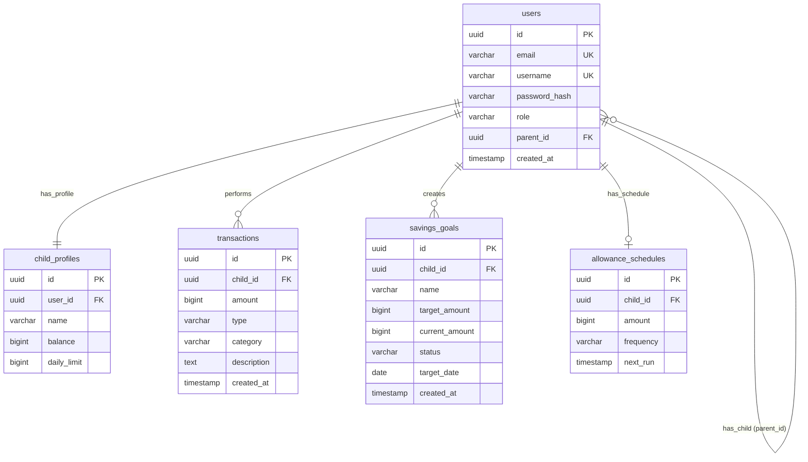

# Product Requirements Document: JajanPintar
Version: 1.0, Status: Draft, Tanggal: 24 Oktober 2023

## 1. Overview
- **Problem Statement**: Orang tua sering kali kesulitan memantau dan mengontrol uang jajan anak secara konsisten. Anak-anak cenderung menghabiskan uang jajan mereka tanpa belajar menabung atau memprioritaskan kebutuhan. Pencatatan manual sering terlupakan, menyebabkan ketidakcocokan saldo virtual dan hilangnya kesempatan untuk mengajarkan literasi keuangan sejak dini kepada anak.
- **Solution**: JajanPintar adalah aplikasi manajemen uang jajan anak berbasis web-mobile (PWA) yang memungkinkan orang tua mendistribusikan uang jajan secara otomatis berdasarkan jadwal, membatasi pengeluaran harian, dan memantau alokasi dana anak (Jajan, Tabungan, Berbagi). Anak mendapatkan dasbor sederhana untuk mencatat pengeluaran mereka dan memantau target tabungan (Celengan) mereka sendiri secara visual.
- **Goals**:
  - Mengurangi waktu pencatatan manual uang jajan orang tua sebesar 80% (dari rata-rata 30 menit per minggu menjadi kurang dari 5 menit per minggu).
  - Meningkatkan tingkat tabungan anak minimal 15% dari total uang jajan yang diterima dalam waktu 3 bulan penggunaan.
  - Memastikan waktu muat halaman (p95) di bawah 800ms pada koneksi 3G/4G.
  - Mendukung hingga 5.000 pengguna aktif bulanan (MAU) pada fase awal peluncuran.
- **Non-Goals**:
  - Aplikasi ini tidak terhubung langsung dengan rekening bank riil atau gerbang pembayaran (payment gateway) untuk transfer uang nyata pada Fase 1. Semua saldo dan transaksi bersifat virtual (ledger-based) yang dijamin secara fisik oleh orang tua.
  - Tidak menerbitkan kartu debit fisik atau gelang pembayaran NFC khusus anak.
- **Target Users**:
  - Orang tua dengan anak usia 6 - 15 tahun yang memiliki akses ke gawai (smartphone/tablet).
  - Anak-anak usia 6 - 15 tahun yang mulai belajar mengelola uang jajan sendiri.
- **Personas**:
  - **Persona 1**: 
    - *Nama*: Budi Santoso (Ayah, 38 tahun)
    - *Peran*: Kepala Keluarga / Pengelola Keuangan Utama
    - *Kebutuhan*: Mengotomatiskan pemberian uang jajan mingguan anak dan membatasi pengeluaran jajan harian anak agar tidak habis sekaligus.
    - *Pain Points*: Sering lupa memberikan uang jajan tepat waktu, dan tidak tahu uang jajan habis dipakai untuk apa saja oleh anak.
    - *Konteks*: Bekerja kantoran, menggunakan smartphone Android dengan waktu luang terbatas.
  - **Persona 2**:
    - *Nama*: Ani Santoso (Anak, 10 tahun)
    - *Peran*: Anak / Pengguna Tabungan
    - *Kebutuhan*: Membeli mainan Lego seharga Rp200.000 dengan menyisihkan uang jajannya setiap hari.
    - *Pain Points*: Sulit menahan keinginan membeli jajanan di sekolah, tidak tahu sisa uang tabungan yang sudah dikumpulkan.
    - *Konteks*: Menggunakan tablet di rumah setelah pulang sekolah untuk memperbarui catatan celengannya.
- **User Stories**:
  - **US-01**: Sbg Orang Tua, saya ingin mendaftarkan akun dan membuat profil untuk anak saya agar saya dapat mengelola uang jajan mereka secara terpisah.
  - **US-02**: Sbg Orang Tua, saya ingin menjadwalkan pembagian uang jajan otomatis (harian/mingguan) agar saya tidak perlu mengingat untuk memberikannya secara manual.
  - **US-03**: Sbg Orang Tua, saya ingin menetapkan batas maksimal pengeluaran harian anak agar anak belajar memprioritaskan belanjanya.
  - **US-04**: Sbg Anak, saya ingin mencatat pengeluaran jajan saya dengan memilih kategori yang sudah disediakan agar saldo virtual saya terbarui secara real-time.
  - **US-05**: Sbg Anak, saya ingin membuat target tabungan (Celengan) baru dengan nominal target tertentu agar saya termotivasi menyisihkan saldo jajan saya ke sana.
  - **US-06**: Sbg Orang Tua, saya ingin melihat grafik ringkasan pengeluaran anak per bulan agar saya dapat mengevaluasi kebiasaan belanja anak saya.

---

## 2. Scope
- **In-Scope**:
  - Registrasi dan autentikasi pengguna (Orang Tua dan Anak).
  - Manajemen Profil Anak (maksimal 5 anak per akun Orang Tua).
  - Sistem Buku Kas Virtual (Ledger) dengan pencatatan otomatis uang jajan terjadwal (Cron-based).
  - Batasan Pengeluaran Harian (Daily Spending Limit).
  - Fitur Celengan (Savings Goals) untuk anak dengan sistem alokasi manual dari saldo utama.
  - Pencatatan Transaksi Pengeluaran oleh Anak dengan persetujuan otomatis atau manual dari Orang Tua.
  - Dasbor ringkasan performa keuangan (grafik pengeluaran & pencapaian tabungan).
- **Out-of-Scope (with reason)**:
  - Integrasi Bank API / Open Finance (Dihilangkan untuk mempercepat time-to-market dan menghindari kompleksitas regulasi finansial OJK pada Fase 1).
  - Rekomendasi investasi atau produk keuangan riil untuk anak (Fokus utama murni pada pencatatan dan edukasi dasar).
- **Assumptions**:
  - Orang tua memegang uang fisik/digital riil dan bertanggung jawab mencairkan uang tersebut kepada anak secara offline sesuai dengan saldo virtual di aplikasi.
  - Anak memiliki akses ke perangkat smartphone milik sendiri atau meminjam milik orang tua secara berkala.
- **Dependencies**:
  - Layanan pengiriman email (seperti SendGrid atau Mailgun) untuk verifikasi akun orang tua dan reset password.
  - Cron Job scheduler yang andal untuk memproses distribusi uang jajan terjadwal setiap hari pada pukul 00:00.

---

## 3. Functional Requirements

| ID | Fitur | Deskripsi Detail | Prioritas | Acceptance Criteria |
| :--- | :--- | :--- | :--- | :--- |
| **FR-01** | Registrasi & Login Orang Tua | Orang tua dapat mendaftar menggunakan email aktif, nama lengkap, dan password minimal 8 karakter, serta melakukan login. | P0 | - Given: Form registrasi diisi dengan email valid yang belum terdaftar.<br>- When: Tombol "Daftar" ditekan.<br>- Then: Sistem mengirimkan email verifikasi dan menyimpan data user dengan status pending. |
| **FR-02** | Manajemen Profil Anak | Orang tua dapat membuat profil anak dengan nama panggilan, username unik, password (untuk login anak), dan tanggal lahir. | P0 | - Given: Orang tua sudah login.<br>- When: Menginput nama "Ani", username "ani123", password "ani12345", lalu klik "Simpan".<br>- Then: Akun anak dibuat dan terasosiasi dengan akun orang tua tersebut. |
| **FR-03** | Penjadwalan Uang Jajan | Orang tua dapat mengatur nominal uang jajan otomatis (contoh: Rp10.000) dengan frekuensi Harian atau Mingguan (setiap hari Senin). | P0 | - Given: Konfigurasi uang jajan Rp20.000 mingguan diatur pada profil anak.<br>- When: Hari Senin pukul 00:00 UTC terjadi.<br>- Then: Saldo virtual anak bertambah Rp20.000 dan tercatat transaksi masuk otomatis. |
| **FR-04** | Limit Harian | Orang tua dapat menetapkan batas maksimal pengeluaran harian anak (misal: Rp15.000 per hari). | P0 | - Given: Limit harian anak diatur Rp15.000. Saldo anak Rp50.000.<br>- When: Anak mencoba mencatat pengeluaran sebesar Rp16.000 pada hari yang sama.<br>- Then: Transaksi ditolak dengan pesan error "Melebihi batas pengeluaran harian". |
| **FR-05** | Pencatatan Pengeluaran Anak | Anak dapat mencatat pengeluaran dengan memasukkan nominal, memilih kategori (Makanan, Mainan, Buku, Lainnya), dan deskripsi singkat. | P0 | - Given: Anak login dengan akunnya.<br>- When: Memasukkan pengeluaran Rp5.000 untuk kategori "Makanan".<br>- Then: Saldo utama anak berkurang Rp5.000 dan tercatat di riwayat transaksi. |
| **FR-06** | Pembuatan Celengan (Savings Goal) | Anak atau Orang Tua dapat membuat target tabungan dengan nama target, nominal target, dan tanggal tenggat waktu. | P1 | - Given: Anak berada di menu Celengan.<br>- When: Membuat target "Beli Lego" senilai Rp200.000.<br>- Then: Sistem membuat entitas Celengan baru dengan progres 0%. |
| **FR-07** | Alokasi Dana ke Celengan | Anak dapat memindahkan sebagian dari saldo utamanya ke dalam target Celengan tertentu. | P1 | - Given: Saldo utama anak Rp30.000 dan Celengan "Beli Lego" memiliki progres Rp10.000.<br>- When: Anak memindahkan Rp5.000 ke Celengan.<br>- Then: Saldo utama menjadi Rp25.000, isi Celengan menjadi Rp15.000. |
| **FR-08** | Konfirmasi Penarikan Celengan | Ketika Celengan sudah tercapai, anak mengajukan klaim penarikan saldo Celengan ke saldo utama, yang memerlukan persetujuan orang tua. | P1 | - Given: Celengan "Beli Lego" terisi Rp200.000 (100%).<br>- When: Anak menekan tombol "Cairkan Celengan".<br>- Then: Status celengan menjadi "Pending Approval" dan notifikasi dikirim ke dasbor Orang Tua. |
| **FR-09** | Dasbor Orang Tua | Menampilkan ringkasan saldo total semua anak, status target celengan anak, dan daftar aktivitas transaksi terbaru. | P0 | - Given: Orang tua login dan mengakses halaman utama.<br>- When: Halaman dimuat.<br>- Then: Menampilkan daftar anak dengan saldo masing-masing dan grafik tren pengeluaran 7 hari terakhir. |
| **FR-10** | Ekspor Riwayat Transaksi | Orang tua dapat mengekspor riwayat transaksi anak ke format CSV untuk rentang tanggal tertentu (maksimal 90 hari). | P2 | - Given: Orang tua berada di halaman Laporan.<br>- When: Memilih rentang tanggal 1-30 September dan klik "Ekspor CSV".<br>- Then: File CSV terunduh berisi kolom Tanggal, Nama Anak, Tipe, Kategori, Nominal, Deskripsi. |

---

## 4. Non-Functional Requirements
- **Performance**:
  - Waktu respon API (p95) harus kurang dari 500ms untuk semua permintaan baca (GET) dan kurang dari 800ms untuk operasi tulis (POST/PUT/DELETE).
  - Mampu menangani beban hingga 1.000 pengguna aktif bersamaan (concurrent users) tanpa penurunan performa.
  - Ukuran bundle asset frontend (HTML/JS/CSS) awal saat dimuat pertama kali tidak boleh melebihi 1.5MB (uncompressed).
- **Security**:
  - Autentikasi menggunakan stateless JSON Web Token (JWT) dengan masa berlaku token 24 jam.
  - Enkripsi password menggunakan algoritma bcrypt dengan work factor 10.
  - Enkripsi data dalam perjalanan (in transit) menggunakan TLS 1.3 dan enkripsi data diam (at rest) menggunakan AES-256 pada tingkat database.
  - Menerapkan pembatasan laju permintaan (rate limiting) maksimal 100 request per menit per alamat IP untuk mencegah serangan Brute Force dan DDoS.
  - Melakukan sanitasi input pada semua parameter API untuk mencegah SQL Injection dan Cross-Site Scripting (XSS).
- **Scalability**:
  - Arsitektur backend harus stateless agar dapat diskalakan secara horizontal menggunakan container (Docker) di belakang Load Balancer.
- **Reliability/Availability**:
  - Target ketersediaan sistem (Uptime) minimal 99.9% per bulan.
  - Pencadangan database otomatis dilakukan setiap hari pukul 02:00 UTC dan disimpan di cloud storage terpisah dengan retensi 30 hari.
  - Recovery Time Objective (RTO) maksimal 4 jam dan Recovery Point Objective (RPO) maksimal 24 jam.
- **Usability**:
  - Antarmuka pengguna untuk anak-anak harus menggunakan ukuran font minimal 16px, tombol berukuran minimal 48x48px untuk kemudahan ketukan jari, serta menggunakan bahasa yang sederhana dan representasi visual (ikon).
- **Accessibility**:
  - Memenuhi standar WCAG 2.1 Level AA.
  - Mendukung navigasi keyboard dasar untuk form input utama.
- **Compliance**:
  - Mematuhi Undang-Undang Pelindungan Data Pribadi (UU PDP) Indonesia dengan menyediakan fitur bagi pengguna untuk menghapus akun mereka secara permanen (Right to be Forgotten).

---

## 5. Business Rules (BR)
- **BR-01**: Saldo virtual anak tidak boleh bernilai negatif dalam kondisi apa pun. Transaksi pengeluaran atau alokasi celengan yang melebihi saldo utama yang tersedia harus ditolak secara otomatis oleh sistem.
- **BR-02**: Batas Pengeluaran Harian (Daily Limit) dihitung berdasarkan akumulasi transaksi pengeluaran (kategori pengeluaran) anak dari pukul 00:00:00 hingga 23:59:59 berdasarkan zona waktu lokal yang diatur pada profil orang tua.
- **BR-03**: Akun anak tidak dapat melakukan perubahan username atau menghapus riwayat transaksi secara mandiri. Modifikasi data tersebut hanya dapat dilakukan melalui akun Orang Tua yang terasosiasi.
- **BR-04**: Alokasi dana dari saldo utama ke Celengan bersifat mengunci dana tersebut. Dana di dalam Celengan tidak dapat digunakan untuk transaksi pengeluaran harian sebelum dicairkan kembali ke saldo utama.
- **BR-05**: Setiap akun Orang Tua maksimal hanya dapat mendaftarkan dan mengelola 5 profil anak aktif secara bersamaan untuk mencegah penyalahgunaan resource server pada tier gratis.
- **BR-06**: Transaksi yang sudah dicatat dan disimpan tidak dapat diubah (immutable). Jika terjadi kesalahan input, koreksi dilakukan dengan membuat transaksi baru bertipe penyesuaian (adjustment) oleh Orang Tua.

---

## 6. Edge Cases

| Skenario | Perilaku Diharapkan |
| :--- | :--- |
| **Empty State** pada Dasbor Anak | Menampilkan ilustrasi karakter kartun ramah anak dengan teks ajakan: "Belum ada uang jajan hari ini. Minta Ayah/Ibu untuk menambahkan uang jajan pertamamu!". |
| **Double Click** pada tombol catat transaksi | Menerapkan mekanisme idempotency token pada backend dan mendisabilitaskan tombol kirim pada frontend segera setelah klik pertama untuk mencegah pencatatan ganda. |
| **Edit saldo bersamaan** oleh Orang Tua dan Anak | Menggunakan mekanisme locking optimistik (versioning) pada tingkat database. Transaksi terakhir yang mencoba mengubah saldo akan dibatalkan jika mendeteksi versi data telah berubah, dan menampilkan pesan "Silakan muat ulang halaman, saldo Anda telah diperbarui". |
| **Tanpa Koneksi Internet** (Offline Sync) | Aplikasi PWA menyimpan antrean transaksi lokal di IndexedDB. Ketika koneksi terdeteksi kembali, aplikasi melakukan sinkronisasi otomatis ke server. Selama offline, saldo tidak dapat dikurangi melebihi saldo terakhir yang tersinkronisasi. |
| **Input Nominal Ekstrim** (contoh: Rp999.000.000.000) | Sistem membatasi input nominal transaksi maksimal Rp10.000.000 per transaksi tunggal dan memunculkan pesan validasi: "Nominal transaksi tidak boleh melebihi Rp10.000.000". |
| **Perbedaan Zona Waktu** Orang Tua & Anak | Semua penyimpanan waktu di database wajib menggunakan format UTC. Konversi ke waktu lokal dilakukan di sisi klien berdasarkan pengaturan zona waktu pada profil Orang Tua untuk konsistensi perhitungan Daily Limit. |
| **Bypass Hak Akses API** (Anak menembak API Orang Tua) | Setiap API endpoint Orang Tua memvalidasi klaim `role` di dalam JWT. Jika token anak mencoba mengakses endpoint `/api/v1/parent/*`, sistem langsung mengembalikan status HTTP 403 Forbidden. |
| **Gagal Koneksi Database** saat Distribusi Cron | Transaksi pembagian uang jajan otomatis dibungkus dalam Database Transaction. Jika terjadi kegagalan di tengah jalan, seluruh operasi di-rollback, status ditandai gagal pada tabel log cron, dan sistem akan mencoba kembali (retry) maksimal 3 kali pada interval berikutnya. |

---

## 7. User Flow & Screen List
### Primary Flow: Setup Awal & Penggunaan Harian
1. Orang Tua mendaftar akun -> Masuk ke dasbor.
2. Orang Tua membuat profil Anak (menentukan username, password, dan limit harian).
3. Orang Tua mengatur jadwal uang jajan otomatis (misal: Mingguan, Rp50.000).
4. Anak masuk (login) ke aplikasi menggunakan username dan password yang dibuatkan orang tua.
5. Anak mencatat pengeluaran pertamanya senilai Rp10.000 untuk beli buku.
6. Saldo anak berkurang secara real-time, dan orang tua menerima pembaruan aktivitas di dasbor mereka.

### Alternative Flow: Batas Limit Harian Terlampaui
1. Anak memiliki saldo Rp100.000 dengan limit harian Rp20.000.
2. Anak sudah membelanjakan Rp15.000 pada hari tersebut.
3. Anak mencoba mencatat pengeluaran baru sebesar Rp10.000.
4. Sistem memvalidasi: Total belanja hari ini (Rp15.000 + Rp10.000 = Rp25.000) > Limit Harian (Rp20.000).
5. Sistem menolak transaksi, menampilkan pesan peringatan di layar anak, dan tidak mengurangi saldo utama.

### Screen List Table
| Nama Layar | Destinasi Navigasi | Elemen Utama | Navigasi |
| :--- | :--- | :--- | :--- |
| **Layar Login/Register** | Dasbor Orang Tua / Dasbor Anak | Form Input Email/Username, Form Password, Tombol Submit, Link Beralih Login Anak/Orang Tua. | Mengarahkan ke Dasbor masing-masing role setelah sukses autentikasi. |
| **Dasbor Orang Tua** | Detail Anak, Tambah Anak, Pengaturan Jadwal | Ringkasan Saldo Semua Anak, List Anak, Log Aktivitas Terbaru, Tombol "Tambah Profil Anak". | Klik nama anak mengarah ke Detail Anak. Klik ikon roda gigi mengarah ke Pengaturan Jadwal. |
| **Detail Anak (Sisi Orang Tua)** | Edit Profil, Riwayat Transaksi | Grafik Pengeluaran, List Celengan Anak, Tombol "Sesuaikan Saldo", Tombol "Ubah Limit". | Tombol kembali mengarah ke Dasbor Orang Tua. |
| **Dasbor Anak** | Catat Transaksi, Celengan Saya | Kartu Saldo Utama, Sisa Limit Hari Ini, Tombol Besar "Catat Pengeluaran", Ringkasan Celengan Aktif. | Menu navigasi bawah (bottom nav): Beranda, Celengan, Riwayat. |
| **Layar Catat Transaksi (Anak)** | Dasbor Anak | Input Angka Nominal besar, Dropdown Kategori, Form Catatan/Deskripsi, Tombol "Simpan Transaksi". | Tombol Batal kembali ke Dasbor Anak. Tombol Simpan mengarahkan kembali setelah sukses. |
| **Layar Celengan (Anak)** | Tambah Celengan, Detail Celengan | List Celengan Aktif, Progress Bar (%) pencapaian, Tombol "Buat Celengan Baru". | Klik Celengan mengarah ke Detail Celengan untuk alokasi dana. |

---

## 8. API Requirements
- **Authentication**: JWT Bearer Token diletakkan pada Header `Authorization: Bearer <token>`.
- **Public Endpoints**:
  - `POST /api/v1/auth/register` (Orang Tua mendaftar)
  - `POST /api/v1/auth/login` (Login Orang Tua & Anak)

### API Endpoint List
| Method | Endpoint | Auth | Deskripsi | Request Body (JSON) | Response (JSON) Success (200/201) |
| :--- | :--- | :--- | :--- | :--- | :--- |
| **POST** | `/api/v1/children` | Parent | Membuat profil anak baru | `{"name": "Ani", "username": "ani123", "password": "securepassword", "daily_limit": 20000}` | `{"id": "c1-uuid", "username": "ani123", "status": "active"}` |
| **GET** | `/api/v1/children` | Parent | Mengambil semua data anak | None | `[{"id": "c1-uuid", "name": "Ani", "balance": 50000, "daily_limit": 20000}]` |
| **POST** | `/api/v1/transactions` | Parent/Child | Mencatat transaksi baru | `{"child_id": "c1-uuid", "amount": 10000, "type": "expense", "category": "food", "description": "Beli roti"}` | `{"transaction_id": "t1-uuid", "new_balance": 40000}` |
| **GET** | `/api/v1/children/:id/transactions` | Parent/Child | Mendapatkan riwayat transaksi anak | Query params: `page`, `limit` | `{"data": [{"id": "t1-uuid", "amount": 10000, "type": "expense", "category": "food", "created_at": "2023-10-24T10:00:00Z"}], "total": 1}` |
| **POST** | `/api/v1/savings-goals` | Parent/Child | Membuat Celengan baru | `{"child_id": "c1-uuid", "name": "Beli Lego", "target_amount": 200000, "target_date": "2023-12-31"}` | `{"goal_id": "g1-uuid", "status": "active"}` |
| **POST** | `/api/v1/savings-goals/:id/allocate` | Child | Mengalokasikan saldo ke Celengan | `{"amount": 5000}` | `{"goal_id": "g1-uuid", "current_amount": 15000, "new_balance": 25000}` |

### Standard Error Responses
- **400 Bad Request**: Request body tidak valid atau melanggar validasi skema.
  ```json
  {"error": "ValidationError", "message": "Nominal transaksi tidak boleh bernilai negatif"}
  ```
- **401 Unauthorized**: Token JWT tidak disertakan atau sudah kedaluwarsa.
  ```json
  {"error": "Unauthorized", "message": "Token tidak valid atau kedaluwarsa"}
  ```
- **403 Forbidden**: Percobaan akses resource milik user lain atau role tidak sesuai.
  ```json
  {"error": "Forbidden", "message": "Anda tidak memiliki hak akses untuk aksi ini"}
  ```
- **404 Not Found**: Resource (misal ID anak atau ID Celengan) tidak ditemukan.
  ```json
  {"error": "NotFound", "message": "Data anak tidak ditemukan"}
  ```
- **409 Conflict**: Username anak sudah digunakan oleh pengguna lain.
  ```json
  {"error": "Conflict", "message": "Username sudah terdaftar"}
  ```
- **422 Unprocessable Entity**: Melanggar aturan bisnis (misal melebihi limit harian).
  ```json
  {"error": "BusinessRuleViolation", "message": "Transaksi ditolak: Melebihi batas pengeluaran harian"}
  ```
- **500 Internal Server Error**: Kegagalan sistem internal.
  ```json
  {"error": "InternalServerError", "message": "Terjadi kesalahan pada sistem kami, silakan coba beberapa saat lagi"}
  ```

---

## 9. Database Schema
Database relasional menggunakan PostgreSQL dengan struktur ternormalisasi (3NF).

### Table: `users`
| Kolom | Tipe | Constraint | Keterangan |
| :--- | :--- | :--- | :--- |
| **id** | UUID | Primary Key, DEFAULT gen_random_uuid() | ID unik user |
| **email** | VARCHAR(255) | UNIQUE, NULLABLE (untuk anak) | Email login (hanya untuk Orang Tua) |
| **username** | VARCHAR(50) | UNIQUE, NOT NULL | Username login |
| **password_hash** | VARCHAR(255) | NOT NULL | Hash password bcrypt |
| **role** | VARCHAR(10) | CHECK (role IN ('parent', 'child')), NOT NULL | Peran user |
| **parent_id** | UUID | FK references users(id) ON DELETE CASCADE, NULLABLE | Relasi anak ke orang tua |
| **created_at** | TIMESTAMP WITH TIME ZONE | DEFAULT CURRENT_TIMESTAMP, NOT NULL | Waktu registrasi |
| **updated_at** | TIMESTAMP WITH TIME ZONE | DEFAULT CURRENT_TIMESTAMP, NOT NULL | Waktu pembaruan profil |
| **deleted_at** | TIMESTAMP WITH TIME ZONE | NULLABLE | Untuk soft delete |

### Table: `child_profiles`
| Kolom | Tipe | Constraint | Keterangan |
| :--- | :--- | :--- | :--- |
| **id** | UUID | Primary Key, DEFAULT gen_random_uuid() | ID profil |
| **user_id** | UUID | FK references users(id) ON DELETE CASCADE, UNIQUE, NOT NULL | Relasi ke tabel users (role child) |
| **name** | VARCHAR(100) | NOT NULL | Nama panggilan anak |
| **balance** | BIGINT | DEFAULT 0, CHECK (balance >= 0), NOT NULL | Saldo virtual aktif (dalam satuan rupiah) |
| **daily_limit** | BIGINT | DEFAULT 0, CHECK (daily_limit >= 0), NOT NULL | Batas pengeluaran harian |
| **created_at** | TIMESTAMP WITH TIME ZONE | DEFAULT CURRENT_TIMESTAMP, NOT NULL | Waktu pembuatan profil |
| **updated_at** | TIMESTAMP WITH TIME ZONE | DEFAULT CURRENT_TIMESTAMP, NOT NULL | Waktu pembaruan profil |

### Table: `transactions`
| Kolom | Tipe | Constraint | Keterangan |
| :--- | :--- | :--- | :--- |
| **id** | UUID | Primary Key, DEFAULT gen_random_uuid() | ID unik transaksi |
| **child_id** | UUID | FK references users(id) ON DELETE RESTRICT, NOT NULL | Relasi ke anak penerima/pengeluar |
| **amount** | BIGINT | CHECK (amount > 0), NOT NULL | Nominal transaksi |
| **type** | VARCHAR(10) | CHECK (type IN ('income', 'expense')), NOT NULL | Tipe transaksi |
| **category** | VARCHAR(20) | CHECK (category IN ('allowance', 'food', 'toy', 'book', 'charity', 'other', 'savings_deposit', 'savings_withdraw')), NOT NULL | Kategori penggunaan |
| **description** | TEXT | NULLABLE | Catatan tambahan transaksi |
| **created_at** | TIMESTAMP WITH TIME ZONE | DEFAULT CURRENT_TIMESTAMP, NOT NULL | Waktu transaksi dibuat |

### Table: `savings_goals`
| Kolom | Tipe | Constraint | Keterangan |
| :--- | :--- | :--- | :--- |
| **id** | UUID | Primary Key, DEFAULT gen_random_uuid() | ID unik celengan |
| **child_id** | UUID | FK references users(id) ON DELETE CASCADE, NOT NULL | Relasi ke pemilik celengan |
| **name** | VARCHAR(100) | NOT NULL | Nama target tabungan |
| **target_amount** | BIGINT | CHECK (target_amount > 0), NOT NULL | Target nominal |
| **current_amount** | BIGINT | DEFAULT 0, CHECK (current_amount >= 0), NOT NULL | Saldo terkumpul saat ini |
| **status** | VARCHAR(20) | CHECK (status IN ('active', 'completed', 'claimed_pending', 'claimed_approved')), DEFAULT 'active', NOT NULL | Status pencapaian celengan |
| **target_date** | DATE | NULLABLE | Tenggat waktu |
| **created_at** | TIMESTAMP WITH TIME ZONE | DEFAULT CURRENT_TIMESTAMP, NOT NULL | Waktu pembuatan target |
| **updated_at** | TIMESTAMP WITH TIME ZONE | DEFAULT CURRENT_TIMESTAMP, NOT NULL | Waktu pembaruan target |

### Table: `allowance_schedules`
| Kolom | Tipe | Constraint | Keterangan |
| :--- | :--- | :--- | :--- |
| **id** | UUID | Primary Key, DEFAULT gen_random_uuid() | ID unik jadwal |
| **child_id** | UUID | FK references users(id) ON DELETE CASCADE, UNIQUE, NOT NULL | Satu anak hanya memiliki satu jadwal aktif |
| **amount** | BIGINT | CHECK (amount > 0), NOT NULL | Nominal uang jajan rutin |
| **frequency** | VARCHAR(10) | CHECK (frequency IN ('daily', 'weekly')), NOT NULL | Frekuensi pembagian |
| **next_run** | TIMESTAMP WITH TIME ZONE | NOT NULL | Waktu pembagian berikutnya |
| **created_at** | TIMESTAMP WITH TIME ZONE | DEFAULT CURRENT_TIMESTAMP, NOT NULL | Waktu pembuatan jadwal |
| **updated_at** | TIMESTAMP WITH TIME ZONE | DEFAULT CURRENT_TIMESTAMP, NOT NULL | Waktu pembaruan jadwal |

### Database Indexes
- `CREATE INDEX idx_users_parent_id ON users(parent_id);` (Mempercepat query daftar anak dari orang tua)
- `CREATE INDEX idx_transactions_child_created ON transactions(child_id, created_at DESC);` (Mempercepat pemuatan riwayat transaksi per anak)
- `CREATE INDEX idx_savings_goals_child ON savings_goals(child_id);` (Mempercepat pemuatan celengan per anak)
- `CREATE INDEX idx_allowance_schedules_next_run ON allowance_schedules(next_run);` (Mempercepat pencarian jadwal oleh worker cron)

### Entity-Relationship Diagram (ERD)


---

## 10. Roles & Permissions

| Role | Modul | Hak (CRUD) | Keterangan |
| :--- | :--- | :--- | :--- |
| **Parent** | Profil Anak | CRUD | Dapat membuat, melihat, memperbarui, dan menghapus profil anak di bawah akunnya. |
| **Parent** | Transaksi Anak | CR | Dapat mencatat transaksi masuk/keluar untuk anak, serta melihat semua riwayat transaksi semua anak. Tidak dapat melakukan Update/Delete transaksi yang sudah disimpan. |
| **Parent** | Jadwal Uang Jajan | CRUD | Memiliki kontrol penuh atas penjadwalan distribusi otomatis. |
| **Parent** | Konfirmasi Celengan | RU | Dapat melihat klaim pencairan celengan anak dan menyetujui (approve) atau menolaknya. |
| **Child** | Profil Sendiri | R | Hanya dapat melihat profilnya sendiri (nama, saldo, limit harian). Tidak bisa mengubah data profil. |
| **Child** | Transaksi Sendiri | CR | Dapat mencatat transaksi pengeluarannya sendiri dan melihat riwayat transaksinya sendiri. |
| **Child** | Celengan | CRU | Dapat membuat celengan baru, mengalokasikan saldo ke celengan miliknya, dan mengajukan pencairan. |

---

## 11. Validation Rules

| Field | Aturan Validasi | Pesan Error (Bahasa Indonesia) |
| :--- | :--- | :--- |
| **email (Parent)** | Format email valid sesuai RFC 5322, tidak boleh kosong, maksimal 255 karakter, harus unik. | "Format email tidak valid atau email sudah terdaftar." |
| **password (Parent/Child)** | Minimal 8 karakter, wajib mengandung minimal 1 huruf besar dan 1 angka. | "Password minimal harus 8 karakter dan mengandung setidaknya 1 huruf besar dan 1 angka." |
| **username (Child)** | Alfanumerik lowercase saja, minimal 4 karakter, maksimal 20 karakter, tidak boleh ada spasi, harus unik global. | "Username anak hanya boleh huruf kecil dan angka, minimal 4 karakter, serta harus unik." |
| **amount (Transaction)** | Harus berupa bilangan bulat positif, minimal Rp100, maksimal Rp10.000.000. | "Nominal transaksi harus berupa angka positif antara Rp100 hingga Rp10.000.000." |
| **daily_limit** | Harus berupa bilangan bulat positif, minimal Rp0 (0 berarti tanpa limit), maksimal Rp5.000.000. | "Batas harian harus berupa angka positif maksimal Rp5.000.000." |
| **target_amount (Celengan)** | Harus lebih besar dari Rp1.000, maksimal Rp50.000.000. | "Target Celengan harus berada di antara Rp1.000 hingga Rp50.000.000." |
| **target_date (Celengan)** | Harus berupa tanggal di masa depan (minimal Besok). | "Tanggal tenggat waktu target harus lebih besar dari hari ini." |

---

## 12. Error Handling
- **Strategy**:
  - Untuk error validasi input pada form, pesan kesalahan harus ditampilkan langsung secara inline di bawah field input yang bermasalah sebelum form dikirim.
  - Untuk kegagalan sistem global atau error API (seperti 500 atau kehilangan jaringan internet), tampilkan notifikasi berupa Toast Banner merah di bagian atas halaman dengan tombol "Coba Lagi" (Retry).
  - Untuk transaksi pengiriman saldo/pencatatan transaksi, sistem di backend wajib menerapkan database transaction rollback demi menjaga integritas saldo virtual.

### Error Mapping Table
| Skenario Error | HTTP Code / Error Code | Pesan ke Pengguna | Aksi Sistem |
| :--- | :--- | :--- | :--- |
| Saldo Kurang saat Transaksi | 422 Unprocessable Entity | "Saldo virtual kamu tidak cukup untuk melakukan transaksi ini." | Transaksi dibatalkan, input form dipertahankan agar pengguna bisa mengedit nominal. |
| Limit Harian Terlampaui | 422 Unprocessable Entity | "Pencatatan gagal karena total belanja hari ini sudah melebihi batas yang diatur Orang Tua." | Menolak penulisan ke DB, memunculkan dialog informasi sisa limit saat ini. |
| Token Kedaluwarsa | 401 Unauthorized | "Sesi Anda telah berakhir. Silakan login kembali." | Menghapus token dari local storage dan mengarahkan paksa user ke layar login. |
| Konflik Username Anak | 409 Conflict | "Username tersebut sudah dipakai oleh anak lain. Coba gunakan nama lain." | Mencegah submit form, menandai warna merah pada field username. |
| Koneksi Terputus | Network Error (Client) | "Koneksi internet terputus. Transaksi disimpan secara lokal dan akan disinkronkan nanti." | Menyimpan payload transaksi ke IndexedDB (PWA offline mode) dan menandai status transaksi "pending sync". |

---

## 13. Analytics & Monitoring
- **Events Logging Table**:

| Event Name | Trigger | Properties | Tujuan Bisnis |
| :--- | :--- | :--- | :--- |
| `user_signup` | Registrasi Orang Tua sukses | `user_id`, `email`, `timestamp` | Mengukur tingkat konversi pendaftaran user baru. |
| `child_profile_created` | Orang Tua sukses membuat profil anak | `parent_id`, `child_id`, `daily_limit_value` | Menganalisis rata-rata jumlah anak per keluarga. |
| `transaction_logged` | Anak/Orang Tua mencatat transaksi pengeluaran | `child_id`, `amount`, `category`, `source` (child/parent) | Memantau kategori pengeluaran terpopuler dan volume transaksi virtual. |
| `savings_goal_created` | Anak membuat Celengan baru | `child_id`, `target_amount`, `target_date` | Mengukur minat anak dalam menabung. |
| `savings_goal_completed` | Celengan mencapai target 100% | `child_id`, `goal_id`, `duration_days` | Mengukur kesuksesan program edukasi menabung anak. |

- **Monitoring System**:
  - **Sentry**: Digunakan untuk melacak error runtime frontend (React/Vue) dan backend (Node.js/Go) dengan tingkat keparahan (severity) kritis untuk error berkode 5xx.
  - **Prometheus & Grafana**: Digunakan untuk memantau metrik infrastruktur (CPU usage, Memory usage, DB Connection Pool) dan metrik bisnis (jumlah transaksi per jam, jumlah registrasi harian).
  - **Health Check Endpoint**: `/api/v1/health` harus mengembalikan `{"status": "UP"}` dan status HTTP 200 jika database dan redis scheduler dapat diakses dengan latensi di bawah 100ms.

---

## 14. Tech Stack

| Layer | Pilihan Teknologi | Alasan Pemilihan terhadap Kebutuhan Produk |
| :--- | :--- | :--- |
| **Frontend** | React (Next.js) / PWA | Memungkinkan pembuatan Progressive Web App (PWA) agar aplikasi terasa seperti aplikasi native di ponsel anak, mendukung mode offline dengan Service Workers untuk pencatatan tanpa internet. |
| **Backend** | Node.js dengan Express / NestJS | Ekosistem yang matang untuk pembuatan REST API cepat, penanganan I/O non-blocking yang efisien untuk konkurensi tinggi, dan kemudahan integrasi dengan pustaka enkripsi. |
| **Database** | PostgreSQL | Mendukung transaksi ACID yang ketat untuk menjamin konsistensi saldo virtual anak (mencegah kondisi balapan/race conditions saat update saldo bersamaan). |
| **Cache & Queue** | Redis | Digunakan sebagai storage session, rate limiter, serta broker antrean (BullMQ) untuk mengelola job cron pembagian uang jajan terjadwal secara presisi. |
| **Hosting/Cloud** | AWS (ECS Fargate + RDS PostgreSQL) | Menyediakan skalabilitas horizontal otomatis tanpa server (serverless container) dan manajemen database terkelola dengan sistem backup harian otomatis yang andal. |

---

## 15. Future Improvements
- **Fase 2 (Integrasi Finansial Nyata)**:
  - Integrasi dengan E-Wallet lokal (seperti GoPay, OVO, atau LinkAja) menggunakan Open API untuk memfasilitasi pengisian saldo virtual secara riil dari rekening orang tua ke akun anak.
  - Opsi penarikan saldo virtual anak menjadi saldo e-wallet riil anak yang diawasi orang tua.
- **Fase 3 (Gamifikasi & Edukasi)**:
  - Fitur "Quest/Tugas Mandiri": Orang tua dapat memberikan misi rumah tangga (misal: membersihkan kamar, mencuci piring) dengan imbalan tambahan uang jajan virtual setelah disetujui orang tua.
  - Kuis Literasi Keuangan Interaktif: Modul pembelajaran keuangan dasar berseri di dalam aplikasi untuk anak dengan sistem reward berupa lencana digital (badges).