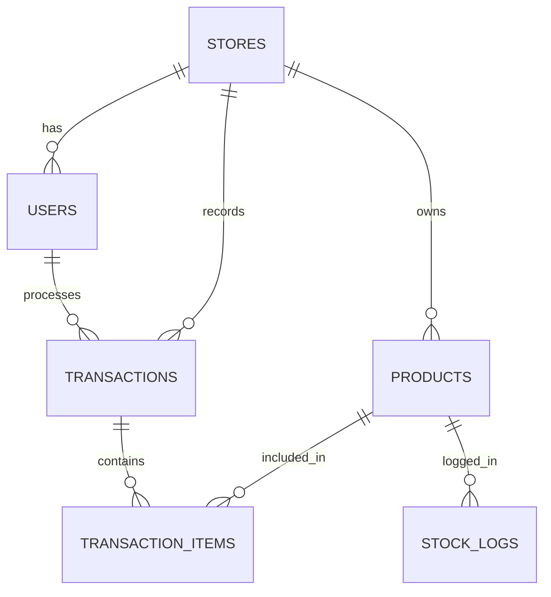

# Product Requirements Document: KelolaBos
Version: 1.0, Status: Draft, Tanggal: 24 Oktober 2023

## 1. Overview
### Problem Statement
UMKM retail di Indonesia sering mengalami ketidakcocokan stok barang (selisih fisik vs catatan) sebesar 5% hingga 15% setiap bulannya akibat pencatatan manual pada buku kertas. Selain itu, pemilik toko kesulitan mengetahui keuntungan bersih secara real-time karena data penjualan, modal (HPP), dan biaya operasional tidak terintegrasi. Kasir juga membutuhkan waktu lebih dari 3 menit per pelanggan untuk melayani transaksi pembayaran karena pencarian harga barang dilakukan secara manual tanpa sistem scan barcode.

### Solution
KelolaBos adalah aplikasi Point of Sale (POS) dan manajemen inventaris berbasis web mobile-first yang dirancang khusus untuk UMKM. Aplikasi ini memungkinkan kasir mencatat transaksi dalam waktu kurang dari 15 detik menggunakan fitur scan barcode kamera ponsel, serta memproses transaksi secara offline-first yang akan otomatis tersinkronisasi saat koneksi internet kembali pulih. Pemilik toko dapat mengakses dashboard analitik untuk melihat laba kotor, laba bersih, dan status stok kritis secara real-time dari perangkat mana saja.

### Goals
- Mengurangi waktu checkout transaksi kasir dari rata-rata 3 menit menjadi p95 < 15 detik per transaksi.
- Menurunkan selisih stok (inventory shrinkage) hingga di bawah 0.5% melalui pencatatan log mutasi stok otomatis.
- Menyajikan laporan laba-rugi bulanan secara instan dengan waktu muat halaman dashboard p95 < 500ms.
- Menjamin operasional kasir tetap berjalan 100% tanpa hambatan ketika terjadi gangguan koneksi internet (offline-first).

### Non-Goals
- Tidak mendukung manajemen multi-gudang (multi-warehouse) pada versi ini; satu akun toko hanya memiliki satu gudang fisik.
- Tidak menyediakan fitur penggajian (payroll) karyawan atau manajemen shift kerja yang kompleks.
- Tidak melakukan integrasi langsung dengan API marketplace eksternal seperti Tokopedia, Shopee, atau TikTok Shop.

### Target Users
- Pemilik UMKM Retail (Toko Kelontong, Butik, Minimarket Mandiri).
- Kasir / Staf Operasional Toko.

### Personas
1. **Budi (Pemilik Toko)**
   - **Peran**: Pemilik Toko Kelontong "Budi Jaya".
   - **Kebutuhan**: Memantau keuntungan bersih bulanan tanpa harus menghitung manual dari tumpukan nota, serta menerima peringatan jika stok barang habis.
   - **Pain Points**: Sering kehilangan data penjualan karena nota fisik hilang, dan tidak tahu pasti produk mana yang paling memberikan margin keuntungan besar.
   - **Konteks**: Mengelola toko dengan 2 kasir, jarang berada di toko secara fisik karena harus menyuplai barang dari distributor.
2. **Siti (Kasir)**
   - **Peran**: Kasir Toko.
   - **Kebutuhan**: Memproses transaksi pelanggan dengan cepat saat antrean panjang dan mencetak struk belanja.
   - **Pain Points**: Kesulitan menghitung uang kembalian secara manual dan sering salah mengingat harga barang yang tidak memiliki label harga fisik.
   - **Konteks**: Menggunakan tablet Android kelas menengah dengan koneksi internet seluler yang sering tidak stabil di dalam toko.

### User Stories
- **US-01**: Sebagai Pemilik Toko, saya ingin melihat total penjualan, total modal, dan laba bersih harian di dashboard agar saya dapat memantau performa keuangan toko secara instan.
- **US-02**: Sebagai Pemilik Toko, saya ingin menambahkan produk baru lengkap dengan SKU, harga beli, harga jual, dan batas stok minimum agar sistem dapat melacak inventaris dan memberikan peringatan otomatis.
- **US-03**: Sebagai Kasir, saya ingin memindai barcode produk menggunakan kamera tablet/ponsel saya agar produk langsung masuk ke keranjang belanja tanpa perlu mengetik nama produk.
- **US-04**: Sebagai Kasir, saya ingin memproses pembayaran transaksi menggunakan metode Tunai dan QRIS dinamis agar pelanggan memiliki opsi pembayaran yang fleksibel dan cepat.
- **US-05**: Sebagai Kasir, saya ingin tetap bisa memasukkan transaksi penjualan ke dalam sistem saat koneksi internet terputus agar antrean pelanggan tidak terganggu.
- **US-06**: Sebagai Pemilik Toko, saya ingin membatasi akses hak suara Kasir agar mereka tidak bisa mengubah harga barang atau melihat laporan keuangan toko.

---

## 2. Scope
### In-Scope
- **Manajemen Autentikasi & Otorisasi**: Registrasi toko, login multi-role (Owner & Cashier) menggunakan JWT.
- **Manajemen Inventaris**: CRUD produk, pelacakan stok, log mutasi stok, alert batas stok minimum.
- **Modul POS (Point of Sale)**: Keranjang belanja, scan barcode kamera, kalkulator kembalian, integrasi QRIS statis/dinamis, cetak struk via bluetooth thermal printer.
- **Sinkronisasi Offline-First**: Penyimpanan transaksi lokal menggunakan IndexedDB dan sinkronisasi otomatis ke server cloud ketika koneksi terdeteksi aktif.
- **Dashboard Laporan**: Laporan penjualan harian/mingguan/bulanan, laporan laba rugi, ekspor laporan ke format PDF/CSV.

### Out-of-Scope (with reason)
- **Sistem Hutang/Piutang Pelanggan**: Ditunda ke Fase 2 untuk memfokuskan stabilitas fitur transaksi tunai/QRIS terlebih dahulu.
- **Modul Pembelian ke Supplier (Purchase Order)**: Ditunda karena pemilik toko saat ini lebih memilih melakukan pencatatan manual untuk transaksi ke supplier eksternal.

### Assumptions
- Perangkat keras kasir (smartphone/tablet Android/iOS) memiliki kamera belakang dengan resolusi minimal 5 Megapixel dengan fitur autofocus yang berfungsi untuk memindai barcode secara optimal.
- Pengguna memiliki browser modern yang mendukung standard Service Worker dan IndexedDB (Chrome v80+, Safari v14+, Edge v80+).

### Dependencies
- **API RajaOngkir** (jika ada pengiriman, namun pada versi ini tidak digunakan).
- **Payment Gateway API (Xendit)** untuk pembuatan QRIS dinamis secara real-time.
- **Library Barcode Scanner**: `@zxing/library` untuk pemindaian barcode berbasis browser.

---

## 3. Functional Requirements

| ID | Fitur | Deskripsi Detail | Prioritas | Acceptance Criteria |
| :--- | :--- | :--- | :--- | :--- |
| **FR-01** | Registrasi & Login Multi-Role | Pengguna dapat mendaftarkan toko baru dan membuat akun dengan role Owner. Owner dapat membuat akun tambahan untuk Kasir dengan hak akses terbatas. | P0 | - **Given**: User berada di halaman registrasi. **When**: Mengisi nama toko, email unik, password, dan klik daftar. **Then**: Akun berhasil dibuat dan user diarahkan ke dashboard Owner. - **Given**: Owner masuk ke menu staf. **When**: Membuat akun kasir baru. **Then**: Akun kasir aktif dan hanya bisa mengakses menu POS. |
| **FR-02** | Manajemen Produk | Owner dapat menambah, mengedit, dan menghapus produk dengan atribut: Nama, SKU, Kategori, Harga Beli, Harga Jual, Stok Sekarang, dan Stok Minimum. | P0 | - **Given**: Owner berada di form tambah produk. **When**: Mengisi semua field valid dan menyimpan. **Then**: Produk tersimpan di database dan stok awal tercatat di log mutasi. - **Given**: Produk dengan nama yang sama sudah ada di toko tersebut. **When**: Menekan tombol simpan. **Then**: Muncul pesan error "SKU atau Nama Produk sudah terdaftar". |
| **FR-03** | Scan Barcode Produk | Kasir dapat memindai barcode (EAN-13 / UPC) menggunakan kamera perangkat untuk memasukkan produk ke dalam keranjang POS. | P0 | - **Given**: Kamera aktif pada layar POS. **When**: Barcode produk didekatkan ke kamera. **Then**: Produk dengan SKU tersebut otomatis masuk ke keranjang belanja dengan kuantitas 1. - **Given**: Barcode tidak terdaftar di sistem. **When**: Barcode terpindai. **Then**: Muncul bunyi beep error dan toast "Produk tidak ditemukan". |
| **FR-04** | Transaksi Penjualan (POS) | Kasir dapat memilih produk, mengatur kuantitas, memilih metode pembayaran (Tunai/QRIS), menghitung kembalian, dan menyelesaikan transaksi. | P0 | - **Given**: Terdapat produk di keranjang belanja. **When**: Kasir memilih metode Tunai dan memasukkan nominal uang pas. **Then**: Transaksi berhasil diproses, stok produk berkurang, dan struk belanja ditampilkan. - **Given**: Nominal uang tunai kurang dari total belanja. **When**: Kasir menekan tombol bayar. **Then**: Tombol dinonaktifkan dan muncul validasi "Uang pembayaran kurang". |
| **FR-05** | Offline Transaksi | Kasir tetap dapat melakukan transaksi penjualan saat koneksi internet terputus. Data disimpan di IndexedDB lokal. | P0 | - **Given**: Perangkat tidak terhubung ke internet (offline mode). **When**: Kasir menyelesaikan transaksi POS. **Then**: Transaksi disimpan di IndexedDB lokal, stok lokal terpotong, dan struk tercetak dengan tanda "Offline". |
| **FR-06** | Sinkronisasi Data Otomatis | Sistem mendeteksi koneksi internet kembali aktif dan mensinkronisasikan semua transaksi offline ke server cloud. | P0 | - **Given**: Terdapat 3 transaksi tertunda di database lokal. **When**: Koneksi internet terhubung kembali (online). **Then**: Sistem otomatis mengirimkan data transaksi ke server secara berurutan, status database lokal terupdate menjadi "Synced", dan stok di cloud disesuaikan. |
| **FR-07** | Dashboard Analitik Owner | Owner dapat melihat grafik penjualan harian, total omzet, total HPP, laba kotor, dan daftar produk terlaris. | P1 | - **Given**: Owner membuka dashboard utama. **When**: Memilih filter tanggal "Hari Ini". **Then**: Angka penjualan, HPP, dan laba kotor dihitung secara real-time dan ditampilkan dalam waktu < 500ms. |
| **FR-08** | Peringatan Stok Minimum | Sistem menampilkan indikator visual berwarna merah untuk produk yang stoknya berada di bawah batas minimum yang ditentukan. | P1 | - **Given**: Stok produk "Kopi Susu" tersisa 2, dengan batas minimum 5. **When**: Owner melihat daftar produk atau dashboard. **Then**: Produk tersebut ditandai dengan badge merah "Stok Kritis: 2" dan muncul di panel alert dashboard. |
| **FR-09** | Cetak Struk Bluetooth | Kasir dapat mencetak struk belanja fisik ke printer thermal bluetooth 58mm langsung dari aplikasi. | P1 | - **Given**: Transaksi berhasil diselesaikan. **When**: Kasir menekan tombol "Cetak Struk". **Then**: Aplikasi mengirimkan payload teks format ESC/POS ke printer bluetooth yang terhubung dan mencetak struk fisik. |
| **FR-10** | Ekspor Laporan Penjualan | Owner dapat mengekspor laporan transaksi bulanan ke file CSV dan PDF. | P2 | - **Given**: Owner berada di halaman Laporan Penjualan. **When**: Memilih bulan Oktober 2023 dan mengklik "Ekspor ke CSV". **Then**: File CSV terunduh berisi kolom: Tanggal, ID Transaksi, SKU, Nama Produk, Qty, Harga Jual, Total Jual, Margin Keuntungan. |

---

## 4. Non-Functional Requirements
### Performance
- **Response Time**: API response time p95 harus < 300ms untuk aksi tulis (write operations) dan p95 < 150ms untuk aksi baca (read operations) pada kondisi beban normal (1000 concurrent users).
- **Load Speed**: Halaman POS harus dapat dimuat dan siap digunakan dalam waktu kurang dari 1.5 detik pada jaringan 3G (throttled 1.6 Mbps).
- **Throughput**: Sistem server harus mampu menangani minimal 150 request per detik (RPS) tanpa adanya kegagalan koneksi (0% error rate).

### Security
- **Authentication**: Menggunakan JSON Web Token (JWT) dengan algoritma HS256. Token disimpan di `HttpOnly` cookie untuk mencegah serangan XSS. Masa berlaku token adalah 24 jam.
- **Authorization**: Role-Based Access Control (RBAC) diterapkan secara ketat di level API. Endpoint laporan keuangan (`/api/v1/reports/*`) wajib menolak request dari user dengan role `cashier` dengan status HTTP 403 Forbidden.
- **Encryption**: Seluruh lalu lintas data wajib menggunakan protokol HTTPS dengan enkripsi TLS 1.3. Data sensitif pada database (seperti password) wajib di-hash menggunakan algoritma `bcrypt` dengan work factor 10.
- **Rate-Limiting**: Pembatasan request maksimal 60 request per menit per alamat IP untuk mencegah brute-force dan DDoS ringan.
- **Input Sanitization**: Semua input string dari user dibersihkan dari tag HTML dan karakter berbahaya menggunakan pustaka sanitasi input untuk mencegah SQL Injection dan Stored XSS.
- **Secrets Management**: Kunci API pihak ketiga (Xendit) dan kredensial database disimpan menggunakan Environment Variables di server produksi, bukan hardcoded di dalam repositori kode.

### Scalability
- **Concurrency**: Aplikasi dirancang untuk mendukung hingga 5,000 pengguna terdaftar dengan 1,000 pengguna aktif bersamaan (concurrent users) tanpa penurunan performa.
- **Horizontal Scaling**: Backend service harus stateless sehingga dapat dideploy menggunakan auto-scaling group di atas Docker/Kubernetes dengan trigger utilisasi CPU > 70%.

### Reliability/Availability
- **Uptime**: Ketersediaan sistem (Service Level Objective) ditargetkan minimal 99.9% setiap bulannya (maksimal downtime 43 menit per bulan).
- **Backup**: Database PostgreSQL di-backup secara otomatis setiap hari pada pukul 02:00 WIB. File backup disimpan di Cloud Storage terpisah dengan retensi penyimpanan selama 30 hari.
- **Disaster Recovery**: Recovery Point Objective (RPO) maksimal 24 jam dan Recovery Time Objective (RTO) maksimal 2 jam untuk pemulihan sistem dari kegagalan total.

### Usability
- **Mobile-First Design**: Seluruh antarmuka dirancang responsif dengan fokus utama pada layar smartphone/tablet (resolusi lebar 360px hingga 1024px).
- **Touch Target**: Ukuran tombol interaktif minimal 48px x 48px untuk meminimalkan kesalahan ketukan oleh jari kasir.

### Accessibility
- **WCAG Target**: Memenuhi standar aksesibilitas WCAG 2.1 Level AA.
- **Color Contrast**: Rasio kontras teks dengan latar belakang minimal 4.5:1 untuk keterbacaan optimal di bawah sinar matahari langsung (kondisi toko outdoor).
- **Screen Reader**: Menyediakan atribut `aria-label` yang lengkap pada semua tombol ikon tanpa teks di layar POS.

### Compliance
- **Data Protection**: Mematuhi Undang-Undang Perlindungan Data Pribadi (UU PDP) Indonesia. Data transaksi dan data pribadi pengguna tidak boleh dijual atau dibagikan ke pihak ketiga tanpa persetujuan eksplisit.
- **Data Retention**: Data transaksi penjualan disimpan minimal selama 5 tahun sesuai dengan aturan perpajakan standar di Indonesia sebelum dapat diarsipkan secara permanen.

---

## 5. Business Rules (BR)
- **BR-01 (Kalkulasi Stok)**: Stok produk tidak boleh bernilai negatif. Jika stok produk bernilai 0, produk tersebut tidak dapat diproses dalam transaksi POS, kecuali produk diset dengan flag `allow_backorder = true`.
- **BR-02 (Harga Jual vs Harga Beli)**: Harga Jual produk (`selling_price`) tidak boleh lebih rendah dari Harga Beli (`purchase_price`). Sistem harus menolak penyimpanan produk jika kondisi ini dilanggar dengan pesan error yang jelas.
- **BR-03 (Konsistensi Transaksi)**: Total nilai transaksi (`grand_total`) harus sama dengan jumlah dari (`selling_price` dikali `quantity`) untuk semua item di dalam transaksi tersebut, dikurangi nilai diskon transaksi (`discount_amount`) jika ada.
- **BR-04 (Masa Berlaku QRIS)**: QRIS dinamis yang dibuat untuk transaksi pembayaran POS hanya berlaku selama 10 menit (600 detik). Jika pembayaran belum diverifikasi lewat dari waktu tersebut, transaksi otomatis dibatalkan dan status QRIS diset expired.
- **BR-05 (Pembatasan Role)**: Kasir hanya diperbolehkan membuat transaksi dan melihat riwayat transaksinya sendiri pada hari yang berjalan. Kasir dilarang melihat transaksi kasir lain, mengubah harga produk di keranjang (kecuali diberikan izin diskon oleh Owner), atau menghapus transaksi yang sudah selesai.
- **BR-06 (Penghapusan Produk)**: Produk yang sudah memiliki riwayat transaksi tidak boleh didelete secara fisik dari database (hard delete). Penghapusan produk harus menggunakan mekanisme soft delete (`deleted_at` terisi) untuk menjaga integritas data laporan keuangan historis.
- **BR-07 (Sinkronisasi Konflik)**: Jika terjadi konflik data transaksi offline (misal: ID Transaksi yang sama dikirim dua kali akibat kegagalan jaringan saat sinkronisasi), sistem backend harus menerapkan prinsip idempotensi berdasarkan UUID transaksi untuk mencegah duplikasi data transaksi di database.
- **BR-08 (Validasi Diskon)**: Diskon item tidak boleh melebihi 100% dari harga jual produk tersebut. Diskon transaksi (`discount_amount`) tidak boleh melebihi nilai subtotal transaksi.

---

## 6. Edge Cases

| Skenario | Perilaku Diharapkan |
| :--- | :--- |
| **Keranjang Kosong saat Checkout** | Tombol "Bayar" dinonaktifkan (disabled) secara visual. Jika kasir mencoba menembak API secara langsung, server akan mengembalikan error 422 Unprocessable Entity dengan pesan "Keranjang belanja tidak boleh kosong". |
| **Transaksi Offline dengan Stok Habis di Cloud** | Ketika kasir offline menjual produk A yang ternyata sudah habis terjual di kasir lain (online), saat sinkronisasi terjadi backend tetap menerima transaksi tersebut, mencatat stok produk A menjadi negatif sementara, dan memberikan tanda warning "Stok Minus / Over-sold" pada log mutasi produk agar ditindaklanjuti Owner. |
| **Double Click pada Tombol Bayar** | Tombol "Bayar" langsung masuk ke state loading dan dinonaktifkan seketika setelah klik pertama. Backend menggunakan token idempotensi berbasis UUID transaksi untuk menolak request duplikat yang dikirim dalam rentang waktu < 5 detik. |
| **Perangkat Mati saat Transaksi Berlangsung** | Saat perangkat menyala kembali, aplikasi POS akan membaca state transaksi terakhir yang disimpan di IndexedDB lokal (auto-save state setiap perubahan item) sehingga kasir dapat melanjutkan transaksi tanpa kehilangan data keranjang belanja. |
| **Perbedaan Waktu Perangkat (Timezone)** | Semua timestamp transaksi disimpan menggunakan format ISO 8601 UTC di database lokal dan server (`YYYY-MM-DDTHH:mm:ssZ`). Konversi ke waktu lokal toko dilakukan di sisi klien berdasarkan timezone browser pengguna. |
| **Perubahan Harga Produk Saat Transaksi Tertunda** | Jika produk A mengalami kenaikan harga di server saat kasir melakukan transaksi secara offline, transaksi offline tersebut tetap diproses menggunakan harga produk yang berlaku secara lokal saat transaksi dibuat. Saat sinkronisasi, backend mencatat harga historis sesuai data transaksi yang dikirim. |
| **Koneksi Terputus Tengah Jalan Saat Generate QRIS** | Jika koneksi terputus saat request QRIS dinamis dikirim ke Payment Gateway, aplikasi POS menampilkan pesan "Koneksi terganggu. Silakan gunakan metode pembayaran Tunai atau coba lagi dalam 10 detik" dan mengaktifkan tombol retry. |
| **Hak Akses Kasir Dicabut Saat Sedang Login** | Jika Owner mengubah role kasir menjadi non-aktif atau menghapus akun kasir tersebut saat kasir sedang melayani pembeli, pada request API berikutnya server akan mengembalikan status 401 Unauthorized, menghapus token di browser kasir, dan mengarahkan paksa kasir ke halaman login. |

---

## 7. User Flow & Screen List
### Primary Flow: Kasir Melakukan Checkout Transaksi (Happy Path)
1. Kasir membuka aplikasi POS dan masuk ke Halaman Penjualan (POS Screen).
2. Kasir memindai barcode produk menggunakan kamera ponsel atau mencari nama produk lewat kolom pencarian.
3. Produk masuk ke dalam daftar keranjang belanja. Kasir menyesuaikan kuantitas produk jika diperlukan.
4. Kasir menekan tombol "Bayar" (Grand Total dihitung otomatis).
5. Kasir memilih metode pembayaran "Tunai".
6. Kasir memasukkan nominal uang tunai yang diterima dari pelanggan.
7. Aplikasi menghitung dan menampilkan nominal uang kembalian secara otomatis.
8. Kasir menekan tombol "Selesaikan Transaksi".
9. Sistem menyimpan transaksi ke database lokal, mengirimkan data ke cloud, memperbarui stok barang, dan menampilkan opsi cetak struk.
10. Kasir menekan "Cetak Struk", struk keluar dari printer bluetooth, dan kasir menekan "Transaksi Baru" untuk kembali ke langkah awal.

### Alternative Flow: Transaksi Offline & Sinkronisasi
1. Langkah 1-4 sama dengan Happy Path.
2. Saat menekan "Bayar", aplikasi mendeteksi status koneksi internet mati (offline).
3. Aplikasi menampilkan indikator "Mode Offline Aktif".
4. Kasir memproses pembayaran dengan metode "Tunai" (Metode QRIS dinamis dinonaktifkan saat offline).
5. Kasir menekan "Selesaikan Transaksi".
6. Aplikasi menyimpan data transaksi ke IndexedDB lokal dengan status `synced = false`.
7. Ketika koneksi internet terdeteksi kembali online, Service Worker mendeteksi perubahan status jaringan.
8. Background Sync dipicu: Aplikasi mengirimkan data transaksi offline ke endpoint `/api/v1/transactions/sync`.
9. Setelah server mengonfirmasi sukses, status di database lokal diubah menjadi `synced = true`.

### Screen List

| Nama Layar | Layar Tujuan | Elemen Utama | Navigasi |
| :--- | :--- | :--- | :--- |
| **Layar Login** | Dashboard / POS Screen | Form Email, Form Password, Tombol Login, Link Lupa Password | Diarahkan ke Dashboard jika role = Owner, atau ke POS Screen jika role = Cashier. |
| **Dashboard Owner** | Manajemen Produk / Laporan | Widget total omzet, widget laba bersih, grafik penjualan, daftar produk dengan stok kritis, menu navigasi samping (sidebar). | Klik menu navigasi untuk berpindah ke halaman Produk, Laporan, atau Staf. |
| **Layar POS (Kasir)** | Layar Pembayaran | Viewport kamera scanner barcode, kolom pencarian produk, daftar item keranjang belanja, tombol ubah quantity, tombol diskon, tombol "Bayar". | Klik "Bayar" mengarah ke Layar Pembayaran modal overlay. |
| **Layar Pembayaran (Modal)**| Layar Sukses Transaksi | Total tagihan, pilihan metode (Tunai/QRIS), input nominal uang tunai, kalkulator kembalian, tombol "Selesaikan". | Klik "Selesaikan" mengarah ke Layar Sukses Transaksi. |
| **Layar Sukses Transaksi**| Layar POS (Kasir) | Animasi sukses, ringkasan belanja, tombol "Cetak Struk", tombol "Transaksi Baru". | Klik "Transaksi Baru" mengembalikan ke Layar POS dengan keranjang kosong. |
| **Manajemen Produk** | Form Tambah/Edit Produk | Tabel daftar produk (SKU, Nama, Kategori, Harga Jual, Stok), tombol tambah produk, tombol edit, tombol hapus (soft delete). | Klik "Tambah Produk" membuka Form Tambah Produk. |
| **Laporan Penjualan** | Dashboard Owner | Filter tanggal, ringkasan total penjualan, tabel detail transaksi historis, tombol ekspor CSV/PDF. | Klik baris transaksi untuk melihat detail item belanja transaksi tersebut. |

---

## 8. API Requirements
Semua endpoint menggunakan prefix `/api/v1/` dan mewajibkan header `Content-Type: application/json`. Endpoint dengan kolom Auth "JWT" membutuhkan header `Authorization: Bearer <token>`.

### API Endpoints Table

| Method | Endpoint | Auth | Deskripsi | Request Body | Response (200/201) |
| :--- | :--- | :--- | :--- | :--- | :--- |
| **POST** | `/api/v1/auth/login` | Public | Login pengguna untuk mendapatkan token JWT | `{"email": "budi@mail.com", "password": "securepassword"}` | `{"token": "eyJhbGci...", "role": "owner", "store_id": "uuid-store"}` |
| **GET** | `/api/v1/products` | JWT | Mengambil semua daftar produk aktif di toko | *None* | `[{"id": "uuid-1", "sku": "899123...", "name": "Kopi", "selling_price": 5000, "stock": 20}]` |
| **POST** | `/api/v1/products` | JWT | Menambahkan produk baru (Hanya role Owner) | `{"sku": "899123", "name": "Kopi", "purchase_price": 3500, "selling_price": 5000, "stock": 50, "min_stock": 5}` | `{"id": "uuid-1", "sku": "899123", "name": "Kopi", "stock": 50}` |
| **PUT** | `/api/v1/products/:id` | JWT | Mengubah data produk berdasarkan ID | `{"name": "Kopi Susu", "selling_price": 6000}` | `{"id": "uuid-1", "name": "Kopi Susu", "selling_price": 6000}` |
| **DELETE**| `/api/v1/products/:id` | JWT | Menghapus produk secara soft-delete | *None* | `{"success": true, "message": "Product soft-deleted successfully"}` |
| **POST** | `/api/v1/transactions` | JWT | Membuat transaksi penjualan baru | `{"id": "uuid-trx-1", "payment_method": "CASH", "amount_paid": 50000, "items": [{"product_id": "uuid-1", "quantity": 2, "price": 5000}]}` | `{"id": "uuid-trx-1", "grand_total": 10000, "status": "COMPLETED"}` |
| **POST** | `/api/v1/transactions/sync` | JWT | Sinkronisasi transaksi massal dari offline mode | `{"transactions": [{"id": "uuid-trx-2", "payment_method": "CASH", "amount_paid": 20000, "created_at": "2023-10-24T10:00:00Z", "items": [...]}]}` | `{"synced_count": 1, "failed_items": []}` |
| **GET** | `/api/v1/reports/profit-loss` | JWT | Mengambil laporan laba rugi (Hanya role Owner) | *Query params: ?start_date=2023-10-01&end_date=2023-10-31* | `{"total_sales": 15000000, "total_hpp": 10000000, "gross_profit": 5000000}` |

### Standard Error Responses
- **400 Bad Request**: Request parameter tidak valid atau format JSON salah.
- **401 Unauthorized**: Token JWT tidak disertakan, kedaluwarsa, atau tidak valid.
- **403 Forbidden**: Pengguna tidak memiliki hak akses untuk modul tersebut (misal: Kasir mengakses Laporan).
- **404 Not Found**: Resource yang diminta (produk/transaksi) tidak ditemukan di database.
- **409 Conflict**: Terjadi bentrokan data, misalnya duplikasi SKU produk yang sudah ada.
- **422 Unprocessable Entity**: Validasi bisnis gagal (misal: stok tidak mencukupi, harga jual di bawah harga beli).
- **500 Internal Server Error**: Kegagalan sistem internal pada server cloud.

---

## 9. Database Schema
Database menggunakan PostgreSQL dengan desain normalisasi 3NF. Seluruh tabel menggunakan UUID v4 sebagai Primary Key.

### Tables Specification

#### 1. Table: `stores` (Toko)
| Kolom | Tipe | Constraint | Keterangan |
| :--- | :--- | :--- | :--- |
| `id` | UUID | PRIMARY KEY, DEFAULT gen_random_uuid() | ID unik toko |
| `name` | VARCHAR(100) | NOT NULL | Nama toko |
| `address` | TEXT | NULL | Alamat fisik toko |
| `created_at` | TIMESTAMP | NOT NULL, DEFAULT NOW() | Waktu pembuatan |
| `updated_at` | TIMESTAMP | NOT NULL, DEFAULT NOW() | Waktu update terakhir |

#### 2. Table: `users` (Pengguna)
| Kolom | Tipe | Constraint | Keterangan |
| :--- | :--- | :--- | :--- |
| `id` | UUID | PRIMARY KEY, DEFAULT gen_random_uuid() | ID unik user |
| `store_id` | UUID | FK -> `stores(id)` ON DELETE CASCADE, NOT NULL | Relasi ke toko |
| `email` | VARCHAR(100) | UNIQUE, NOT NULL | Email untuk login |
| `password_hash`| VARCHAR(255) | NOT NULL | Password terenkripsi bcrypt |
| `role` | VARCHAR(20) | CHECK (role IN ('OWNER', 'CASHIER')), NOT NULL | Role pengguna |
| `name` | VARCHAR(100) | NOT NULL | Nama lengkap pengguna |
| `created_at` | TIMESTAMP | NOT NULL, DEFAULT NOW() | Waktu pendaftaran |
| `updated_at` | TIMESTAMP | NOT NULL, DEFAULT NOW() | Waktu update terakhir |

#### 3. Table: `products` (Produk)
| Kolom | Tipe | Constraint | Keterangan |
| :--- | :--- | :--- | :--- |
| `id` | UUID | PRIMARY KEY, DEFAULT gen_random_uuid() | ID unik produk |
| `store_id` | UUID | FK -> `stores(id)` ON DELETE CASCADE, NOT NULL | Relasi ke toko |
| `sku` | VARCHAR(50) | NOT NULL | Kode SKU / Barcode produk |
| `name` | VARCHAR(150) | NOT NULL | Nama produk |
| `purchase_price`| DECIMAL(12,2) | NOT NULL, CHECK (purchase_price >= 0) | Harga beli modal (HPP) |
| `selling_price` | DECIMAL(12,2) | NOT NULL, CHECK (selling_price >= purchase_price) | Harga jual ke konsumen |
| `stock` | INT | NOT NULL, DEFAULT 0 | Jumlah stok fisik saat ini |
| `min_stock` | INT | NOT NULL, DEFAULT 0, CHECK (min_stock >= 0) | Batas minimum peringatan stok |
| `created_at` | TIMESTAMP | NOT NULL, DEFAULT NOW() | Waktu pembuatan |
| `updated_at` | TIMESTAMP | NOT NULL, DEFAULT NOW() | Waktu update terakhir |
| `deleted_at` | TIMESTAMP | NULL | Timestamp untuk soft-delete |

#### 4. Table: `transactions` (Transaksi Penjualan)
| Kolom | Tipe | Constraint | Keterangan |
| :--- | :--- | :--- | :--- |
| `id` | UUID | PRIMARY KEY, DEFAULT gen_random_uuid() | ID unik transaksi |
| `store_id` | UUID | FK -> `stores(id)` ON DELETE CASCADE, NOT NULL | Relasi ke toko |
| `user_id` | UUID | FK -> `users(id)` ON DELETE SET NULL, NOT NULL | Kasir yang melayani |
| `grand_total` | DECIMAL(12,2) | NOT NULL, CHECK (grand_total >= 0) | Total akhir pembayaran |
| `payment_method`| VARCHAR(20) | CHECK (payment_method IN ('CASH', 'QRIS')), NOT NULL | Metode pembayaran |
| `amount_paid` | DECIMAL(12,2) | NOT NULL, CHECK (amount_paid >= grand_total) | Jumlah uang yang diserahkan |
| `created_at` | TIMESTAMP | NOT NULL | Waktu transaksi (berdasarkan input POS) |
| `synced_at` | TIMESTAMP | NOT NULL, DEFAULT NOW() | Waktu tersinkronisasi ke server |

#### 5. Table: `transaction_items` (Item Detil Transaksi)
| Kolom | Tipe | Constraint | Keterangan |
| :--- | :--- | :--- | :--- |
| `id` | UUID | PRIMARY KEY, DEFAULT gen_random_uuid() | ID unik item transaksi |
| `transaction_id`| UUID | FK -> `transactions(id)` ON DELETE CASCADE, NOT NULL | Relasi ke transaksi induk |
| `product_id` | UUID | FK -> `products(id)` ON DELETE SET NULL, NOT NULL | Relasi ke produk |
| `quantity` | INT | NOT NULL, CHECK (quantity > 0) | Jumlah barang dibeli |
| `price` | DECIMAL(12,2) | NOT NULL, CHECK (price >= 0) | Harga jual historis saat transaksi |
| `purchase_price`| DECIMAL(12,2) | NOT NULL, CHECK (purchase_price >= 0) | Harga beli historis untuk HPP |

#### 6. Table: `stock_logs` (Log Mutasi Stok)
| Kolom | Tipe | Constraint | Keterangan |
| :--- | :--- | :--- | :--- |
| `id` | UUID | PRIMARY KEY, DEFAULT gen_random_uuid() | ID unik log |
| `product_id` | UUID | FK -> `products(id)` ON DELETE CASCADE, NOT NULL | Relasi ke produk |
| `change_qty` | INT | NOT NULL | Perubahan stok (+/-) |
| `reference_type`| VARCHAR(50) | CHECK (reference_type IN ('SALE', 'RESTOCK', 'ADJUSTMENT')), NOT NULL | Sumber perubahan stok |
| `reference_id` | UUID | NULL | ID Transaksi terkait jika tipe = SALE |
| `created_at` | TIMESTAMP | NOT NULL, DEFAULT NOW() | Waktu pencatatan mutasi |

### Indexes
- `idx_products_store_sku` (UNIQUE) on `products(store_id, sku)` WHERE `deleted_at IS NULL` (pencarian produk cepat berdasarkan barcode).
- `idx_transactions_store_date` on `transactions(store_id, created_at)` (untuk query laporan harian/bulanan).
- `idx_stock_logs_product` on `stock_logs(product_id)` (untuk tracking histori mutasi stok).

### Entity Relationship Diagram (ERD)

---

## 10. Roles & Permissions

| Role | Modul | Hak (CRUD) | Keterangan |
| :--- | :--- | :--- | :--- |
| **Owner** | Manajemen Produk | CRUD | Memiliki kontrol penuh atas data produk, harga modal, dan harga jual. |
| **Owner** | POS (Transaksi) | CRUD | Dapat membuat transaksi, melihat riwayat semua kasir, dan melakukan refund. |
| **Owner** | Laporan Keuangan | R | Dapat melihat dan mengekspor laporan laba rugi serta omzet toko. |
| **Owner** | Manajemen Staf | CRUD | Dapat menambah, menonaktifkan, atau mereset password akun Kasir. |
| **Cashier** | Manajemen Produk | R | Hanya dapat melihat daftar produk dan stok untuk melayani pembeli. Tidak bisa edit/tambah/hapus. |
| **Cashier** | POS (Transaksi) | CR | Dapat membuat transaksi baru dan melihat riwayat transaksi miliknya sendiri pada hari berjalan. |
| **Cashier** | Laporan Keuangan | None | Dilarang keras mengakses laporan laba rugi, total omzet toko, atau margin keuntungan. |
| **Cashier** | Manajemen Staf | None | Tidak memiliki akses ke konfigurasi staf atau pengaturan toko. |

---

## 11. Validation Rules

| Field | Aturan Validasi | Pesan Error (Indonesian) |
| :--- | :--- | :--- |
| `email` (User) | Format email valid, wajib diisi, maksimal 100 karakter, unik di database. | "Format email tidak valid atau email sudah terdaftar." |
| `password` (User) | Minimal 8 karakter, mengandung minimal 1 angka dan 1 huruf besar. | "Password minimal 8 karakter dengan kombinasi angka dan huruf besar." |
| `sku` (Product) | Alfanumerik, panjang 3 - 50 karakter, unik per toko. | "SKU produk harus unik dan berisi 3 hingga 50 karakter alfanumerik." |
| `name` (Product) | Wajib diisi, panjang 3 - 150 karakter, tidak boleh mengandung karakter HTML. | "Nama produk wajib diisi dengan panjang 3 hingga 150 karakter." |
| `purchase_price` | Wajib diisi, tipe data numerik, nilai minimum 0. | "Harga beli tidak boleh kurang dari 0." |
| `selling_price` | Wajib diisi, tipe data numerik, nilai harus >= `purchase_price`. | "Harga jual tidak boleh lebih rendah dari harga beli." |
| `stock` (Product) | Tipe data integer, nilai minimum 0 saat pembuatan awal. | "Stok awal produk tidak boleh bernilai negatif." |
| `quantity` (Trx Item) | Tipe data integer, nilai minimum 1, tidak boleh melebihi stok produk tersedia. | "Jumlah barang dibeli minimal 1 dan tidak boleh melebihi stok yang ada." |
| `amount_paid` (Trx) | Tipe data numerik, nilai wajib >= `grand_total` transaksi. | "Nominal pembayaran tunai kurang dari total belanja." |

---

## 12. Error Handling
### Strategy
1. **User Interface (UI)**: Error validasi input ditampilkan secara inline di bawah field input yang bersangkutan dengan warna merah. Error sistem global (seperti server down 500 atau token expired 401) ditampilkan menggunakan sistem Toast Notification di pojok kanan atas layar dengan autoclose setelah 5 detik.
2. **Idempotency & Retry**: Untuk transaksi POS yang gagal akibat timeout jaringan (status pending), aplikasi akan menyimpan transaksi ke antrean syncing lokal dan melakukan retry otomatis dengan algoritma Exponential Backoff (percobaan ulang pada detik ke 2, 4, 8, 16, dan 32) sebelum akhirnya mengubah status menjadi "Failed Sync" dan meminta intervensi manual user.

### Error Scenarios Table

| Skenario Error | Error Code | Pesan ke User | Aksi Sistem |
| :--- | :--- | :--- | :--- |
| **Token Expired** | 401 Unauthorized | "Sesi Anda telah berakhir. Silakan login kembali." | Menghapus token JWT lokal dari storage browser dan mengarahkan paksa user ke Halaman Login. |
| **SKU Duplikat** | 409 Conflict | "SKU ini sudah digunakan oleh produk lain di toko Anda." | Fokus kursor otomatis diarahkan ke input SKU dan border input berubah menjadi merah. |
| **Stok Tidak Cukup** | 422 Unprocessable | "Stok produk 'X' tidak mencukupi untuk transaksi ini." | Membatalkan penambahan produk ke keranjang POS dan memicu reload data stok produk terbaru dari server. |
| **Server Down** | 500 Internal Error | "Terjadi gangguan pada server kami. Transaksi Anda aman di lokal." | Sistem POS otomatis mengalihkan status jaringan aplikasi ke mode offline dan menyimpan transaksi di IndexedDB. |
| **Akses Ditolak** | 403 Forbidden | "Anda tidak memiliki izin untuk melihat halaman laporan ini." | Menampilkan halaman fallback 403 dan mencatat aktivitas mencurigakan ini ke log audit server. |
| **Gagal Koneksi Printer** | Local Error | "Printer bluetooth terputus. Nyalakan printer dan coba lagi." | Membuka modal konfigurasi koneksi bluetooth untuk membantu kasir melakukan pairing ulang printer. |
| **QRIS Expired** | 400 Bad Request | "Waktu pembayaran QRIS telah habis. Silakan buat QRIS baru." | Menghapus QRIS yang ditampilkan di layar, mengembalikan status transaksi ke pending, dan memunculkan tombol "Generate QRIS Baru". |
| **Input Karakter Ilegal** | 400 Bad Request | "Karakter tidak valid terdeteksi pada input data." | Menolak request API, membersihkan string input di sisi backend, dan mengembalikan user ke form input awal. |

---

## 13. Analytics & Monitoring
### Events Table

| Event Name | Trigger | Properties | Tujuan Bisnis |
| :--- | :--- | :--- | :--- |
| `user_signup` | Akun Owner baru berhasil dibuat | `store_id`, `owner_email`, `registration_source` | Mengukur conversion rate akuisisi merchant baru. |
| `product_created` | Produk baru ditambahkan ke toko | `store_id`, `product_id`, `has_barcode` (true/false) | Menganalisis seberapa aktif merchant mengelola inventaris mereka. |
| `transaction_completed`| Transaksi POS berhasil diselesaikan | `store_id`, `transaction_id`, `payment_method`, `total_amount`, `is_offline` (true/false) | Melacak total volume transaksi (GMV) harian secara sistemik. |
| `sync_triggered` | Sinkronisasi data offline selesai | `store_id`, `items_synced_count`, `duration_ms` | Memantau keandalan fitur offline-first dan performa sinkronisasi. |
| `scanner_failed` | Barcode dibaca tapi tidak ditemukan | `store_id`, `scanned_sku` | Mengidentifikasi kebutuhan input produk baru oleh merchant. |

### Monitoring
- **Health Checks**: Endpoint `/api/v1/health` dipantau setiap 30 detik oleh monitoring tool (seperti UptimeRobot/AWS Route 53) untuk memastikan server backend dan database terkoneksi dengan baik.
- **Error Tracking**: Menggunakan Sentry SDK di frontend dan backend untuk menangkap unhandled exceptions dan crash log secara real-time. Setiap error di atas tingkat keparahan "Error" (severity level) akan memicu alert ke Slack channel tim developer.
- **Business Metrics**: Dashboard internal Grafana menampilkan grafik real-time untuk memantau metrik bisnis utama: Jumlah Transaksi per Jam, Rata-rata Nilai Transaksi (AOV), dan Rasio Transaksi Offline vs Online.

---

## 14. Tech Stack

| Layer | Pilihan Teknologi | Alasan Pemilihan vs Kebutuhan KelolaBos |
| :--- | :--- | :--- |
| **Frontend Framework** | React.js (Vite) | Ringan, memiliki ekosistem PWA yang matang, serta rendering DOM cepat untuk interaksi POS yang responsif dan mobile-first. |
| **State Management** | Redux Toolkit + RTK Query | Mempermudah manajemen state keranjang belanja yang kompleks dan caching data produk untuk performa query p95 < 150ms. |
| **Local Database (Offline)**| IndexedDB via LocalForage | Menyediakan kapasitas penyimpanan lokal yang besar (hingga ratusan MB) untuk menyimpan ribuan data transaksi offline dan katalog produk. |
| **Backend Framework** | Node.js (Express.js) | Non-blocking I/O yang sangat efisien untuk menangani concurency tinggi (1000+ concurrent users) dan integrasi API yang cepat. |
| **Database Server** | PostgreSQL (v15) | Database relasional tangguh dengan dukungan penuh terhadap integritas data (ACID compliance) yang krusial untuk pencatatan keuangan UMKM. |
| **Caching & Session** | Redis | Digunakan untuk caching data produk yang jarang berubah dan rate-limiting request API untuk menjaga performa server tetap stabil. |
| **Deployment & Hosting** | Docker + AWS ECS (Fargate) | Memungkinkan deployment backend berbasis microservices yang stateless dengan auto-scaling group yang mudah dikonfigurasi. |

---

## 15. Future Improvements
- **Fase 1 (Rilis MVP - Versi Saat Ini)**: Peluncuran fitur POS dasar, manajemen stok sederhana, offline-first transaction, dan laporan keuangan dasar (laba rugi).
- **Fase 2 (Skalabilitas & Fitur Finansial)**:
  - Penambahan fitur manajemen hutang/piutang pelanggan (Customer Ledger).
  - Integrasi dengan printer thermal wireless berbasis WiFi/Network.
  - Fitur Multi-User Shift Management (Laporan Kas masuk/keluar per shift kasir).
- **Fase 3 (Ekosistem & Automasi)**:
  - Integrasi stok otomatis dengan API e-commerce/marketplace nasional (Tokopedia, Shopee).
  - Sistem rekomendasi pengadaan barang berbasis AI (predictive restock) berdasarkan analisis tren penjualan historis toko.
  - Aplikasi mobile native (Android & iOS) menggunakan React Native untuk performa pemindaian barcode kamera yang lebih cepat dan stabil.