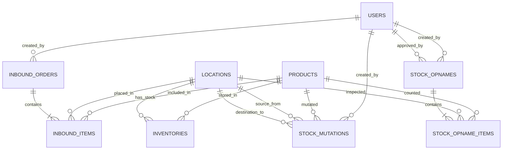

# Product Requirements Document: WMS-Pintar
Version: 1.0, Status: Draft, Tanggal: 24 Mei 2024

## 1. Overview
- **Problem Statement**: Manajemen gudang manual menggunakan kertas/spreadsheet menyebabkan selisih inventori sebesar 15%, waktu pencarian barang yang lama (rata-rata 45 menit per barang), dan keterlambatan pengisian stok karena tidak ada sistem peringatan dini. Hal ini dialami oleh Warehouse Manager yang kesulitan memantau akurasi data dan Warehouse Staff yang tidak efisien dalam bekerja.
- **Solution**: WMS-Pintar adalah aplikasi manajemen gudang berbasis web-responsive yang memfasilitasi pencatatan inbound/outbound barang secara real-time, pelacakan lokasi penyimpanan hingga tingkat bin menggunakan scan SKU barcode, mutasi stok antar rak, digital stock opname, serta sistem notifikasi otomatis saat stok berada di bawah batas aman.
- **Goals**:
  - Mengurangi selisih inventori (selisih fisik vs sistem) menjadi < 0.2%.
  - Mempercepat proses pencarian lokasi barang dari rata-rata 45 menit menjadi p95 < 3 menit.
  - Memotong waktu pencatatan inbound/outbound hingga 60% menggunakan barcode scanner.
  - Mengeliminasi kasus kehabisan stok (stockout) untuk komoditas fast-moving dengan akurasi peringatan stok minim 100%.
- **Non-Goals**:
  - Sistem tidak menangani rute pengiriman logistik di luar gudang (last-mile delivery).
  - Sistem tidak menangani multi-warehouse (hanya fokus pada satu gudang fisik dengan banyak zona/rak).
  - Sistem tidak melakukan otomatisasi pemesanan pembelian (purchase order) ke supplier secara otomatis.
- **Target Users**: Warehouse Manager, Warehouse Staff (Picker/Packer/Receiver).
- **Personas**:
  - **Nama**: Budi Santoso
    - **Peran**: Warehouse Manager
    - **Kebutuhan**: Laporan stok akurat, persetujuan stock opname cepat, notifikasi stok kritis.
    - **Pain Points**: Sering disalahkan direksi karena selisih stok saat audit bulanan.
    - **Konteks**: Bekerja di kantor gudang menggunakan laptop/desktop.
  - **Nama**: Agus Setiawan
    - **Peran**: Warehouse Staff
    - **Kebutuhan**: Mengetahui lokasi rak barang secara instan, mencatat barang masuk/keluar tanpa mengetik manual.
    - **Pain Points**: Lelah berjalan memutari gudang seluas 2000m² hanya untuk mencari satu tipe barang.
    - **Konteks**: Bekerja di area gudang menggunakan handphone/tablet industri dengan koneksi Wi-Fi gudang.
- **User Stories**:
  - **US-01**: Sebagai Warehouse Staff, saya ingin memindai barcode SKU menggunakan kamera HP agar saya bisa mendaftarkan barang masuk (inbound) tanpa input manual.
  - **US-02**: Sebagai Warehouse Staff, saya ingin melihat lokasi rak dan bin yang spesifik dari suatu barang agar saya bisa mengambil barang (outbound) dengan rute terpendek.
  - **US-03**: Sebagai Warehouse Staff, saya ingin mencatat perpindahan barang dari satu bin ke bin lain agar posisi fisik barang selalu sama dengan data di sistem.
  - **US-04**: Sebagai Warehouse Manager, saya ingin menerima email peringatan otomatis saat stok suatu SKU di bawah batas minimum agar saya bisa segera melakukan restock.
  - **US-05**: Sebagai Warehouse Staff, saya ingin melakukan stock opname digital per rak agar proses pencocokan fisik akhir bulan berjalan lebih cepat tanpa kertas.
  - **US-06**: Sebagai Warehouse Manager, saya ingin menyetujui atau menolak penyesuaian stok hasil stock opname agar tidak terjadi manipulasi data inventori.

---

## 2. Scope
- **In-Scope**:
  - Manajemen Master Data Produk (SKU, Nama, Deskripsi, Satuan, Safety Stock).
  - Manajemen Layout Gudang (Zona, Rak, Bin).
  - Transaksi Inbound (Penerimaan barang dengan scan barcode, penempatan ke bin).
  - Transaksi Outbound (Pengambilan barang berdasarkan daftar pesanan, scan verifikasi).
  - Mutasi Stok (Perpindahan antar bin dengan pelacakan riwayat).
  - Stock Opname (Pencatatan fisik, perhitungan selisih, persetujuan manager).
  - Alert system untuk stok minim (dashboard alert + notifikasi email).
- **Out-of-Scope (with reason)**:
  - Integrasi API kurir pihak ketiga (tidak diperlukan untuk fase internal manajemen stok).
  - Sistem manajemen armada/kendaraan gudang (fokus utama adalah internal layout gudang).
- **Assumptions**:
  - Perangkat mobile yang digunakan staf memiliki kamera minimal 8MP dengan autofokus untuk memindai barcode secara optimal.
  - Koneksi Wi-Fi mencakup seluruh area gudang dengan sinyal minimal -70 dBm.
- **Dependencies**:
  - Layanan SMTP/SendGrid untuk pengiriman email notifikasi stok minim.
  - Library JavaScript barcode scanner (misal: Html5Qrcode) untuk pemindaian via browser mobile.

---

## 3. Functional Requirements

| ID | Fitur | Deskripsi Detail | Prioritas | Acceptance Criteria |
| :--- | :--- | :--- | :--- | :--- |
| FR-01 | Scan Barcode SKU | Sistem dapat memindai barcode tipe EAN-13 atau QR Code menggunakan kamera perangkat mobile untuk mengidentifikasi produk secara instan. | P0 | - GIVEN user membuka halaman scan, WHEN kamera diarahkan ke barcode valid, THEN sistem menampilkan detail produk dalam < 1 detik.<br>- GIVEN barcode tidak terdaftar, WHEN dipindai, THEN sistem menampilkan pesan error "SKU Tidak Dikenal". |
| FR-02 | Manajemen Lokasi (Bin) | Sistem dapat mendefinisikan struktur lokasi penyimpanan dengan format: ZONA-RAK-BARIS-KOLOM (contoh: A-01-03-B). | P0 | - GIVEN admin di halaman lokasi, WHEN mengisi form zona, rak, baris, kolom yang unik, THEN lokasi baru tersimpan.<br>- GIVEN duplikasi kode lokasi, WHEN disimpan, THEN sistem menolak dan menampilkan pesan error. |
| FR-03 | Inbound Order | Pencatatan barang masuk berdasarkan nomor dokumen inbound. Staff memindai barang dan menentukan bin penempatan. | P0 | - GIVEN dokumen inbound berstatus DRAFT, WHEN staff memindai SKU dan memasukkan qty, THEN status berubah menjadi IN_PROGRESS.<br>- GIVEN semua item telah diletakkan di bin, WHEN disubmit, THEN status menjadi COMPLETED dan stok bertambah di bin tersebut. |
| FR-04 | Outbound Order | Proses pengeluaran barang berdasarkan order list. Sistem menunjukkan bin asal barang untuk diambil oleh picker. | P0 | - GIVEN order outbound aktif, WHEN picker mengambil barang, THEN sistem memvalidasi scan SKU apakah sesuai dengan order.<br>- GIVEN qty yang diambil melebihi pesanan, WHEN diproses, THEN sistem memblokir tindakan dengan notifikasi "Jumlah melebihi batas". |
| FR-05 | Mutasi Stok | Pemindahan fisik barang dari satu bin ke bin lain di dalam gudang yang sama. | P0 | - GIVEN staff memilih bin asal, WHEN memasukkan SKU dan qty yang akan dipindahkan ke bin tujuan, THEN sistem memotong stok bin asal dan menambah stok bin tujuan secara real-time.<br>- GIVEN qty mutasi > stok bin asal, WHEN disubmit, THEN sistem menampilkan error "Stok tidak cukup". |
| FR-06 | Stock Opname | Proses perhitungan fisik stok secara berkala untuk mencocokkan data sistem dengan fisik. | P1 | - GIVEN proses opname dimulai, WHEN staff menginput qty fisik suatu SKU di bin tertentu, THEN sistem mencatat selisih (discrepancy) secara otomatis tanpa langsung mengubah stok utama. |
| FR-07 | Approval Opname | Verifikasi hasil stock opname oleh Warehouse Manager sebelum stok resmi diperbarui di database. | P1 | - GIVEN manajer membuka dashboard approval, WHEN menyetujui hasil opname, THEN stok sistem diperbarui sesuai qty fisik.<br>- GIVEN ditolak, WHEN diklik tolak, THEN status opname kembali ke DRAFT untuk dihitung ulang. |
| FR-08 | Peringatan Stok Minim | Notifikasi otomatis ketika total stok suatu SKU di seluruh gudang berada di bawah nilai safety stock. | P1 | - GIVEN transaksi outbound selesai, WHEN total stok SKU <= safety_stock, THEN sistem memicu email alert ke Manager dan memunculkan badge merah di dashboard. |
| FR-09 | Riwayat Transaksi Stok | Log audit komprehensif untuk setiap perubahan stok barang (inbound, outbound, mutasi, opname). | P1 | - GIVEN user membuka detail produk, WHEN melihat tab riwayat, THEN sistem menampilkan tabel berisi: Tanggal, Tipe Transaksi, Bin Asal/Tujuan, Qty Perubahan, dan User Pelaksana secara kronologis. |
| FR-10 | Cetak Label Barcode | Fitur untuk mengunduh atau mencetak label barcode SKU dan label lokasi bin dalam format PDF siap cetak. | P2 | - GIVEN user memilih produk/lokasi, WHEN mengklik tombol "Cetak Label", THEN sistem menghasilkan file PDF berisi barcode dengan resolusi minimal 300 DPI. |

---

## 4. Non-Functional Requirements
- **Performance**:
  - Response time API untuk pencarian barang dan scan barcode (p95) harus < 500ms pada beban normal.
  - Halaman aplikasi web-responsive harus termuat penuh (Time to Interactive) dalam < 2.0 detik pada koneksi 4G.
  - Mampu menangani beban hingga 100 pengguna bersamaan (concurrent users) tanpa penurunan performa.
- **Security**:
  - Otentikasi menggunakan stateless JSON Web Token (JWT) yang disimpan di HTTP-only cookie dengan masa berlaku session 24 jam.
  - Enkripsi data sensitif (password) menggunakan algoritma bcrypt dengan work factor 10.
  - Enkripsi data saat transit menggunakan TLS 1.3 (HTTPS) dan enkripsi data saat istirahat (at rest) menggunakan AES-256 pada level database.
  - Rate limiting diterapkan pada API: maksimal 100 request per menit per alamat IP.
  - Proteksi terhadap SQL Injection, XSS, dan CSRF melalui sanitasi input menggunakan library validator dan ORM.
- **Scalability**:
  - Database harus mampu menampung hingga 50,000 data SKU dan 1,000,000 baris log transaksi tanpa degradasi kecepatan query (indeks wajib diterapkan).
- **Reliability/Availability**:
  - Tingkat ketersediaan sistem (uptime) minimal 99.9% (maksimal downtime 8.76 jam dalam setahun).
  - Backup database otomatis dilakukan setiap hari pada pukul 01:00 WIB ke cloud storage terpisah dengan retensi data backup selama 30 hari.
  - Recovery Point Objective (RPO) maksimal 24 jam dan Recovery Time Objective (RTO) maksimal 2 jam.
- **Usability & Accessibility**:
  - Antarmuka pengguna harus sepenuhnya responsif, optimal untuk layar handphone (lebar minimum 360px) hingga monitor desktop (1920px).
  - Memenuhi standar aksesibilitas WCAG 2.1 Level AA (kontras rasio teks minimal 4.5:1, navigasi keyboard penuh).
- **Compliance**:
  - Mematuhi regulasi perlindungan data pribadi (UU PDP Indonesia) dengan tidak mengekspos data pribadi karyawan di luar sistem internal.
  - Log audit transaksi inventori harus dipertahankan secara read-only dan tidak boleh dihapus selama minimal 3 tahun untuk kebutuhan audit finansial.

---

## 5. Business Rules (BR)
- **BR-01**: Stok fisik suatu barang di dalam suatu bin tidak boleh bernilai negatif (< 0) dalam kondisi apa pun.
- **BR-02**: Setiap SKU produk harus bersifat unik di dalam sistem dan tidak boleh ada dua produk berbeda dengan SKU yang sama.
- **BR-03**: Setiap transaksi mutasi stok harus memiliki bin asal dan bin tujuan yang berbeda. Mutasi di dalam bin yang sama akan ditolak oleh sistem.
- **BR-04**: Status dokumen inbound/outbound hanya bisa berubah dengan urutan: `DRAFT` -> `IN_PROGRESS` -> `COMPLETED`. Status yang sudah `COMPLETED` bersifat read-only dan tidak dapat diubah kembali atau dihapus.
- **BR-05**: Penyesuaian stok (stock adjustment) akibat selisih stock opname hanya akan memengaruhi stok riil setelah mendapatkan persetujuan (approval) berstatus `APPROVED` dari user dengan role `Manager`.
- **BR-06**: Nilai safety stock untuk setiap produk minimal bernilai 0 (tidak boleh negatif).
- **BR-07**: Satu lokasi bin hanya dapat menampung maksimal volume 1 meter kubik atau berat 500 kg (validasi secara sistem saat penempatan inbound jika data dimensi produk tersedia).

---

## 6. Edge Cases

| Skenario | Perilaku Diharapkan |
| :--- | :--- |
| **Empty State** (Gudang baru tanpa data produk atau lokasi) | Halaman daftar produk dan lokasi menampilkan ilustrasi kosong yang informatif beserta tombol panduan bertuliskan "Tambah Produk Pertama" dan "Tambah Lokasi Pertama" untuk memandu user. |
| **Pindai Barcode Ganda** (Staff tidak sengaja memindai barcode yang sama dua kali dalam satu detik) | Sistem menerapkan mekanisme debouncing selama 1.5 detik pada input scanner. Pemindaian kedua dalam rentang waktu tersebut akan diabaikan untuk mencegah duplikasi input kuantitas. |
| **Edit Bersamaan** (Dua staff mengupdate kuantitas stok di bin yang sama pada detik yang sama) | Menggunakan mekanisme Optimistic Locking pada database. User kedua yang melakukan submit akan menerima pesan error: "Data telah diperbarui oleh pengguna lain. Silakan muat ulang halaman." |
| **Kehilangan Koneksi** (Koneksi internet terputus saat staff berada di lorong gudang yang blank spot) | Aplikasi mobile menyimpan data scan sementara di LocalStorage browser. Saat koneksi terdeteksi kembali (online event), sistem menampilkan tombol "Sinkronisasi Data" untuk mengirim data tertunda ke server. |
| **Nilai Ekstrim** (User memasukkan kuantitas inbound sebesar 999,999,999) | Input dibatasi oleh sistem validasi frontend dan backend dengan nilai maksimal transaksi sekali input sebesar 100,000 unit. Input di atas nilai tersebut akan memicu error "Jumlah melebihi batas wajar". |
| **Perbedaan Timezone** (Server di UTC, user di WIB/WITA) | Database menyimpan semua timestamp transaksi dalam format UTC. Frontend wajib mengonversi timestamp tersebut ke zona waktu lokal perangkat pengguna saat ditampilkan di layar. |
| **Pelanggaran Hak Akses** (Staff mencoba menembak API approval opname secara langsung lewat Postman) | API backend memvalidasi token JWT. Jika role user di dalam token bukan `Manager`, API langsung mengembalikan status HTTP 403 Forbidden dengan payload JSON error. |
| **Inbound Barang Rusak** (Barang yang diterima dalam kondisi rusak saat inbound) | Staff dapat menandai status item inbound tersebut sebagai `DAMAGED`. Barang otomatis diarahkan ke lokasi bin khusus karantina (misal: zona `QUARANTINE`) dan tidak masuk ke stok siap jual. |

---

## 7. User Flow & Screen List
### Primary Flow (Happy Path) - Inbound Barang:
1. Staff masuk ke menu **Inbound**, memilih dokumen inbound aktif berstatus `DRAFT`, lalu klik **Mulai Penerimaan** (status berubah menjadi `IN_PROGRESS`).
2. Staff mengarahkan kamera HP ke barcode produk. Barcode berhasil dipindai, detail produk muncul.
3. Staff memasukkan jumlah barang fisik yang diterima, lalu memindai barcode lokasi bin tujuan penempatan.
4. Staff mengulangi proses untuk semua produk dalam daftar dokumen.
5. Staff menekan tombol **Selesaikan Inbound**. Sistem mengubah status dokumen menjadi `COMPLETED` dan memperbarui jumlah stok di database.

### Alternative Flow - Selisih Penemuan saat Outbound:
1. Picker melakukan proses outbound berdasarkan daftar picking.
2. Saat mendatangi bin tujuan, picker menemukan fisik barang kosong padahal sistem mencatat ada 5 unit.
3. Picker menekan tombol **Laporkan Selisih** pada item tersebut di aplikasi.
4. Sistem otomatis menandai bin tersebut untuk ditinjau, membuat dokumen Stock Opname darurat berstatus `DRAFT` khusus untuk bin tersebut, dan mengizinkan picker mencari barang dari bin alternatif yang disarankan sistem.

### Screen List:
| Nama Layar | Destinasi Navigasi Utama | Elemen Utama | Navigasi |
| :--- | :--- | :--- | :--- |
| **Login Screen** | Dashboard Screen | Form email & password, tombol login, error banner. | Redirect ke Dashboard setelah auth berhasil. |
| **Dashboard Screen** | Inbound, Outbound, Mutasi, Opname, Produk | Ringkasan stok total, grafik transaksi mingguan, widget alert stok minim, menu navigasi utama. | Klik menu untuk berpindah halaman. |
| **Product List Screen** | Product Detail Screen, Add Product | Tabel daftar produk (SKU, Nama, Total Stok, Safety Stock), kolom pencarian, tombol tambah produk. | Klik baris produk ke detail; klik tambah ke form produk. |
| **Inbound Process Screen** | Dashboard Screen | Scanner view (kamera), daftar item expected vs received, input qty, input bin, tombol "Selesaikan". | Tombol kembali ke Dashboard (dengan konfirmasi batal). |
| **Mutation Screen** | Dashboard Screen | Form input bin asal (scan), input SKU (scan), input qty, input bin tujuan (scan), tombol "Mutasi". | Tombol submit memproses perpindahan dan refresh form. |
| **Stock Opname Screen** | Opname Detail Screen | Daftar sesi opname aktif, tombol "Buat Sesi Opname Baru", filter status (Draft/Completed). | Klik sesi opname untuk mulai menghitung. |
| **Approval Screen** | Dashboard Screen | Daftar pengajuan penyesuaian stok, detail discrepancy (selisih), tombol "Approve" dan "Reject". | Khusus role Manager. Kembali ke dashboard setelah aksi. |

---

## 8. API Requirements
- **Prefix URL**: `/api/v1`
- **Format Response Error Standar**:
  ```json
  {
    "success": false,
    "error": {
      "code": "ERROR_CODE",
      "message": "Pesan kesalahan dalam bahasa Indonesia yang informatif."
    }
  }
  ```
- **Error Codes**:
  - `400 Bad Request`: Parameter input tidak valid atau tidak lengkap.
  - `401 Unauthorized`: Token JWT tidak ada, kedaluwarsa, atau tidak valid.
  - `403 Forbidden`: User tidak memiliki role yang sesuai untuk mengakses resource.
  - `404 Not Found`: Data produk, lokasi, atau dokumen tidak ditemukan.
  - `409 Conflict`: Konflik data (misal: SKU sudah terdaftar, optimistic lock gagal).
  - `422 Unprocessable Entity`: Pelanggaran aturan bisnis (misal: mutasi melebihi stok tersedia).
  - `500 Internal Server Error`: Kesalahan sistem internal backend.

### API Endpoints Table:
| Method | Endpoint | Auth | Deskripsi | Request Body (JSON) | Response (JSON) Success 200/201 |
| :--- | :--- | :--- | :--- | :--- | :--- |
| POST | `/api/v1/auth/login` | Publik | Otentikasi user untuk masuk ke sistem. | `{"username": "agus", "password": "password123"}` | `{"success": true, "token": "jwt_token_here"}` |
| GET | `/api/v1/products` | JWT | Mengambil daftar semua produk di gudang. | None | `{"success": true, "data": [{"id": 1, "sku": "SKU-001", "name": "Barang A", "safety_stock": 10}]}` |
| GET | `/api/v1/products/scan/:sku` | JWT | Mencari produk berdasarkan scan barcode SKU. | None | `{"success": true, "data": {"id": 1, "sku": "SKU-001", "name": "Barang A"}}` |
| POST | `/api/v1/inbound` | JWT | Membuat dokumen transaksi inbound baru. | `{"order_number": "IN-20240524-01"}` | `{"success": true, "data": {"id": 10, "status": "DRAFT"}}` |
| PUT | `/api/v1/inbound/:id/items` | JWT | Mencatat barang yang diterima ke bin tertentu. | `{"product_id": 1, "qty_received": 50, "location_id": 5}` | `{"success": true, "message": "Item berhasil ditambahkan"}` |
| POST | `/api/v1/mutations` | JWT | Memproses mutasi stok antar bin gudang. | `{"product_id": 1, "source_location_id": 2, "destination_location_id": 5, "quantity": 10}` | `{"success": true, "message": "Mutasi berhasil diproses"}` |
| POST | `/api/v1/opnames` | JWT | Membuat sesi stock opname baru. | `{"opname_number": "SO-202405-01"}` | `{"success": true, "data": {"id": 8, "status": "DRAFT"}}` |
| POST | `/api/v1/opnames/:id/approve` | JWT (Manager) | Menyetujui hasil stock opname untuk update stok. | None | `{"success": true, "message": "Opname disetujui, stok diperbarui"}` |

---

## 9. Database Schema

### Database Design & Relationships (3NF)

#### 1. Table: `users`
| Kolom | Tipe | Constraint | Keterangan |
| :--- | :--- | :--- | :--- |
| `id` | INT | PK, AUTO_INCREMENT | Identifier unik user. |
| `username` | VARCHAR(50) | UNIQUE, NOT NULL | Username untuk login. |
| `password_hash` | VARCHAR(255) | NOT NULL | Hash password bcrypt. |
| `role` | VARCHAR(20) | NOT NULL | ENUM: 'admin', 'manager', 'staff'. |
| `created_at` | TIMESTAMP | DEFAULT CURRENT_TIMESTAMP | Waktu data dibuat. |
| `updated_at` | TIMESTAMP | DEFAULT CURRENT_TIMESTAMP ON UPDATE | Waktu data diupdate. |

#### 2. Table: `products`
| Kolom | Tipe | Constraint | Keterangan |
| :--- | :--- | :--- | :--- |
| `id` | INT | PK, AUTO_INCREMENT | Identifier unik produk. |
| `sku` | VARCHAR(50) | UNIQUE, NOT NULL | Barcode SKU produk. |
| `name` | VARCHAR(100) | NOT NULL | Nama produk. |
| `description` | TEXT | NULL | Deskripsi detail produk. |
| `unit` | VARCHAR(20) | NOT NULL | Satuan barang (pcs, box, pack). |
| `safety_stock` | INT | NOT NULL, CHECK (safety_stock >= 0) | Batas minimum stok aman. |
| `created_at` | TIMESTAMP | DEFAULT CURRENT_TIMESTAMP | Waktu data dibuat. |
| `updated_at` | TIMESTAMP | DEFAULT CURRENT_TIMESTAMP ON UPDATE | Waktu data diupdate. |

#### 3. Table: `locations`
| Kolom | Tipe | Constraint | Keterangan |
| :--- | :--- | :--- | :--- |
| `id` | INT | PK, AUTO_INCREMENT | Identifier unik lokasi. |
| `zone` | VARCHAR(10) | NOT NULL | Kode Zona (misal: A, B, C). |
| `rack` | VARCHAR(10) | NOT NULL | Kode Rak (misal: 01, 02). |
| `bin` | VARCHAR(10) | NOT NULL | Kode Bin (misal: A1, A2). |
| `created_at` | TIMESTAMP | DEFAULT CURRENT_TIMESTAMP | Waktu data dibuat. |
| `updated_at` | TIMESTAMP | DEFAULT CURRENT_TIMESTAMP ON UPDATE | Waktu data diupdate. |
| **Constraint Tambahan** | UNIQUE(`zone`, `rack`, `bin`) | Menjamin satu koordinat bin hanya terdaftar satu kali. |

#### 4. Table: `inventories`
| Kolom | Tipe | Constraint | Keterangan |
| :--- | :--- | :--- | :--- |
| `id` | INT | PK, AUTO_INCREMENT | Identifier unik inventory link. |
| `product_id` | INT | FK -> `products(id)`, NOT NULL | Relasi ke produk. |
| `location_id` | INT | FK -> `locations(id)`, NOT NULL | Relasi ke lokasi bin. |
| `quantity` | INT | NOT NULL, CHECK (quantity >= 0) | Jumlah stok fisik di bin tersebut. |
| `version` | INT | DEFAULT 1, NOT NULL | Kolom penanda untuk Optimistic Locking. |
| `updated_at` | TIMESTAMP | DEFAULT CURRENT_TIMESTAMP ON UPDATE | Waktu update stok terakhir. |
| **Constraint Tambahan** | UNIQUE(`product_id`, `location_id`) | Menjamin satu produk hanya punya satu baris per bin. |

#### 5. Table: `inbound_orders`
| Kolom | Tipe | Constraint | Keterangan |
| :--- | :--- | :--- | :--- |
| `id` | INT | PK, AUTO_INCREMENT | Identifier unik dokumen inbound. |
| `order_number` | VARCHAR(50) | UNIQUE, NOT NULL | Nomor dokumen transaksi. |
| `status` | VARCHAR(20) | NOT NULL, DEFAULT 'DRAFT' | ENUM: 'DRAFT', 'IN_PROGRESS', 'COMPLETED'. |
| `created_by` | INT | FK -> `users(id)`, NOT NULL | Staff pembuat dokumen. |
| `created_at` | TIMESTAMP | DEFAULT CURRENT_TIMESTAMP | Waktu dokumen dibuat. |
| `updated_at` | TIMESTAMP | DEFAULT CURRENT_TIMESTAMP ON UPDATE | Waktu update status dokumen. |

#### 6. Table: `inbound_items`
| Kolom | Tipe | Constraint | Keterangan |
| :--- | :--- | :--- | :--- |
| `id` | INT | PK, AUTO_INCREMENT | Identifier unik baris item inbound. |
| `inbound_order_id`| INT | FK -> `inbound_orders(id)` ON DELETE CASCADE | Relasi ke dokumen utama. |
| `product_id` | INT | FK -> `products(id)`, NOT NULL | Relasi ke produk. |
| `qty_expected` | INT | NOT NULL, CHECK (qty_expected > 0) | Kuantitas rencana masuk. |
| `qty_received` | INT | NOT NULL, DEFAULT 0 | Kuantitas aktual yang diterima. |
| `location_id` | INT | FK -> `locations(id)`, NULL | Lokasi bin penempatan barang. |

#### 7. Table: `stock_mutations`
| Kolom | Tipe | Constraint | Keterangan |
| :--- | :--- | :--- | :--- |
| `id` | INT | PK, AUTO_INCREMENT | Identifier unik transaksi mutasi. |
| `product_id` | INT | FK -> `products(id)`, NOT NULL | Produk yang dipindahkan. |
| `source_location_id`| INT | FK -> `locations(id)`, NOT NULL | Bin asal. |
| `destination_location_id`| INT | FK -> `locations(id)`, NOT NULL | Bin tujuan. |
| `quantity` | INT | NOT NULL, CHECK (quantity > 0) | Jumlah barang yang dipindahkan. |
| `created_by` | INT | FK -> `users(id)`, NOT NULL | Staff eksekutor mutasi. |
| `created_at` | TIMESTAMP | DEFAULT CURRENT_TIMESTAMP | Waktu mutasi terjadi. |

#### 8. Table: `stock_opnames`
| Kolom | Tipe | Constraint | Keterangan |
| :--- | :--- | :--- | :--- |
| `id` | INT | PK, AUTO_INCREMENT | Identifier unik dokumen opname. |
| `opname_number` | VARCHAR(50) | UNIQUE, NOT NULL | Nomor dokumen stock opname. |
| `status` | VARCHAR(20) | NOT NULL, DEFAULT 'DRAFT' | ENUM: 'DRAFT', 'COMPLETED', 'APPROVED', 'REJECTED'. |
| `created_by` | INT | FK -> `users(id)`, NOT NULL | Staff pembuat opname. |
| `approved_by` | INT | FK -> `users(id)`, NULL | Manager penyetuju opname. |
| `created_at` | TIMESTAMP | DEFAULT CURRENT_TIMESTAMP | Waktu opname dibuat. |
| `updated_at` | TIMESTAMP | DEFAULT CURRENT_TIMESTAMP ON UPDATE | Waktu status diupdate. |

#### 9. Table: `stock_opname_items`
| Kolom | Tipe | Constraint | Keterangan |
| :--- | :--- | :--- | :--- |
| `id` | INT | PK, AUTO_INCREMENT | Identifier unik baris item opname. |
| `stock_opname_id` | INT | FK -> `stock_opnames(id)` ON DELETE CASCADE | Relasi ke dokumen utama. |
| `product_id` | INT | FK -> `products(id)`, NOT NULL | Produk yang dihitung. |
| `location_id` | INT | FK -> `locations(id)`, NOT NULL | Lokasi bin yang dihitung. |
| `qty_system` | INT | NOT NULL | Kuantitas menurut sistem saat opname dimulai. |
| `qty_physical` | INT | NOT NULL, CHECK (qty_physical >= 0) | Kuantitas riil hasil hitung fisik staff. |
| `discrepancy` | INT | NOT NULL | Hasil kalkulasi: `qty_physical - qty_system`. |

### Database Indexes:
- `idx_products_sku` ON `products(sku)` (Mempercepat query scan barcode).
- `idx_inventories_product_location` ON `inventories(product_id, location_id)` (Mempercepat pengecekan stok di bin tertentu).
- `idx_locations_coords` ON `locations(zone, rack, bin)` (Mempercepat pencarian data lokasi).

### Entity Relationship Diagram (Mermaid)


---

## 10. Roles & Permissions

| Role | Modul | Hak Akses (CRUD) | Keterangan |
| :--- | :--- | :--- | :--- |
| **Admin** | User Management | CREATE, READ, UPDATE, DELETE | Mengelola akun user (tambah/nonaktifkan staff gudang & manager). |
| | Master Data Produk | CREATE, READ, UPDATE, DELETE | Mengelola data SKU barang baru dan mengedit safety stock. |
| | Master Data Lokasi | CREATE, READ, UPDATE, DELETE | Mengatur denah layout zona, rak, dan bin gudang. |
| **Manager** | Dashboard & Reports | READ | Melihat visualisasi laporan stok, barang lambat/cepat laku. |
| | Stock Opname Approval | READ, UPDATE | Menyetujui (`APPROVED`) atau menolak (`REJECTED`) hasil penyesuaian stok opname. |
| | Master Data Produk | READ, UPDATE | Memantau data produk dan memperbarui batas safety stock. |
| **Staff** | Inbound Order | CREATE, READ, UPDATE | Melakukan penerimaan barang masuk dan input bin. Tidak bisa menghapus dokumen. |
| | Outbound Order | READ, UPDATE | Melihat daftar picking barang dan mengonfirmasi barcode pengambilan. |
| | Mutasi Stok | CREATE, READ | Melakukan pemindahan barang antar bin secara real-time. |
| | Stock Opname | CREATE, READ, UPDATE | Menginput hitungan fisik barang di rak. Tidak bisa melakukan approval. |

---

## 11. Validation Rules

| Field | Aturan Validasi | Message Error (Bahasa Indonesia) |
| :--- | :--- | :--- |
| `products.sku` | Wajib diisi, tipe string alfanumerik, panjang 8-20 karakter, harus unik. | "SKU wajib diisi, berupa alfanumerik sepanjang 8 hingga 20 karakter, dan belum terdaftar." |
| `products.safety_stock` | Wajib diisi, tipe integer, minimal bernilai 0. | "Safety stock wajib berupa angka bulat positif atau nol." |
| `locations.zone` | Wajib diisi, string alfabet uppercase, panjang 1 karakter (A-Z). | "Zona harus diisi berupa satu huruf kapital (A-Z)." |
| `locations.rack` | Wajib diisi, string angka dua digit (01-99). | "Rak harus berupa dua digit angka (contoh: 01)." |
| `inventories.quantity` | Tipe integer, tidak boleh bernilai negatif (< 0). | "Stok barang tidak boleh bernilai negatif." |
| `inbound_items.qty_received`| Tipe integer, harus <= `qty_expected * 1.1` (toleransi kelebihan kirim max 10%). | "Jumlah barang diterima melebihi batas toleransi 10% dari pesanan." |
| `stock_mutations.quantity`| Tipe integer, harus <= kuantitas produk yang tersedia di `source_location_id`. | "Jumlah mutasi tidak boleh melebihi stok yang tersedia di bin asal." |
| `stock_opname_items.qty_physical`| Wajib diisi, tipe integer, minimal 0. | "Jumlah fisik barang hasil hitung harus berupa angka positif atau nol." |

---

## 12. Error Handling
- **Tampilan Error**:
  - Validasi form frontend langsung memunculkan pesan error inline berwarna merah di bawah input field sebelum submit.
  - Error transaksi backend (seperti kegagalan API, optimistic locking, bad request) ditampilkan lewat notifikasi Banner di bagian atas layar atau Toast melayang yang otomatis hilang dalam 5 detik.
- **Kebijakan Retry & Idempotency**:
  - Untuk request mutasi stok dan approval opname, client wajib menyertakan unique header `X-Idempotency-Key` (berupa UUID v4). Jika terjadi network timeout, client dapat mengirim ulang request dengan key yang sama tanpa takut terjadi double mutation/approval.
  - API client (frontend) menerapkan kebijakan auto-retry dengan exponential backoff jika menemui network error (status 503/504) maksimal sebanyak 3 kali percobaan sebelum menampilkan status offline ke user.

### Daftar Skenario Error & Aksi Sistem:
| Skenario Error | Code | Pesan ke User | Aksi Sistem |
| :--- | :--- | :--- | :--- |
| **Optimistic Lock Failure** | `409` | "Gagal menyimpan. Data stok bin ini telah diubah oleh staff lain. Halaman akan dimuat ulang." | Sistem membatalkan query update, lalu otomatis memicu reload state data terbaru di frontend. |
| **Database Down** | `500` | "Sistem sedang mengalami gangguan koneksi database. Silakan coba beberapa saat lagi." | Kirim alert internal ke monitoring system (Sentry) dan tampilkan halaman maintenance static. |
| **Token Expired** | `401` | "Sesi Anda telah berakhir. Silakan login kembali untuk melanjutkan pekerjaan." | Hapus token lokal di cookie, lalu redirect user secara otomatis ke halaman Login Screen. |
| **Barang Tidak Cukup** | `422` | "Gagal memproses. Stok barang di bin asal tidak mencukupi untuk dipindahkan." | Batalkan transaksi mutasi, kembalikan response error tanpa mengubah isi database. |

---

## 13. Analytics & Monitoring

### Analytics Events Table:
| Event Name | Trigger | Properties | Tujuan Bisnis |
| :--- | :--- | :--- | :--- |
| `inbound_completed` | Ketika dokumen inbound disubmit dengan status `COMPLETED`. | `inbound_id`, `total_items`, `duration_minutes`, `user_id` | Mengukur efisiensi kerja staff receiver dan volume barang masuk harian. |
| `outbound_completed` | Ketika dokumen outbound selesai diverifikasi dan disubmit. | `outbound_id`, `total_items`, `user_id` | Mengukur kecepatan pemenuhan pesanan (order fulfillment rate). |
| `mutation_logged` | Ketika mutasi stok berhasil diproses. | `product_id`, `source_bin`, `dest_bin`, `qty`, `user_id` | Menganalisis frekuensi perpindahan barang internal (optimalisasi tata letak). |
| `low_stock_triggered` | Ketika stok total SKU berada di bawah safety stock. | `sku`, `current_stock`, `safety_stock` | Memantau produk yang sering mengalami kritis stok untuk antisipasi restock. |

### Monitoring & Observability:
- **Error Tracking**: Integrasi dengan Sentry untuk menangkap unhandled exception di backend Node.js dan runtime error di browser frontend secara real-time.
- **Health Checks**: Endpoint `/api/v1/health` untuk memantau status keaktifan server backend dan konektivitas database PostgreSQL/MySQL (diperiksa oleh load balancer setiap 30 detik).
- **Business Metric Dashboard**: Grafik real-time yang menampilkan:
  - Jumlah order inbound/outbound berstatus `IN_PROGRESS` yang menggantung > 12 jam.
  - Jumlah alert stok minim yang belum ditindaklanjuti.

---

## 14. Tech Stack

| Layer | Pilihan Teknologi | Alasan Pemilihan |
| :--- | :--- | :--- |
| **Frontend Web** | React.js (dengan Tailwind CSS) | Mempermudah pembuatan Single Page Application (SPA) yang responsif, cepat dimuat di mobile browser, dan kaya akan state management untuk scan barcode. |
| **Barcode Scan Engine**| `html5-qrcode` (Library JS) | Library open-source yang stabil untuk mengakses kamera HP langsung dari browser tanpa perlu membuat aplikasi mobile native (menghemat biaya development). |
| **Backend API** | Node.js dengan Express.js | I/O non-blocking yang sangat efisien untuk menangani banyak request scan barcode secara concurrent dengan response time minimal. |
| **Database** | PostgreSQL | Mendukung ACID compliance secara ketat untuk menjamin konsistensi data stok barang (mencegah selisih nilai akibat race condition). |
| **ORM** | Prisma ORM | Memiliki fitur migrasi skema database yang aman dan mendukung type-safety penuh untuk mempercepat development. |
| **Notifikasi** | SendGrid API (SMTP) | Layanan pengiriman email transaksional dengan tingkat deliverability tinggi untuk mengirim alert stok minim ke manajer. |

---

## 15. Future Improvements
- **Fase 2 (Optimasi Rute Picking)**: Penambahan algoritma pencarian rute terdekat (Traveling Salesperson Problem) untuk picker gudang saat melakukan outbound order agar rute jalan kaki lebih efisien.
- **Fase 3 (Multi-Warehouse)**: Pengembangan arsitektur database untuk mendukung pengelolaan banyak cabang gudang fisik di kota yang berbeda dengan fitur mutasi antar-gudang (inter-branch transfer).
- **Fase 4 (Integrasi IoT & RFID)**: Integrasi dengan sensor RFID gate untuk otomatisasi pencatatan inbound/outbound tanpa perlu memindai barcode satu per satu secara manual.